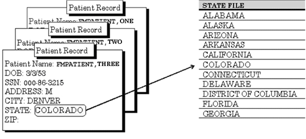

VA FileMan 22.2

User Manual

October 2018

 

Department of Veterans Affairs (VA)

Office of Information and Technology (OIT)

Enterprise Program Management Office (EPMO)

 

  

Revision
History

<table class="MsoNormalTable" data-border="1" data-cellspacing="0"
data-cellpadding="0"
data-summary="Table details the revision history including the date, revision number, description of changes, and the author."
width="628"
style="margin-left:7.15pt;border-collapse:collapse;border:none">
<colgroup>
<col style="width: 25%" />
<col style="width: 25%" />
<col style="width: 25%" />
<col style="width: 25%" />
</colgroup>
<thead>
<tr class="header">
<th width="94" data-valign="top"
style="width: 70.25pt; border: solid windowtext 1.0pt; background: #DFDFDF; padding: 0in 5.4pt 0in 5.4pt">
Date
</th>
<th width="78" data-valign="top"
style="width: 58.5pt; border: solid windowtext 1.0pt; border-left: none; background: #DFDFDF; padding: 0in 5.4pt 0in 5.4pt">
Revision
</th>
<th width="270" data-valign="top"
style="width: 202.5pt; border: solid windowtext 1.0pt; border-left: none; background: #DFDFDF; padding: 0in 5.4pt 0in 5.4pt">
Description
</th>
<th width="186" data-valign="top"
style="width: 139.5pt; border: solid windowtext 1.0pt; border-left: none; background: #DFDFDF; padding: 0in 5.4pt 0in 5.4pt">
Author
</th>
</tr>
</thead>
<tbody>
<tr class="odd">
<td width="94" data-valign="top"
style="width: 70.25pt; border: solid windowtext 1.0pt; border-top: none; padding: 0in 5.4pt 0in 5.4pt">
10/15/2018
</td>
<td width="78" data-valign="top"
style="width: 58.5pt; border-top: none; border-left: none; border-bottom: solid windowtext 1.0pt; border-right: solid windowtext 1.0pt; padding: 0in 5.4pt 0in 5.4pt">
1.3
</td>
<td width="270" data-valign="top"
style="width: 202.5pt; border-top: none; border-left: none; border-bottom: solid windowtext 1.0pt; border-right: solid windowtext 1.0pt; padding: 0in 5.4pt 0in 5.4pt">
Tech
Edits:

·      
Updated styles and formatting throughout.

·       Made
format and content updates throughout this document related to HTML and
Word document synchronization project.

·      
Changed all references from “OI&amp;T” to “OIT”
throughout.

·      
Updated all references throughout to Kernel manuals to the
current, correct title:

o  
<em>Kernel 8.0 &amp; Kernel Toolkit 7.3 Systems Management
Guide</em>

o  
<em>Kernel 8.0 &amp; Kernel Toolkit 7.3 Developer’s
Guide</em>

·      
Reformatted display of file and field names throughout;
moved file/field number immediataly following the file/field
name.
</td>
<td width="186" data-valign="top"
style="width: 139.5pt; border-top: none; border-left: none; border-bottom: solid windowtext 1.0pt; border-right: solid windowtext 1.0pt; padding: 0in 5.4pt 0in 5.4pt">
REDACTED
</td>
</tr>
<tr class="even">
<td width="94" data-valign="top"
style="width: 70.25pt; border: solid windowtext 1.0pt; border-top: none; padding: 0in 5.4pt 0in 5.4pt">
01/17/2017
</td>
<td width="78" data-valign="top"
style="width: 58.5pt; border-top: none; border-left: none; border-bottom: solid windowtext 1.0pt; border-right: solid windowtext 1.0pt; padding: 0in 5.4pt 0in 5.4pt">
1.2
</td>
<td width="270" data-valign="top"
style="width: 202.5pt; border-top: none; border-left: none; border-bottom: solid windowtext 1.0pt; border-right: solid windowtext 1.0pt; padding: 0in 5.4pt 0in 5.4pt">
Changes
for patch DI*22.2*2:

·      
Updated Section <u>7</u>,
adding eight field types to the list.

·      
Added Sections <u>7.10</u> –
<u>7.17</u>.
</td>
<td width="186" data-valign="top"
style="width: 139.5pt; border-top: none; border-left: none; border-bottom: solid windowtext 1.0pt; border-right: solid windowtext 1.0pt; padding: 0in 5.4pt 0in 5.4pt">
REDACTED
</td>
</tr>
<tr class="odd">
<td width="94" data-valign="top"
style="width: 70.25pt; border: solid windowtext 1.0pt; border-top: none; padding: 0in 5.4pt 0in 5.4pt">
11/30/2016
</td>
<td width="78" data-valign="top"
style="width: 58.5pt; border-top: none; border-left: none; border-bottom: solid windowtext 1.0pt; border-right: solid windowtext 1.0pt; padding: 0in 5.4pt 0in 5.4pt">
1.1
</td>
<td width="270" data-valign="top"
style="width: 202.5pt; border-top: none; border-left: none; border-bottom: solid windowtext 1.0pt; border-right: solid windowtext 1.0pt; padding: 0in 5.4pt 0in 5.4pt">
Updates
for Patch DI*22.2*4:

·      
Updated Section <u>4.3.3</u> (Internal vs. External Field Values
for Search Conditions) for the search conditions for a COMPUTED type
fields that evaluate to a date.

·      
Added line to <u>Table
3</u> for :B Print Qualifier.

·      
Updated <u>Table 31</u> to
revise wording about exiting Screen Editor.
</td>
<td width="186" data-valign="top"
style="width: 139.5pt; border-top: none; border-left: none; border-bottom: solid windowtext 1.0pt; border-right: solid windowtext 1.0pt; padding: 0in 5.4pt 0in 5.4pt">
REDACTED
</td>
</tr>
<tr class="even">
<td width="94" data-valign="top"
style="width: 70.25pt; border: solid windowtext 1.0pt; border-top: none; padding: 0in 5.4pt 0in 5.4pt">
08/03/2016
</td>
<td width="78" data-valign="top"
style="width: 58.5pt; border-top: none; border-left: none; border-bottom: solid windowtext 1.0pt; border-right: solid windowtext 1.0pt; padding: 0in 5.4pt 0in 5.4pt">
1.0
</td>
<td width="270" data-valign="top"
style="width: 202.5pt; border-top: none; border-left: none; border-bottom: solid windowtext 1.0pt; border-right: solid windowtext 1.0pt; padding: 0in 5.4pt 0in 5.4pt">
Initial
release of VA FileMan 22.2 User Manual.
</td>
<td width="186" data-valign="top"
style="width: 139.5pt; border-top: none; border-left: none; border-bottom: solid windowtext 1.0pt; border-right: solid windowtext 1.0pt; padding: 0in 5.4pt 0in 5.4pt">
VA
FileMan 22.2 Development Team
</td>
</tr>
</tbody>
</table>

 

     **REF:** For the current patch history
related to this software, see the Patch Module (i.e., Patch User Menu
\[A1AE USER\]) on FORUM.

 

  

 

Table of Contents

[Revision History.
ii](#_Toc527389037)

[List of
Figures.
ix](#_Toc527389038)

[List of Tables.
xiv](#_Toc527389039)

[Orientation.
xvi](#_Toc527389040)

[1    Introduction.
1](#_Toc527389041)

[1.1      
Fields, Records, and
Files.
1](#_Toc527389042)

[1.2      
Files and the
Database.
2](#_Toc527389043)

[1.3      
Printing Records from
Files.
3](#_Toc527389044)

[1.4      
Adding and Editing
Records.
3](#_Toc527389045)

[1.5      
LAYGO File
Access.
4](#_Toc527389046)

[1.6      
Scrolling Mode vs. Screen
Mode.
4](#_Toc527389047)

[2   
Inquire.
5](#_Toc527389048)

[2.1      
Overview..
5](#_Toc527389049)

[2.2      
Inquire to File Entries
Option.
6](#_Toc527389050)

[2.2.1      
Standard Caption
Output
7](#_Toc527389051)

[2.3      
SORT
Templates.
8](#_Toc527389052)

[2.4      
Choose Your Own Print
Fields.
9](#_Toc527389053)

[2.5      
Choose Your Own
Device.
10](#_Toc527389054)

[3   
Print
11](#_Toc527389055)

[3.1      
How to Print Reports from
Files
11](#_Toc527389056)

[3.2      
VA FileMan’s Print
Capabilities.
11](#_Toc527389057)

[3.3      
Standard Column Format for VA FileMan
Prints
12](#_Toc527389058)

[3.4      
Sorting.
13](#_Toc527389059)

[3.4.1      
Specifying SORT BY
Fields.
13](#_Toc527389060)

[3.4.2      
Sorting
Order
14](#_Toc527389061)

[3.4.3      
Choosing Print
Fields.
22](#_Toc527389062)

[3.4.4      
Other Print
Features.
30](#_Toc527389063)

[4   
Search.
35](#_Toc527389064)

[4.1      
How to
Search.
35](#_Toc527389065)

[4.2      
Search
Steps.
35](#_Toc527389066)

[4.2.1      
Enter
Conditions.
35](#_Toc527389067)

[4.2.2      
Combine
Conditions.
38](#_Toc527389068)

[4.2.3      
Format
Output
40](#_Toc527389069)

[4.3      
Details and
Features
41](#_Toc527389070)

[4.3.1      
Sorting and
Searching.
41](#_Toc527389071)

[4.3.2      
SEARCH
Templates
41](#_Toc527389072)

[4.3.3      
Internal vs. External Field Values for Search
Conditions
43](#_Toc527389073)

[4.3.4      
Print Number of Matches
Found.
43](#_Toc527389074)

[4.3.5      
Searching
Multiples
43](#_Toc527389075)

[5   
Browser.
46](#_Toc527389076)

[5.1      
Browser
Screen.
47](#_Toc527389077)

[5.2      
Browser
Features
48](#_Toc527389078)

[5.2.1      
Navigation
Keystrokes
48](#_Toc527389079)

[5.2.2      
Clipboard.
49](#_Toc527389080)

[5.2.3      
Search.
50](#_Toc527389081)

[5.2.4      
Online
Help.
50](#_Toc527389082)

[5.2.5      
Other
Features.
51](#_Toc527389083)

[5.2.6      
Browser as an
Option.
52](#_Toc527389084)

[6    VA FileMan
Prompts.
52](#_Toc527389085)

[6.1      
The \<Enter\>
Key.
53](#_Toc527389086)

[6.2      
Standard Prompt
Structure.
54](#_Toc527389087)

[6.3      
Responding to
Prompts.
54](#_Toc527389088)

[6.4      
Getting Online Help at Any Prompt (Enter ? or
??)
55](#_Toc527389089)

[6.5      
Incorrect
Responses.
55](#_Toc527389090)

[6.6      
Partial
Responses.
56](#_Toc527389091)

[6.7      
Default
Responses.
56](#_Toc527389092)

[6.8      
Longer Default Responses and the “Replace…With”
Editor
57](#_Toc527389093)

[6.8.1      
“Replace...” Prompt
Shortcuts
58](#_Toc527389094)

[6.9      
Prompts with a List of
Choices
58](#_Toc527389095)

[6.10    
Key
Fields
60](#_Toc527389096)

[6.11    
Special Responses to Field
Prompts
60](#_Toc527389097)

[6.11.1    
Deleting a Field’s Value
(@)
60](#_Toc527389098)

[6.11.2    
Jumping to another Field with the Caret
(^)
61](#_Toc527389099)

[6.11.3    
Exiting with the Single Caret
(^)
61](#_Toc527389100)

[6.11.4    
Exiting with the Double Caret
(^^)
62](#_Toc527389101)

[6.11.5    
Mandatory (Required)
Fields
62](#_Toc527389102)

[6.11.6    
Spacebar
Recall
62](#_Toc527389103)

[6.11.7    
Typical Data Entry
Session.
63](#_Toc527389104)

[7    Field Types.
64](#_Toc527389105)

[7.1      
Introduction.
64](#_Toc527389106)

[7.2      
DATE/TIME
Fields.
65](#_Toc527389107)

[7.2.1      
Acceptable Formats for Entering
Dates
65](#_Toc527389108)

[7.2.2      
Abbreviations for
Dates
66](#_Toc527389109)

[7.2.3      
Times in DATE/TIME
Fields.
66](#_Toc527389110)

[7.2.4      
Abbreviations for
Times.
67](#_Toc527389111)

[7.3      
NUMERIC
Fields.
67](#_Toc527389112)

[7.4      
SET OF CODES
Fields.
68](#_Toc527389113)

[7.4.1      
Internal vs. External Values for SET OF CODES
Fields.
68](#_Toc527389114)

[7.5      
FREE TEXT
Fields.
69](#_Toc527389115)

[7.6      
WORD-PROCESSING
Fields
69](#_Toc527389116)

[7.7      
COMPUTED
Fields
71](#_Toc527389117)

[7.8      
POINTER TO A FILE
Fields
72](#_Toc527389118)

[7.9      
VARIABLE-POINTER
Fields.
73](#_Toc527389119)

[7.10    
BOOLEAN
Fields.
75](#_Toc527389120)

[7.11    
LABEL REFERENCE
Fields.
75](#_Toc527389121)

[7.12    
TIME
Fields.
76](#_Toc527389122)

[7.13    
YEAR
Fields.
76](#_Toc527389123)

[7.14    
UNIVERSAL TIME
Fields.
76](#_Toc527389124)

[7.15    
FT POINTER
Fields
77](#_Toc527389125)

[7.16    
FT DATE
Fields
77](#_Toc527389126)

[7.17    
RATIO
Fields.
77](#_Toc527389127)

[7.18    
Subfiles
(Multiples)
78](#_Toc527389128)

[8    Adding and Deleting
Records
79](#_Toc527389129)

[8.1      
.01
Field.
79](#_Toc527389130)

[8.2      
How to Add a
Record.
79](#_Toc527389131)

[8.3      
Adding a Duplicate Record (Use
Quotes)
80](#_Toc527389132)

[8.4      
How to Delete a
Record.
81](#_Toc527389133)

[8.5      
Repointing When Deleting
Records.
81](#_Toc527389134)

[8.6      
Adding Records to a POINTER TO A FILE
Field.
84](#_Toc527389135)

[8.6.1      
Adding Duplicate-Named
Entries.
85](#_Toc527389136)

[8.7      
Adding and Deleting from
Multiples
86](#_Toc527389137)

[8.8      
Enter or Edit File Entries
Option.
87](#_Toc527389138)

[9   
ScreenMan.
89](#_Toc527389139)

[9.1      
Scrolling Mode Editing vs. Screen Mode
Editing.
89](#_Toc527389140)

[9.1.1      
Similarities.
89](#_Toc527389141)

[9.1.2      
Differences.
90](#_Toc527389142)

[9.2      
ScreenMan
Screen.
91](#_Toc527389143)

[9.3      
Navigation Keystrokes (Cursor
Movement)
92](#_Toc527389144)

[9.3.1      
How to Navigate between
Fields.
92](#_Toc527389145)

[9.3.2      
How to Navigate between
Pages
93](#_Toc527389146)

[9.3.3      
Saving and
Exiting.
93](#_Toc527389147)

[9.3.4      
Command Line Options (SAVE, EXIT,
etc.)
94](#_Toc527389148)

[9.4      
Editing.
95](#_Toc527389149)

[9.4.1      
How to Edit
Fields.
95](#_Toc527389150)

[9.4.2      
Long Fields (and the Zoom
Editor)
96](#_Toc527389151)

[9.4.3      
WORD-PROCESSING
Fields
96](#_Toc527389152)

[9.4.4      
Multiples.
97](#_Toc527389153)

[9.4.5      
Navigational Keys for Repeating
Blocks.
101](#_Toc527389154)

[9.5      
Details.
101](#_Toc527389155)

[9.5.1      
How to File
Edits.
101](#_Toc527389156)

[9.5.2      
Troubleshooting.
102](#_Toc527389157)

[10  Word-Processing
Fields.
102](#_Toc527389158)

[10.1    
Word-Processing
Editors.
102](#_Toc527389159)

[10.2    
Choosing a Preferred
Editor
102](#_Toc527389160)

[10.3    
Switching to another Editor While
Editing.
103](#_Toc527389161)

[11  Screen Editor.
103](#_Toc527389162)

[11.1    
Screen Editor
Screen.
105](#_Toc527389163)

[11.2    
Entering
Text
105](#_Toc527389164)

[11.3    
Entering
Commands.
105](#_Toc527389165)

[11.4    
Navigation Keystrokes (Cursor
Movement)
106](#_Toc527389166)

[11.5    
Saving, Printing, and
Exiting.
107](#_Toc527389167)

[11.6    
Finding
Text
107](#_Toc527389168)

[11.7    
Formatting
Paragraphs.
108](#_Toc527389169)

[11.8    
Cutting and
Pasting.
108](#_Toc527389170)

[11.9    
Deleting.
109](#_Toc527389171)

[11.10  
Settings/Modes.
110](#_Toc527389172)

[11.11  
Troubleshooting.
110](#_Toc527389173)

[11.11.1  
Terminal Type
Setting.
110](#_Toc527389174)

[11.11.2  
\<PF\> Keys Not Working: How to
Exit
111](#_Toc527389175)

[11.12  
Screen Editor and Personal
Computers
111](#_Toc527389176)

[11.12.1  
Pasting and
Uploading.
111](#_Toc527389177)

[11.12.2  
Symbol
Characters.
111](#_Toc527389178)

[11.12.3  
Files: Save as
Text
111](#_Toc527389179)

[11.12.4  
Wrap Vs. No
Wrap.
111](#_Toc527389180)

[11.12.5  
Avoiding Lost
Characters.
112](#_Toc527389181)

[12  Line
Editor.
113](#_Toc527389182)

[12.1    
Recognizing the Line
Editor
113](#_Toc527389183)

[12.2    
How to Enter Text in the Line
Editor
113](#_Toc527389184)

[12.3    
Revising Existing
Text
114](#_Toc527389185)

[12.3.1    
Shortcut: Enter Line Number to Edit at “EDIT Option:”
Prompt
114](#_Toc527389186)

[12.4    
“Replace...With” Edits: Be
Careful
115](#_Toc527389187)

[12.4.1    
Shortcuts at the “Replace...With”
Prompt
115](#_Toc527389188)

[12.4.2    
“Replace...” Prompt
Shortcuts
116](#_Toc527389189)

[12.5    
Commands.
117](#_Toc527389190)

[12.5.1    
Available
Commands
117](#_Toc527389191)

[12.5.2    
LIST: List the
Message.
117](#_Toc527389192)

[12.5.3    
ADD: Append More
Text
118](#_Toc527389193)

[12.5.4    
JOIN: Combine Two Lines of
Text
118](#_Toc527389194)

[12.5.5    
INSERT: Insert New Lines of Text between Existing
Ones.
118](#_Toc527389195)

[12.5.6    
DELETE: Delete a Line or
Lines
119](#_Toc527389196)

[12.6    
Advanced
Features
119](#_Toc527389197)

[12.6.1    
File Transfer (Use When Uploading ASCII
Text)
119](#_Toc527389198)

[12.6.2    
Text Terminator-String
Change.
120](#_Toc527389199)

[12.6.3    
Programmer Edit (Edit Lines with M
Commands)
121](#_Toc527389200)

[12.6.4    
Editor Change: Switch
Editors
121](#_Toc527389201)

[12.6.5    
Transfer Text (from another WORD-PROCESSING
Field)
121](#_Toc527389202)

[Glossary.
124](#_Toc527389203)

[Index.
131](#_Toc527389204)

** **

List of Figures

[Figure 1: Example Showing Several Patient
Records.
1](#_Toc527389205)

[Figure 2: Representation of a
Database.
2](#_Toc527389206)

[Figure 3: Example of a Printed
Report
3](#_Toc527389207)

[Figure 4: Inquire—Dialogue Using the Inquire to File Entries Option:
Sample User Entries at Prompts and Sample
Report
6](#_Toc527389208)

[Figure 5: Inquire—Prompt to Store Entries into a
Template.
8](#_Toc527389209)

[Figure 6: Inquire—Dialogue for Choosing Your Own Print Fields: Sample
User Entries at
Prompts
9](#_Toc527389210)

[Figure 7: Inquire—Dialogue for Choosing a Device *and* Getting STANDARD
CAPTIONED OUTPUT: Sample User Entries at
Prompts 
10](#_Toc527389211)

[Figure 8: Print—Example of a Standard
Printout
12](#_Toc527389212)

[Figure 9: Print—Dialogue for Creating a Printed Report: Sample User
Entries at Prompts
12](#_Toc527389213)

[Figure 10: Print—Dialogue for Specifying a Sort Order for a Printed
Report: Sample User Entries at
Prompts
13](#_Toc527389214)

[Figure 11: Print—Example of a Printed Report in a Specific
Order
13](#_Toc527389215)

[Figure 12: Print—Sorting Canonic and Non-Canonic
Numbers.
14](#_Toc527389216)

[Figure 13: Print—Specifying a Sort
Range.
15](#_Toc527389217)

[Figure 14: Print—Choosing Entries with a Specific
Value.
15](#_Toc527389218)

[Figure 15: Print—Dialogue to Include Records with NULL Values: Sample
User Entries at Prompts 
16](#_Toc527389219)

[Figure 16: Print—Sample Report Displaying Fields with NULL
Values.
17](#_Toc527389220)

[Figure 17: Print—Dialogue to Create a Sort Template: Sample User
Entries at Prompts.
21](#_Toc527389221)

[Figure 18: Print—Forcing the Creation of a Sort
Template.
22](#_Toc527389222)

[Figure 19: Print—Reusing a Sort
Template.
22](#_Toc527389223)

[Figure 20: Print—Confirmation Message to Print All
Fields
22](#_Toc527389224)

[Figure 21: Print—Stringing Several Print Qualifiers
Together
26](#_Toc527389225)

[Figure 22: Print—Obtaining a List of All Print Templates for a
File.
27](#_Toc527389226)

[Figure 23: Print—Creating a Print
Template.
27](#_Toc527389227)

[Figure 24: Print—Forcing the Creation of a Print
Template.
27](#_Toc527389228)

[Figure 25: Print—Reusing a Print
Template.
28](#_Toc527389229)

[Figure 26: Print—Inserting a New Print
Field.
28](#_Toc527389230)

[Figure 27: Print—Inserting a Multiple Print
Field.
28](#_Toc527389231)

[Figure 28: Print—Choosing a Captioned Print
Template.
29](#_Toc527389232)

[Figure 29: Print—Dialogue Encountered when Creating a Captioned Print
Report
29](#_Toc527389233)

[Figure 30: Print—Generating Multiple Copies of a
Report
30](#_Toc527389234)

[Figure 31: Print—Example of a Report
Heading.
31](#_Toc527389235)

[Figure 32: Print—Dialogue to Customize Report Headings: Sample User
Entries at Prompts.
31](#_Toc527389236)

[Figure 33: Print—Suppressing Headings on a
Report
32](#_Toc527389237)

[Figure 34: Print—Confirming the Suppression of Headings in a Print
Template.
32](#_Toc527389238)

[Figure 35: Print—Creating a Print Template with a Custom
Header
32](#_Toc527389239)

[Figure 36: Print—Selecting an Existing Print Template with a Custom
Header
33](#_Toc527389240)

[Figure 37: Print—Including a Custom Footer in a Print
Template.
33](#_Toc527389241)

[Figure 38: Print—Including a Custom Header and Footer in a Print
Template.
33](#_Toc527389242)

[Figure 39: Search—Example of a Search
Condition.
37](#_Toc527389243)

[Figure 40: Search—Example of Two Truth
Tests
38](#_Toc527389244)

[Figure 41: Search—Example of a Single Search Condition Using a Truth
Test
39](#_Toc527389245)

[Figure 42: Search—Example of a Multiple Search Condition Using Truth
Tests.
39](#_Toc527389246)

[Figure 43. Search—Dialogue to a Completed Search: Sample User Entries
at Prompts and Sample
Report
40](#_Toc527389247)

[Figure 44: Search—Creating a Search
Template.
42](#_Toc527389248)

[Figure 45: Search—Reusing a Search Template at the “SEARCH FOR FIELD”
Prompt
42](#_Toc527389249)

[Figure 46: Search—Reusing a Search Template at the “SORT BY”
Prompt
42](#_Toc527389250)

[Figure 47: Search—Dialogue of a Search on a Multiple Field: Sample User
Entries at Prompts.
44](#_Toc527389251)

[Figure 48: Search—Prompts Encountered when Searching on a Multiple
Field.
45](#_Toc527389252)

[Figure 49: Search—Additional Prompts Encountered when Searching on a
Multiple Field.
45](#_Toc527389253)

[Figure 50: Browser—Sample Screen Component
Parts
47](#_Toc527389254)

[Figure 51: VA FileMan Prompts—Sample Component Parts of a
Prompt
54](#_Toc527389255)

[Figure 52: VA FileMan Prompts—Asking for a
Response.
54](#_Toc527389256)

[Figure 53: VA FileMan Prompts—“Select-type” Prompts, Offering a
Choice.
54](#_Toc527389257)

[Figure 54: VA FileMan Prompts—“Yes/No-type”
Prompts.
55](#_Toc527389258)

[Figure 55: VA FileMan Prompts—Dialogue to Choose from a List in VA
FileMan: Sample User Entries at
Prompts 
56](#_Toc527389259)

[Figure 56: VA FileMan Prompts—Prompts with Default
Responses.
56](#_Toc527389260)

[Figure 57: VA FileMan Prompts—Overriding the Default Response to a
Prompt
56](#_Toc527389261)

[Figure 58: VA FileMan Prompts—Long Responses Employing the
“Replace...With” Editor
57](#_Toc527389262)

[Figure 59: VA FileMan Prompts—Changing a Long Response Using the
“Replace...With” Editor
57](#_Toc527389263)

[Figure 60: VA FileMan Prompts—Replacing an Entire Entry Using the
Ellipsis
(...)
57](#_Toc527389264)

[Figure 61: VA FileMan Prompts—Deleting an Entire Entry Using the
At-Sign (@)
57](#_Toc527389265)

[Figure 62: VA FileMan Prompts—Displaying a List of
Choices
58](#_Toc527389266)

[Figure 63: VA FileMan Prompts—Displaying a Subset of Choices from a
List
59](#_Toc527389267)

[Figure 64: VA FileMan Prompts—Entering a Duplicate Compound
Key.
60](#_Toc527389268)

[Figure 65: VA FileMan Prompts—Deleting a Field
Entry.
60](#_Toc527389269)

[Figure 66: VA FileMan Prompts—Using the Caret (^) Key to “Jump” to a
Specific Field.
61](#_Toc527389270)

[Figure 67: VA FileMan Prompts—Using the Caret (^) Key to Exit a
Prompt
61](#_Toc527389271)

[Figure 68: VA FileMan Prompts—Using the “Spacebar Recall”
Functionality.
62](#_Toc527389272)

[Figure 69: VA FileMan Prompts—Example of a Typical Data Entry
Session.
63](#_Toc527389273)

[Figure 70: Field Types—Entering a Date at a DATE/TIME
Field.
65](#_Toc527389274)

[Figure 71: Field Types—Entering a Date and
Time.
66](#_Toc527389275)

[Figure 72: Field Types—Example of a NUMERIC
Field.
67](#_Toc527389276)

[Figure 73: Field Types—Example of a SET OF CODES
Field.
68](#_Toc527389277)

[Figure 74: Field Types—Example of a FREE TEXT
Field.
69](#_Toc527389278)

[Figure 75: Field Types—Example of a FREE TEXT Field with
Validation.
69](#_Toc527389279)

[Figure 76: Field Types—Example of a WORD-PROCESSING Field, Using the
Screen Editor
70](#_Toc527389280)

[Figure 77: Field Types—Example of a WORD-PROCESSING Field, Using the
Line Editor
70](#_Toc527389281)

[Figure 78: Field Types—Dialogue to Choose a COMPUTED Field: Sample User
Entries at Prompts
71](#_Toc527389282)

[Figure 79: Field Types—Sample of a POINTER TO A FILE Field (1 of
2)
72](#_Toc527389283)

[Figure 80. Field Types—Sample of a POINTER TO A FILE Field (2 of
2)
72](#_Toc527389284)

[Figure 81: Field Types—Dialogue Showing Help for Entries in a
VARIABLE-POINTER Field: Sample User Entries at
Prompts 
73](#_Toc527389285)

[Figure 82: Field Types—Using the PREFIX and a Question Mark to Get a
List of Entries in a Pointed-To
File 
74](#_Toc527389286)

[Figure 83: Field Types—Searching for an Entry in a Pointed-To
File.
74](#_Toc527389287)

[Figure 84: Field Types—Adding a New Entry to a Pointed-To
File.
75](#_Toc527389288)

[Figure 85: Field Types—Sample Subfile (Multiple)
Field.
78](#_Toc527389289)

[Figure 86: Field Types—Example of a Multiple Field
Prompt
78](#_Toc527389290)

[Figure 87: Records—Dialogue to Add a Record: Sample User Entries at
Prompts.
79](#_Toc527389291)

[Figure 88: Records—Dialogue to Add a Duplicate Record: Sample User
Entries at Prompts.
80](#_Toc527389292)

[Figure 89: Records—Dialogue to Delete a Record: Sample User Entries at
Prompts.
81](#_Toc527389293)

[Figure 90: Records—Dialogue to Delete a Record and Re-Point to a
Different Record: Sample User Entries at
Prompts
82](#_Toc527389294)

[Figure 91: Records—Dialogue Showing a Report of Changed Entries: Sample
Report
83](#_Toc527389295)

[Figure 92: Records—Dialogue to Add a New Entry to a Pointed-To File:
Sample User Entries at
Prompts
84](#_Toc527389296)

[Figure 93: Records—Adding a Duplicate-Named Entry to a Pointed-To
File.
85](#_Toc527389297)

[Figure 94: Records—Adding an Entry to Both the Current File and to a
Pointed-To File.
85](#_Toc527389298)

[Figure 95: Records—Dialogue Showing Entries to a Multiple Field: Sample
User Entries at
Prompts 
86](#_Toc527389299)

[Figure 96: Records—Choosing a File to
Edit
87](#_Toc527389300)

[Figure 97: Records—Choosing the File Fields to
Edit
87](#_Toc527389301)

[Figure 98: Records—Choosing Specific File Fields to
Edit
87](#_Toc527389302)

[Figure 99: Records—Dialogue Using the Enter or Edit File Entries
Option: Sample User Entries at
Prompts 
88](#_Toc527389303)

[Figure 100: ScreenMan—Sample Screen Component Parts and Field
Values.
91](#_Toc527389304)

[Figure 101: ScreenMan—A “Popup” Subpage for a Multiple: Sample
Component Parts and Field
Values 
98](#_Toc527389305)

[Figure 102: ScreenMan—Dialogue Showing a Repeating Block in a Multiple:
Sample ScreenMan Fields and Field
Values
100](#_Toc527389306)

[Figure 103: Screen Editor—Sample WORD-PROCESSING Field in the Screen
Editor: Sample Component
Parts 
105](#_Toc527389307)

[Figure 104: Screen Editor—Dialogue to Do a “FIND” while Using the
Screen Editor
108](#_Toc527389308)

[Figure 105: Line Editor—Example of a WORD-PROCESSING Field in the Line
Editor
113](#_Toc527389309)

[Figure 106: Line Editor—Prompts for Entering Word-Processing
Text
113](#_Toc527389310)

[Figure 107: Line Editor—Completing Your Edits in the Line
Editor
114](#_Toc527389311)

[Figure 108: Line Editor—Shortcut to Edit a Specific Line Using the Line
Editor
114](#_Toc527389312)

[Figure 109: Line Editor—Example of an *Incorrect* Edit with the
“Replace...With” Editor
115](#_Toc527389313)

[Figure 110: Line Editor—Using the Ellipsis (…) to Replace an Entire
Line.
115](#_Toc527389314)

[Figure 111: Line Editor—Edit Options Available with the Line
Editor
117](#_Toc527389315)

[Figure 112: Line Editor—Example Using the List a Range of Lines
Option.
117](#_Toc527389316)

[Figure 113: Line Editor—Example Using the Add Lines to End of Text
Option.
118](#_Toc527389317)

[Figure 114: Line Editor—Example Using the Join Line to the One
Following Option.
118](#_Toc527389318)

[Figure 115: Line Editor—Example Using the Insert Lines after an
Existing Line Option.
118](#_Toc527389319)

[Figure 116: Line Editor—Example Using the Delete Line(s)
Option.
119](#_Toc527389320)

[Figure 117: Line Editor—Example of Entering M Code while Using the
Y-Programmer Edit Option 
121](#_Toc527389321)

[Figure 118: Line Editor—Dialogue of the Extended Pointer Syntax while
Using the Transfer Lines From Another Document Option: Sample User
Entries at Prompts (Example
\#1)
122](#_Toc527389322)

[Figure 119: Line Editor—Dialogue of the Extended Pointer Syntax while
Using the Transfer Lines From Another Document Option: Sample User
Entries at Prompts (Example
\#2)
122](#_Toc527389323)

[Figure 120: Line Editor—Example of a Possible Warning Message when
Using the Transfer Lines From Another Document
Option 
123](#_Toc527389324)

 

**  
**

List of Tables

[Table 1: Documentation Symbol
Descriptions.
xix](#_Toc527389325)

[Table 2: Print—Sort
Qualifiers
18](#_Toc527389326)

[Table 3: Print—Print
Qualifiers.
23](#_Toc527389327)

[Table 4: Search—Condition
Tests.
36](#_Toc527389328)

[Table 5: Search—Condition
Operators.
38](#_Toc527389329)

[Table 6: Browser—Navigation
Keystrokes.
48](#_Toc527389330)

[Table 7: Browser—Using the Browser
Clipboard.
49](#_Toc527389331)

[Table 8: Browser—Searching in the
Browser
50](#_Toc527389332)

[Table 9: Browser—Online
Help.
50](#_Toc527389333)

[Table 10: Browser—Other
Features.
51](#_Toc527389334)

[Table 11: VA FileMan Prompts—Getting Online Help at any Prompts Using
Question Marks.
55](#_Toc527389335)

[Table 12: VA FileMan Prompts—“Replace” Prompt
Shortcuts.
58](#_Toc527389336)

[Table 13: Field Types—Abbreviations for
Dates
66](#_Toc527389337)

[Table 14: Field Types—Abbreviations for
Times.
67](#_Toc527389338)

[Table 15: BOOLEAN Data Type
Example.
75](#_Toc527389339)

[Table 16: LABEL REFERENCE Data Type
Example.
75](#_Toc527389340)

[Table 17: TIME Data Type
Example.
76](#_Toc527389341)

[Table 18: YEAR Data Type
Example.
76](#_Toc527389342)

[Table 19: UNIVERSAL TIME Data Type
Example.
76](#_Toc527389343)

[Table 20: FT POINTER Data Type
Example.
77](#_Toc527389344)

[Table 21: FT DATE Data Type
Example.
77](#_Toc527389345)

[Table 22: RATIO Data Type
Example.
77](#_Toc527389346)

[Table 23: ScreenMan—Keystrokes to Navigate between Fields in a
ScreenMan Form..
92](#_Toc527389347)

[Table 24: ScreenMan—Keystrokes to Navigate between Pages in a ScreenMan
Form..
93](#_Toc527389348)

[Table 25: ScreenMan—Command Line Options and Shortcut Keystrokes in a
ScreenMan  
Form..
94](#_Toc527389349)

[Table 26: ScreenMan—Keystrokes to Move the Cursor in a ScreenMan
Form..
95](#_Toc527389350)

[Table 27: ScreenMan—Keystrokes to Delete Characters in a ScreenMan
Form..
95](#_Toc527389351)

[Table 28: ScreenMan—Keystrokes to Switch Modes in a ScreenMan
Form..
96](#_Toc527389352)

[Table 29: ScreenMan—Keystrokes to Navigate Repeating Blocks in a
ScreenMan Form..
101](#_Toc527389353)

[Table 30: Screen Editor—Keystrokes to Navigate in the Screen
Editor
106](#_Toc527389354)

[Table 31: Screen Editor—Keystrokes to Exit and Save Text in the Screen
Editor
107](#_Toc527389355)

[Table 32: Screen Editor—Keystrokes to Find Text in the Screen
Editor
107](#_Toc527389356)

[Table 33: Screen Editor—Keystrokes to Format Paragraphs in the Screen
Editor
108](#_Toc527389357)

[Table 34: Screen Editor—Keystrokes to Cut and Paste Text in the Screen
Editor
108](#_Toc527389358)

[Table 35: Screen Editor—Keystrokes to Delete Text in the Screen
Editor
109](#_Toc527389359)

[Table 36: Screen Editor—Keystrokes to Change the Settings and Mode in
the Screen Editor
110](#_Toc527389360)

[Table 37: Line Editor—”Replace” Prompt
Shortcuts.
116](#_Toc527389361)

 

 

  

Orientation

What is VA
FileMan?

VA FileMan is the database management system for the Veterans Health
Information Systems and Technology Architecture user (VistA)
environment. VA FileMan creates and maintains a database management
system that includes features such as:

·     
A report writer

·     
A data dictionary manager

·     
Scrolling and screen-oriented data entry

·     
Text editors

·     
Programming utilities

·     
Tools for sending data to other systems

·     
File archiving

VA FileMan can be used as a:

·     
Standalone database

·     
Set of interactive or “silent” routines

·     
Set of application utilities

In all modes, it is used to define, enter, and retrieve information from
a set of computer-stored files, each of which is described by a data
dictionary.

VA FileMan is a public domain software package that is developed and
maintained by the Department of Veterans Affairs (VA). It is widely used
by VA medical centers and in clinical, administrative, and business
settings in this country and abroad.

   CAUTION: Programmer access in VistA is defined as
DUZ(0)=“@”. It grants the privilege to become a developer in VistA.
Programmer access allows you to work outside many of the security
controls enforced by VA FileMan, enables access to all VA FileMan files,
access to modify data dictionaries, etc. It is important to proceed with
caution when having access to the system in this way.

How to Use this Manual

The VA FileMan User Manual is comprised of two separate documents that
describe the VA FileMan functionality of VistA’s database management
system:

·     
The *VA FileMan User Manual* (this manual) introduces
basic VA FileMan concepts, and shows you how to use VA FileMan’s basic
tools for displaying and editing data. It shows you how to use VA
FileMan features that are used throughout most VistA applications and
used by *all* VistA users.

·     
The *VA FileMan Advanced User Manual* shows how to use the
features of VA FileMan that are likely to be used by experienced VistA
users. It introduces advanced VA FileMan concepts, and shows you how to
use VA FileMan’s advanced tools. It describes features that are more
likely to be used by:

o  
Automated Data Processing Application Coordinators
(ADPACs)

o  
System Administrators

o  
Other technical users

    **NOTE:** These documents are available in
Microsoft Word (.docx), Adobe Acrobat Portable Document Format (PDF),
and Hypertext Markup Language (HTML) format (see the “[HTML
Manuals](#html_manuals)” section).

In this manual, the following major features of VA FileMan are
introduced along with a description on how to use them:

·     
<u>Inquire</u>

·     
<u>Print</u>

·     
<u>Search</u>

·     
<u>Browser</u>

·     
<u>VA FileMan Prompts</u>

·     
<u>Field Types</u>

·     
<u>Adding and Deleting
Records</u>

·     
<u>ScreenMan</u>

·     
<u>Word-Processing
Fields</u>

·     
<u>Screen Editor</u>

·     
<u>Line Editor</u>

     **REF:** For VA FileMan
installation instructions in the VistA environment see the *VA FileMan
Installation Guide* and any national patch description of the patch
being released.

HTML Manuals

Why produce an HTML (Hypertext Markup Language) edition of the VA
FileMan manuals?

·     
The HTML versions of the VA FileMan manuals are useful as
online documentation support as you use VA FileMan. HTML manuals allow
you to instantly jump (link) to specific sections, other documents, or
references online.

·     
The VA FileMan HTML manuals are “living” documents that
are continuously updated with the most current VA FileMan information
(unlike paper or printed documentation). They are updated based on new
versions, patches, or enhancements to VA FileMan.

·     
Presenting manuals in an HTML format online also gives new
opportunities, such as accessing embedded multimedia training material
(e.g., movies, audio recordings, etc.) directly in the manuals.

·     
Manuals are accessible over the VA Intranet network.

Intended Audience

The intended audience of this manual is all key stakeholders. The
stakeholders include the following:

·     
General users of the VA FileMan database.

·     
Automated Data Processing Application Coordinators
(ADPACs)

·     
System Administrators—Personnel at Department of Veterans
Affairs (VA) sites who are responsible for computer management and
system security on the VistA M Servers.

·     
Enterprise Program Management Office (EPMO)—VistA legacy
development teams.

·     
Product Support (PS).

Disclaimers

Software Disclaimer

This software was developed at the Department of Veterans Affairs (VA)
by employees of the Federal Government in the course of their official
duties. Pursuant to title 17 Section 105 of the United States Code this
software is *not* subject to copyright protection and is in the public
domain. VA assumes no responsibility whatsoever for its use by other
parties, and makes no guarantees, expressed or implied, about its
quality, reliability, or any other characteristic. We would appreciate
acknowledgement if the software is used. This software can be
redistributed and/or modified freely provided that any derivative works
bear some notice that they are derived from it, and any modified
versions bear some notice that they have been modified.

    CAUTION: To protect the security of
VistA systems, distribution of this software for use on any other
computer system by VistA sites is prohibited. All requests for copies of
Kernel for *non*-VistA use should be referred to the VistA site’s local
Office of Information Field Office (OIFO).

Documentation Disclaimer

This manual provides an overall explanation of VA FileMan and the
functionality contained in VA FileMan 22.2; however, no attempt is made
to explain how the overall VistA programming system is integrated and
maintained. Such methods and procedures are documented elsewhere. We
suggest you look at the various VA Internet and Intranet Websites for a
general orientation to VistA. For example, visit the Office of
Information and Technology (OIT) VistA Development Intranet website.

   
DISCLAIMER: The appearance of any external hyperlink references in this
manual does *not* constitute endorsement by the Department of Veterans
Affairs (VA) of this Website or the information, products, or services
contained therein. The VA does *not* exercise any editorial control over
the information you find at these locations. Such links are provided and
are consistent with the stated purpose of this VA Intranet Service.

Documentation Conventions

This manual uses several methods to highlight different aspects of the
material:

·     
Various symbols are used throughout the documentation to
alert the reader to special information.
<u>Table 1</u> gives a description of
each of these symbols:

Table 1:
Documentation Symbol Descriptions

| Symbol                                                                                         | Description                                                                                                           |
|--------------------------------------------------------------------------------------------------------------------------------|-----------------------------------------------------------------------------------------------------------------------|
|                                                                                             | **NOTE / REF:** Used to inform the reader of general information including references to additional reading material. |
|                                                                                          | **CAUTION / RECOMMENDATION / DISCLAIMER:** Used to caution the reader to take special notice of critical information. |
|                                                                                                  | **TIP:** Used to inform the reader of helpful tips or tricks they can use when working with VA FileMan.               |

 

·     
Descriptive text is presented in a proportional font (as
represented by this font).

·     
Conventions for displaying TEST data in this document are
as follows:

o  
The first three digits (prefix) of any Social Security
Numbers (SSN) begin with either “**000**” or “**666**”.

o  
Patient and user names are formatted as follows:
\<*Application Name/Abbreviation/Namespace*\>PATIENT,\[*N*\] and
\<*Application Name/Abbreviation/Namespace*\>USER,\[*N*\] respectively,
where “\<*Application Name/Abbreviation/Namespace*\>” is defined in the
Approved Application Abbreviations document and “*N*” represents the
first name as a number spelled out and incremented with each new entry.
For example, in VA FileMan (FM) test patient and user names would be
documented as follows: FMPATIENT,ONE; FMPATIENT,TWO; FMPATIENT,THREE;
FMUSER,14, etc.

·     
“Snapshots” of computer online displays (i.e., screen
captures/dialogues) and computer source code, if any, are shown in a
*non*-proportional font and usually enclosed within a box:

o  
User’s responses to online prompts are **bold** typeface
and highlighted in yellow
(e.g., **\<Enter\>**).

o  
Emphasis within a dialogue box is **bold** typeface and
highlighted in blue (e.g., STANDARD
LISTENER: RUNNING).

o  
Some software code reserved/key words are **bold**
typeface with alternate color font.

o  
References to “**\<Enter\>**” within these snapshots
indicate that the user should press the **Enter** key on the keyboard.
Other special keys are represented within **\< \>** angle brackets. For
example, pressing the **PF1** key can be represented as pressing
**\<PF1\>**.

o  
Author’s comments are displayed in italics or as “callout”
boxes.

     **NOTE:** Callout boxes refer
to labels or descriptions usually enclosed within a box, which point to
specific areas of a displayed image.

·     
All uppercase is reserved for the representation of M
code, variable names, or the formal name of options, field/file names,
and security keys (e.g., DIEXTRACT).

     **NOTE:** Other software code
(e.g., Delphi/Pascal and Java) variable names and file/folder names can
be written in lower or mixed case (e.g., CamelCase).

Documentation
Navigation

This document uses Microsoft® Word’s built-in navigation for
internal hyperlinks. To add **Back** and **Forward** navigation buttons
to your toolbar, do the following:

1.    
Right-click anywhere on the customizable Toolbar in Word (*not*
the Ribbon section).

2.    
Select **Customize Quick Access Toolbar** from the secondary
menu.

3.    
Select the drop-down arrow in the “Choose commands from:” box.

4.    
Select **All Commands** from the displayed list.

5.    
Scroll through the command list in the left column until you see
the **Back** command (green circle with arrow pointing left).

6.    
Select/Highlight the **Back** command and select **Add** to add
it to your customized toolbar.

7.    
Scroll through the command list in the left column until you see
the **Forward** command (green circle with arrow pointing right).

8.    
Select/Highlight the Forward command and select **Add** to add it
to your customized toolbar.

9.    
Select **OK**.

You can now use these **Back** and **Forward** command buttons in your
Toolbar to navigate back and forth in your Word document when selecting
hyperlinks within the document.

     **NOTE:** This is a one-time
setup and is automatically available in any other Word document once you
install it on the Toolbar.

How
to Obtain Technical Information Online

Exported VistA M Server-based software file, routine, and global
documentation can be generated through the use of Kernel, MailMan, and
VA FileMan utilities.

     **NOTE:** Methods of obtaining
specific technical information online is indicated where applicable
under the appropriate section.  
  
**REF:** For further information, see the *VA FileMan Technical Manual*.

Help at Prompts

VistA M Server-based software provides online help and commonly used
system default prompts. Users are encouraged to enter question marks at
any response prompt. At the end of the help display, you are immediately
returned to the point from which you started. This is an easy way to
learn about any aspect of the software.

Obtaining Data Dictionary
Listings

Technical information about VistA M Server-based files and the fields in
files is stored in data dictionaries (DD). You can use the **List File
Attributes** \[DILIST\] option on the **Data Dictionary Utilities** \[DI
DDU\] menu in VA FileMan to print formatted data dictionaries.

     **REF:** For details about
obtaining data dictionaries and about the formats available, see the
“List File Attributes” section in the “File Management” section in the
*VA FileMan Advanced User Manual*.

Assumptions

This manual is written with the assumption that the reader is familiar
with the following:

·     
VistA computing environment:

o  
Kernel—VistA M Server software

o  
VA FileMan data structures and terminology—VistA M Server
software

·     
Microsoft® Windows environment

·     
M programming language

Reference
Materials

Readers who wish to learn more about VA FileMan should consult the
following:

·     
*VA FileMan Release Notes*

·     
*VA FileMan Installation Guide*

·     
*VA FileMan Technical Manual*

·     
*VA FileMan User Manual* (this manual; PDF and HTML
format)

·     
*VA FileMan Advanced User Manual* (PDF and HTML format)

·     
*VA FileMan Developer’s Guide* (PDF and HTML format)

     **REF:** Zip files of the VA
FileMan documentation in HTML format are located on the VA FileMan
Intranet product website and VDL at:
<http://www.va.gov/vdl/application.asp?appid=5>.  
  
Using a web browser, open the **HTML** documents “table of contents”
page (i.e., index.html). The *VA FileMan User Manual*, *VA FileMan
Advanced User Manual*, and *VA FileMan Developer’s Guide* are all linked
together.

VistA documentation is made available online in Microsoft®
Word format and in Adobe® Acrobat Portable Document Format
(PDF). The PDF documents *must* be read using the Adobe®
Acrobat Reader, which is freely distributed by Adobe® Systems
Incorporated at: <http://www.adobe.com/>

VistA software documentation can be downloaded from the VA Software
Document Library (VDL) at: <http://www.va.gov/vdl/>

     **REF:** VA FileMan manuals are
located on the VDL at: <http://www.va.gov/vdl/application.asp?appid=5>

VistA documentation and software can also be downloaded from the Product
Support (PS) Anonymous Directories.

 

  

# 1         Introduction

## 1.1       Fields, Records, and Files

A computer database, such as VA FileMan, organizes your data, storing it
in fields, records, and files, much as you might arrange and preserve
information on paper.

A *record* is a group of fields of data. Each record has a name (e.g., a
patient name for a patient record). You can use the record name to
recall the record for editing or for printing out. Records are also
known as file *entries*.

For example, a record for a patient might have various fields
(e.g., NAME, AGE, ADMISSION DATE, etc.) for a single patient. Each
record for a patient would contain the same set of fields (places to
fill in information):

Figure 1: Example Showing Several
Patient Records

 

Each *field* in a record functions just like a blank on a form. When you
are editing a record on a terminal, for each field, you get a prompt
that tells you what type of data to enter.

VA FileMan uses **16** basic [field types](#field_types). These fields
allow you to enter only certain kinds of information, just as a blank on
a form might require you to enter only numbers. For example:

·     
A DATE OF BIRTH field could be set up to record
dates/times.

·     
A SOCIAL SECURITY NUMBER field could be set up to record a
**nine**-digit number.

·     
An ADDRESS field could be set up to hold the text of an
address.

These three fields are different from one another because of the type of
data they store.

All of the records that contain like data are collected and stored in
the same *file*. For example, all patient records are stored in the
PATIENT (#2) file and all computer user records are stored in the NEW
PERSON (#200) file. This way, to look up a patient, you know that the
file to go to is the PATIENT (#2) file. Also, to do a report on all
patients, you would generate the report from the PATIENT (#2) file.

## 1.2       Files and the Database

The *database* contains all the data files on your computer system:

Figure 2: Representation of a Database

 

     **NOTE:** There are many more
files than this in VistA databases!

## 1.3       Printing Records from Files

One way of getting at the information stored in a database is to
generate reports that print out selected records. You do *not* have to
print *every* field in a record; you can just choose a subset of fields
to print out. Nor do you have to print *every* record in a file; there
are ways to limit and select what records to print out.

The report in <u>Figure
3 </u>displays four records, with
one line of output per record, from the HOSPITAL LOCATION (#44) file:

Figure
3: Example of a Printed Report

  Internal Entry

  Number         Name        Title

  -------------  ----------  -------------------

  1              ICU         Intensive Care Unit

  2              CCU         Critical Care Unit

  5              OR          Operating Room

  25             1EAST       Ward on 1 East

 

Most applications that use VA FileMan provide a number of already-set-up
reports you can quickly choose and print out. In addition, there are
options in VA FileMan that allow you to generate your own reports.

This manual contains the following sections on print records from the
database:

·     
<u>Inquire</u>

·     
<u>Print</u>

·     
<u>Search</u>

·     
<u>Browser</u>

## 1.4       Adding and Editing Records

As well as printing records from the database, you can *add* new records
and *edit* existing records. When you work on the computer system with
VistA applications (e.g., Laboratory) most of what you are doing is
adding new records and editing existing ones. For example, each new lab
result would get stored in a new record; when you make a status change
it would be an edit to a field or fields in a patient’s existing record.

Since the bulk of the work you do on the computer system involves
working with records, the more you know about using the underlying
database system (VA FileMan), the easier it is to do all of your work on
the computer system.

This manual contains the following sections on how to edit information
in records:

·     
<u>VA FileMan Prompts</u>

·     
<u>Field Types</u>

·     
<u>Adding and Deleting
Records</u>

·     
<u>ScreenMan</u> (editing
via forms)

·     
<u>Word-Processing
Fields</u>

·     
<u>Screen Editor</u>
(WORD-PROCESSING fields)

·     
<u>Line Editor</u>
(WORD-PROCESSING fields)

## 1.5       LAYGO File Access

In VistA applications, you *not* only display and edit existing records,
but also add and delete records from files. For example, you might need
to add a new patient to the PATIENT (#2) file. The access to add and
delete records can be controlled; however, each VA FileMan file can be
set to either allow or *not* allow adding and deleting of new records.

If a file allows records to be added or deleted, it is said to have
**Learn-As-You-Go** (**LAYGO**) access. To add or delete records, your
user account *must* also be set to allow **LAYGO** access to the file in
question. For example, there are certain conditions when you need to
specify a particular physician. At that point, you can enter a new
physician name, rather than choosing one that already is on file. If you
are allowed to add new entries to the file (i.e., you have **LAYGO**
access), the new entry is added to a file of physicians.

## 1.6       Scrolling Mode vs. Screen Mode

Many VA VistA application packages have a *Scrolling Mode* interface.
Scrolling Mode works as follows:

1.    
Computer puts a prompt on the screen.

2.     Users
enter a response to the prompt.

3.    
Computer places another prompt on the screen, scrolling down one
line. Previous prompts move up and eventually off of the screen.

In Scrolling Mode, prompting occurs in the same predetermined order, in
a sequence designed by the developer of the application. The user
enters, and the computer stores, the responses one at a time. Unless the
user is familiar with a few timesaving Scrolling Mode techniques, the
user has to step through each prompt in a record before he/she can
finish editing the record.

     **REF:** For more information
on editing records in Scrolling Mode, see the
“<u>VA FileMan Prompts</u>” section.

Recently developed VistA applications, on the other hand, often use a
*Screen Mode* interface for editing data. In the Screen Mode approach,
each field occupies a fixed position on the screen. The user can see
many data fields at once and use simple key combinations to edit data
and move from field to field on a screen. The user can also move from
one screen to another like turning through the pages of a book. VA
FileMan’s screen-oriented data entry tool is called
<u>ScreenMan</u>.

In comparing Scrolling Mode with Screen Mode, an area in particular
where Screen Mode is much more convenient than Scrolling Mode is text
editing. VA FileMan’s Scrolling Mode text editor is the
<u>Line Editor</u>. A better choice for
editing text is VA FileMan’s Screen Mode editor, the
<u>Screen Editor</u>.

     **REF:** For more information
on the Line Editor, see the “<u>Line
Editor</u>” section. For more information on the Screen Editor,
see the “<u>Screen Editor</u>” section.

 

# 2         Inquire

## 2.1       Overview

Many reports that you print from applications are pre-designed
(i.e., the selection of records) and the fields that print for each
record are pre-determined by the application developer. You simply
choose the report you would like to print from a menu option, choose an
output device, and the selected report prints.

You can also create your own reports, however, if you have either VA
FileMan’s print options, or custom-designed application options that
take advantage of the same VA FileMan features. This section introduces
one of VA FileMan’s print options, **Inquire to File
Entries** \[DIINQUIRE\] option.

There are two ways you have an opportunity to use VA FileMan’s inquiry
capabilities:

·     
An option that has been set up already to allow you to
inquire to entries from a particular file.

·     
VA FileMan’s **Inquire to File
Entries** \[DIINQUIRE\] option,
which lets you inquire to any file to which you have access.

In either case, use of VA FileMan’s inquire feature is very similar. In
most cases, the only difference is that with the **Inquire to File
Entries** \[DIINQUIRE\] option,
you have to choose which file to inquire.

## 2.2       Inquire to File Entries Option

The quickest way to display the data for one file entry or for a small
number of entries is to use the **Inquire to File
Entries** \[DIINQUIRE\] option.
This option lets you choose a set of entries to display, and choose the
fields that you want to see for each entry. For example:

Figure 4: Inquire—Dialogue Using the
Inquire to File Entries Option: Sample User Entries at Prompts and
Sample Report

Select VA FileMan Option: **INQ
\<Enter\>** uire to File Entries

 

OUTPUT FROM WHAT FILE: PATIENT//
**\<Enter\>**

Select PATIENT NAME: **FMPATIENT,
ONE**

ANOTHER ONE: **FMPATIENT, TWO**

ANOTHER ONE: **FMPATIENT, THREE**

ANOTHER ONE: **\<Enter\>**

 

STANDARD CAPTIONED OUTPUT? Yes//
**\<Enter\>** (Yes)

Include COMPUTED fields:  (N/Y/R/B): NO//
**?**

Enter a code from the list.

     Select one of the following:

 

          N         NO - No record number (IEN), no Computed Fields

          Y         Computed Fields

          R         Record Number (IEN)

          B         BOTH Computed Fields and Record Number (IEN)

 

 

Include COMPUTED fields:  (N/Y/R/B): NO//
**B \<Enter\>** OTH Computed
Fields and Record Number (IEN)

DISPLAY AUDIT TRAIL? No//
**\<Enter\>** NO

 

 

 

 

 

 

 

NUMBER: 180                             NAME: FMPATIENT, ONE

  SEX: MALE                             DATE OF BIRTH: 04/04/1944

.

.

.

NUMBER: 229                             NAME: FMPATIENT, TWO

  SEX: MALE                             DATE OF BIRTH: 01/01/1962

.

.

.

NUMBER: 229                             NAME: FMPATIENT, THREE

  SEX: FEMALE                           DATE OF BIRTH: 01/25/1952

.

.

.

 

### 2.2.1       Standard Caption Output

Choosing Standard Captioned Output can be very useful; it prints out
*all* fields (that contain data) for each entry in the report. Use it is
a quick way to select all the fields for each entry in the report.
Otherwise, you need to select each field to print individually, from the
list of fields available to print in the file. Answering **YES** to use
STANDARD CAPTIONED OUTPUT is the fastest way to choose what fields to
print.

#### 2.2.1.1         Computed Fields

When using Standard Captioned Output, you can choose from the following
at the “Include COMPUTED Fields: (N/Y/R/B): NO//” prompt:

·     
**N (default)—**NO - No record number (IEN), no Computed
Fields

·     
**Y—**Computed Fields

·     
**R—**Record Number (IEN)

·     
**B—**BOTH Computed Fields and Record Number (IEN)

The default is to display neither. Enter two question marks (**??**) for
detailed help about responding to this prompt.

#### 2.2.1.2         Audit Trails

If one or more of the fields have been audited, the system displays the
“DISPLAY AUDIT TRAIL?” prompt. If you answer **YES**, then you see the
changes that have been recorded for the various fields in the AUDIT
(#1.1) file, along with the current values of the fields.

## 2.3       SORT Templates

When you choose several entries to display, you are prompted with the
following:

Figure 5: Inquire—Prompt to Store
Entries into a Template

STORE THESE ENTRY ID’s IN A TEMPLATE:

 

You can *save* your list of selected entries in a SORT template by
entering a template name at this prompt. Your list of entries is then
saved in a SORT template. You can then *reuse* the list of selected
entries in the template when you do additional printing from this file
in the future.

     **REF:** For more information
on using SORT templates, see the “<u>Saving
Sort Criteria (SORT Templates)</u>” section.

## 2.4       Choose Your Own Print Fields

    CAUTION: Do *not* use STANDARD CAPTIONED
OUTPUT.

To choose your own fields to output for each entry, answer **NO** to the
“STANDARD CAPTIONED OUTPUT?” prompt. You can then choose your own output
fields. For example, if you only need NAME, DATE OF BIRTH, and PROVIDER
information about a selected patient, you could request it, as shown in
<u>Figure 6</u>:

Figure
6: Inquire—Dialogue for Choosing Your Own Print Fields: Sample User
Entries at Prompts

Select VA FileMan Option: **INQ
\<Enter\>** uire to File Entries

 

OUTPUT FROM WHAT FILE: PATIENT//
**\<Enter\>**

Select PATIENT NAME: **FMPATIENT,
ONE**

ANOTHER ONE: **\<Enter\>**

STANDARD CAPTIONED OUTPUT? Yes// **NO
\<Enter\>** (No)

FIRST PRINT FIELD: **NAME**

     1   NAME

     2   NAME COMPONENTS

     3   NAME ORDER

CHOOSE 1-3: **1 \<Enter\>** NAME

THEN PRINT FIELD: **DATE OF
BIRTH**

THEN PRINT FIELD: **PROVIDER**

THEN PRINT FIELD: **\<Enter\>**

Heading (S/C): PATIENT LIST//
**\<Enter\>**

DEVICE: **\<Enter\>** SSH VIRTUAL
TERMINAL Right Margin: 80//
**\<Enter\>**

 

PATIENT LIST                                   FEB 12,2013  18:41   
PAGE 1

NAME                            DATE OF BIRTH

  PROVIDER

--------------------------------------------------------------------------------

 

FMPATIENT,ONE                   11/20/1950

 

     **REF:** For more information
on customizing output print fields, see the
“<u>Print</u>” section. It provides
detailed information about the different choices you can make at the
“PRINT FIELD:” prompt to display your information in different ways.

## 2.5       Choose Your Own Device

    CAUTION: Do *not*
use STANDARD CAPTIONED OUTPUT.

If you enter **YES** at the “STANDARD CAPTIONED OUTPUT?” prompt, output
is sent to the **HOME** device, which ordinarily is the terminal you are
using. To send output to a printer, you need to answer **NO** at the
“STANDARD CAPTIONED OUTPUT?” prompt. This means you *must* choose
your own
print fields, as described in Section
<u>2.4</u>,
“<u>Choose Your Own Print Fields</u>.”
Doing this allows you to select the output device, however.

If you answer **NO** to the “STANDARD CAPTIONED OUTPUT?” prompt, you can
still get CAPTIONED output, however. To do this, choose the CAPTIONED
PRINT template at the first “PRINT FIELD:” prompt, as shown in
<u>Figure 7</u>.

Enter a left bracket “**\[**” and the word **CAPTIONED**. CAPTIONED
OUTPUT from the template works exactly as if you had answered **YES** at
the “STANDARD CAPTIONED OUTPUT?” prompt to request CAPTIONED OUTPUT.

Figure
7: Inquire—Dialogue for Choosing a Device *and* Getting STANDARD
CAPTIONED OUTPUT: Sample User Entries at Prompts

STANDARD CAPTIONED OUTPUT? Yes// **N
\<Enter\>** (No)

FIRST PRINT FIELD:
**\[CAPTIONED**

 

Include COMPUTED fields:  (N/Y/R/B): NO//
**\<Enter\>** - No record number
(IEN), no Computed Fields

DISPLAY AUDIT TRAIL? No//
**\<Enter\>** NO

Heading (S/C): PATIENT LIST//
**\<Enter\>**

 

DEVICE:

 

  

 

# 3         Print

## 3.1       How to Print Reports from Files

With the **Inquire to File
Entries** \[DIINQUIRE\] option,
you can:

1.    
Select entries from a file, one by one.

2.    
Choose a format for displaying the selected entries.

3.    
Output the selected entries.

VA FileMan’s print capabilities, on the other hand, allow you to select
entries, *not* one by one, but instead by choosing a range of entries
based on the sorting order. You can choose all entries in a file, for
example, and sort them in alphabetical order for the printout.
Alternatively, you can choose all entries sorting between **E** and
**F** and sort them in alphabetical order for the printout.

## 3.2       VA FileMan’s Print Capabilities

There are two ways in which you have an opportunity to use VA FileMan’s
print capabilities:

·     
An option that has been set up already to allow you to
print from a particular file.

·     
VA FileMan’s **Print File Entries** \[DIPRINT\] option,
which lets you print from any file to which you have access.

In either case, use of VA FileMan’s print features is very similar. In
most cases, the only difference is that with the **Print File
Entries** \[DIPRINT\], you have to choose from which file to print.

Unlike the **Inquire to File
Entries** \[DIINQUIRE\] option,
which displays individual records, VA FileMan’s print can list all
records in a file. Thus, the focus of the **Inquire to File
Entries** \[DIINQUIRE\] option is
a single or small group of entries while VA FileMan’s prints are
concerned with the entire file.

VA FileMan’s print features allow considerable flexibility in:

·     
Selecting entries.

·     
Ordering (or sorting) the entries selected.

·     
Choosing which fields to display.

·     
Formatting the output.

The following two basic components can be used to create a report:

·     
“SORT
BY:” dialogue. Used to sort (and
sometimes narrow down) the entries that you want displayed.

·     
“PRINT FIELD:” dialogue.
Used to choose the fields you want and the format of their display.

The choices you can make at these two prompts are discussed in detail
later in this section.

## 3.3       Standard Column Format for VA FileMan Prints

VA FileMan has a standard, columnar format for print output. The file
name, current date/time, and page number appear at the top of each
report page, followed by column headings that correspond to the labels
of selected fields. There are many ways to customize the format, as
shown in <u>Figure 8</u>:

Figure
8: Print—Example of a Standard Printout

    PATIENT LIST                          NOV 28, 1996     11:32   PAGE
1

    NAME                    SEX

   
---------------------------------------------------------------------

    FMPATIENT,SEVEN         MALE

    FMPATIENT,EIGHT         MALE

    FMPATIENT,NINE          MALE

    FMPATIENT,10            FEMALE

 

This simple example of a report (<u>Figure
8</u>) is generated by the dialogue in
<u>Figure 9</u>. It prints information
from all the entries in the PATIENT (#2) file, ordered by NAME (#.01)
field. Only data from the NAME and SEX fields are printed, as requested
at the “PRINT FIELD:” prompts:

Figure
9: Print—Dialogue for Creating a Printed Report: Sample User Entries at
Prompts

Select VA FileMan Option: **PRINT
\<Enter\>** File Entries

 

OUTPUT FROM WHAT FILE: PATIENT//
**\<Enter\>**

SORT BY: NAME// **\<Enter\>**

START WITH NAME: FIRST//
**\<Enter\>**

FIRST PRINT FIELD: **NAME**

     1   NAME

     2   NAME COMPONENTS

     3   NAME ORDER

CHOOSE 1-3: **1 \<Enter\>** NAME

THEN PRINT FIELD: **SEX**

THEN PRINT FIELD:

Heading (S/C): PATIENT LIST//
**\<Enter\>**

DEVICE:

 

**     NOTE:** You would have
received information about every patient in the file, *not* just these
four. You could have asked for several more fields to be printed. They
would appear as columns of output, left to right, in the order
specified.

## 3.4       Sorting

### 3.4.1       Specifying SORT BY Fields

Sorting determines the *order* that records are printed in your reports.
You can accept the default order (by the **.01** field), or you can
specify your own sorting order. The sort can be a simple sort, based on
only one field, or you can sort based on the values of several fields.

For example, if you want to print the entries in order from oldest to
youngest patient, you could sort the report by date of birth (the DATE
OF BIRTH field in the PATIENT \[#2\] file), as shown in
<u>Figure 10</u>:

Figure
10: Print—Dialogue for Specifying a Sort Order for a Printed Report:
Sample User Entries at Prompts

Select VA FileMan Option: **PRINT
\<Enter\>** File Entries

 

OUTPUT FROM WHAT FILE: PATIENT//
**\<Enter\>**

SORT BY: NAME// **DATE OF BIRTH**

START WITH DATE OF BIRTH: FIRST//
**\<Enter\>**

  WITHIN DATE OF BIRTH, SORT BY:
**\<Enter\>**

FIRST PRINT FIELD: **NAME**

     1   NAME 

     2   NAME COMPONENTS 

     3   NAME ORDER 

CHOOSE 1-3: **1 \<Enter\>** NAME

THEN PRINT FIELD: **SEX**

THEN PRINT FIELD: **\<Enter\>**

Heading (S/C): PATIENT LIST//
**\<Enter\>**

DEVICE: **\<Enter\>** SSH VIRTUAL
TERMINAL Right Margin: 80//
**\<Enter\>**

 

The output then prints in the following order (by DATE OF BIRTH), as
shown in <u>Figure 11</u>:

Figure
11: Print—Example of a Printed Report in a Specific Order

PATIENT LIST                                 FEB 12, 2013   19:11       
PAGE 1

NAME                        SEX

-------------------------------------------------------------------------------

 

         DATE OF BIRTH: OCT 14, 1877

FMPATIENT,12                FEMALE

         DATE OF BIRTH: NOV 3, 1922

FMPATIENT,13                MALE

         DATE OF BIRTH: APR 4, 1933

FMPATIENT,NINE              MALE

 

If you sort by a field that is *not* a print field, then it is displayed
as a subheader. In <u>Figure 11</u>, the
sort criterion (DATE OF BIRTH) is printed as a subheader with every
change in sort value.

To suppress the printing of sort values (subheaders) in the body of your
report, you can either:

·     
Add the field you are sorting by to the print field list.

·     
Place an at-sign (**@**)
in front of the field label at the “SORT BY:” prompt. In the previous
example (<u>Figure 11</u>), you would
sort by **@DATE OF BIRTH** instead of **DATE OF BIRTH**.

### 3.4.2       Sorting Order

The ordering of entries within a sort is generally from low value to
high value. Some special cases for specific data type field values
include:

·     
**SET OF CODES—**Field
values are sorted by the internally stored code, *not* the value that is
output.

·     
**FREE TEXT—**Field values usually sort from lowest value
to highest value following the ASCII sorting sequence. Digits sort
before uppercase letters, which sort before lowercase letters
(e.g., **M1** sorts before **MC** which sorts before **Mc**).

#### 3.4.2.1         Sorting Canonic Numbers and *Non*-Canonic Strings, and the ;TXT Sort Qualifier

Canonic numbers are pure numbers that do *not* have leading **zeroes**
before or trailing **zeroes** after a decimal point. Thus, **1.1** is a
canonic number but **01.1** and **1.10** are *not*. A *non*-canonic
string is everything else. For example, **“8C”** is a *non*-canonic
string.

This distinction is important when sorting, because in all VA FileMan
sorting, *canonic numbers sort first*, and everything else sorts second.
Usually, this works very well. But in a few cases where sort fields
contain a mix of canonic numbers and *non*-canonic strings, unexpected
sort orders result. Classic cases include sorting on Social Security
Numbers and on ward locations.

Consider Social Security Numbers (SSNs). The SSNs **666333333** and
**666999900** are canonic numbers. But the SSN **000769000** is *not* a
canonic number, because of its leading **zeroes**. When you use the
default sort based on SSN, you get output that looks like
<u>Figure 12</u>:

Figure
12: Print—Sorting Canonic and Non-Canonic Numbers

PATIENT LIST                              JUL 19,1996   11:36       
PAGE 1

SSN              NAME

-------------------------------------------------------------------------------

 

666333333        FMPATIENT,13

666999900        FMPATIENT,14

000769000        FMPATIENT,15

 

In this example (<u>Figure 12</u>), you
see that SSN **000769000** is *non*-canonic due to its leading
**zeroes**, so it sorts *after* SSN **666999900**, which is canonic.

A similar situation occurs when you sort on ward locations. Suppose you
have wards **8**, **8C**, and **9**. Wards **8** and **9** are canonic
numbers, while ward **8C** is a *non*-canonic string. Thus, if you sort
on ward location, your output comes out in this order: **8**, **9**,
**8C**.

To avoid this problem, use the sort qualifier “**;TXT**” on your sort
field. This forces all field values to be *non*-canonic, with the result
that a group of strings like **8**, **8C**, and **9** sort in the
expected order.

     **REF:** For more information
on the “**;TXT**” sort qualifier, see the list of Sort
Qualifiers
in <u>Table 2</u>.

#### 3.4.2.2         Sorting to Select Entries for Printing

Besides using sorting to determine the *order* of entries printed, you
can also use the “START WITH ...:” prompt to restrict what entries are
printed to a range. For example, if you accept the default sort range
(from first to last), you can get a report with every item in the file
listed. You can cut this list down to a subset of the entries in the
file by how you sort (e.g., entries that sort from **FMPATIENT**,A to
**FMPATIENT**,Z only).

To specify a sort range, enter the range starting point at the “START
WITH...:” prompt, and the range end point at the “GO TO...:” prompt. For
example:

Figure 13: Print—Specifying a Sort Range

    SORT BY: NAME// **\<Enter\>**

      START WITH NAME: FIRST//
**FMPATIENT,A**

      GO TO NAME:  LAST//
**FMPATIENT,Z**

 

#### 3.4.2.3         Selecting All Entries with the Same Value for One Field

A simple kind of selecting can be done to choose only those entries that
have a particular value for a field. For example, to list only those
patients who have a DIAGNOSIS equal to **CANCER**, you can sort as in
the example in <u>Figure 14</u>:

Figure
14: Print—Choosing Entries with a Specific Value

    START WITH DIAGNOSIS: FIRST//
**CANCER**

    GO TO DIAGNOSIS: LAST//
**CANCER**

 

#### 3.4.2.4         Other Ways of Selecting Entries

The “START WITH ... GO TO ...” dialogue can be used to do sophisticated
selecting from a file. Computed expressions can be entered at the
prompts to filter the entries to be printed.

     **REF:** These powerful
techniques are discussed in the
“Computed Expressions” section in the
*VA FileMan Advanced User Manual*.

You can also use VA FileMan’s search functions to select entries for
printing.

    
**REF:** For more information on VA FileMan’s search functions,
see the “<u>Search</u>” section.

#### 3.4.2.5         Including Entries with NULL Fields in Your Sort (Start with @)

When you sort a report on a particular field, if any record in the file
has *no value* in that field (i.e., **NULL**) that record is *skipped*
and *not printed*, if you accept the default sort start value (FIRST).
In other words, in a print from the PATIENT (#2) file, if you sort on
the PROVIDER field, start sorting from the default of FIRST, and there
are some patients with nothing in their PROVIDER field (i.e., **NULL**),
those patients are *left off of the report entirely*.

If you want to include records in your report, even if they have no
value in the field on which you are sorting (i.e., **NULL**), sort from
**@** instead of accepting the default of FIRST. As in
<u>Figure 15</u>, enter an
at-sign (**@**) at the “START WITH:” prompt:

Figure
15: Print—Dialogue to Include Records with NULL Values: Sample User
Entries at Prompts

Select VA FileMan Option: **PRINT
\<Enter\>** File Entries

 

OUTPUT FROM WHAT FILE: PATIENT//
**\<Enter\>**

SORT BY: NAME// **PROVIDER**

START WITH PROVIDER: FIRST//
**@**

GO TO PROVIDER: LAST//
**\<Enter\>**

  WITHIN PROVIDER, SORT BY:
**\<Enter\>**

FIRST PRINT FIELD: **NAME**

     1   NAME

     2   NAME COMPONENTS

     3   NAME ORDER

CHOOSE 1-3: **1 \<Enter\>** NAME

THEN PRINT FIELD: **DATE OF
BIRTH**

THEN PRINT FIELD: **\<Enter\>**

Heading (S/C): PATIENT LIST//
**\<Enter\>**

START AT PAGE: 1// **\<Enter\>**

 

...SORRY, THIS MAY TAKE A FEW
MOMENTS...

 

The output of this sort would then include all records, even those with
no value in their PROVIDER fields:

Figure
16: Print—Sample Report Displaying Fields with NULL Values

PATIENT LIST                                   FEB 13,2013  16:22   
PAGE 1

NAME                                DATE OF BIRTH

--------------------------------------------------------------------------------

 

 

        PROVIDER:   EMPTY

FMPATIENT,ONE                       03/01/1940

        PROVIDER:   FMPROVIDER,2

FMPATIENT,TWO                       03/04/1933

        PROVIDER:   FMPROVIDER,2

FMPATIENT,THREE                     09/25/1949

        PROVIDER:   FMPROVIDER,2

FMPATIENT,FOUR                      01/31/1921

        PROVIDER:   FMPROVIDER,3

FMPATIENT,FIVE                      05/24/1931

        PROVIDER:   FMPROVIDER,3

FMPATIENT,SIX                       04/03/1935

        PROVIDER:   FMPROVIDER,3

FMPATIENT,SEVEN                     10/22/1925

 

#### 3.4.2.6         Sort Qualifier Reference

As well as entering fields to sort by, you can also enter formatting
controls in the “SORT BY:” dialogue. Add these qualifiers to the field
label or to the computed expression you are entering at the “SORT BY:”
prompt.

##### 3.4.2.6.1    Sort Qualifiers to Use at “SORT BY:” Prompts

<u>Table 2</u> lists the sort qualifiers
you can use at the “SORT BY:” prompts:

Table 2:
Print—Sort Qualifiers

<table class="MsoNormalTable" data-border="1" data-cellspacing="0"
data-cellpadding="0" width="668"
style="margin-left:1.15pt;border-collapse:collapse;border:none">
<colgroup>
<col style="width: 33%" />
<col style="width: 33%" />
<col style="width: 33%" />
</colgroup>
<thead>
<tr class="header">
<th width="102"
style="width: 76.5pt; border: solid windowtext 1.0pt; background: #F2F2F2; padding: 3.0pt 3.0pt 3.0pt 3.0pt">
Qualifier
</th>
<th width="144"
style="width: 1.5in; border: solid windowtext 1.0pt; border-left: none; background: #F2F2F2; padding: 3.0pt 3.0pt 3.0pt 3.0pt">
Action
</th>
<th width="422"
style="width: 316.5pt; border: solid windowtext 1.0pt; border-left: none; background: #F2F2F2; padding: 3.0pt 3.0pt 3.0pt 3.0pt">
Discussion
</th>
</tr>
</thead>
<tbody>
<tr class="odd">
<td width="102" data-valign="top"
style="width: 76.5pt; border: solid windowtext 1.0pt; border-top: none; padding: 3.0pt 3.0pt 3.0pt 3.0pt">
<strong>!</strong>field
</td>
<td width="144" data-valign="top"
style="width: 1.5in; border-top: none; border-left: none; border-bottom: solid windowtext 1.0pt; border-right: solid windowtext 1.0pt; padding: 3.0pt 3.0pt 3.0pt 3.0pt">
Number
entries by sort value
</td>
<td width="422" data-valign="top"
style="width: 316.5pt; border-top: none; border-left: none; border-bottom: solid windowtext 1.0pt; border-right: solid windowtext 1.0pt; padding: 3.0pt 3.0pt 3.0pt 3.0pt">
Entries
having the same value for the SORT BY field are numbered sequentially
starting at one.
</td>
</tr>
<tr class="even">
<td width="102" data-valign="top"
style="width: 76.5pt; border: solid windowtext 1.0pt; border-top: none; padding: 3.0pt 3.0pt 3.0pt 3.0pt">
<strong>#</strong>field
</td>
<td width="144" data-valign="top"
style="width: 1.5in; border-top: none; border-left: none; border-bottom: solid windowtext 1.0pt; border-right: solid windowtext 1.0pt; padding: 3.0pt 3.0pt 3.0pt 3.0pt">
Page
break when sort value changes
</td>
<td width="422" data-valign="top"
style="width: 316.5pt; border-top: none; border-left: none; border-bottom: solid windowtext 1.0pt; border-right: solid windowtext 1.0pt; padding: 3.0pt 3.0pt 3.0pt 3.0pt">
Starts
a new page every time the value of the sorted field changes.
</td>
</tr>
<tr class="odd">
<td width="102" data-valign="top"
style="width: 76.5pt; border: solid windowtext 1.0pt; border-top: none; padding: 3.0pt 3.0pt 3.0pt 3.0pt">
<strong>‘</strong>field
</td>
<td width="144" data-valign="top"
style="width: 1.5in; border-top: none; border-left: none; border-bottom: solid windowtext 1.0pt; border-right: solid windowtext 1.0pt; padding: 3.0pt 3.0pt 3.0pt 3.0pt">
Specify
a range for output without sorting
</td>
<td width="422" data-valign="top"
style="width: 316.5pt; border-top: none; border-left: none; border-bottom: solid windowtext 1.0pt; border-right: solid windowtext 1.0pt; padding: 3.0pt 3.0pt 3.0pt 3.0pt">
This
lets you <em>select</em> entries based on this field in the “START WITH
. . . GO TO . . .” dialogue, but <em>not sort</em> based on the
field.

 <strong>NOTE:</strong> Since sorting requires substantial
system resources, do <em>not</em> sort entries unnecessarily.
</td>
</tr>
<tr class="even">
<td width="102" data-valign="top"
style="width: 76.5pt; border: solid windowtext 1.0pt; border-top: none; padding: 3.0pt 3.0pt 3.0pt 3.0pt">
<strong>+</strong>field
</td>
<td width="144" data-valign="top"
style="width: 1.5in; border-top: none; border-left: none; border-bottom: solid windowtext 1.0pt; border-right: solid windowtext 1.0pt; padding: 3.0pt 3.0pt 3.0pt 3.0pt">
Subtotal
within a SORT BY field
</td>
<td width="422" data-valign="top"
style="width: 316.5pt; border-top: none; border-left: none; border-bottom: solid windowtext 1.0pt; border-right: solid windowtext 1.0pt; padding: 3.0pt 3.0pt 3.0pt 3.0pt">
When
subtotaling, you indicate in the “PRINT FIELD” dialogue the fields to be
enumerated. All requested numeric operations (sum, count, etc.) are done
as a subtotal when the SORT BY field changes in addition to the grand
totals at the end.

You can sub-subtotal by adding a prefix of <strong>+</strong> to
<strong>two</strong> fields in the “SORT BY:” dialogue. For example:

 

SORT BY: <strong>+REGION</strong>

WITHIN REGION, SORT BY: <strong>+STORE</strong>

 

This produces subtotals for each STORE within the subtotals for each
REGION.
</td>
</tr>
<tr class="odd">
<td width="102" data-valign="top"
style="width: 76.5pt; border: solid windowtext 1.0pt; border-top: none; padding: 3.0pt 3.0pt 3.0pt 3.0pt"> 

<strong> -</strong>field
</td>
<td width="144" data-valign="top"
style="width: 1.5in; border-top: none; border-left: none; border-bottom: solid windowtext 1.0pt; border-right: solid windowtext 1.0pt; padding: 3.0pt 3.0pt 3.0pt 3.0pt">
Reverse
sort order
</td>
<td width="422" data-valign="top"
style="width: 316.5pt; border-top: none; border-left: none; border-bottom: solid windowtext 1.0pt; border-right: solid windowtext 1.0pt; padding: 3.0pt 3.0pt 3.0pt 3.0pt">
Only
effective for NUMERIC and DATE/TIME valued fields:

·      
DATE/TIME values—Prints from most recent to earliest.

·      
NUMERIC values—Prints from largest to smallest.
</td>
</tr>
<tr class="even">
<td width="102" data-valign="top"
style="width: 76.5pt; border: solid windowtext 1.0pt; border-top: none; padding: 3.0pt 3.0pt 3.0pt 3.0pt">
<strong>@</strong>field
</td>
<td width="144" data-valign="top"
style="width: 1.5in; border-top: none; border-left: none; border-bottom: solid windowtext 1.0pt; border-right: solid windowtext 1.0pt; padding: 3.0pt 3.0pt 3.0pt 3.0pt">
Suppress
the printing of subheader
</td>
<td width="422" data-valign="top"
style="width: 316.5pt; border-top: none; border-left: none; border-bottom: solid windowtext 1.0pt; border-right: solid windowtext 1.0pt; padding: 3.0pt 3.0pt 3.0pt 3.0pt">
Normally,
a subheader with the value of the SORT BY field name is printed for SORT
BY fields, if the field is <em>not</em> also specified as a print field.
Using an at-sign (<strong>@</strong>) suppresses those
subheaders.
</td>
</tr>
<tr class="odd">
<td width="102" data-valign="top"
style="width: 76.5pt; border: solid windowtext 1.0pt; border-top: none; padding: 3.0pt 3.0pt 3.0pt 3.0pt">
field<strong>;C<em>n</em></strong>
</td>
<td width="144" data-valign="top"
style="width: 1.5in; border-top: none; border-left: none; border-bottom: solid windowtext 1.0pt; border-right: solid windowtext 1.0pt; padding: 3.0pt 3.0pt 3.0pt 3.0pt">
Set
column of subheader
</td>
<td width="422" data-valign="top"
style="width: 316.5pt; border-top: none; border-left: none; border-bottom: solid windowtext 1.0pt; border-right: solid windowtext 1.0pt; padding: 3.0pt 3.0pt 3.0pt 3.0pt">
The
number (<strong><em>n</em></strong>) indicates the column to begin the
subheader.
</td>
</tr>
<tr class="even">
<td width="102" data-valign="top"
style="width: 76.5pt; border: solid windowtext 1.0pt; border-top: none; padding: 3.0pt 3.0pt 3.0pt 3.0pt">
field<strong>;L<em>n</em></strong>
</td>
<td width="144" data-valign="top"
style="width: 1.5in; border-top: none; border-left: none; border-bottom: solid windowtext 1.0pt; border-right: solid windowtext 1.0pt; padding: 3.0pt 3.0pt 3.0pt 3.0pt">
Use
less than the entire sort field for sorting
</td>
<td width="422" data-valign="top"
style="width: 316.5pt; border-top: none; border-left: none; border-bottom: solid windowtext 1.0pt; border-right: solid windowtext 1.0pt; padding: 3.0pt 3.0pt 3.0pt 3.0pt">
The
<strong>;L</strong> suffix lets you specify that only the first
“<strong><em>n</em></strong>” characters of the field used to sort.
Thus, if you specify:

 

SORT BY: <strong>NAME;L2</strong>

 

Only the first <strong>two</strong> letters of the name field are
used for sorting: the order of “<strong>FMEMPLOYEE,TWENTY</strong>” and
“<strong>FMEMPLOYEE,ONE</strong>”, for example, is unpredictable in your
output.
</td>
</tr>
<tr class="odd">
<td width="102" data-valign="top"
style="width: 76.5pt; border: solid windowtext 1.0pt; border-top: none; padding: 3.0pt 3.0pt 3.0pt 3.0pt">
field<strong>;P<em>a</em>-<em>b</em></strong>
</td>
<td width="144" data-valign="top"
style="width: 1.5in; border-top: none; border-left: none; border-bottom: solid windowtext 1.0pt; border-right: solid windowtext 1.0pt; padding: 3.0pt 3.0pt 3.0pt 3.0pt">
Store
sort range for display
</td>
<td width="422" data-valign="top"
style="width: 316.5pt; border-top: none; border-left: none; border-bottom: solid windowtext 1.0pt; border-right: solid windowtext 1.0pt; padding: 3.0pt 3.0pt 3.0pt 3.0pt">
The
<strong>;P</strong> suffix saves the “START WITH” and “GO TO” sort range
for <em>one</em> level of sort fields, for later reference at a “PRINT
FIELD” prompt. You can substitute any string (up to <strong>60</strong>
characters in length) for “<strong><em>a</em></strong>” and
“<strong><em>b</em></strong>” in
“<strong>;P<em>a</em>-<em>b</em></strong>”. Whatever strings you use as
“<strong><em>a</em></strong>” and “<strong><em>b</em></strong>”
(e.g., FROM and
TO) become subscripts of the PARAM() array:

 

SORT BY: <strong>NAME;PFROM-TO</strong>

START WITH NAME: FIRST// <strong>C</strong>

GO TO NAME: LAST// <strong>D<em>zzzzz</em></strong>

 

Then at a “PRINT FIELD” prompt, you can reference the saved values by
using <strong>PARAM(“<em>a-string</em>”)</strong> and
<strong>PARAM(“<em>b-string</em>”)</strong>. Thus, in this case:

 

THEN PRINT FIELD: <strong>PARAM(“FROM”)</strong>

THEN PRINT FIELD: <strong>PARAM(“TO”)</strong>

 

The sort-from and sort-to values of “<strong>C</strong>” and
“<strong>D<em>zzzzz</em></strong>” in the report would then print in the
appropriate location. The typical reason to save sort values, and then
retrieve them from the <strong>PARAM</strong> array in a print field, is
for custom report headers (which are created as PRINT templates). It is
one method to print sort criteria in the report header.

If you need to sort on <em>two or more</em> fields, you need to use a
different string for “<strong><em>a</em></strong>” and
“<strong><em>b</em></strong>” at each level, or else the values
overwrite each other.

 <strong>NOTE:</strong> No value is saved in the
<strong>PARAM</strong> array if the user accepts “FIRST” or “LAST” as
the “START WITH” or “GO TO” sort values; the PARAM array is
<strong>NULL</strong>.
</td>
</tr>
<tr class="even">
<td width="102" data-valign="top"
style="width: 76.5pt; border: solid windowtext 1.0pt; border-top: none; padding: 3.0pt 3.0pt 3.0pt 3.0pt">
field<strong>;S<em>n</em></strong>
</td>
<td width="144" data-valign="top"
style="width: 1.5in; border-top: none; border-left: none; border-bottom: solid windowtext 1.0pt; border-right: solid windowtext 1.0pt; padding: 3.0pt 3.0pt 3.0pt 3.0pt">
Skip
lines when sort value changes
</td>
<td width="422" data-valign="top"
style="width: 316.5pt; border-top: none; border-left: none; border-bottom: solid windowtext 1.0pt; border-right: solid windowtext 1.0pt; padding: 3.0pt 3.0pt 3.0pt 3.0pt">
The
<strong>;S</strong> suffix skips one line between sort field values, if
no number is added. If you specify a number
(“<strong><em>n</em></strong>”), <em>n</em>-lines are skipped. You can
use this qualifier to skip lines after subtotals are printed by
inserting the following after the last subtotaled field:

 

WITHIN X, SORT BY: <strong>@“”;S</strong>

START WITH ““: FIRST// <strong>@</strong>

GO TO “<strong>”</strong>: LAST// <strong>@</strong>
</td>
</tr>
<tr class="odd">
<td width="102" data-valign="top"
style="width: 76.5pt; border: solid windowtext 1.0pt; border-top: none; padding: 3.0pt 3.0pt 3.0pt 3.0pt">
field<strong>;TXT</strong>
</td>
<td width="144" data-valign="top"
style="width: 1.5in; border-top: none; border-left: none; border-bottom: solid windowtext 1.0pt; border-right: solid windowtext 1.0pt; padding: 3.0pt 3.0pt 3.0pt 3.0pt">
Sort
numbers as text
</td>
<td width="422" data-valign="top"
style="width: 316.5pt; border-top: none; border-left: none; border-bottom: solid windowtext 1.0pt; border-right: solid windowtext 1.0pt; padding: 3.0pt 3.0pt 3.0pt 3.0pt">
The
<strong>;TXT</strong> sort qualifier forces digits to be sorted as
alphanumeric strings, <em>not</em> as numbers (“<strong>22</strong>”
sorts before “<strong>3</strong>”). Use this to correctly sort mixed
canonic and <em>non</em>-canonic numbers.
</td>
</tr>
<tr class="even">
<td width="102" data-valign="top"
style="width: 76.5pt; border: solid windowtext 1.0pt; border-top: none; padding: 3.0pt 3.0pt 3.0pt 3.0pt">
field<strong>;”xxx”</strong>
</td>
<td width="144" data-valign="top"
style="width: 1.5in; border-top: none; border-left: none; border-bottom: solid windowtext 1.0pt; border-right: solid windowtext 1.0pt; padding: 3.0pt 3.0pt 3.0pt 3.0pt">
Replace
caption in subheader and sort dialogue
</td>
<td width="422" data-valign="top"
style="width: 316.5pt; border-top: none; border-left: none; border-bottom: solid windowtext 1.0pt; border-right: solid windowtext 1.0pt; padding: 3.0pt 3.0pt 3.0pt 3.0pt">
The
default subheader is the field label or expression entered at the “SORT
BY:” prompt. The same string is used within the sort dialogue. You can
substitute a string of your choosing by adding a semicolon
(<strong>;</strong>) and text enclosed in quotation marks. For
example:

 

SORT BY: DATE OF BIRTH;“Birthdate: <strong>”</strong>

 

To suppress the caption in the subheader, enter <strong>two</strong>
double quotes after the semicolon: 
 

SORT BY: DATE OF BIRTH;“”

 

The specified caption is also used in the subsequent sort dialogue.
This is useful in simplifying the sort dialogue when a field label is
confusing, is concatenated, or is an extended pointer. For example:

 

SORT BY: <strong>STORE:REGION;”Location:”</strong>

START WITH Location: FIRST// <strong>&lt;Enter&gt;</strong>

WITHIN Location, SORT BY: <strong>&lt;Enter&gt;</strong>

PRINT FIELD: <strong>STORE</strong>

THEN PRINT FIELD: <strong>&lt;Enter&gt;</strong>

 

“<strong>Location:</strong>” is substituted for
“<strong>STORE:REGION</strong>”.
</td>
</tr>
</tbody>
</table>

 

#### 3.4.2.7         Saving Sort Criteria (SORT Templates)

You can save your sort criteria in a SORT template. This lets you reuse
the same sorting instructions in future prints from the current file.
SORT templates are stored in the SORT TEMPLATE (#.401) file. If you sort
by more than **three** fields, you are asked whether you want to store
your sort criteria in a SORT template, as shown in
<u>Figure 17</u>.

Figure
17: Print—Dialogue to Create a Sort Template: Sample User Entries at
Prompts

Select VA FileMan Option: **PRINT
\<Enter\>** File Entries

 

OUTPUT FROM WHAT FILE: PATIENT//
**\<Enter\>**

SORT BY: NAME// **ZIP CODE**

START WITH ZIP CODE: FIRST//
**\<Enter\>**

  WITHIN ZIP CODE, SORT BY:
**CITY**

     1   CITY 

     2   CITY (CIVIL)

     3   CITY (VA)

CHOOSE 1-3: **1 \<Enter\>** CITY

  START WITH CITY: FIRST//
**\<Enter\>**

    WITHIN CITY, SORT BY:
**NAME**

     1   NAME 

     2   NAME COMPONENTS 

     3   NAME ORDER 

CHOOSE 1-3: **1 \<Enter\>**  NAME

    START WITH NAME: FIRST//
**\<Enter\>**

      WITHIN NAME, SORT BY:
**\<Enter\>**

STORE IN ‘SORT’ TEMPLATE: **ADDRESS
LIST**

  Are you adding ‘ADDRESS LIST’ as a new SORT TEMPLATE? No//
**Y \<Enter\>** (Yes)

DESCRIPTION:

  No existing text

  Edit? NO// **YES**

==\[ WRAP \]==\[ INSERT \]=============\< DESCRIPTION \>===========\[
\<PF1\>H=Help \]====

**Template for address listing.**

 

 

\<=======T=======T=======T=======T=======T=======T=======T=======T=======T\>======

 

 

FIRST PRINT FIELD:

 

##### 3.4.2.7.1    Forcing Creation of a SORT Template

Ordinarily, you are only asked whether to save your sort criteria in a
SORT template if you enter **three** or more fields at the “SORT BY:”
prompts. However, to force this question to be asked, enter a right
bracket ( **\]** ) by itself at one “SORT BY:” prompt. No matter how few
fields you sort by, you are still prompted to save your sort criteria in
a SORT template.

Figure 18: Print—Forcing the Creation of
a Sort Template

    SORT BY: NAME// **\]**

    SORT BY: NAME//

 

##### 3.4.2.7.2    Reusing Sort Criteria in New Reports

The reason to save sort criteria in a SORT template is so that you can
*reuse* your sort criteria in a new report from the same file.

To reuse a SORT template as the sort criteria in a new report, at the
“SORT BY:” prompt in the new report, enter a left bracket ( **\[** )
plus the template name:

Figure 19: Print—Reusing a Sort Template

    OUTPUT FROM WHAT FILE: NEW PERSON//
**\<Enter\>**

    SORT BY: NAME// **\[ADDRESS LIST
\<Enter\>**

                                    (Dec 08, 1995@07:53) User \#34 File
\#200 

    WANT TO EDIT ‘ADDRESS LIST’ TEMPLATE? NO//
**\<Enter\>**

    FIRST PRINT FIELD:

 

### 3.4.3       Choosing Print Fields

#### 3.4.3.1         Specifying Fields to Print

After you have specified the order in which the output should occur, you
are asked to list the fields you want displayed for each file entry. In
the simplest case, fields are identified by their label. If you enter a
single question mark (**?**) at the prompt, a list of all the fields in
the file is displayed. If you enter the name of a Multiple, you are
asked for the subfields you want printed. A subfield *must* be specified
even if the Multiple has only one subfield.

To print all fields in the file, enter **ALL** (uppercase) at the “FIRST
PRINT FIELD:” prompt. You are then prompted:

Figure 20: Print—Confirmation Message to
Print All Fields

    Do you mean ALL the fields in the file? NO//

 

Enter **YES** to indicate all fields; otherwise, the file is searched
for field labels beginning with the letters “**ALL**”.

     **NOTE:** Fields from other
files can also be printed using extended pointers. This technique is
described in the “Using Computed
Expressions in COMPUTED Fields” section in the “Computed Expressions”
section in the *VA FileMan Advanced User Manual*. You can also enter
other computed expressions, which are also described in that section.

#### 3.4.3.2         Print Qualifier Reference

VA FileMan’s print capabilities provide many ways to format a report. If
you do *not* specify any formatting controls, a format is constructed
automatically. The width of each field’s print area is computed using
information from the field’s definition. The default width is the larger
of the following in the print dialogue:

·     
Maximum number of characters allowed for the field.

·     
Length of the longest word of the field’s label (or other
specification).

**Two** inter-column spaces are added to separate fields.

By using print qualifiers at the “PRINT FIELD:” prompt, for each field,
you can indicate:

·     
How long the field’s print area should be.

·     
Where it should start.

·     
How many lines to skip before printing the field.

·     
Column title for the field.

·     
Insert literal strings within the output.

For fields that have numeric values, you can call for several arithmetic
calculations and indicate the number of decimal digits of accuracy. If
you have requested subtotals in the sort dialogue (by preceding the
field with a **+**), calculations are done at the subtotal level as
well.

##### 3.4.3.2.1    Print Qualifiers to use at “PRINT FIELD:” Prompts

<u>Table 3</u> lists the print
qualifiers you can use at the “PRINT FIELD:” prompts:

Table
3: Print—Print Qualifiers

<table class="MsoNormalTable" data-border="1" data-cellspacing="0"
data-cellpadding="0" width="668"
style="margin-left:1.15pt;border-collapse:collapse;border:none">
<colgroup>
<col style="width: 33%" />
<col style="width: 33%" />
<col style="width: 33%" />
</colgroup>
<thead>
<tr class="header">
<th width="102"
style="width: 76.5pt; border: solid windowtext 1.0pt; background: #F2F2F2; padding: 3.0pt 3.0pt 3.0pt 3.0pt">
Qualifier
</th>
<th width="144"
style="width: 1.5in; border: solid windowtext 1.0pt; border-left: none; background: #F2F2F2; padding: 3.0pt 3.0pt 3.0pt 3.0pt">
Action
</th>
<th width="422"
style="width: 316.5pt; border: solid windowtext 1.0pt; border-left: none; background: #F2F2F2; padding: 3.0pt 3.0pt 3.0pt 3.0pt">
Discussion
</th>
</tr>
</thead>
<tbody>
<tr class="odd">
<td width="102" data-valign="top"
style="width: 76.5pt; border: solid windowtext 1.0pt; border-top: none; padding: 3.0pt 3.0pt 3.0pt 3.0pt">
<strong>!</strong>field
</td>
<td width="144" data-valign="top"
style="width: 1.5in; border-top: none; border-left: none; border-bottom: solid windowtext 1.0pt; border-right: solid windowtext 1.0pt; padding: 3.0pt 3.0pt 3.0pt 3.0pt">
Count
</td>
<td width="422" data-valign="top"
style="width: 316.5pt; border-top: none; border-left: none; border-bottom: solid windowtext 1.0pt; border-right: solid windowtext 1.0pt; padding: 3.0pt 3.0pt 3.0pt 3.0pt">
The
number of entries with <em>non</em>-<strong>NULL</strong> values in this
field is counted.
</td>
</tr>
<tr class="even">
<td width="102" data-valign="top"
style="width: 76.5pt; border: solid windowtext 1.0pt; border-top: none; padding: 3.0pt 3.0pt 3.0pt 3.0pt">
<strong>#</strong>field
</td>
<td width="144" data-valign="top"
style="width: 1.5in; border-top: none; border-left: none; border-bottom: solid windowtext 1.0pt; border-right: solid windowtext 1.0pt; padding: 3.0pt 3.0pt 3.0pt 3.0pt">
All
statistics
</td>
<td width="422" data-valign="top"
style="width: 316.5pt; border-top: none; border-left: none; border-bottom: solid windowtext 1.0pt; border-right: solid windowtext 1.0pt; padding: 3.0pt 3.0pt 3.0pt 3.0pt">
Use
with NUMERIC fields only. <strong>Six</strong> lines of statistical
output are generated for the selected field:

·      
Total

·      
Count

·      
Mean

·      
Maximum

·      
Minimum

·      
Standard Deviation
</td>
</tr>
<tr class="odd">
<td width="102" data-valign="top"
style="width: 76.5pt; border: solid windowtext 1.0pt; border-top: none; padding: 3.0pt 3.0pt 3.0pt 3.0pt">
<strong>&amp;</strong>field
</td>
<td width="144" data-valign="top"
style="width: 1.5in; border-top: none; border-left: none; border-bottom: solid windowtext 1.0pt; border-right: solid windowtext 1.0pt; padding: 3.0pt 3.0pt 3.0pt 3.0pt">
Total
</td>
<td width="422" data-valign="top"
style="width: 316.5pt; border-top: none; border-left: none; border-bottom: solid windowtext 1.0pt; border-right: solid windowtext 1.0pt; padding: 3.0pt 3.0pt 3.0pt 3.0pt">
Use
for NUMERIC fields only. The values of all occurrences of this field are
summed.
</td>
</tr>
<tr class="even">
<td width="102" data-valign="top"
style="width: 76.5pt; border: solid windowtext 1.0pt; border-top: none; padding: 3.0pt 3.0pt 3.0pt 3.0pt">
<strong>+</strong>field
</td>
<td width="144" data-valign="top"
style="width: 1.5in; border-top: none; border-left: none; border-bottom: solid windowtext 1.0pt; border-right: solid windowtext 1.0pt; padding: 3.0pt 3.0pt 3.0pt 3.0pt">
Total,
count and mean
</td>
<td width="422" data-valign="top"
style="width: 316.5pt; border-top: none; border-left: none; border-bottom: solid windowtext 1.0pt; border-right: solid windowtext 1.0pt; padding: 3.0pt 3.0pt 3.0pt 3.0pt">
Use
for NUMERIC fields only. The sum, count of <em>non</em>-
<strong>NULL</strong> values, and the arithmetic mean of the
<em>non</em>- <strong>NULL</strong> values are printed.
</td>
</tr>
<tr class="odd">
<td width="102" data-valign="top"
style="width: 76.5pt; border: solid windowtext 1.0pt; border-top: none; padding: 3.0pt 3.0pt 3.0pt 3.0pt">
field<strong>;B</strong>
</td>
<td width="144" data-valign="top"
style="width: 1.5in; border-top: none; border-left: none; border-bottom: solid windowtext 1.0pt; border-right: solid windowtext 1.0pt; padding: 3.0pt 3.0pt 3.0pt 3.0pt">
Multiples
in sorted order
</td>
<td width="422" data-valign="top"
style="width: 316.5pt; border-top: none; border-left: none; border-bottom: solid windowtext 1.0pt; border-right: solid windowtext 1.0pt; padding: 3.0pt 3.0pt 3.0pt 3.0pt">
Typically,
entries in a Multiple are printed in order by Internal Entry Number
(IEN). The <strong>;B</strong> print specifier ensures that subentries
are displayed in order by the value of the <strong>.01</strong>
field.
</td>
</tr>
<tr class="even">
<td width="102" data-valign="top"
style="width: 76.5pt; border: solid windowtext 1.0pt; border-top: none; padding: 3.0pt 3.0pt 3.0pt 3.0pt">
field<strong>;C<em>n</em></strong>
</td>
<td width="144" data-valign="top"
style="width: 1.5in; border-top: none; border-left: none; border-bottom: solid windowtext 1.0pt; border-right: solid windowtext 1.0pt; padding: 3.0pt 3.0pt 3.0pt 3.0pt">
Set
start column position
</td>
<td width="422" data-valign="top"
style="width: 316.5pt; border-top: none; border-left: none; border-bottom: solid windowtext 1.0pt; border-right: solid windowtext 1.0pt; padding: 3.0pt 3.0pt 3.0pt 3.0pt">
You
can specify the starting column of a field’s display. If the number
(<strong><em>n</em></strong>) is a positive number, the field prints in
that column counting from the left margin. If it is negative, the field
starts in that column as subtracted from the right margin. If there is
<em>not</em> enough room on a line for the field to display properly, it
is moved to the line below. Adding <strong>;C1</strong> always starts a
field’s display at the beginning of a line.
</td>
</tr>
<tr class="odd">
<td width="102" data-valign="top"
style="width: 76.5pt; border: solid windowtext 1.0pt; border-top: none; padding: 3.0pt 3.0pt 3.0pt 3.0pt">
field<strong>;D<em>n</em></strong>
</td>
<td width="144" data-valign="top"
style="width: 1.5in; border-top: none; border-left: none; border-bottom: solid windowtext 1.0pt; border-right: solid windowtext 1.0pt; padding: 3.0pt 3.0pt 3.0pt 3.0pt">
Round
decimal fractions
</td>
<td width="422" data-valign="top"
style="width: 316.5pt; border-top: none; border-left: none; border-bottom: solid windowtext 1.0pt; border-right: solid windowtext 1.0pt; padding: 3.0pt 3.0pt 3.0pt 3.0pt">
Specify
the number of decimal digits of accuracy with a number,
“<strong><em>n</em></strong>”. If <strong><em>n</em>=0</strong>, the
number is rounded to a whole number. The number
(<strong><em>n</em></strong>) <em>must be</em> <strong>&gt; 0</strong>
<em>or</em> <strong>= 0</strong>.
</td>
</tr>
<tr class="even">
<td width="102" data-valign="top"
style="width: 76.5pt; border: solid windowtext 1.0pt; border-top: none; padding: 3.0pt 3.0pt 3.0pt 3.0pt">
field<strong>;L<em>n</em></strong>
</td>
<td width="144" data-valign="top"
style="width: 1.5in; border-top: none; border-left: none; border-bottom: solid windowtext 1.0pt; border-right: solid windowtext 1.0pt; padding: 3.0pt 3.0pt 3.0pt 3.0pt">
Left
justify and truncate
</td>
<td width="422" data-valign="top"
style="width: 316.5pt; border-top: none; border-left: none; border-bottom: solid windowtext 1.0pt; border-right: solid windowtext 1.0pt; padding: 3.0pt 3.0pt 3.0pt 3.0pt">
To
left justify within a field width of “<strong><em>n</em></strong>”
characters, follow the <strong>;L</strong> with the number of column
positions you want the field to occupy. If necessary, the data is
truncated to fit into this length. Since <em>non</em>-numeric fields are
left justified by default, the only effect of <strong>;L</strong> on
those fields is truncation. This qualifier does <em>not</em> affect
DATE/TIME-valued fields.
</td>
</tr>
<tr class="odd">
<td width="102" data-valign="top"
style="width: 76.5pt; border: solid windowtext 1.0pt; border-top: none; padding: 3.0pt 3.0pt 3.0pt 3.0pt">
field<strong>;N</strong>
</td>
<td width="144" data-valign="top"
style="width: 1.5in; border-top: none; border-left: none; border-bottom: solid windowtext 1.0pt; border-right: solid windowtext 1.0pt; padding: 3.0pt 3.0pt 3.0pt 3.0pt">
Suppress
consecutive duplicate values
</td>
<td width="422" data-valign="top"
style="width: 316.5pt; border-top: none; border-left: none; border-bottom: solid windowtext 1.0pt; border-right: solid windowtext 1.0pt; padding: 3.0pt 3.0pt 3.0pt 3.0pt">
If
you do <em>not</em> want the same value for a field printed on
consecutive rows of a report, add <strong>;N</strong> to the field
specification.
</td>
</tr>
<tr class="even">
<td width="102" data-valign="top"
style="width: 76.5pt; border: solid windowtext 1.0pt; border-top: none; padding: 3.0pt 3.0pt 3.0pt 3.0pt">
field<strong>;R<em>n</em></strong>
</td>
<td width="144" data-valign="top"
style="width: 1.5in; border-top: none; border-left: none; border-bottom: solid windowtext 1.0pt; border-right: solid windowtext 1.0pt; padding: 3.0pt 3.0pt 3.0pt 3.0pt">
Right
justify text
</td>
<td width="422" data-valign="top"
style="width: 316.5pt; border-top: none; border-left: none; border-bottom: solid windowtext 1.0pt; border-right: solid windowtext 1.0pt; padding: 3.0pt 3.0pt 3.0pt 3.0pt">
To
right justify within a field of “<strong><em>n</em></strong>”
characters, follow the <strong>;R</strong> with that number.
Right-justified data is <em>not</em> truncated; if
“<strong><em>n</em></strong>” is <em>not</em> large enough; data spills
into the next field’s area causing confusing output. DATA TYPE field
values of NUMERIC are right justified by default. However, COMPUTED
expressions with numeric results are <em>not</em> right justified
automatically.
</td>
</tr>
<tr class="odd">
<td width="102" data-valign="top"
style="width: 76.5pt; border: solid windowtext 1.0pt; border-top: none; padding: 3.0pt 3.0pt 3.0pt 3.0pt">
field<strong>;S<em>n</em></strong>
</td>
<td width="144" data-valign="top"
style="width: 1.5in; border-top: none; border-left: none; border-bottom: solid windowtext 1.0pt; border-right: solid windowtext 1.0pt; padding: 3.0pt 3.0pt 3.0pt 3.0pt">
Skip
lines between fields
</td>
<td width="422" data-valign="top"
style="width: 316.5pt; border-top: none; border-left: none; border-bottom: solid windowtext 1.0pt; border-right: solid windowtext 1.0pt; padding: 3.0pt 3.0pt 3.0pt 3.0pt">
You
can indicate a number of lines to skip before printing a field by using
<strong>;S<em>n</em></strong>. Without a number, <strong>;S</strong>
skips a single line. If your field has a <strong>NULL</strong> value,
“<strong><em>n</em></strong>” lines are skipped anyway. You
<em>cannot</em> use <strong>;S</strong> with a WORD-PROCESSING-type
field. To skip one line before a WORD-PROCESSING field, precede the
field with an additional print specification like this: 
 

THEN PRINT FIELD: <strong>“”;S</strong>
</td>
</tr>
<tr class="even">
<td width="102" data-valign="top"
style="width: 76.5pt; border: solid windowtext 1.0pt; border-top: none; padding: 3.0pt 3.0pt 3.0pt 3.0pt">
field<strong>;T</strong>
</td>
<td width="144" data-valign="top"
style="width: 1.5in; border-top: none; border-left: none; border-bottom: solid windowtext 1.0pt; border-right: solid windowtext 1.0pt; padding: 3.0pt 3.0pt 3.0pt 3.0pt">
Use
field TITLE as header
</td>
<td width="422" data-valign="top"
style="width: 316.5pt; border-top: none; border-left: none; border-bottom: solid windowtext 1.0pt; border-right: solid windowtext 1.0pt; padding: 3.0pt 3.0pt 3.0pt 3.0pt">
If
you want to use the field’s TITLE, as defined in the data dictionary,
instead of its LABEL in the header, add <strong>;T</strong>.
</td>
</tr>
<tr class="odd">
<td width="102" data-valign="top"
style="width: 76.5pt; border: solid windowtext 1.0pt; border-top: none; padding: 3.0pt 3.0pt 3.0pt 3.0pt">
field<strong>;W<em>n</em></strong>
</td>
<td width="144" data-valign="top"
style="width: 1.5in; border-top: none; border-left: none; border-bottom: solid windowtext 1.0pt; border-right: solid windowtext 1.0pt; padding: 3.0pt 3.0pt 3.0pt 3.0pt">
Wrap
text
</td>
<td width="422" data-valign="top"
style="width: 316.5pt; border-top: none; border-left: none; border-bottom: solid windowtext 1.0pt; border-right: solid windowtext 1.0pt; padding: 3.0pt 3.0pt 3.0pt 3.0pt">
The
<strong>;W</strong> suffix splits a field that is too long for its field
column width at word boundaries (spaces) and prints it out fully on
<strong>two</strong> or more rows. You can optionally follow the
<strong>;W</strong> with the number of column positions to be occupied
by each line of output. If the field’s data dictionary definition says
to always print in word-wrap mode, DATA TYPE field values of
WORD-PROCESSING are automatically wrapped. The <strong>;W</strong>
suffix overrides the <strong>;R</strong> or <strong>;L</strong>
suffixes; <em>do not use them together</em>.
</td>
</tr>
<tr class="even">
<td width="102" data-valign="top"
style="width: 76.5pt; border: solid windowtext 1.0pt; border-top: none; padding: 3.0pt 3.0pt 3.0pt 3.0pt">
field<strong>;X</strong>
</td>
<td width="144" data-valign="top"
style="width: 1.5in; border-top: none; border-left: none; border-bottom: solid windowtext 1.0pt; border-right: solid windowtext 1.0pt; padding: 3.0pt 3.0pt 3.0pt 3.0pt">
Suppress
header and inter-column spaces
</td>
<td width="422" data-valign="top"
style="width: 316.5pt; border-top: none; border-left: none; border-bottom: solid windowtext 1.0pt; border-right: solid windowtext 1.0pt; padding: 3.0pt 3.0pt 3.0pt 3.0pt">
Follow
the field specification with <strong>;X</strong> to suppress the
<strong>two spaces</strong> normally inserted before a field and the
column header for the field. The result is concatenation of the field
with the field that came before it. The <strong>;X</strong> suffix is
often used to add a literal caption to a field.
</td>
</tr>
<tr class="odd">
<td width="102" data-valign="top"
style="width: 76.5pt; border: solid windowtext 1.0pt; border-top: none; padding: 3.0pt 3.0pt 3.0pt 3.0pt">
field<strong>;”<em>xxx</em>”</strong>
</td>
<td width="144" data-valign="top"
style="width: 1.5in; border-top: none; border-left: none; border-bottom: solid windowtext 1.0pt; border-right: solid windowtext 1.0pt; padding: 3.0pt 3.0pt 3.0pt 3.0pt">
Customize
header
</td>
<td width="422" data-valign="top"
style="width: 316.5pt; border-top: none; border-left: none; border-bottom: solid windowtext 1.0pt; border-right: solid windowtext 1.0pt; padding: 3.0pt 3.0pt 3.0pt 3.0pt">
The
default header for columns of a report is the field label (for fields)
or a COMPUTED expression (for “on-the-fly” COMPUTED expressions). To
change the header, follow the field label with a semicolon
(<strong>;</strong>) and the column header you want. Enclose the header
in quotes. When possible, spaces wrap the substitute header within a
print width obtained from the field’s data definition. For example:

 

THEN PRINT FIELD: <strong>DOB;”Date of Birth”</strong>

THEN PRINT FIELD: <strong>DOB;”Date_of_Birth”</strong>

 

The first specification prints the header on <strong>two</strong>
lines; the second prints it on <strong>one</strong> line (with
underscores). To suppress the header, add <strong>; “”</strong> to the
field.

<strong> NOTE:</strong> The tilde (<strong>~</strong>)
character should <em>never</em> be used within a customized header,
because this character has a special meaning to VA FileMan.
</td>
</tr>
<tr class="even">
<td width="102" data-valign="top"
style="width: 76.5pt; border: solid windowtext 1.0pt; border-top: none; padding: 3.0pt 3.0pt 3.0pt 3.0pt">
field<strong>;Y<em>n</em></strong>
</td>
<td width="144" data-valign="top"
style="width: 1.5in; border-top: none; border-left: none; border-bottom: solid windowtext 1.0pt; border-right: solid windowtext 1.0pt; padding: 3.0pt 3.0pt 3.0pt 3.0pt">
Set
start row position
</td>
<td width="422" data-valign="top"
style="width: 316.5pt; border-top: none; border-left: none; border-bottom: solid windowtext 1.0pt; border-right: solid windowtext 1.0pt; padding: 3.0pt 3.0pt 3.0pt 3.0pt">
You
can start printing a field on any line on the page. If
“<strong><em>n</em></strong>” is:

·      
<strong>Positive—</strong>The field is printed on that
line as counted from the top of the page.

·      
<strong>Negative—</strong>The field is printed on that
line as counted from the bottom.

When specifying <strong>;Y<em>n</em></strong>, you <em>must</em>
account for any page header that is displayed.
</td>
</tr>
<tr class="odd">
<td width="102" data-valign="top"
style="width: 76.5pt; border: solid windowtext 1.0pt; border-top: none; padding: 3.0pt 3.0pt 3.0pt 3.0pt">
<strong>“<em>xxx</em>”</strong>
</td>
<td width="144" data-valign="top"
style="width: 1.5in; border-top: none; border-left: none; border-bottom: solid windowtext 1.0pt; border-right: solid windowtext 1.0pt; padding: 3.0pt 3.0pt 3.0pt 3.0pt">
Insert
a literal
</td>
<td width="422" data-valign="top"
style="width: 316.5pt; border-top: none; border-left: none; border-bottom: solid windowtext 1.0pt; border-right: solid windowtext 1.0pt; padding: 3.0pt 3.0pt 3.0pt 3.0pt">
At
the “PRINT FIELD:” prompt enclose a FREE TEXT literal in quotes. The
literal is inserted into the body of the report. For example, the
following specifications begin each entry’s display with a caption and
NAME:

 

FIRST PRINT FIELD: <strong>“Patient’s name:”</strong>

THEN PRINT FIELD: <strong>NAME;“”</strong>

<strong>Or</strong>

FIRST PRINT FIELD: <strong>“Patient’s name:”</strong>

THEN PRINT FIELD: <strong>NAME;X</strong>

 

 <strong>NOTE:</strong> The header for the NAME field is
suppressed in both examples.
</td>
</tr>
</tbody>
</table>

 

You can string together several of these print qualifiers at the “PRINT
FIELD:” prompt. For example:

Figure 21: Print—Stringing Several Print
Qualifiers Together

    THEN PRINT FIELD: **+WEIGHT;S1;C3;L6;”Patient Weight”**

 

These specifications translate to: total, count, and give the mean for
all values of the WEIGHT field, which *must* be a NUMERIC valued field.
Skip one line before printing the values. Start the output in column
three, left justify and truncate it to **six** character positions, and
print the column heading “Patient Weight” on **two** lines.

#### 3.4.3.3         Saving Print Criteria (PRINT Templates)

PRINT templates let you store your print field specifications for use at
a later time. You can retrieve the template at a later time by using the
template name surrounded by square brackets ( **\[ \]** ). Template
names *must* be unique with respect to any other PRINT template created
for the same file. VA FileMan notifies you if you try to create a
template with a template name that already exists for a file. PRINT
templates are stored in the PRINT TEMPLATE (#.4) file.

To see a list of all existing templates that pertain to the file you are
dealing with, enter a left bracket and a question mark (**\[?**) at the
prompt where you can retrieve templates. For example:

Figure 22: Print—Obtaining a List of All
Print Templates for a File

    FIRST PRINT FIELD: **\[?**

 

This gives you a list of the PRINT templates available for your use with
the file.

You are automatically prompted for a template name when it is determined
that a considerable amount of information has been specified. If you
choose **five** or more print fields, or if some of your print fields
have special formatting specifications, you are prompted to store your
print field specification in a PRINT template, as follows:

Figure 23: Print—Creating a Print
Template

    STORE PRINT LOGIC IN TEMPLATE:

 

If you do *not* want to store your specifications in a template, simply
press the **Enter** key. If you do want to save these print
specifications for future reuse, however, respond to this prompt with
the name of a template (either new or existing). Do *not* enclose the
name in brackets; use brackets only to invoke a template, *not* to name
one.

##### 3.4.3.3.1    Forcing Creation of a PRINT Template

Ordinarily, you are only asked whether you want to save your PRINT
template if you enter **five** or more fields at the “PRINT FIELD:”
prompt, or enter complex print specifications. However, by entering a
right bracket ( **\]** ) by itself at one of your field prompts, you can
force the prompt that asks you for a template name, no matter how few
fields you specify. You *must* designate at least one field to be
printed to receive the template prompt, though.

For example:

Figure 24: Print—Forcing the Creation of
a Print Template

    PRINT FIELD: **\] \<Enter\>**

    PRINT FIELD: **NAME**

    THEN PRINT FIELD:
**\<Enter\>**

    HEADING: **\<Enter\>**

    STORE PRINT LOGIC IN TEMPLATE: **ID
PRINT**

 

##### 3.4.3.3.2    Using and Editing PRINT Templates

If a PRINT template has already been defined for a file, you can answer
the “FIRST PRINT FIELD:” prompt with the template name, enclosed within
square brackets ( **\[ \]** ). For example:

Figure
25: Print—Reusing a Print Template

    FIRST PRINT FIELD: **\[PATIENT
DATA\]**

    WANT TO EDIT ‘PATIENT DATA’ TEMPLATE? NO//
**Y \<Enter\>** (YES)

    NAME: PATIENT DATA//
**\<Enter\>**

    READ ACCESS: **\<Enter\>**

    WRITE ACCESS: **\<Enter\>**

 

After you retrieve a template, you are asked if you want to edit the
template. If you answer **YES** (as shown in
<u>Figure 25</u>), you are allowed to
edit the template name. To delete the template, enter an
at-sign (**@**). After the “NAME:” prompt, you can edit the template
security codes for **READ** and **WRITE** access.

Next, you are prompted to edit each “PRINT FIELD:” value, containing
each print field stored in the template. You can leave each print field
as is, edit it, or delete it with the at-sign character (**@**).

To insert a new print field ahead of the print field being displayed in
your template, precede the print field you want to insert with a caret
(**^**). See the example in <u>Figure
26</u> of adding to a PRINT template (INPUT and SORT templates
have this feature also):

Figure
26: Print—Inserting a New Print Field

    FIRST PRINT FIELD: FIELD1//
**\<Enter\>**

    THEN PRINT FIELD: FIELD2//
**\<Enter\>**

    THEN PRINT FIELD: FIELD4//
**^FIELD3**

    THEN PRINT FIELD: FIELD4//
**\<Enter\>**

 

To insert a Multiple field and its subfields ahead of the field
currently displayed in the template, do the following:

1.     Enter
a caret (**^**) followed by the name of the Multiple field.

2.    
Ignore the default presented at the “THEN PRINT FIELD:” prompt
and insert each subfield by entering a caret (**^**) followed by the
name of that subfield.

3.     After
all subfields have been added, enter a caret (**^**) and a right bracket
(**^\]**).

For example:

Figure 27: Print—Inserting a Multiple
Print Field

FIRST PRINT FIELD: FIELD1//
**\<Enter\>**

    THEN PRINT FIELD: FIELD2//
**\<Enter\>**

    THEN PRINT FIELD: FIELD3//
**^MultField \<Enter\>**
(multiple)

    THEN PRINT MultField SUB-FIELD: FIELD3//
**^SubField1**

    THEN PRINT MultField SUB-FIELD: FIELD3//
**^SubField2**

    THEN PRINT MultField SUB-FIELD: FIELD3//
**^\]**

    THEN PRINT FIELD: FIELD3//

 

#### 3.4.3.4         CAPTIONED PRINT Template: \[CAPTIONED

Every file has a pre-defined CAPTIONED PRINT template that you can
select at the “PRINT FIELD:” prompt. The CAPTIONED PRINT template can be
very useful; it prints out all fields for each entry in your report. Use
it is a quick way to get all the fields for each entry in your report
(much quicker than entering each field individually)!

Use it as follows:

Figure 28: Print—Choosing a Captioned
Print Template

    FIRST PRINT FIELD:
**\[CAPTIONED**

 

##### 3.4.3.4.1    COMPUTED Fields and Record Numbers in CAPTIONED OUTPUT

When you choose the CAPTIONED PRINT template, you are prompted with
“Include COMPUTED fields”. At this prompt, you can decide whether to
include COMPUTED-type fields in the output for each record, as well as
record numbers.

     **REF:** For more information
on COMPUTED fields, see the “COMPUTED Data
Type” section in the *VA FileMan
Advanced User Manual*.

Figure 29: Print—Dialogue Encountered
when Creating a Captioned Print Report

    FIRST PRINT FIELD:
**\[CAPTIONED**

 

    Include COMPUTED fields: (N/Y/R/B): NO//
**?**

 

    Enter a code from the list.

         Select one of the following:

 

              N         NO - No record number (IEN), no Computed Fields

              Y         Computed Fields

              R         Record Number (IEN)

              B         BOTH Computed Fields and Record Number (IEN)

 

   

    Include COMPUTED fields:  (N/Y/R/B): NO//
**BOTH \<Enter\>** Computed
Fields and Record Number (IEN)

 

      \*\*\*\*\*\*\*\*\*\*\*\*\*\*\*\*\*\*\*\*\*\*\*\*\*

    Heading (S/C): NEW PERSON LIST//
**\<Enter\>**

    DEVICE: **\<Enter\>**

 

#### 3.4.3.5         Printing Statistics Only (Totals, Counts, etc.)

If you precede *all* of the fields that you choose for printing at the
“PRINT FIELD:” prompts with a **+**, **&**, **!**, or **\#**, the
individual field values are *not* printed in your report. Instead, you
only get the requested statistics, which (depending on the print
qualifiers and fields used) can be the total, count, mean, maximum,
minimum, and/or standard deviation.

     **REF:** For more information
about print qualifiers, see the “[Print Qualifier
Reference](#print_qualifiers)”
section.

### 3.4.4       Other Print Features

·     
[Multiple Copies of a
Print](#multiple_copies)

·     
[Report
Headings](#headings)

·     
[Suppressing Report Headings (and Page
Feeds)](#suppressing)

·     
[Custom Headings and
Footers](#custom)

·     
[Printing Sort Criteria in Header or
Footer](#criteria)

#### 3.4.4.1         Multiple Copies of a Print

To generate more than one copy of a report, you *must* have an output
device on your system (e.g., a spool device or a sequential disk
processor \[SDP\]), which stores data in a linear format. If you choose
to send the output to such a device at the “DEVICE:” prompt, the system
prompts you as shown in <u>Figure
30</u>:

Figure
30: Print—Generating Multiple Copies of a Report

    ENTER NUMBER OF COPIES: **4**

    OUTPUT COPIES TO DEVICE:
**PRINTER**

 

In this example (<u>Figure 30</u>), you
are asking to print **four** copies to the device called **PRINTER**.

You *must* be using VA FileMan with Kernel or with a device handler
similar to Kernel’s to produce multiple copies. If you exceed the
maximum spool lines allowed, as defined in the KERNEL SYSTEM PARAMETERS
(#8989.3) file, your report is stopped.

#### 3.4.4.2         Report Headings

The heading in a report is what is printed at the top of each report
page. Ordinarily, it includes the following, as shown in
<u>Figure 31</u>:

·     
Heading (report title)

·     
Date of report

·     
Time of report

·     
Page number

·     
Column headers (field titles for fields in the output)

Figure
31: Print—Example of a Report Heading

    PATIENT LIST                       JUL 19,1996  14:49    PAGE 1

    SSN        NAME

    -------------------------------------------------------------------

 

You can customize the report heading when you print. If you ask for help
at the “Heading (S/C):...” prompt, VA FileMan displays the instructions
shown in <u>Figure 32</u>:

Figure
32: Print—Dialogue to Customize Report Headings: Sample User Entries at
Prompts

Heading (S/C): PATIENT LIST//
**?**

 

There are two different options:

 

1\) Accept the default heading or enter a custom heading.

 For no heading at all, type @.

 To use a Print Template for the heading, type \[TEMPLATE NAME\].

 

2\) Replace the default heading with:

 S  to Suppress the heading when there are no records to print, and/or

 C  to print sort Criteria in the heading.

 

If S and/or C is entered, the heading prompt will re-appear.

Heading (S/C): PATIENT LIST//
**CS**

 

  \*\* Suppress the heading when there are no records to print.

  \*\* print sort Criteria in heading.

 

 

Heading: PATIENT LIST//

 

Thus, at the “Heading (S/C):” prompt, you can:

·     
Enter **S** to *not* print the heading (i.e., *not* print
anything), if no records are found to print.

·     
Enter **C** to print sort criteria in the report heading
on the first page.

·     
Enter a new heading to replace the default heading or
press the **Enter** key to accept the default heading.

#### 3.4.4.3         Suppressing Report Headings (and Page Feeds)

If you do *not* want headings to be printed in your output, enter an
at-sign (**@**) at the “HEADING:” prompt:

Figure 33: Print—Suppressing Headings on
a Report

    HEADING: PATIENT LIST// **@**

 

If you want neither headings nor page feeds in your output, enter
**two** at-signs (**@@**) at the “HEADING:” prompt.

If you suppress the headings in your output and also save your print
criteria in a PRINT template, you are asked:

Figure 34: Print—Confirming the
Suppression of Headings in a Print Template

    DO YOU ALWAYS WANT TO SUPPRESS SUBHEADERS WHEN PRINTING TEMPLATE?

 

Subheaders are the names of SORT BY fields you see in the body of your
report, when you do *not* include those SORT BY fields as print fields.
To automatically suppress all subheaders, answer **YES** at this prompt.

    
**NOTE:** When you are sorting, you can suppress subheaders
individually at each sort level by entering an at-sign (**@**) in front
of the field on which you are sorting.  
  
**REF:** For more information, see the
“[Sorting](#specifying_sort)”
section.

#### 3.4.4.4         Custom Headings and Footers

You can print complex, multi-line headings by using a PRINT template to
hold your heading format. For example, suppose that you want the
patient’s name and date of birth to appear as the heading at every page
break. You could first create a PATIENT HEADER template as follows:

Figure 35: Print—Creating a Print
Template with a Custom Header

    SORT BY: **NAME**

    START WITH NAME:  FIRST//
**\<Enter\>**

    FIRST PRINT FIELD: **“PATIENT NAME: 
”**

    THEN PRINT FIELD: **NAME**

    THEN PRINT FIELD: **“DATE OF BIRTH: 
”;C50**

    THEN PRINT FIELD: **DATE OF
BIRTH**

    THEN PRINT FIELD:
**\<Enter\>**

      \*\*\*\*\*\*\*\*\*\*\*\*\*\*\*\*\*\*\*\*\*\*\*\*\*

    Heading (S/C): PATIENT LIST//
**\<Enter\>**

    STORE PRINT LOGIC IN TEMPLATE:
**PATIENT HEADER**

      Are you adding ‘PATIENT HEADER’ as a new PRINT TEMPLATE?  No//
**YES \<Enter\>** (Yes) 

    DEVICE:

 

Then, at a later time, when you do another print, at the heading prompt,
enter the template name:

Figure 36: Print—Selecting an Existing
Print Template with a Custom Header

    Heading (S/C): PATIENT LIST//
**\[PATIENT HEADER\]**

 

When you enter a PRINT template name such as PATIENT HEADER at the
“Heading (S/C):...” prompt, the format of the template is used as a
replacement for the full normal report heading on each page of your
report. It replaces the full default heading, including:

·     
Title

·     
Time

·     
Date

·     
Page number

·     
Field names

·     
Separator line

Thus, the header, as defined above, would contain *no* column headings
and would *not* be separated from the body of the report by a horizontal
line or even a blank line. You can add these in yourself as print fields
in the template, if you so desire.

##### 3.4.4.4.1    Custom Footers

You can also add custom footers to the bottom of each page of a report.
First, save the contents of the footer in a template as you do to create
a custom heading. Then, use the template at the “HEADING:” prompt with a
dash (-) before the first square bracket, as shown in
<u>Figure 37</u>:

Figure
37: Print—Including a Custom Footer in a Print Template

Heading (S/C): PATIENT LIST//
**-\[PATIENT FOOTER\]**

 

You can specify both a heading and footer like this:

Figure 38: Print—Including a Custom
Header and Footer in a Print Template

    Heading (S/C): PATIENT LIST//
**\[PATIENT HEADER\]-\[PATIENT
FOOTER\]**

 

**     NOTE:** Specifying only a
footer at the “Heading (S/C):” prompt suppresses the default heading. If
you need a header as well as footer, you *must* use custom templates for
both.

#### 3.4.4.5         Printing Sort Criteria in the Heading or the Footer

You can print the sort criteria (values
used to sort the report) in the header in two different ways:

·     
At the “Heading (S/C):” prompt, entering **C** prints the
sort criteria in the automatically generated report heading.

·     
Use the [sort
qualifier](#sort_reference)
**;P*a*-*b*** to save the FROM and TO values used to sort a report.
Then, in a customized header or footer (stored in SORT templates), you
can retrieve the sort values with **PARAM(“*a-string*”)**.

     **REF:** For more information,
see the description of the
[**;Pa-b**](#pa-b)
sort qualifier.

 

  

 

# 4         Search

When you print reports, you can print a subset of the total number of
file entries, if you sort your output. For example, by sorting on a
file’s DATE field, you could sort for entries from October
1st to October 15th, and only print entries whose
DATE field falls in that sort range.

Selecting a subset of entries by sorting works well if the subset of
entries you would like to print can be isolated based on a contiguous
sort range. However, what if you would like a different set of entries
(e.g., only entries whose DATE field is equal to September
1st, October 1st, or November 1st)? You
*cannot* do this with a sort range, because the sort range that includes
September 1st and November 1st would include every
entry between the two dates.

When you use VA FileMan’s search capabilities, you have much more
control over what entries you select from a file for printing.

## 4.1       How to Search

As with VA FileMan’s print capabilities, there are two methods in which
you can use VA FileMan’s search features:

·     
An option that has been set up already to allow you to
search a particular file.

·     
VA FileMan’s **Search File Entries** \[DISEARCH\] option,
which lets you perform a search on any file to which you have access.

In either case, use of VA FileMan’s search features is very similar. In
most cases, the only difference is that with the **Search File
Entries** \[DISEARCH\] option, you have to choose which file to search.

The steps in searching are:

1.     Enter
the search conditions (truth tests) to perform on each entry.

2.    
Specify how the search conditions should be combined (link them
together with logical **AND**s & **OR**s) to select records.

3.    
Format your output (i.e., choose the sort order and print
fields).

## 4.2       Search Steps

### 4.2.1       Enter Conditions

First, you *must* enter **one** or more search conditions to test each
entry. For each condition you choose a field in the entry and a
condition to compare the field against.

For example, you could check if an entry’s DATE field is **NULL**,
**GREATER THAN** 10/1/96, or **EQUALS** 10/1/96.

#### 4.2.1.1         Search Condition Tests

<u>Table 4</u> lists the **six**
possible search conditions against which you can test entries. It also
includes:

·     
The symbol that represents the condition (if any).

·     
For what field types the condition can be used.

·     
The description/arguments of each condition.

Table 4:
Search—Condition Tests

<table class="MsoNormalTable" data-border="1" data-cellspacing="0"
data-cellpadding="0"
style="margin-left:1.15pt;border-collapse:collapse;border:none">
<colgroup>
<col style="width: 25%" />
<col style="width: 25%" />
<col style="width: 25%" />
<col style="width: 25%" />
</colgroup>
<thead>
<tr class="header">
<th width="114" data-valign="top"
style="width: 85.5pt; border: solid windowtext 1.0pt; background: #F2F2F2; padding: 3.0pt 3.0pt 3.0pt 3.0pt">
Condition
</th>
<th width="90" data-valign="top"
style="width: 67.5pt; border: solid windowtext 1.0pt; border-left: none; background: #F2F2F2; padding: 3.0pt 3.0pt 3.0pt 3.0pt">
Symbol
</th>
<th width="144" data-valign="top"
style="width: 1.5in; border: solid windowtext 1.0pt; border-left: none; background: #F2F2F2; padding: 3.0pt 3.0pt 3.0pt 3.0pt">
For
Field Types
</th>
<th width="276" data-valign="top"
style="width: 207.0pt; border: solid windowtext 1.0pt; border-left: none; background: #F2F2F2; padding: 3.0pt 3.0pt 3.0pt 3.0pt">
Description/Arguments
</th>
</tr>
</thead>
<tbody>
<tr class="odd">
<td width="114" data-valign="top"
style="width: 85.5pt; border: solid windowtext 1.0pt; border-top: none; padding: 3.0pt 3.0pt 3.0pt 3.0pt">
<strong>NULL</strong>
</td>
<td width="90" data-valign="top"
style="width: 67.5pt; border-top: none; border-left: none; border-bottom: solid windowtext 1.0pt; border-right: solid windowtext 1.0pt; padding: 3.0pt 3.0pt 3.0pt 3.0pt">
(none)
</td>
<td width="144" data-valign="top"
style="width: 1.5in; border-top: none; border-left: none; border-bottom: solid windowtext 1.0pt; border-right: solid windowtext 1.0pt; padding: 3.0pt 3.0pt 3.0pt 3.0pt">
All
data field types except WORD-PROCESSING.
</td>
<td width="276" data-valign="top"
style="width: 207.0pt; border-top: none; border-left: none; border-bottom: solid windowtext 1.0pt; border-right: solid windowtext 1.0pt; padding: 3.0pt 3.0pt 3.0pt 3.0pt">
<strong>NULL</strong>
returns true if the field in question is empty (<strong>NULL</strong>).
No argument is required.
</td>
</tr>
<tr class="even">
<td width="114" data-valign="top"
style="width: 85.5pt; border: solid windowtext 1.0pt; border-top: none; padding: 3.0pt 3.0pt 3.0pt 3.0pt">
<strong>CONTAINS</strong>
</td>
<td width="90" data-valign="top"
style="width: 67.5pt; border-top: none; border-left: none; border-bottom: solid windowtext 1.0pt; border-right: solid windowtext 1.0pt; padding: 3.0pt 3.0pt 3.0pt 3.0pt">
<strong>[</strong>
</td>
<td width="144" data-valign="top"
style="width: 1.5in; border-top: none; border-left: none; border-bottom: solid windowtext 1.0pt; border-right: solid windowtext 1.0pt; padding: 3.0pt 3.0pt 3.0pt 3.0pt">
The
following data field types:

·      
NUMERIC

·      
FREE TEXT

·      
WORD-PROCESSING

·      
MUMPS

·      
SET OF CODES

·      
COMPUTED
</td>
<td width="276" data-valign="top"
style="width: 207.0pt; border-top: none; border-left: none; border-bottom: solid windowtext 1.0pt; border-right: solid windowtext 1.0pt; padding: 3.0pt 3.0pt 3.0pt 3.0pt">
Enter
a character string that should be contained in matching entry
fields.
</td>
</tr>
<tr class="odd">
<td width="114" data-valign="top"
style="width: 85.5pt; border: solid windowtext 1.0pt; border-top: none; padding: 3.0pt 3.0pt 3.0pt 3.0pt">
<strong>MATCHES</strong>
</td>
<td width="90" data-valign="top"
style="width: 67.5pt; border-top: none; border-left: none; border-bottom: solid windowtext 1.0pt; border-right: solid windowtext 1.0pt; padding: 3.0pt 3.0pt 3.0pt 3.0pt">
(none)
</td>
<td width="144" data-valign="top"
style="width: 1.5in; border-top: none; border-left: none; border-bottom: solid windowtext 1.0pt; border-right: solid windowtext 1.0pt; padding: 3.0pt 3.0pt 3.0pt 3.0pt">
The
following data field types:

·      
NUMERIC

·      
FREE TEXT

·      
MUMPS

·      
COMPUTED

·      
DATE/TIME
</td>
<td width="276" data-valign="top"
style="width: 207.0pt; border-top: none; border-left: none; border-bottom: solid windowtext 1.0pt; border-right: solid windowtext 1.0pt; padding: 3.0pt 3.0pt 3.0pt 3.0pt">
Enter
a MUMPS pattern match. The pattern <em>must</em> be valid for the MUMPS
pattern match operator.
</td>
</tr>
<tr class="even">
<td width="114" data-valign="top"
style="width: 85.5pt; border: solid windowtext 1.0pt; border-top: none; padding: 3.0pt 3.0pt 3.0pt 3.0pt">
<strong>LESS
THAN</strong>
</td>
<td width="90" data-valign="top"
style="width: 67.5pt; border-top: none; border-left: none; border-bottom: solid windowtext 1.0pt; border-right: solid windowtext 1.0pt; padding: 3.0pt 3.0pt 3.0pt 3.0pt">
<strong>&lt; </strong>
</td>
<td width="144" data-valign="top"
style="width: 1.5in; border-top: none; border-left: none; border-bottom: solid windowtext 1.0pt; border-right: solid windowtext 1.0pt; padding: 3.0pt 3.0pt 3.0pt 3.0pt">
The
following data field types:

·      
NUMERIC

·      
COMPUTED

·      
SET OF CODES

·      
FREE TEXT

·      
DATE/TIME
</td>
<td width="276" data-valign="top"
style="width: 207.0pt; border-top: none; border-left: none; border-bottom: solid windowtext 1.0pt; border-right: solid windowtext 1.0pt; padding: 3.0pt 3.0pt 3.0pt 3.0pt">
Enter
a value that a matching entry field should be less than.
<em>Non</em>-NUMERIC fields are evaluated as if they were numbers. Thus,
strings beginning with alpha characters are evaluated as
<strong>zero</strong>.
</td>
</tr>
<tr class="odd">
<td width="114" data-valign="top"
style="width: 85.5pt; border: solid windowtext 1.0pt; border-top: none; padding: 3.0pt 3.0pt 3.0pt 3.0pt">
<strong>EQUALS</strong>
</td>
<td width="90" data-valign="top"
style="width: 67.5pt; border-top: none; border-left: none; border-bottom: solid windowtext 1.0pt; border-right: solid windowtext 1.0pt; padding: 3.0pt 3.0pt 3.0pt 3.0pt">
<strong>=</strong>
</td>
<td width="144" data-valign="top"
style="width: 1.5in; border-top: none; border-left: none; border-bottom: solid windowtext 1.0pt; border-right: solid windowtext 1.0pt; padding: 3.0pt 3.0pt 3.0pt 3.0pt">
All
data field types except WORD-PROCESSING.
</td>
<td width="276" data-valign="top"
style="width: 207.0pt; border-top: none; border-left: none; border-bottom: solid windowtext 1.0pt; border-right: solid windowtext 1.0pt; padding: 3.0pt 3.0pt 3.0pt 3.0pt">
Enter
a value to which a matching entry field should be equal.
</td>
</tr>
<tr class="even">
<td width="114" data-valign="top"
style="width: 85.5pt; border: solid windowtext 1.0pt; border-top: none; padding: 3.0pt 3.0pt 3.0pt 3.0pt">
<strong>GREATER
THAN</strong>
</td>
<td width="90" data-valign="top"
style="width: 67.5pt; border-top: none; border-left: none; border-bottom: solid windowtext 1.0pt; border-right: solid windowtext 1.0pt; padding: 3.0pt 3.0pt 3.0pt 3.0pt">
<strong>&gt; </strong>
</td>
<td width="144" data-valign="top"
style="width: 1.5in; border-top: none; border-left: none; border-bottom: solid windowtext 1.0pt; border-right: solid windowtext 1.0pt; padding: 3.0pt 3.0pt 3.0pt 3.0pt">
The
following data field types:

·      
NUMERIC

·      
COMPUTED

·      
SET OF CODES

·      
FREE TEXT

·      
DATE/TIME
</td>
<td width="276" data-valign="top"
style="width: 207.0pt; border-top: none; border-left: none; border-bottom: solid windowtext 1.0pt; border-right: solid windowtext 1.0pt; padding: 3.0pt 3.0pt 3.0pt 3.0pt">
Enter
a value to which a matching entry field should be less than.
<em>Non</em>-NUMERIC fields are evaluated as if they were numbers. Thus,
strings beginning with alpha characters are evaluated as
<strong>zero</strong>.
</td>
</tr>
</tbody>
</table>

 

When you start your search, VA FileMan asks you to enter a:

1.    
Field.

2.    
Condition.

3.     Value
to which the field is compared.

For example, to create a search condition that would find all entries
whose DATE ACCESS CODE LAST CHANGED field contains a date older than
**120** days in the past, you would enter the following:

Figure 39: Search—Example of a Search
Condition

  -A- SEARCH FOR FIELD: **DATE ACCESS
CODE LAST CHANGED**

  -A- CONDITION: **LESS THAN**

  -A- GREATER THAN: **T-120
\<Enter\>** (Jun 20, 1995)

 

    
**NOTE:** Each prompt above
begins with “**-A-**”; what you have entered becomes search condition
**A**.

Once you enter your first search condition, you can enter additional
search conditions, if you wish. VA FileMan assigns the letter **A** to
the first search condition, **B** to the second search condition (if
any), **C** to the third, and so on.

<u>Figure 40</u> is an example of
entering two truth tests:

Figure
40: Search—Example of Two Truth Tests

  -A- SEARCH FOR FIELD: **DATE ACCESS
CODE LAST CHANGED**

  -A- CONDITION: **LESS THAN**

  -A- GREATER THAN: **T-120
\<Enter\>** (Jun 20, 1995)

 

  -B- SEARCH FOR FIELD: **ACCESS
CODE**

  -B- CONDITION: **‘NULL**

 

  -C- SEARCH FOR FIELD:
**\<Enter\>**

 

### 4.2.2       Combine Conditions

After defining a series of conditions (**A**, **B**, etc.), you combine
the conditions to yield the complete test that an entry *must* satisfy
to be selected in the search. The complete test is a logical combination
of tests **A**, **B**, etc., using **AND**, **OR**, and **NOT**.

#### 4.2.2.1         Operators for Combining Search Conditions

<u>Table 5</u> lists the possible
operators to combine search conditions:

Table 5:
Search—Condition Operators

<table class="MsoNormalTable" data-border="1" data-cellspacing="0"
data-cellpadding="0"
style="margin-left:1.15pt;border-collapse:collapse;border:none">
<colgroup>
<col style="width: 25%" />
<col style="width: 25%" />
<col style="width: 25%" />
<col style="width: 25%" />
</colgroup>
<thead>
<tr class="header">
<th width="114" data-valign="top"
style="width: 85.7pt; border: solid windowtext 1.0pt; background: #F2F2F2; padding: 3.0pt 3.0pt 3.0pt 3.0pt">
Condition
</th>
<th width="90" data-valign="top"
style="width: 67.7pt; border: solid windowtext 1.0pt; border-left: none; background: #F2F2F2; padding: 3.0pt 3.0pt 3.0pt 3.0pt">
Symbol
</th>
<th width="281" data-valign="top"
style="width: 211.1pt; border: solid windowtext 1.0pt; border-left: none; background: #F2F2F2; padding: 3.0pt 3.0pt 3.0pt 3.0pt">
Description
</th>
<th width="138" data-valign="top"
style="width: 103.5pt; border: solid windowtext 1.0pt; border-left: none; background: #F2F2F2; padding: 3.0pt 3.0pt 3.0pt 3.0pt">
Example
</th>
</tr>
</thead>
<tbody>
<tr class="odd">
<td width="114" data-valign="top"
style="width: 85.7pt; border: solid windowtext 1.0pt; border-top: none; padding: 3.0pt 3.0pt 3.0pt 3.0pt">
<strong>AND</strong>
</td>
<td width="90" data-valign="top"
style="width: 67.7pt; border-top: none; border-left: none; border-bottom: solid windowtext 1.0pt; border-right: solid windowtext 1.0pt; padding: 3.0pt 3.0pt 3.0pt 3.0pt">
<strong>&amp;</strong>
</td>
<td width="281" data-valign="top"
style="width: 211.1pt; border-top: none; border-left: none; border-bottom: solid windowtext 1.0pt; border-right: solid windowtext 1.0pt; padding: 3.0pt 3.0pt 3.0pt 3.0pt">
For
truth test to be <strong>true</strong>, the conditions on both sides of
the <strong>AND</strong> operator <em>must</em> be
<strong>true</strong>. The <strong>&amp;</strong> symbol can be omitted
(i.e., <strong>AB</strong> is the same as
<strong>A&amp;B</strong>).
</td>
<td width="138" data-valign="top"
style="width: 103.5pt; border-top: none; border-left: none; border-bottom: solid windowtext 1.0pt; border-right: solid windowtext 1.0pt; padding: 3.0pt 3.0pt 3.0pt 3.0pt">
<strong>A&amp;B</strong>
</td>
</tr>
<tr class="even">
<td width="114" data-valign="top"
style="width: 85.7pt; border: solid windowtext 1.0pt; border-top: none; padding: 3.0pt 3.0pt 3.0pt 3.0pt">
<strong>NOT</strong>
</td>
<td width="90" data-valign="top"
style="width: 67.7pt; border-top: none; border-left: none; border-bottom: solid windowtext 1.0pt; border-right: solid windowtext 1.0pt; padding: 3.0pt 3.0pt 3.0pt 3.0pt">
<strong>‘</strong>
or <strong>-</strong>
</td>
<td width="281" data-valign="top"
style="width: 211.1pt; border-top: none; border-left: none; border-bottom: solid windowtext 1.0pt; border-right: solid windowtext 1.0pt; padding: 3.0pt 3.0pt 3.0pt 3.0pt">
For
truth test to be <strong>true</strong>, the condition following
<strong>NOT</strong> (i.e., single quote <strong>‘</strong> or dash
<strong>-</strong>) <em>must</em> be <strong>false</strong>. If
<strong>A</strong> is <strong>false</strong>, <strong>‘A</strong>
evaluates to <strong>true</strong>.
</td>
<td width="138" data-valign="top"
style="width: 103.5pt; border-top: none; border-left: none; border-bottom: solid windowtext 1.0pt; border-right: solid windowtext 1.0pt; padding: 3.0pt 3.0pt 3.0pt 3.0pt">
<strong>‘A</strong>
</td>
</tr>
<tr class="odd">
<td width="114" data-valign="top"
style="width: 85.7pt; border: solid windowtext 1.0pt; border-top: none; padding: 3.0pt 3.0pt 3.0pt 3.0pt">
<strong>OR</strong>
</td>
<td width="90" data-valign="top"
style="width: 67.7pt; border-top: none; border-left: none; border-bottom: solid windowtext 1.0pt; border-right: solid windowtext 1.0pt; padding: 3.0pt 3.0pt 3.0pt 3.0pt">
Enter
on new line.
</td>
<td width="281" data-valign="top"
style="width: 211.1pt; border-top: none; border-left: none; border-bottom: solid windowtext 1.0pt; border-right: solid windowtext 1.0pt; padding: 3.0pt 3.0pt 3.0pt 3.0pt">
For
truth test to be <strong>true</strong>, only one of the conditions that
are combined with <strong>OR</strong> needs to be <strong>true</strong>.
If <strong>A</strong> is <strong>true</strong> and <strong>B</strong> is
<strong>false</strong>, <strong>A OR B</strong> evaluates to
<strong>true</strong>.
</td>
<td width="138" data-valign="top"
style="width: 103.5pt; border-top: none; border-left: none; border-bottom: solid windowtext 1.0pt; border-right: solid windowtext 1.0pt; padding: 3.0pt 3.0pt 3.0pt 3.0pt">
IF:
<strong>A &lt;Enter&gt;</strong>

OR: <strong>B &lt;Enter&gt;</strong>
</td>
</tr>
</tbody>
</table>

 

For example, if you just want to find all entries for which search
condition **A** is **true**, you would enter:

Figure 41: Search—Example of a Single
Search Condition Using a Truth Test

  -B- SEARCH FOR FIELD:
**\<Enter\>**

   IF: **A**

   OR: **\<Enter\>**

 

A more complicated search might have a number of search conditions
(e.g., **A**, **B**, **C**, and **D**). Thus, for example, to find all
entries which do either of the following:

·     
Satisfy both truth tests **A** and **B**.

·     
Do *not* satisfy truth test **C**, but satisfy truth test
**D**.

You could combine search conditions, as shown in
<u>Figure 42</u>:

Figure
42: Search—Example of a Multiple Search Condition Using Truth Tests

  -E- SEARCH FOR FIELD:
**\<Enter\>**

   IF: **A&B**

   OR: **‘C&D**

   OR: **\<Enter\>**

 

In the example above, the logic says “if **A** and **B**, or if *not*
**C** (but **D**)”.

### 4.2.3       Format Output

The remaining steps to finish your search are to choose your sorting
criteria (same as with printing) and to choose the fields to print for
each matched entry (also the same as with the printing).

A complete search (entering search conditions, combining search
conditions, and finishing the search) is shown in
<u>Figure 43</u>:

Figure
43. Search—Dialogue to a Completed Search: Sample User Entries at
Prompts and Sample Report

Select VA FileMan Option: **SEARCH
\<Enter\>** File Entries

 

OUTPUT FROM WHAT FILE: PATIENT// **NEW
PERSON \<Enter\>** (88362 entries)

  -A- SEARCH FOR NEW PERSON FIELD:
**DATE ACCESS \<Enter\>** CODE
LAST CHANGED

  -A- CONDITION: **\> \<Enter\>**
GREATER THAN

  -A- GREATER THAN DATE: **T-50
\<Enter\>** (DEC 25, 2012)

 

  -B- SEARCH FOR NEW PERSON FIELD:
**ACCESS CODE**

     1   ACCESS CODE

     2   ACCESS CODE  Want to edit ACCESS CODE (Y/N)

CHOOSE 1-2: **1 \<Enter\>**
ACCESS CODE

  -B- CONDITION: **‘NULL**

 

  -C- SEARCH FOR NEW PERSON FIELD:
**\<Enter\>**

IF: **AB**

       DATE ACCESS CODE LAST CHANGED GREATER THAN the entire day DEC
25,2012 (T-50) and ACCESS CODE NOT NULL

OR: **\<Enter\>**

 

STORE RESULTS OF SEARCH IN TEMPLATE:
**ACCESS CODE SEARCH**

  Are you adding ‘ACCESS CODE SEARCH’ as a new SORT TEMPLATE? No//
**Y \<Enter\>** (Yes)

DESCRIPTION:

  No existing text

  Edit? NO// **\<Enter\>**

SORT BY: NAME// **\<Enter\>**

START WITH NAME: FIRST//
**\<Enter\>**

FIRST PRINT FIELD: **NAME**

     1   NAME

     2   NAME COMPONENTS

CHOOSE 1-2: **1 \<Enter\>** NAME

THEN PRINT FIELD: **DATE ACCESS CODE
\<Enter\>** LAST CHANGED

THEN PRINT FIELD: **\<Enter\>**

Heading (S/C): NEW PERSON SEARCH//
**\<Enter\>**

DEVICE: **\<Enter\>** SSH VIRTUAL
TERMINAL    Right Margin: 80//
**\<Enter\>**

****

 

NEW PERSON SEARCH                              FEB 13,2013  17:17   
PAGE 1

                                     DATE ACCESS

                                     CODE LAST

NAME                                 CHANGED

--------------------------------------------------------------------------------

 

FMPERSON,ONE                        FEB 13,2013

FMPERSON,TWO                        JAN 16,2013

 

 

                         2 MATCHES FOUND.

 

Press RETURN to continue...

 

The previous search (<u>Figure 43</u>)
found **two** entries that matched the search conditions (i.e., DATE
ACCESS CODE LAST CHANGED greater than **2/2/99** and ACCESS CODE *not*
**NULL**).

## 4.3       Details and Features

### 4.3.1       Sorting and Searching

As you recall from the “<u>Print</u>”
section, you can print a subset of entries from a file by sorting
(i.e., printing only those entries that fall between a sort-from value
and a sort-to value). Searches also select a subset of entries from a
file, although with more flexibility than with sorting.

When you print your output from a search, you are also given a chance to
sort the output. This means that while searching selects a subset of
entries to print, through sorting you can further restrict that subset
of entries that is going to print. How does sorting affect the output of
the searches?

The answer is that VA FileMan uses *both* your search and sort order to
select entries. You enter the search criteria *before* you enter the
sort order. However, the selection of entries indicated in the sort
(“START WITH … GO TO” dialogue) sorting is done first, after which the
search conditions are applied to all remaining entries to determine the
final set of matching entries.

### 4.3.2       SEARCH Templates

You can save the results of your search in a SEARCH template. Doing this
allows you to:

·     
Reuse your search criteria to perform another search.

·     
Reuse your search results (the list of entries selected as
a result of both the search and the sort order).

This is because SEARCH templates store both your search criteria and
also the list of entries that is found in your search. SEARCH templates
are stored in the SORT TEMPLATE (#.401) file.

#### 4.3.2.1         Creating SEARCH Templates

The place to save your search criteria and results in a SEARCH template
is right after you specify your search conditions. At this point, you
are prompted:

Figure 44: Search—Creating a Search
Template

  STORE RESULTS OF SEARCH IN TEMPLATE:

 

You can create a template at this prompt. Because SEARCH templates are
stored in the same file as SORT templates (SORT TEMPLATE \[#.401\]), you
*cannot* give a SEARCH template the same name as a SORT template. To
avoid creating a SEARCH template, just press the **Enter** key at this
prompt. Usually, only the creator of a SEARCH template can use it.

#### 4.3.2.2         Reusing Search Criteria Stored in a SEARCH Template

Whenever you do a search, you can reuse the search criteria (i.e., your
combined search conditions) stored in a SEARCH template. To do this,
enter the bracketed SEARCH template name at the first “SEARCH FOR
FIELD:” prompt:

Figure 45: Search—Reusing a Search
Template at the “SEARCH FOR FIELD” Prompt

  -A- SEARCH FOR FIELD: **\[RESEARCH
1\]**

 

A new search is performed with the recalled search criteria.

#### 4.3.2.3         Reusing Search Results in another Search

Whenever you do a search, you can recall the results of a previous
search (the list of entries found in the search) at the “SORT BY:”
prompt. In this case, the new search is done against the entries in the
SEARCH template, rather than the entire file. Answer the “SORT BY:”
prompt with the bracketed SEARCH template name:

Figure 46: Search—Reusing a Search
Template at the “SORT BY” Prompt

  SORT BY:  NAME// **\[RESEARCH
1\]**

 

#### 4.3.2.4         Reusing Search Results in a Print

When doing VA FileMan prints, you can also recall the results of a
previous search at the “SORT BY:” prompt. In this case, the entries
saved in the SEARCH template are the ones printed in the report. This is
handy if you do a search, collect a group of entries, and then want to
print several different reports based on the same set of entries.

### 4.3.3       Internal vs. External Field Values for Search Conditions

The following are search conditions for specific DATA TYPE fields:

·     
 **SET OF CODES—**You *must* use external values for the
search conditions.

·     
**DATE/TIME** and **COMPUTED** (that evaluate to
**DATE/TIME**)**—**You can enter internal or external values for the
search conditions.

·     
**NUMERIC**, **COMPUTED** (that do *not* evaluate to
**DATE/TIME**), and **FREE TEXT—**There is no difference between
internal and external value.

·     
**POINTER TO A FILE** or **VARIABLE-POINTER—**The sort is
based on the field type of the **.01** field of the pointed-to file.

### 4.3.4       Print Number of Matches Found

If you only want to print the number of matches found, *without*
printing any of the matched entries, answer the “FIRST PRINT FIELD:”
prompt by simply pressing the **Enter** key.

### 4.3.5       Searching Multiples

Searching on Multiple-valued fields, like the DIAGNOSIS field in the
PATIENT (#2) file, is a special situation. You *must* specify whether a
truth test is to be considered met if *at least one* of the subentries
for an entry passes the test or if *all* the subentries *must* pass the
test.

When truth tests contain a negative (contains a single quote), you can
even specify that an entry with *no* subentries should automatically
pass the test.

For example, suppose that you want to search for all patients who were
born before **1920** and who *do not* have a DIAGNOSIS containing the
word ANGINA, as shown in <u>Figure
47</u>:

Figure
47: Search—Dialogue of a Search on a Multiple Field: Sample User Entries
at Prompts

Select VA FileMan Option: **SEARCH
\<Enter\>** File Entries

 

OUTPUT FROM WHAT FILE: PATIENT//
**\<Enter\>**

 

  -A- SEARCH FOR PATIENT FIELD: **DATE
OF BIRTH**

  -A- CONDITION: **\< \<Enter\>**
LESS THAN

  -A- LESS THAN DATE: **1920
\<Enter\>** (1920)

 

  -B- SEARCH FOR PATIENT FIELD:
**SERVICE CONNECTED**

     1   SERVICE CONNECTED CONDITIONS    
(multiple)

     2   SERVICE CONNECTED PERCENTAGE

     3   SERVICE CONNECTED?

CHOOSE 1-3: **1 \<Enter\>**
SERVICE CONNECTED CONDITIONS (multiple)

 

    -B- SEARCH FOR PATIENT SERVICE CONNECTED CONDITIONS SUB-FIELD:
**SERVICE CONNECTED CONDITIONS**

    -B- CONDITION: **\[
\<Enter\>** CONTAINS

    -B- CONTAINS: **ANGINA**

 

    -C- SEARCH FOR PATIENT SERVICE CONNECTED CONDITIONS SUB-FIELD:
**\<Enter\>**

 

  -C- SEARCH FOR PATIENT FIELD:
**\<Enter\>**

 

IF: **A&’B \<Enter\>**    DATE OF
BIRTH LESS THAN 1920 (1920)

                 and not PATIENT SERVICE CONNECTED CONDITIONS CONTAINS
(case-insensitive) “ANGINA”

 

DO YOU WANT THIS SEARCH SPECIFICATION TO BE CONSIDERED TRUE FOR
CONDITION -B-

        1) WHEN AT LEAST ONE OF THE ‘SERVICE CONNECTED CONDITIONS’
MULTIPLES SATISFIES IT

        2) WHEN ALL OF THE ‘SERVICE CONNECTED CONDITIONS’ MULTIPLES
SATISFY IT

        3) WHEN ALL OF THE ‘SERVICE CONNECTED CONDITIONS’ MULTIPLES
SATISFY IT,

                OR WHEN THERE ARE NO ‘SERVICE CONNECTED CONDITIONS’
MULTIPLES

 

    CHOOSE 1-3: 1// **3**

 

 

OR:

 

STORE RESULTS OF SEARCH IN TEMPLATE:

 

For this example, choosing the following number means:

·     
**1** = Find people born before **1920** who have *at
least one* SERVICE CONNECTED CONDITION that does *not* contain “ANGINA.”

·     
**2** = Find people born before **1920** who have *at
least one* SERVICE CONNECTED CONDITION and *none* containing “ANGINA.”

·     
**3** = Find people born before **1920** who either have
no SERVICE CONNECTED CONDITION at all or whose SERVICE CONNECTED
CONDITIONs do *not* contain “ANGINA.”

Another ambiguity about searches of multiple fields is how to interpret
two separate truth tests on the same subfield.

For example, if you are searching for DIAGNOSIS containing **ANGINA**
and also for DIAGNOSIS containing **PECTORIS**, do you want to find:

·     
Only those patients who have **ANGINA** *and* **PECTORIS**
in the *same* diagnosis name?

·     
Patients who might have one diagnosis containing
**ANGINA** and a *different* diagnosis containing **PECTORIS**?

Whenever you combine two truth tests (e.g., **A** and **B**) pertaining
to the same Multiple-valued field, you are prompted with the following:

Figure
48: Search—Prompts Encountered when Searching on a Multiple Field

CONDITION -A- WILL APPLY TO THE SAME MULTIPLE AS CONDITION -B-

OK? YES//

 

In this example (<u>Figure 47</u> and
<u>Figure 48</u>), a **YES** answer
means that **ANGINA** and **PECTORIS** *must* be found in the *same*
DIAGNOSIS. If you answer **NO**, you can specify how **A** and **B**
apply:

Figure 49: Search—Additional Prompts
Encountered when Searching on a Multiple Field

DO YOU WANT THIS SEARCH SPECIFICATION TO BE CONSIDERED TRUE FOR
CONDITION -A-

 

        1) WHEN AT LEAST ONE OF THE ‘DIAGNOSIS’ MULTIPLES SATISFIES IT

 

        2) WHEN ALL OF THE ‘DIAGNOSIS’ MULTIPLES SATISFY IT

 

    CHOOSE 1-2: 1// **2**

 

DO YOU WANT THIS SEARCH SPECIFICATION TO BE CONSIDERED TRUE FOR
CONDITION -B-

 

        1) WHEN AT LEAST ONE OF THE ‘DIAGNOSIS’ MULTIPLES SATISFIES IT

 

        2) WHEN ALL OF THE ‘DIAGNOSIS’ MULTIPLES SATISFY IT

 

    CHOOSE 1-2: 1// **\<Enter\>**

 

In this case, all the diagnoses would need to satisfy the **A**
condition, but only **one** (or more) would need to satisfy the **B**
condition.

    
**NOTE:** Applying search tests to fields in a Multiple selects
entries at the top-level of the file. VA FileMan’s searching features
*cannot* be used to select specific subentries.

 

# 5         Browser

If your site is using Kernel, your site manager may have set up an
output device called **BROWSER**. If so, you can view any report *on the
screen* instead of *on paper*. Do this by printing your report to the
**BROWSER** device instead of the **HOME** device or a printer.

The Browser makes it very easy to view reports on screen. Its main
features are:

·     
Scroll forwards *and backwards* through a report. This
means you do *not* lose reports “off the top” of the screen, like you do
when you print to the **HOME** device.

·     
Use the Search feature to find and immediately jump to any
text in a report.

·     
Copy text from the report to the VA FileMan clipboard;
later, if you are editing a mail message or other WORD-PROCESSING-type
field with the Screen Editor, you can
paste from the clipboard.

    
**REF:** For more information on the Screen Editor, see the
“<u>Screen Editor</u>” section.

As you become accustomed to using the **BROWSER** device, you may find
that you start to save paper by viewing reports that otherwise you would
end up printing.

The [**Browser** \[DDBROWSER\]](#browser_option) option lets you browse
the contents of any WORD-PROCESSING-type field to which you have access.

## 5.1       Browser Screen

<u>Figure
50</u> illustrates the Browser screen:

Figure
50: Browser—Sample Screen Component
Parts

                             
EXAMPLE                                

THIS IS LINE 1

THIS IS LINE 2

THIS IS LINE 3

THIS IS LINE 4

THIS IS LINE 5

THIS IS LINE 6

THIS IS LINE 7

THIS IS LINE 8

THIS IS LINE 9

THIS IS LINE 10

THIS IS LINE 11

THIS IS LINE 12

THIS IS LINE 13

THIS IS LINE 14

THIS IS LINE 15

THIS IS LINE 16

THIS IS LINE 17

THIS IS LINE 18

THIS IS LINE 19

THIS IS LINE 20

THIS IS LINE 21

THIS IS LINE 22

Col\>   1 \|\<PF1\>H=Help \<PF1\>E=Exit\|
Line\>    22 of 300  Screen\>     1 of 14  

 

## 5.2       Browser Features

The following Browser features are described below:

·     
[Navigation
Keystrokes](#command_keystrokes)

·     
[Clipboard](#clipboard)

·     
[Search](#search)

·     
[Online
Help](#online_help)

·     
[Other
Features](#special_features)

·     
[Browser as an Option](#browser_option)

### 5.2.1       Navigation Keystrokes

<u>Table
6</u> lists the keystrokes you use to navigate while in the
Browser (i.e., cursor movement):

Table 6:
Browser—Navigation Keystrokes

<table class="MsoNormalTable" data-border="1" data-cellspacing="0"
data-cellpadding="0"
style="margin-left:1.15pt;border-collapse:collapse;border:none">
<colgroup>
<col style="width: 50%" />
<col style="width: 50%" />
</colgroup>
<thead>
<tr class="header" style="page-break-inside:avoid">
<th width="156" data-valign="top"
style="width: 117.0pt; border: solid windowtext 1.0pt; background: #F2F2F2; padding: 3.0pt 3.0pt 3.0pt 3.0pt">
To
</th>
<th width="468" data-valign="top"
style="width: 351.0pt; border: solid windowtext 1.0pt; border-left: none; background: #F2F2F2; padding: 3.0pt 3.0pt 3.0pt 3.0pt">
Press
</th>
</tr>
</thead>
<tbody>
<tr class="odd" style="page-break-inside:avoid">
<td width="156" data-valign="top"
style="width: 117.0pt; border: solid windowtext 1.0pt; border-top: none; padding: 3.0pt 3.0pt 3.0pt 3.0pt">
Scroll
Up or Down One Line at a Time
</td>
<td width="468" data-valign="top"
style="width: 351.0pt; border-top: none; border-left: none; border-bottom: solid windowtext 1.0pt; border-right: solid windowtext 1.0pt; padding: 3.0pt 3.0pt 3.0pt 3.0pt">
<strong>&lt;ArrowUp&gt;</strong>
and <strong>&lt;ArrowDown&gt;</strong>
</td>
</tr>
<tr class="even" style="page-break-inside:avoid">
<td width="156" data-valign="top"
style="width: 117.0pt; border: solid windowtext 1.0pt; border-top: none; padding: 3.0pt 3.0pt 3.0pt 3.0pt">
Scroll
Right <strong>22</strong> columns
</td>
<td width="468" data-valign="top"
style="width: 351.0pt; border-top: none; border-left: none; border-bottom: solid windowtext 1.0pt; border-right: solid windowtext 1.0pt; padding: 3.0pt 3.0pt 3.0pt 3.0pt">
<strong>&lt;ArrowRight&gt;</strong>
</td>
</tr>
<tr class="odd" style="page-break-inside:avoid">
<td width="156" data-valign="top"
style="width: 117.0pt; border: solid windowtext 1.0pt; border-top: none; padding: 3.0pt 3.0pt 3.0pt 3.0pt">
Scroll
to Rightmost Edge
</td>
<td width="468" data-valign="top"
style="width: 351.0pt; border-top: none; border-left: none; border-bottom: solid windowtext 1.0pt; border-right: solid windowtext 1.0pt; padding: 3.0pt 3.0pt 3.0pt 3.0pt">
<strong>&lt;PF1&gt;&lt;ArrowRight&gt;</strong>
</td>
</tr>
<tr class="even" style="page-break-inside:avoid">
<td width="156" data-valign="top"
style="width: 117.0pt; border: solid windowtext 1.0pt; border-top: none; padding: 3.0pt 3.0pt 3.0pt 3.0pt">
Scroll
Left <strong>22</strong> Columns
</td>
<td width="468" data-valign="top"
style="width: 351.0pt; border-top: none; border-left: none; border-bottom: solid windowtext 1.0pt; border-right: solid windowtext 1.0pt; padding: 3.0pt 3.0pt 3.0pt 3.0pt">
<strong>&lt;ArrowLeft&gt;</strong>
</td>
</tr>
<tr class="odd" style="page-break-inside:avoid">
<td width="156" data-valign="top"
style="width: 117.0pt; border: solid windowtext 1.0pt; border-top: none; padding: 3.0pt 3.0pt 3.0pt 3.0pt">
Scroll
to Leftmost Edge
</td>
<td width="468" data-valign="top"
style="width: 351.0pt; border-top: none; border-left: none; border-bottom: solid windowtext 1.0pt; border-right: solid windowtext 1.0pt; padding: 3.0pt 3.0pt 3.0pt 3.0pt">
<strong>&lt;PF1&gt;&lt;ArrowLeft&gt;</strong>
</td>
</tr>
<tr class="even" style="page-break-inside:avoid">
<td width="156" data-valign="top"
style="width: 117.0pt; border: solid windowtext 1.0pt; border-top: none; padding: 3.0pt 3.0pt 3.0pt 3.0pt">
Page
Down
</td>
<td width="468" data-valign="top"
style="width: 351.0pt; border-top: none; border-left: none; border-bottom: solid windowtext 1.0pt; border-right: solid windowtext 1.0pt; padding: 3.0pt 3.0pt 3.0pt 3.0pt">
<strong>&lt;PF1&gt;&lt;ArrowDown&gt;</strong>,
<strong>&lt;NextScreen&gt;</strong>, or
<strong>&lt;PageDown&gt;</strong>
</td>
</tr>
<tr class="odd" style="page-break-inside:avoid">
<td width="156" data-valign="top"
style="width: 117.0pt; border: solid windowtext 1.0pt; border-top: none; padding: 3.0pt 3.0pt 3.0pt 3.0pt">
Page
Up
</td>
<td width="468" data-valign="top"
style="width: 351.0pt; border-top: none; border-left: none; border-bottom: solid windowtext 1.0pt; border-right: solid windowtext 1.0pt; padding: 3.0pt 3.0pt 3.0pt 3.0pt">
<strong>&lt;PF1&gt;&lt;ArrowUp&gt;</strong>,
<strong>&lt;PrevScreen&gt;</strong>, or
<strong>&lt;PageUp&gt;</strong>
</td>
</tr>
<tr class="even" style="page-break-inside:avoid">
<td width="156" data-valign="top"
style="width: 117.0pt; border: solid windowtext 1.0pt; border-top: none; padding: 3.0pt 3.0pt 3.0pt 3.0pt">
Go
to Top
</td>
<td width="468" data-valign="top"
style="width: 351.0pt; border-top: none; border-left: none; border-bottom: solid windowtext 1.0pt; border-right: solid windowtext 1.0pt; padding: 3.0pt 3.0pt 3.0pt 3.0pt">
<strong>&lt;PF1&gt;T</strong>
</td>
</tr>
<tr class="odd" style="page-break-inside:avoid">
<td width="156" data-valign="top"
style="width: 117.0pt; border: solid windowtext 1.0pt; border-top: none; padding: 3.0pt 3.0pt 3.0pt 3.0pt">
Go
to Bottom
</td>
<td width="468" data-valign="top"
style="width: 351.0pt; border-top: none; border-left: none; border-bottom: solid windowtext 1.0pt; border-right: solid windowtext 1.0pt; padding: 3.0pt 3.0pt 3.0pt 3.0pt">
<strong>&lt;PF1&gt;B</strong>
</td>
</tr>
<tr class="even" style="page-break-inside:avoid">
<td width="156" data-valign="top"
style="width: 117.0pt; border: solid windowtext 1.0pt; border-top: none; padding: 3.0pt 3.0pt 3.0pt 3.0pt">
Go
to Specific Line, Screen, or Column
</td>
<td width="468" data-valign="top"
style="width: 351.0pt; border-top: none; border-left: none; border-bottom: solid windowtext 1.0pt; border-right: solid windowtext 1.0pt; padding: 3.0pt 3.0pt 3.0pt 3.0pt">
<strong>&lt;PF1&gt;G</strong>

At prompt, enter a number, which you can precede with any of the
following:

·      
<strong>S—</strong>Screen

·      
<strong>L</strong>—Line

·      
<strong>C—</strong>Column

The cursor is re-positioned at the corresponding screen, line, or
column. If you enter a number only, screen is assumed.
</td>
</tr>
<tr class="odd" style="page-break-inside:avoid">
<td width="156" data-valign="top"
style="width: 117.0pt; border: solid windowtext 1.0pt; border-top: none; padding: 3.0pt 3.0pt 3.0pt 3.0pt">
Exit
</td>
<td width="468" data-valign="top"
style="width: 351.0pt; border-top: none; border-left: none; border-bottom: solid windowtext 1.0pt; border-right: solid windowtext 1.0pt; padding: 3.0pt 3.0pt 3.0pt 3.0pt">
<strong>&lt;PF1&gt;E</strong>
or <strong>&lt;PF1&gt;Q</strong> or <strong>CTRL - E</strong>
</td>
</tr>
<tr class="even" style="page-break-inside:avoid">
<td width="156" data-valign="top"
style="width: 117.0pt; border: solid windowtext 1.0pt; border-top: none; padding: 3.0pt 3.0pt 3.0pt 3.0pt">
Print
</td>
<td width="468" data-valign="top"
style="width: 351.0pt; border-top: none; border-left: none; border-bottom: solid windowtext 1.0pt; border-right: solid windowtext 1.0pt; padding: 3.0pt 3.0pt 3.0pt 3.0pt">
<strong>&lt;PF1&gt;&lt;PF1&gt;P</strong>
</td>
</tr>
</tbody>
</table>

 

### 5.2.2       Clipboard

<u>Table 7</u> lists the keystrokes you
use to work with the Browser’s clipboard:

Table 7:
Browser—Using the Browser Clipboard

<table class="MsoNormalTable" data-border="1" data-cellspacing="0"
data-cellpadding="0"
style="margin-left:1.15pt;border-collapse:collapse;border:none">
<colgroup>
<col style="width: 50%" />
<col style="width: 50%" />
</colgroup>
<thead>
<tr class="header" style="page-break-inside:avoid">
<th width="156" data-valign="top"
style="width: 117.0pt; border: solid windowtext 1.0pt; background: #F2F2F2; padding: 3.0pt 3.0pt 3.0pt 3.0pt">
To
</th>
<th width="468" data-valign="top"
style="width: 351.0pt; border: solid windowtext 1.0pt; border-left: none; background: #F2F2F2; padding: 3.0pt 3.0pt 3.0pt 3.0pt">
Press
</th>
</tr>
</thead>
<tbody>
<tr class="odd" style="page-break-inside:avoid">
<td width="156" data-valign="top"
style="width: 117.0pt; border: solid windowtext 1.0pt; border-top: none; padding: 3.0pt 3.0pt 3.0pt 3.0pt">
Copy
Text to the VA FileMan Clipboard
</td>
<td width="468" data-valign="top"
style="width: 351.0pt; border-top: none; border-left: none; border-bottom: solid windowtext 1.0pt; border-right: solid windowtext 1.0pt; padding: 3.0pt 3.0pt 3.0pt 3.0pt">
<strong>&lt;PF1&gt;C</strong>

At the “Copy Text Line(s) to Paste Buffer &gt;" prompt, specify the
lines in the document to copy. You can enter:

·      
<strong>#:#—</strong>For example, <strong>3:10</strong>
would copy text from line <strong>3</strong> to line <strong>10</strong>
in the document, and make that the contents of the clipboard.

·      
<strong>#:#A—</strong>The <strong>A</strong> means append.
For example, <strong>3:10A</strong> would copy text from line
<strong>3</strong> to line <strong>10</strong> in the document and
append it to any existing text in the clipboard.

·      
<strong>*—</strong>Entering <strong>*</strong> copies all
text in the document to the clipboard.

·      
<strong>*A—</strong>The <strong>A</strong> means append.
Entering <strong>*A</strong> appends all text in the document to any
existing text in the clipboard.
</td>
</tr>
<tr class="even" style="page-break-inside:avoid">
<td width="156" data-valign="top"
style="width: 117.0pt; border: solid windowtext 1.0pt; border-top: none; padding: 3.0pt 3.0pt 3.0pt 3.0pt">
View
Contents of the Clipboard
</td>
<td width="468" data-valign="top"
style="width: 351.0pt; border-top: none; border-left: none; border-bottom: solid windowtext 1.0pt; border-right: solid windowtext 1.0pt; padding: 3.0pt 3.0pt 3.0pt 3.0pt">
<strong>&lt;PF1&gt;V</strong>

This lets you view the current contents of the VA FileMan clipboard.
To switch back to your document, enter
<strong>&lt;PF1&gt;E</strong>.
</td>
</tr>
<tr class="odd" style="page-break-inside:avoid">
<td width="156" data-valign="top"
style="width: 117.0pt; border: solid windowtext 1.0pt; border-top: none; padding: 3.0pt 3.0pt 3.0pt 3.0pt">
Paste
Text from the Clipboard
</td>
<td width="468" data-valign="top"
style="width: 351.0pt; border-top: none; border-left: none; border-bottom: solid windowtext 1.0pt; border-right: solid windowtext 1.0pt; padding: 3.0pt 3.0pt 3.0pt 3.0pt">
In
VA FileMan’s Screen Editor, you can
paste the contents of the VA FileMan clipboard by entering
<strong>&lt;PF1&gt;V</strong>.

<strong>REF:</strong> For more information on the Screen Editor, see the
“

<u>Screen </u>Editor”
section.
</td>
</tr>
</tbody>
</table>

 

### 5.2.3       Search

<u>Table 8</u> lists the keystrokes you
use to search for text in the Browser:

Table 8:
Browser—Searching in the Browser

<table class="MsoNormalTable" data-border="1" data-cellspacing="0"
data-cellpadding="0"
style="margin-left:1.15pt;border-collapse:collapse;border:none">
<colgroup>
<col style="width: 50%" />
<col style="width: 50%" />
</colgroup>
<thead>
<tr class="header" style="page-break-inside:avoid">
<th width="156" data-valign="top"
style="width: 117.0pt; border: solid windowtext 1.0pt; background: #F2F2F2; padding: 3.0pt 3.0pt 3.0pt 3.0pt">
To
</th>
<th width="468" data-valign="top"
style="width: 351.0pt; border: solid windowtext 1.0pt; border-left: none; background: #F2F2F2; padding: 3.0pt 3.0pt 3.0pt 3.0pt">
Press
</th>
</tr>
</thead>
<tbody>
<tr class="odd" style="page-break-inside:avoid">
<td width="156" data-valign="top"
style="width: 117.0pt; border: solid windowtext 1.0pt; border-top: none; padding: 3.0pt 3.0pt 3.0pt 3.0pt">
Find
a String or Characters
</td>
<td width="468" data-valign="top"
style="width: 351.0pt; border-top: none; border-left: none; border-bottom: solid windowtext 1.0pt; border-right: solid windowtext 1.0pt; padding: 3.0pt 3.0pt 3.0pt 3.0pt">
<strong>&lt;PF1&gt;F</strong>
or <strong>&lt;FIND&gt;</strong>

At the prompt, enter the string to find. You can specify the
direction of the search by ending your <strong>FIND</strong> string with
the <strong>&lt;ArrowUp&gt;</strong> or
<strong>&lt;ArrowDown&gt;</strong>. If you just press the
<strong>Enter</strong> key after the find string, the search direction
is down.
</td>
</tr>
<tr class="even" style="page-break-inside:avoid">
<td width="156" data-valign="top"
style="width: 117.0pt; border: solid windowtext 1.0pt; border-top: none; padding: 3.0pt 3.0pt 3.0pt 3.0pt">
Next
Find
</td>
<td width="468" data-valign="top"
style="width: 351.0pt; border-top: none; border-left: none; border-bottom: solid windowtext 1.0pt; border-right: solid windowtext 1.0pt; padding: 3.0pt 3.0pt 3.0pt 3.0pt">
<strong>&lt;PF1&gt;N</strong>

Finds the next occurrence of the search string from a previous
<strong>FIND</strong> request.
</td>
</tr>
</tbody>
</table>

 

### 5.2.4       Online Help

<u>Table 9</u> lists the keystrokes you
use to display and print help information in the Browser:

Table 9:
Browser—Online Help

<table class="MsoNormalTable" data-border="1" data-cellspacing="0"
data-cellpadding="0"
style="margin-left:1.15pt;border-collapse:collapse;border:none">
<colgroup>
<col style="width: 50%" />
<col style="width: 50%" />
</colgroup>
<thead>
<tr class="header" style="page-break-inside:avoid">
<th width="156" data-valign="top"
style="width: 117.0pt; border: solid windowtext 1.0pt; background: #F2F2F2; padding: 3.0pt 3.0pt 3.0pt 3.0pt">
To
</th>
<th width="468" data-valign="top"
style="width: 351.0pt; border: solid windowtext 1.0pt; border-left: none; background: #F2F2F2; padding: 3.0pt 3.0pt 3.0pt 3.0pt">
Press
</th>
</tr>
</thead>
<tbody>
<tr class="odd" style="page-break-inside:avoid">
<td width="156" data-valign="top"
style="width: 117.0pt; border: solid windowtext 1.0pt; border-top: none; padding: 3.0pt 3.0pt 3.0pt 3.0pt">
Get
Help
</td>
<td width="468" data-valign="top"
style="width: 351.0pt; border-top: none; border-left: none; border-bottom: solid windowtext 1.0pt; border-right: solid windowtext 1.0pt; padding: 3.0pt 3.0pt 3.0pt 3.0pt">
<strong>&lt;PF1&gt;H</strong>
for Help Summary.

<strong>&lt;PF1&gt;&lt;PF1&gt;H</strong> for more help.
</td>
</tr>
<tr class="even" style="page-break-inside:avoid">
<td width="156" data-valign="top"
style="width: 117.0pt; border: solid windowtext 1.0pt; border-top: none; padding: 3.0pt 3.0pt 3.0pt 3.0pt">
Print
Help
</td>
<td width="468" data-valign="top"
style="width: 351.0pt; border-top: none; border-left: none; border-bottom: solid windowtext 1.0pt; border-right: solid windowtext 1.0pt; padding: 3.0pt 3.0pt 3.0pt 3.0pt">
<strong>&lt;PF1&gt;&lt;PF1&gt;&lt;PF1&gt;H</strong>

This prints the online help text.
</td>
</tr>
</tbody>
</table>

 

### 5.2.5       Other Features

<u>Table
10</u> lists the keystrokes you use to perform miscellaneous
tasks in the Browser:

Table
10: Browser—Other Features

<table class="MsoNormalTable" data-border="1" data-cellspacing="0"
data-cellpadding="0"
style="margin-left:1.15pt;border-collapse:collapse;border:none">
<colgroup>
<col style="width: 50%" />
<col style="width: 50%" />
</colgroup>
<thead>
<tr class="header" style="page-break-inside:avoid">
<th width="156" data-valign="top"
style="width: 117.0pt; border: solid windowtext 1.0pt; background: #F2F2F2; padding: 3.0pt 3.0pt 3.0pt 3.0pt">
To
</th>
<th width="468" data-valign="top"
style="width: 351.0pt; border: solid windowtext 1.0pt; border-left: none; background: #F2F2F2; padding: 3.0pt 3.0pt 3.0pt 3.0pt">
Press
</th>
</tr>
</thead>
<tbody>
<tr class="odd" style="page-break-inside:avoid">
<td width="156" data-valign="top"
style="width: 117.0pt; border: solid windowtext 1.0pt; border-top: none; padding: 3.0pt 3.0pt 3.0pt 3.0pt">
Repaint
the Screen
</td>
<td width="468" data-valign="top"
style="width: 351.0pt; border-top: none; border-left: none; border-bottom: solid windowtext 1.0pt; border-right: solid windowtext 1.0pt; padding: 3.0pt 3.0pt 3.0pt 3.0pt">
<strong>&lt;PF1&gt;P</strong>
</td>
</tr>
<tr class="even" style="page-break-inside:avoid">
<td width="156" data-valign="top"
style="width: 117.0pt; border: solid windowtext 1.0pt; border-top: none; padding: 3.0pt 3.0pt 3.0pt 3.0pt">
Print
the Document
</td>
<td width="468" data-valign="top"
style="width: 351.0pt; border-top: none; border-left: none; border-bottom: solid windowtext 1.0pt; border-right: solid windowtext 1.0pt; padding: 3.0pt 3.0pt 3.0pt 3.0pt">
<strong>&lt;PF1&gt;&lt;PF1&gt;P</strong>

This feature allows you to print the document currently being
displayed in the Browser. You can choose to print a header on each page,
which includes:

·      
Document title

·      
Current date and time

·       Page
number

You can also choose whether to print the document in word wrap mode
and whether to have word-processing windows (<strong>|</strong>)
interpreted.

 <strong>NOTE:</strong> This feature was released with
Patch DI*22.0*169.
</td>
</tr>
<tr class="odd" style="page-break-inside:avoid">
<td width="156" data-valign="top"
style="width: 117.0pt; border: solid windowtext 1.0pt; border-top: none; padding: 3.0pt 3.0pt 3.0pt 3.0pt">
Change
the Document Title in the Browser Header Line
</td>
<td width="468" data-valign="top"
style="width: 351.0pt; border-top: none; border-left: none; border-bottom: solid windowtext 1.0pt; border-right: solid windowtext 1.0pt; padding: 3.0pt 3.0pt 3.0pt 3.0pt">
<strong>&lt;PF1&gt;&lt;PF1&gt;&lt;ArrowDown&gt;</strong>
or

<strong>&lt;PF1&gt;&lt;PF1&gt;&lt;ArrowUp&gt;</strong>

This feature lets you change the text in the Browser’s header to some
line in your report. Each time you press
<strong>&lt;PF1&gt;&lt;PF1&gt;&lt;ArrowDown&gt;</strong> you set the
Browser header line to the text of the next line down in your document
(and vice-versa for
<strong>&lt;PF1&gt;&lt;PF1&gt;&lt;ArrowUp&gt;</strong>).

Typically, you might want to set the Browser’s header line to the
text in your report’s header that contains field names for your report’s
data. You might need to press
<strong>&lt;PF1&gt;&lt;PF1&gt;&lt;ArrowDown&gt;</strong> four or five
times to get to your report’s field header line. Then, as you scroll
through your report, the Browser header line contains the field names
that match and help identify the data through which you are
scrolling.
</td>
</tr>
<tr class="even" style="page-break-inside:avoid">
<td width="156" data-valign="top"
style="width: 117.0pt; border: solid windowtext 1.0pt; border-top: none; padding: 3.0pt 3.0pt 3.0pt 3.0pt">
Switch
to another Document
</td>
<td width="468" data-valign="top"
style="width: 351.0pt; border-top: none; border-left: none; border-bottom: solid windowtext 1.0pt; border-right: solid windowtext 1.0pt; padding: 3.0pt 3.0pt 3.0pt 3.0pt">
<strong>&lt;PF1&gt;S</strong>

Adds another document to the active list of documents and switches to
it. Choose another VA FileMan file, field, and entry for the document to
switch to.
</td>
</tr>
<tr class="odd" style="page-break-inside:avoid">
<td width="156" data-valign="top"
style="width: 117.0pt; border: solid windowtext 1.0pt; border-top: none; padding: 3.0pt 3.0pt 3.0pt 3.0pt">
Return
to Previous Document (after having switched at least once)
</td>
<td width="468" data-valign="top"
style="width: 351.0pt; border-top: none; border-left: none; border-bottom: solid windowtext 1.0pt; border-right: solid windowtext 1.0pt; padding: 3.0pt 3.0pt 3.0pt 3.0pt">
Press
<strong>R</strong>

Pressed repeatedly, <strong>R</strong> returns you all the way back
to your first document.
</td>
</tr>
<tr class="even" style="page-break-inside:avoid">
<td width="156" data-valign="top"
style="width: 117.0pt; border: solid windowtext 1.0pt; border-top: none; padding: 3.0pt 3.0pt 3.0pt 3.0pt">
Split
Screen (while in Full Screen Mode)
</td>
<td width="468" data-valign="top"
style="width: 351.0pt; border-top: none; border-left: none; border-bottom: solid windowtext 1.0pt; border-right: solid windowtext 1.0pt; padding: 3.0pt 3.0pt 3.0pt 3.0pt">
<strong>&lt;PF2&gt;S</strong>

Screen splits into <strong>two</strong> separate scroll
regions.
</td>
</tr>
<tr class="odd" style="page-break-inside:avoid">
<td width="156" data-valign="top"
style="width: 117.0pt; border: solid windowtext 1.0pt; border-top: none; padding: 3.0pt 3.0pt 3.0pt 3.0pt">
Move
Cursor to Lower Screen (in Split Screen Mode)
</td>
<td width="468" data-valign="top"
style="width: 351.0pt; border-top: none; border-left: none; border-bottom: solid windowtext 1.0pt; border-right: solid windowtext 1.0pt; padding: 3.0pt 3.0pt 3.0pt 3.0pt">
<strong>&lt;PF2&gt;
&lt;ArrowDown&gt;</strong>
</td>
</tr>
<tr class="even" style="page-break-inside:avoid">
<td width="156" data-valign="top"
style="width: 117.0pt; border: solid windowtext 1.0pt; border-top: none; padding: 3.0pt 3.0pt 3.0pt 3.0pt">
Move
Cursor to Upper Screen (in Split Screen Mode)
</td>
<td width="468" data-valign="top"
style="width: 351.0pt; border-top: none; border-left: none; border-bottom: solid windowtext 1.0pt; border-right: solid windowtext 1.0pt; padding: 3.0pt 3.0pt 3.0pt 3.0pt">
<strong>&lt;PF2&gt;&lt;ArrowUp&gt;</strong>
</td>
</tr>
<tr class="odd" style="page-break-inside:avoid">
<td width="156" data-valign="top"
style="width: 117.0pt; border: solid windowtext 1.0pt; border-top: none; padding: 3.0pt 3.0pt 3.0pt 3.0pt">
Resize
screens (in Split Screen Mode)
</td>
<td width="468" data-valign="top"
style="width: 351.0pt; border-top: none; border-left: none; border-bottom: solid windowtext 1.0pt; border-right: solid windowtext 1.0pt; padding: 3.0pt 3.0pt 3.0pt 3.0pt">
<strong>&lt;PF2&gt;&lt;PF2&gt;&lt;ArrowUp&gt;</strong>
and

<strong>&lt;PF2&gt;&lt;PF2&gt;&lt;ArrowDown&gt;</strong>
</td>
</tr>
<tr class="even" style="page-break-inside:avoid">
<td width="156" data-valign="top"
style="width: 117.0pt; border: solid windowtext 1.0pt; border-top: none; padding: 3.0pt 3.0pt 3.0pt 3.0pt">
Return
to Full Screen from Split Screen Mode
</td>
<td width="468" data-valign="top"
style="width: 351.0pt; border-top: none; border-left: none; border-bottom: solid windowtext 1.0pt; border-right: solid windowtext 1.0pt; padding: 3.0pt 3.0pt 3.0pt 3.0pt">
<strong>&lt;PF2&gt;F</strong>
</td>
</tr>
</tbody>
</table>

 

### 5.2.6       Browser as an Option

As well as being able send output to the **BROWSER** device, you can use
the VA FileMan
**Browser** \[DDBROWSER\]
option, located under the **Other Options** \[DIOTHER\] menu on the **VA
FileMan** \[DIUSER\] main menu, to view the contents of any
WORD-PROCESSING-type field that you have access to in the database. When
you use the
**Browser** \[DDBROWSER\]
option, you are prompted for the following:

·     
File

·     
WORD-PROCESSING field

·     
Entry to view

By answering these prompts, you can view the contents of any accessible
WORD-PROCESSING field in the Browser.

 

# 6         VA FileMan Prompts

Many VA VistA application packages have
a *Scrolling Mode* interface. Scrolling Mode works as follows:

1.    
Computer puts a prompt on the screen.

2.     User
enters a response to the prompt.

3.    
Computer places another prompt on the screen, scrolling down one
line. Previous prompts move up and eventually off of the screen.

In Scrolling Mode, prompting occurs in the same predetermined order, in
a sequence designed by the application developer. You enter a value and
the computer stores your responses one at a time. And, unless you are
familiar with a few timesaving scrolling mode techniques, you have to
step through each prompt in a record before you can finish editing the
record.

Recently developed VistA applications often use a *screen-oriented*
interface (i.e., Screen Mode) for editing data. However, scrolling mode
interfaces are still used quite heavily in VistA applications.

    
**REF:** For more information on Screen Mode, see the
“<u>ScreenMan</u>” section.

After reading about a few of the Scrolling Mode operations discussed in
this section, you should be able to enter and edit data in Scrolling
Mode with a minimum number of keystrokes.

     **NOTE:** VA FileMan is in the
process of converting all *non*-developer dialogues to use VA FileMan
(FM) dialogues framework, so that translations can be table-driven.

## 6.1       The \<Enter\> Key

To enter data in scrolling mode, you primarily enter data or commands at
a prompt on your terminal screen. After typing a command or data at your
terminal keyboard, you *must* send your response from your terminal to
the computer. Pressing the **Enter** key on your keyboard (abbreviated
as **\<Enter\>** in examples) sends all of your typed input to the
computer for action or storage.

     **NOTE:** Some older
documentation examples still refer to it as the **Return** key (shown as
**\<RET\>** in examples).

If you type a response but fail to press the **Enter** key, the computer
waits; it does *not* do anything until you indicate that you have
finished entering your response. Pressing the **Enter** key also
indicates to the computer when you have decided to “enter” nothing at
all. Whenever you press the **Enter** key without first entering data or
a command, you indicate to the computer either to avoid taking action or
to take the default action at the current prompt. The computer then
moves on to the next prompt.

     **NOTE:** Some prompts require
a user response; so, if you only press the **Enter** key *without* a
valid response, the system continues to repeat the prompt until you
respond with a valid value.

## 6.2       Standard Prompt Structure

The standard VA FileMan prompt consists of three parts:

Figure 51: VA FileMan Prompts—Sample
Component Parts of a Prompt

 

## 6.3       Responding to Prompts

When VA FileMan prompts you for a response, typically, a colon (**:**)
is used at the end of the prompt; the computer waits for a response.
Prompts are often asking for the value of a field in a file, like the
one shown in <u>Figure 52</u>:

Figure
52: VA FileMan Prompts—Asking for a Response

    DATE OF BIRTH:

 

This type of prompt is waiting for you to enter a value (e.g., **3 OCT
49**). Do *not* forget to press the **Enter** key
([**\<Enter\>**](#enter_key)) to complete your interaction.

If the answer to the prompt question is a choice of several things, the
prompt often starts with the word “**Select**”, as in
<u>Figure 53</u>:

Figure
53: VA FileMan Prompts—“Select-type” Prompts, Offering a Choice

    Select PATIENT NAME:

 

If the question requires either a **YES** or **NO** response (in which
case simply entering **Y** or **N**, upper- or lowercase, is
acceptable), the prompt can end with a question mark, rather than by a
colon, as shown in <u>Figure 54</u>:

Figure
54: VA FileMan Prompts—“Yes/No-type” Prompts

    ARE YOU SURE?

 

    
**REF:** For more information on the specific types of fields
(DATE/TIME, NUMERIC, WORD-PROCESSING, FREE TEXT, etc.) and how to edit
them, see the “<u>Field Types</u>”
section.

## 6.4       Getting Online Help at Any Prompt (Enter ? or ??)

If you are *not* sure how to answer a prompt, help is always available.
Just enter one question mark (**?**) to get brief help, or two question
marks (**??**) to get more detailed online help:

Table 11: VA FileMan Prompts—Getting
Online Help at any Prompts Using Question Marks

| Help Value | Description                                                                                                                                                                                                |
|--------------------------------------------|------------------------------------------------------------------------------------------------------------------------------------------------------------------------------------------------------------|
| **?**                                      | Entering **one** question mark at a prompt gets a single line of help.                                                                                                                                     |
| **??**                                     | Entering **two** question marks at a prompt gets more detailed help: a description of what values are acceptable, and/or a list of choices appropriate to the prompt where you entered the question marks. |

 

## 6.5       Incorrect Responses

VA FileMan checks each answer to a prompt immediately after you enter
it. If you answer a prompt incorrectly, VA FileMan “beeps,” and displays
**two** spaces and **two** question marks. You may be given an
explanation of what was incorrect. Then, you are given a chance to
respond to the prompt again.

## 6.6       Partial Responses

When you are choosing one of a set of responses, you can save keystrokes
by *not* typing the full response. Type in only the first letter of
first few letters representing the response that you desire. If the
characters you enter uniquely identify one of the possible acceptable
responses, VA FileMan “echoes back” the remaining characters and uses
the matching choice as your response.

If more than one possible answer begins with the characters that you
typed, VA FileMan displays the possible choices in a list, and asks you
to choose which choice you want by number:

Figure
55: VA FileMan Prompts—Dialogue to Choose from a List in VA FileMan:
Sample User Entries at Prompts

OPTION: **S**

     1   ScreenMan

     2   Statistics

CHOOSE 1-3: **1 \<Enter\>**
ScreenMan

 

 

## 6.7       Default Responses

When working in VistA applications, the computer frequently presents a
*default* answer along with a prompt. This answer is built into the
application program and represents the most probable response to the
prompt that is being asked. These default answers are clearly identified
by the double slash marks that follow them (**//**). If the default
answer that is provided is correct, you need only press the **Enter**
key to accept it.

For example:

Figure 56: VA FileMan Prompts—Prompts
with Default Responses

    SSN: 000123124//

 

In this case, if you press the **Enter** key, **000123124** is posted as
your response to this prompt.

If, on the other hand, the default answer is *not* what you need, enter
the correct information at the prompt. For example:

Figure 57: VA FileMan Prompts—Overriding
the Default Response to a Prompt

    SSN: 000123124//
**000234563 \<Enter\>**

 

When editing data stored in fields, defaults are used to present the
current value of the field. As with any default prompt, if you just
press the **Enter** key, the current value of the field is left
unchanged. To change the value of the field, enter a new value and press
the **Enter** key.

## 6.8       Longer Default Responses and the “Replace…With” Editor

When a default is **20** or more characters in length, it is *not*
followed by double slashes (**//**). Instead, it is presented with a
“Replace” prompt:

Figure 58: VA FileMan Prompts—Long
Responses Employing the “Replace...With” Editor

    ADDRESS 1: 1 Main Street  Replace

 

The “Replace” prompt employs the “Replace...With” Editor. At the
“Replace” prompt, you can revise some or all of the existing default
answer. To revise only a piece of the existing default response, type in
any series of letters that are part of the existing default answer that
you want to change and then press the **Enter** key. At the “With”
prompt, enter the series of characters to replace the original series,
and press the **Enter** key. At this point, the “Replace” prompt is
presented again, so that you can enter additional corrections. If you
are all done, however, just press the **Enter** key to finish working in
the field and move on to the next prompt.

For example:

Figure 59: VA FileMan Prompts—Changing a
Long Response Using the “Replace...With” Editor

    ADDRESS 1: 1 Main Street  Replace
**Main \<Enter\>** With
**North \<Enter\>**

    Replace **\<Enter\>**

        1 North Street

    ADDRESS 2:

 

To replace the entire default answer at a “Replace...With” prompt,
simply enter **three** periods (**…**), called an ellipsis, at the
“Replace” prompt. You are then able to replace the entire default with
what you enter at the “With” prompt:

Figure 60: VA FileMan Prompts—Replacing
an Entire Entry Using the Ellipsis (...)

    ADDRESS 1: 1 Main Street  Replace
**... \<Enter\>** With
**1 North Street \<Enter\>**

      Replace **\<Enter\>**

       1 North Street

    ADDRESS 2:

 

If you want to delete the entire text, enter the at-sign (**@**) at the
“Replace” prompt:

Figure 61: VA FileMan Prompts—Deleting
an Entire Entry Using the At-Sign (@)

    ADDRESS 1: 1 Main Street  Replace
**@ \<Enter\>**

        SURE YOU WANT TO DELETE? **Y
\<Enter\>** (Yes)

    ADDRESS 2:

 

     **NOTE:** The at-sign (**@**)
is the command in many places to signal deletion.

### 6.8.1       “Replace...” Prompt Shortcuts

<u>Table 12</u> lists shortcut responses
when entering data at the “Replace” prompt:

Table
12: VA FileMan Prompts—“Replace” Prompt Shortcuts

| Shortcut | Action                                                                               |
|------------------------------------------|--------------------------------------------------------------------------------------|
| **...**                                  | Replaces everything.                                                                 |
| **xxx...**                               | Replaces everything starting from the characters ***xxx*** to the end.               |
| **...xxx**                               | Replaces everything from the beginning up to and including the characters ***xxx***. |
| **xxx...yyy**                            | Replaces everything starting from ***xxx*** up to and including ***yyy***.           |
| **end** or **END**                       | Appends what you enter at the “With” prompt to the end of the value.                 |

 

## 6.9       Prompts with a List of Choices

If the acceptable answer to a field prompt is one of a set of choices,
you can display the list of choices by entering **one** or **two**
question marks. If that set of choices is short enough to be displayed
on five or six lines, the choices are listed when you enter **one**
question mark.

Here is an example:

Figure 62: VA FileMan Prompts—Displaying
a List of Choices

    Select PATIENT NAME: **?**

    ANSWER WITH PATIENT NAME

    CHOOSE FROM:  

     FMPATIENT,SEVEN

     FMPATIENT,EIGHTEEN

     FMPATIENT,NINETEEN

    Answer must be 3-30 characters in length.

 

    Select PATIENT NAME:

 

When you enter **one** question mark (**?**) and the entry list is long,
you are asked if you want to see all the entries. Besides a **YES** or
**NO** response, you can enter a caret (**^**) followed by a string of
characters to see a list of all entries beginning with the one that
starts with those characters.

<u>Figure 63</u> shows selection of an
entry starting with an alpha character:

Figure
63: VA FileMan Prompts—Displaying a Subset of Choices from a List

    Select PATIENT NAME: **?**

    ANSWER WITH PATIENT NAME, OR SSN

    DO YOU WANT THE ENTIRE 1890-ENTRY PATIENT LIST?
**^F**

    CHOOSE FROM:

     FMPATIENT,20

     FMPATIENT,21

     FMPATIENT,22

     FMPATIENT,23

      ‘^’ TO STOP  **^**

 

      YOU MAY ENTER A NEW PATIENT, IF YOU WISH

     Enter patient name in “Last, First Middle” format \[3-30
characters\].

 

    Select PATIENT NAME:

 

If you know the list is long and still want it to be displayed, you can
enter **two** question marks (**??**) to force the display of the entire
list.

## 6.10   Key Fields

During a data entry session, VA FileMan checks that the combination of
fields that make up a key for a record is unique for all records in the
file. If a single field makes up a key, VA FileMan checks for uniqueness
as soon as that field is edited. If more than one field makes up a key
(i.e., compound key), VA FileMan checks that the combination of new key
field values is unique only at the end of the data entry session (unless
otherwise instructed in the software code by the developer). If a
compound key is *not* unique, VA FileMan restores the fields that make
up the key to their pre-edited values, and prints a message.

For example:

Figure 64: VA FileMan Prompts—Entering a
Duplicate Compound Key

Select ZZTEST NAME: **\`16
\<Enter\>** FMPATIENT,THREE  9900  SEP 03, 1932

ID NUMBER: 9900// **9800**

DATE: SEP 3,1932// **1/21/1932
\<Enter\>** (JAN 21, 1932)

 

\*\*\*\*\*  NOTE  \*\*\*\*\*

 

Some of the previous edits are not valid because they create one or more

duplicate keys.  Some fields have been restored to their pre-edited

values.

 

Do you want to see a list of those fields? YES//
**\<Enter\>**

 

The following field(s) have been restored to their pre-edited values:

 

File: ZZTEST File (#16999)

  Key: A

    Record: ‘FMPATIENT,THREE’ (#16)

 

              Field: ID NUMBER(#1)

      Invalid value: 9800

        Restored to: 9900

 

              Field: DATE (#2)

      Invalid value: JAN 21, 1932

        Restored to: SEP 03, 1932

 

## 6.11   Special Responses to Field Prompts

### 6.11.1   Deleting a Field’s Value (@)

When you want to delete an answer previously entered, without
substituting any other answer, enter an at-sign (**@**) as a response to
that prompt:

Figure 65: VA FileMan Prompts—Deleting a
Field Entry

    DATE OF BIRTH:  May 21, 1946//
**@**

SURE YOU WANT TO DELETE? **YES**

 

In this example, the date on file would be erased: there is no answer to
the DATE OF BIRTH question; its value is now **NULL**. You are asked to
confirm the deletion; this gives you a chance to change your mind before
deleting the field.

### 6.11.2   Jumping to another Field with the Caret (^)

If you fail to notice a typing error until after you pressed the
**Enter** key and stored a field, you can still correct this error. What
you need to do is go back to the field where the error occurred. You can
usually accomplish this by using the *jump* command. This command
requires entering a caret (**^**) along with the name, or first few
letters, of the field to which you wish to jump. Instead of moving to
the next prompt, you jump to the prompt you identified, as shown in
<u>Figure 66</u>:

Figure
66: VA FileMan Prompts—Using the Caret (^) Key to “Jump” to a Specific
Field

    SSN:  000123123// **^DATE OF
BIRTH**

    DATE OF BIRTH:

 

To get a list of the fields to which you can jump, enter a caret and a
question mark (**^?**) at any field prompt.

You can use the caret to jump both forward and backward in a sequence of
fields.

 **TIP:** Sometimes, you may only need to update
one field in a record. You can jump directly to that field once you
start to edit that record. This can save time; you do not need to go
through every field and prompt that precedes the one you want!

     **NOTE:** The caret (**^**) is
sometimes referred to as the *up-arrow* in some legacy documentation.

### 6.11.3   Exiting with the Single Caret (^)

To exit or opt out of answering any question or prompt, enter the caret
(**^**) by itself at the field prompt, as in
<u>Figure 67</u>:

Figure
67: VA FileMan Prompts—Using the Caret (^) Key to Exit a Prompt

    SSN: 000123123// **^**

    Select PATIENT NAME:

 

In the previous example, the field value **000123123** remains
unchanged, but you skip the rest of the questions for this record and
return to the “Select...” prompt. If you enter a caret (**^**) at the
“Select...” prompt, you return to the previous prompt, and so on.

Entering the caret (**^**) by itself to exit a given function is a
convention used throughout VistA applications.

### 6.11.4   Exiting with the Double Caret (^^)

When the user is doing a lookup to the file, VA FileMan may search many
indexes looking for a value that matches the users input. This can be
time consuming. If the user wants to get out of the lookup before VA
FileMan has completed the search, the user can enter two carets (**^^**)
at any prompt.

### 6.11.5   Mandatory (Required) Fields

In some cases a field is *mandatory*,
and you *must* enter a value, if one is *not* already there; in other
words, a **NULL** response (i.e., pressing the **Enter** key *without*
making an entry) is *not* valid. When you use the caret (**^**) or press
the **Enter** key *without* entering data in one or more fields in the
entry, your terminal “beeps” and prompts you again to enter information.

If you do *not* fill in all required fields in a record, it is
considered incomplete, and is *not* stored unless you fill in the
required fields. This protects the database from records containing so
little information that they are useless. Enter the requested
information.

If you still need to exit before you can provide all required
information, you should abort your edit and start over later. You can
usually exit out of the data editing sequence by answering any of the
prompts with a caret (**^**).

### 6.11.6   Spacebar Recall

VA FileMan can recall your most recent response to a prompt. This
feature is called **Spacebar Recall** and employs the **Spacebar** and
**Enter** keys. For example, if you are editing a particular patient in
a Nursing application and then switch to the Order/Entry application to
work with the same patient, you can usually retrieve the same patient by
pressing the **Spacebar** *and* **Enter** keys
(**\<Spacebar\>\<Enter\>**) at the second application’s (Order/Entry)
“Select PATIENT NAME:” prompt.

For example:

Figure 68: VA FileMan Prompts—Using the
“Spacebar Recall” Functionality

    Select PATIENT NAME:
**\<Spacebar\>\<Enter\>**

      FMPATIENT,24

    NAME: FMPATIENT,24//

 

 **TIP:** You can use **Spacebar Recall**
throughout VA FileMan and the Kernel. Experiment with this feature as a
quick way to recall your last response to most prompts.

### 6.11.7   Typical Data Entry Session

<u>Figure 69</u> is an example of a
typical data entry session. This example is characteristic of editing
data in many VistA applications:

Figure
69: VA FileMan Prompts—Example of a Typical Data Entry Session

    Select Patient (Name or SSN):
**FMPATIENT, \<Enter\>** 
25        01-12-41

    000456789    COLLATERAL

 

    Height: 5’ 4”// **\<Enter\>**

    Weight: **150#**

    Date Weight Taken: TODAY//
**\<Enter\>** (MAY 17, 1995)

    Usual Weight: **145#**

    Wrist Circumference (cm):
**\<Enter\>**

    Frame Size (SMALL,MEDIUM,LARGE) MED//
**\<Enter\>**

 

    Calculation of Ideal Body Weight

              H Hamwi

              M Metropolitan 83

              S Spinal Cord Injury

              E Enter Manually

 

    Method: **S**

 

    Extent of Injury:

           P Paraplegic

           Q Quadriplegic

 

    Select: **P**

 

    Select Ideal Weight (109-118) 114 lb //
**\<Enter\>**

    Does Patient have an Amputation? NO//
**\<Enter\>**

    Do you wish Anthropometric Assessment? NO//
**\<Enter\>**

 

    Collecting laboratory data ...

 

    Calculate Energy Requirements Based On:

 

      1 Actual Body Weight

      2 Ideal Body Weight

      3 Obese Calculation

 

    Choose: **1**

 

    Comments:

      No existing text

      Edit? NO// **\<Enter\>**

 

    Do you wish to FILE this Assessment Y//
**\<Enter\>**

 

     **NOTE:** The fields in the
session listed in <u>Figure 69</u> take
many different responses. Some accept FREE TEXT values, some accept only
DATE/TIME, and some accept only NUMERIC input.

     **REF:** For more information
on the specific types of fields (DATE/TIME, NUMERIC, WORD-PROCESSING,
FREE TEXT, etc.) and how to edit them, see the
“<u>Field Types</u>” section.

 

# 7         Field Types

## 7.1       Introduction

This document describes several fundamental VA FileMan conventions,
including:

·     
When the cursor comes to rest in a field, the computer
expects you to respond.

·     
A field serves much the same purpose as a blank on a form.

·     
Each field has a prompt that identifies your response’s
subject matter.

·     
You have a number of tools available to you at field
prompts, including the:

o  
Caret (**^**) jump.

o  
Default response.

o  
“Replace...With” editor.

o  
Spacebar Recall (**\<Spacebar\>\<Enter\>**).

o  
At-sign (**@**) deletion.

·     
Some fields have additional restrictions, such as your
response’s length or format. Enter **one** or **two** question marks
(**?** or **??**) to retrieve help on what is an acceptable entry for a
particular field.

When you are editing a field, entering **one** question mark (**?**) at
the field prompt usually provides enough help to infer what kind of
field you have reached and to predict what kind of data is acceptable in
this field (i.e., DATA TYPE field value).

You do *not* need to know a lot about these DATA TYPE field values, but
a little information can be helpful. In the sections that follow, you
will find examples and brief explanations about each field type
(i.e., DATA TYPE field value). In VA FileMan, you will work with many,
if not all, of the following DATA TYPE field values:

·     
[DATE/TIME](#date)

·     
[NUMERIC](#numeric)

·     
[SET OF CODES](#set)

·     
[FREE TEXT](#free)

·     
[WORD-PROCESSING](#word)

·     
[COMPUTED](#computed)

·     
[POINTER TO A
FILE](#pointer)

·     
[VARIABLE-POINTER](#variable)

·     
[BOOLEAN](#boolean_fields)

·     
[LABEL REFERENCE](#label_reference_fields)

·     
[TIME](#time_fields)

·     
[YEAR](#year_fields)

·     
[UNIVERSAL TIME](#universal_time_fields)

·     
[FT POINTER](#ft_Pointer_fields)

·     
[FT DATE](#ft_date_fields)

·     
[RATIO](#ratio_fields)

In addition, [Subfiles
(Multiples)](#subfiles) are introduced
at the end of this section.

## 7.2       DATE/TIME Fields

You can use a variety of formats when entering dates. For example, a
DATA TYPE field value of DATE/TIME would probably be used to hold a
patient’s birthdate:

Figure 70: Field Types—Entering a Date
at a DATE/TIME Field

    DATE OF BIRTH: MAR 3, 1955

 

With a DATE/TIME field type, as with all field types, entering a
question mark retrieves help on acceptable responses. Enter **one**
question mark (**?**) at a DATE/TIME field prompt and you are given help
about what dates are acceptable for the particular field and what
precision of date is needed (e.g., year, month, day, or time).

### 7.2.1       Acceptable Formats for Entering Dates

The following are acceptable formats for entering dates:

·     
JULY 20, 1999 ***or*** July 20, 1999

·     
7/20/99

·     
20 JUL 99

·     
10jul99

·     
10 jul 99

·     
072099

To simplify entering dates, you can use shortcuts such as:

·     
**T** for today

·     
**T-1** for yesterday

·     
**T+1** for tomorrow

You can also combine **T** with other shortcuts:

·     
**D** for day. For example, **T-2D** means **two** days
ago.

·     
**W** for week. For example, **T+1W** means today plus
**one** week.

·     
**M** for month. For example, **T+4M** means **four**
months from today.

The year portion of the date can be left off. Normally, VA FileMan
assumes the current year. Sometimes, you can input imprecise dates such
as “**JUL 99**” or “**1999**”.

    
**NOTE:** VA FileMan is Year 2000 (Y2K) compliant.

### 7.2.2       Abbreviations for Dates

<u>Table 13</u> lists acceptable
abbreviations when entering dates:

Table
13: Field Types—Abbreviations for Dates

| Abbreviation | Meaning            |
|----------------------------------------------|--------------------|
| **TODAY** or **Today** or **T** or **t**     | Today.             |
| **TODAY+1** or **T+1** or **t+1**            | Tomorrow.          |
| **TODAY-7** or **T-7** or **t-7**            | One week ago.      |
| **TODAY+3W** or **T+3W** or **t+3w**         | Three weeks hence. |

 

### 7.2.3       Times in DATE/TIME Fields

In some DATE/TIME fields, you can enter a time-of-day along with the
date. For example, to indicate **4:00 PM on July 20, 1999**, enter the
date in one of the formats shown in Section
<u>7.2.1</u>,
“<u>Acceptable Formats for Entering
Dates</u>,” followed by an at-sign (**@**), and then followed by
the time.

For example, you might enter:

Figure 71: Field Types—Entering a Date
and Time

    APPOINTMENT: **20 JUL 99@4PM**

 

To be totally unambiguous, you can enter time in any of the following
formats:

·     
Military time (**four** or **six** digits, no colon)

·     
hour AM/PM, hour:minute AM/PM

·     
hour:minute:second AM/PM

If you do omit an AM/PM notation, the following assumptions are made:

·     
If you enter **one** digit for the hour, a time between
**6AM** and **6PM** is used. Thus, **T@330** (or **T@3:30**) means
**today at 3:30 PM** and **T@945** (or **T@9:45**) means **today at 9:45
AM**.

·     
If you enter **two** digits for the hour, the actual hour
entered is used (as if military time were being used). Thus, **T@0330**
(or **T@03:30**) means **today at 3:30 AM**.

As with dates, there are supported abbreviations you can use when
entering times in DATE/TIME fields. For example:

·     
To enter the present moment, you can enter the word
**NOW**.

·     
To enter an hour from the present moment, enter
**NOW+1H**.

·     
To enter an hour ago from the present moment, enter
**NOW-1H**.

·     
You can combine **NOW** with **D** for day and **M** for
month and **‘** (apostrophe) for minute.

·     
You can enter **MID** for **12 a.m.** and **NOON** for
**12 p.m.**

### 7.2.4       Abbreviations for Times

<u>Table 14</u> lists acceptable
abbreviations when entering time:

Table
14: Field Types—Abbreviations for Times

|                                              |                                      |
|----------------------------------------------|--------------------------------------|
| Abbreviation | Meaning                              |
| **NOW+3’**                                   | Present time plus **three** minutes. |
| **NOW+1H**                                   | Present time plus **one** hour.      |
| **NOW+3D**                                   | Present time plus **three** days.    |
| **NOW+4M**                                   | Present time plus **four** months.   |
| **NOON**                                     | Today at **12:00 noon**.             |
| **MID**                                      | Today at **24:00 midnight**.         |

 

## 7.3       NUMERIC Fields

DATA TYPE field values of NUMERIC work very much like [FREE
TEXT](#free) fields, except that input
is restricted to valid numbers. There can also be restrictions as to how
small or large a number is allowed, and how many decimal places are
allowed. Entering **one** question mark retrieves help that tells you
what responses are acceptable.

For example, a NUMERIC field type would probably be used to store the
height of a patient:

Figure 72: Field Types—Example of a
NUMERIC Field

    HEIGHT (cm): 196

 

## 7.4       SET OF CODES Fields

DATA TYPE field values of SET OF CODES (sometimes referred to as a SET)
are preset to accept coded information. The codes are usually only
**one** or **two** characters long. Each code in a SET represents a word
or a series of words. For example, the codes **Y** and **N** often
represent the words **YES** and **NO**. You can enter the code at this
prompt instead of the entire word. If, however, you enter anything other
than an acceptable code (or the word it represents), the computer
rejects your response.

To see a list of acceptable codes, simply enter **one** question mark
(**?**) in response to the prompt.

<u>Figure 73</u> shows how a SET OF
CODES field type is used to store whether or not a patient is a smoker:

Figure
73: Field Types—Example of a SET OF CODES Field

    Select PATIENT NAME:
**FMPATIENT,NINE**

    SMOKER: **?**

         Choose from:

           S      SMOKER

           N      NON-SMOKER

    SMOKER: **N \<Enter\>**
NON-SMOKER

 

In the example in <u>Figure 73</u>,
there were two choices for the user to select for the "SMOKER" field.

### 7.4.1       Internal vs. External Values for SET OF CODES Fields

In <u>Figure 73</u>, the value of the
SMOKER field is set to **N**, which is the code for **NON-SMOKER**. In
this case:

·     
**N**—Internal value of the field (the form in which it is
stored in the database).

·     
**NON-SMOKER**—External value of the field (the form in
which it is displayed on screen and in reports).

Every DATA TYPE field value has an internal and external value; in most
cases, however, the internal and external values are the same. SET OF
CODES field types are an exception.

    
**NOTE:** Probably, the only place you need to know the
distinction between internal and external values is when you print a
report and *sort* on a SET OF CODES-valued field. The sort order is
based on the internal values (codes) if you sort on a SET OF
CODES-valued field.

    
**REF:** For more information on printing and sorting, see the
“<u>Print</u>” section.

## 7.5       FREE TEXT Fields

You can enter almost any character from your keyboard in a DATA TYPE
field value of FREE TEXT. The computer accepts numbers, letters, and
most of the symbols that can be entered. The FREE TEXT field type places
a restriction on the number of characters that you can enter. If you
enter **one** question mark (**?**) in response to the prompt for a FREE
TEXT-valued field, you learn how many characters you are allowed to
enter.

For example, a FREE TEXT field type would probably be used to hold a
patient’s street address:

Figure 74: Field Types—Example of a FREE
TEXT Field

    ADDRESS: 123 Main Street

 

In some places, even though the field is FREE TEXT, checks are applied
to make sure what is entered matches a certain format. For example, if
you are entering a Social Security Number, which is stored as a DATA
TYPE field value of FREE TEXT, *not* NUMERIC, your input would typically
be checked to make sure it is **nine** characters in length and contains
all digits:

Figure 75: Field Types—Example of a FREE
TEXT Field with Validation

    SSN: **abcde \<Enter\>** ??

     ANSWER MUST BE 9 CHARACTERS IN LENGTH

    SSN: **99999 \<Enter\>** ??

      ANSWER MUST BE 9 CHARACTERS IN LENGTH

    SSN: **33233290 \<Enter\>**
??

      ANSWER MUST BE 9 CHARACTERS IN LENGTH

    SSN: **000232343**

    DATE:

 

## 7.6       WORD-PROCESSING Fields

DATA TYPE field values of WORD-PROCESSING can contain unlimited amounts
of text data, and are suitable for things like mail messages, physician
notes, and descriptions. Because of their special nature, VA FileMan
provides special tools for entering and editing data into this kind of a
field.

Two editors for editing WORD-PROCESSING field types are provided with VA
FileMan (and described in their own section):

·     
<u>Screen Editor</u>

·     
<u>Line Editor</u>

     **REF:** To set your default
editor, see the “<u>Word-Processing
Fields</u>” section. This section also explains how you can
switch your current editor on-the-fly. For most people, the Screen
Editor should be your Preferred Editor for WORD-PROCESSING fields.

When you encounter a WORD-PROCESSING field type, if your default editor
is the Screen Editor, a portion of any
existing text is displayed, and you are prompted “Edit? NO//”:

Figure 76: Field Types—Example of a
WORD-PROCESSING Field, Using the Screen Editor

Select PATIENT NAME:
**FMPATIENT,22**

NAME: FMPATIENT,22//
**\<Enter\>**

SEX: MALE// **\<Enter\>**

DATE OF BIRTH: AUG 22,1948//
**\<Enter\>**

HISTORY:

Owing to poverty in early youth, patient seems not to

have had proper diet. Since achieving economic success,

his diet has been adequate, but traces of original

deficiency remain.

 

  Edit? NO//

 

    
**REF:** For more information on the Screen Editor, see the
“<u>Screen Editor</u>” section.

When you encounter a WORD-PROCESSING field type, if your default editor
is the <u>Line Editor</u> on the other
hand, a portion of the text is displayed, and you are prompted with
“Edit Option:”

Figure 77: Field Types—Example of a
WORD-PROCESSING Field, Using the Line Editor

Select PATIENT NAME:
**FMPATIENT,22**

NAME: FMPATIENT,22//
**\<Enter\>**

SEX: MALE// **\<Enter\>**

DATE OF BIRTH: AUG 22,1948//
**\<Enter\>**

HISTORY:

  1\>Owing to poverty in early youth, patient seems not to

  2\>have had proper diet. Since achieving economic success,

  3\>his diet has been adequate, but traces of original

  4\>deficiency remain.

 

EDIT OPTION:

 

    
**REF:** For more information on the Line Editor, see the
“<u>Line Editor</u>” section.

## 7.7       COMPUTED Fields

DATA TYPE field values of COMPUTED are typically used to output a value
computed at run-time in a report. You *cannot* edit the value of a
COMPUTED field type.

An example of a COMPUTED field type would be a field that calculated age
based on today’s date and a patient’s DATE OF BIRTH field. Because the
field is a COMPUTED field type, it can output a patient’s current age
based on whatever today’s date is. You *cannot* edit the AGE field, but
you can use it to print out the current age of the patient.

You are most likely to come across COMPUTED field types when printing
with the CAPTIONED PRINT template. Choosing the CAPTIONED OUTPUT
template automatically outputs all normal fields containing data for
each entry in a report. However, you *must* choose whether you want
COMPUTED fields included in the output as well, as shown in
<u>Figure 78</u>:

Figure
78: Field Types—Dialogue to Choose a COMPUTED Field: Sample User Entries
at Prompts

STANDARD CAPTIONED OUTPUT? Yes//
**\<Enter\>** (Yes)

Include COMPUTED fields:  (N/Y/R/B): NO//
**?**

Enter a code from the list.

     Select one of the following:

 

          N         NO - No record number (IEN), no Computed Fields

          Y         Computed Fields

          R         Record Number (IEN)

          B         BOTH Computed Fields and Record Number (IEN)

 

At the "Include COMPUTED fields: (N/Y/R/B): NO//" prompt, you choose
whether to output COMPUTED fields.

     **REF:** For more information
on CAPTIONED OUTPUT, see the
“<u>Inquire</u>” and
“<u>Print</u>” sections.

## 7.8       POINTER TO A FILE Fields

A DATA TYPE field value of POINTER TO A FILE is a field that directs the
computer to another file for information. If you are working in the
PATIENT (#2) file, for example, and you have reached a field that asks
for the patient’s STATE, the field is probably a POINTER TO A FILE field
that “points” to the STATE (#5) file. Because of pointers, such commonly
used information as states can be stored in a single STATE (#5) file.
Then, every file (e.g., PATIENT, VENDOR, INSURANCE, etc.) that needs to
record a value for STATE can use a POINTER TO A FILE field to the STATE
(#5) file to store that information.

For example:

Figure
79:
Field Types—Sample of a POINTER TO A
FILE Field (1 of 2)

 

Figure 80. Field Types—Sample of a
POINTER TO A FILE Field (2 of 2)

INPUT TO WHAT FILE: PATIENT//
**\<Enter\>** (1890 entries)

EDIT WHICH FIELD: ALL// **STATE**

THEN EDIT FIELD: **\<Enter\>**

 

Select PATIENT NAME: **FMPATIENT,THREE**

STATE: **??**

CHOOSE FROM:

  ALABAMA

  ALASKA

  ARIZONA

  .

  .

  .

STATE: **COLORADO**

 

Enter **two** question marks at the “STATE:” prompt to list available
choices. If the choice you need is *not* listed, you can add that choice
by typing it in (provided you have **LAYGO** access to add the entry).
If the entry you enter is *not* matched, you are asked if you want to
add a new entry. If you answer **YES**, VA FileMan adds the new entry.
For example, if there was a state that did *not* have an entry in the
STATE (#5) file, you could add it by entering it at the “STATE:” prompt.

## 7.9       VARIABLE-POINTER Fields

A DATA TYPE field value of VARIABLE-POINTER is like the regular [POINTER
TO A FILE](#pointer) field type, with
one difference:

The VARIABLE-POINTER DATA TYPE can point to a single record in one of
*several* files; whereas the regular POINTER TO A FILE DATA TYPE can
point to a single record in only *one* file.

The PATIENT (#2) file, for example, might use a VARIABLE-POINTER field
type to identify a provider; the provider might be a Staff Provider,
stored in the (fictitious) PROVIDER file, or an outside provider, stored
in another file.

For example, if you are working in a PATIENT (#2) file entry, and you
need information that explains how to look up a name listed in one of
several files. To get help, simply enter a single question mark (**?**)
at the “PROVIDER” prompt. The system then displays instructions that
explain how to choose a provider from either of the two files being
pointed to, as shown in <u>Figure
81</u>.

Figure
81: Field Types—Dialogue Showing Help for Entries in a VARIABLE-POINTER
Field: Sample User Entries at Prompts

PROVIDER: **?**

 

  Enter one of the following:

   S.EntryName to select a Staff Provider

   O.EntryName to select an Outside Provider

 

     To see the entries in any particular file, type \<Prefix.?\>

 

Entering one question mark at the “PROVIDER:” prompt displays online
help that shows what prefixes are used to refer to entries in each
pointed to file.

With VARIABLE-POINTER field types, you need to use a PREFIX in addition
to an entry name to select an entry. In this example, the online help
tells you that:

·     
To select a Staff Provider, prefix the provider’s name
with “**S.**”.

·     
To select an Outside Provider, prefix the provider’s name
with “**O.**”.

You can enter a PREFIX and **one** question mark to get a list of
entries in a particular pointed-to file. For example, if you enter
“**S.?**” you can get a list of all Staff Providers. Likewise, you can
enter “**S.FMPROVIDER**” to get a list of all Staff Providers whose last
names are **FMPROVIDER**. You can also enter “**S.FMPROVIDER,ONE**” to
select a Staff Provider named **One Fmprovider**.

For example:

Figure 82: Field Types—Using the PREFIX
and a Question Mark to Get a List of Entries in a Pointed-To File

 

    PROVIDER: **S.?**

     CHOOSE FROM:

       FMPROVIDER,ONE

       FMPROVIDER,TWO

        :

 

You can also select an entry in a VARIABLE-POINTER field by just
entering a name *without* the PREFIX. In this case, VA FileMan searches
each pointed-to file in succession until a match is found.

    
**NOTE:** This method requires more processing time, since VA
FileMan needs to search the various pointed-to files.

For example, to choose a provider *without* specifying in which file the
provider can be found, enter the provider name only:

Figure 83: Field Types—Searching for an
Entry in a Pointed-To File

    PROVIDER: **FMPROVIDER,EIGHT
M**

 

    Searching for a Staff Provider

 

    Searching for a Outside Provider FMPROVIDER,EIGHT M

            ...OK?  YES//
**\<Enter\>** (YES)

 

You can add an entry to one of the files that is being pointed to by a
VARIABLE-POINTER field. To do this, enter the appropriate PREFIX and the
new name to add at the field prompt.

For example, to add “**FMPROVIDER,EIGHT M**” as an Outside Provider
(*not* a Staff Provider), use the appropriate PREFIX when adding the new
entry (in this case, “**O.**”). When the requested name is *not* found,
you are asked if you want to add the provider as a new entry. To add the
entry, enter **YES**:

Figure 84: Field Types—Adding a New
Entry to a Pointed-To File

    PROVIDER: **O.FMPROVIDER,EIGHT
M.**

      Are you adding ‘FMPROVIDER,EIGHT M.’ as a new OUTSIDE PROVIDER? 
No// **YES \<Enter\>** (Yes)

    OUTSIDE PROVIDER SEX:
**MALE**

    OUTSIDE PROVIDER DATE OF BIRTH:
**020235 \<Enter\>** (FEB 02,
1935)

    OUTSIDE PROVIDER SSN:
**000987321**

 

## 7.10   BOOLEAN Fields

A field defined as a BOOLEAN data type can have only two entry choices:
**YES** or **NO**. The internal values of the BOOLEAN DATA TYPE is set
to:

·     
**1—**YES

·     
**0—**NO

Table 15: BOOLEAN Data Type Example

| External | Internal |
|----------|----------|
| **YES**  | **1**    |
| **NO**   | **0**    |

 

## 7.11   LABEL REFERENCE Fields

A field defined as a LABEL REFERENCE data type is designed to store a
tag and routine entry of the format, TAG^ROUTINE. It is stored as a
FREE-TEXT field.

Table 16: LABEL REFERENCE Data Type
Example

| External    | Internal    |
|-------------|-------------|
| TAG^ROUTINE | TAG^ROUTINE |

 

## 7.12   TIME Fields

A field defined as a TIME data type can accept many of the date/time
entries, but only stores the TIME portion.

Table 17: TIME Data Type Example

| External | Internal |
|----------|----------|
| 15:09:43 | 150943   |

 

## 7.13   YEAR Fields

A field defined as a YEAR data type can accept many of the date entries,
but only stores the YEAR portion.

Table 18: YEAR Data Type Example

| External | Internal |
|----------|----------|
| 2016     | 3160000  |

 

## 7.14   UNIVERSAL TIME Fields

A field defined as a UNIVERSAL TIME data type can accept many of the
date/time entries and stores the date/time in a format with the local
time and includes an indicator showing the offset from Universal Time.

The first **14** characters of the internal storage of the UNIVERSAL
TIME data type are exactly like the current DATE/TIME data type that
includes seconds. The **three** characters in position **15**, **16**,
and **17** indicate the UTC time offset in **five** (**5**) minute
increments. In the example below: **(440-500)/12=-5**, this is a
negative **five** hour offset from UTC.

Table 19: UNIVERSAL TIME Data Type
Example

| External                       | Internal          |
|--------------------------------|-------------------|
| JAN 6,2016@08:03:36 (UTC-5:00) | 3160106.080336440 |

 

## 7.15   FT POINTER Fields

A field defined as a FT POINTER data type works similar to the POINTER
data type, but internally stores the free text that was returned from
the pointed-to value.

Table 20: FT POINTER Data Type Example

| External   | Internal   |
|------------|------------|
| PATCH,USER | PATCH,USER |

 

## 7.16   FT DATE Fields

A field defined as a FT DATE data type works similar to the DATE/TIME
data type, but internally stores the free text that was input by the
user to determine the date.

Table 21: FT DATE Data Type Example

| External | Internal |
|----------|----------|
| T-1      | T-1      |

 

## 7.17   RATIO Fields

A field defined as a RATIO data type is designed to accept **two**
numbers with a colon (**:**) between the **two** numbers. It is
formatted and stored like a mathematical ratio.

Table 22: RATIO Data Type Example

| External | Internal |
|----------|----------|
| 1:14     | 1:14     |

 

## 7.18   Subfiles (Multiples)

Sometimes, a single field in a record is *not* enough to hold all the
information required. For example, to keep track of the appointment
history for a patient, a single field would *not* be enough. An ordinary
field could only hold enough information to record a single appointment.
But there needs to be a way to record as many appointments as a patient
has had, which could range from none to several hundred. In addition,
each appointment might have its own information that needs to be stored
(e.g., date, time, location, doctor, etc.).

This situation is handled with what are known as Subfiles (also known as
Multiples). Within an individual record, a Subfile (Multiple) can be
used to hold this type of information:

Figure
85: Field Types—Sample Subfile (Multiple) Field

 

The fields in a Subfile (in this example
\[<u>Figure 85</u>\], DATE, TIME,
LOCATION, and DOCTOR) are called Subfields.

The word “**Select**” is always the first part of the prompt when you
encounter a Multiple, to indicate that you are choosing among one of
several possible values on file, as shown in
<u>Figure 86</u>:

Figure
86: Field Types—Example of a Multiple Field Prompt

    Select APPOINTMENTS:

 

If, for a given Multiple, more than one entry has already been entered,
the most recently created entry is displayed as a default. To see the
list of entries already in the Multiple, enter **two** question marks
(**??**) at the “Select...” prompt.

Because they are so useful, Subfiles (Multiples) are widely used
throughout VistA. They are usually straightforward to use, because their
structure as Subfiles mirrors the real-world structure of the
information. For example, for a purchase order, the top-level record
would be the purchase order. Because a single purchase order needs a
place to store as few or as many items as are requested, the purchase
order record has a Multiple to record the order items for the purchase
order.

Subfiles can themselves contain Subfiles creating additional levels in
files.

 

# 8         Adding and Deleting Records

## 8.1       .01 Field

The **.01** field is the most important field in a file. For the records
in a file, it usually identifies the record more than any other single
field. For example, the **.01** field of the PATIENT (#2) file is NAME.
The **.01** field of a WARD file might be WARD NAME.

Usually, in an edit dialogue the **.01** field is the field you are
prompted for when you choose a record to edit. Typically, it is also the
first field you actually edit once you have chosen the record.

The **.01** field plays a role in both adding and deleting entries in a
file:

·     
To *add* an entry to a file, you usually enter a new value
at the **.01** field’s prompt.

·     
To *delete* an entry to a file, you usually enter an
at-sign (**@**) in the entry’s **.01** field.

## 8.2       How to Add a Record

As you recall from the
“<u>Introduction</u>”, an entry is a
complete record in a file. To *add* a new entry to a file, enter the
name of the new entry at the “Select...” prompt where you ordinarily
choose which record in the file to edit:

Figure
87: Records—Dialogue to Add a Record: Sample User Entries at Prompts

Select PATIENT NAME:
**FMPATIENT,ONE**

   ARE YOU ADDING ‘FMPATIENT,ONE’ AS A NEW PATIENT (THE 121082ND)? No//
**Y \<Enter\>** (Yes)

 

This is the prompt for the record’s **.01** field (see
<u>Figure 87</u>). If you enter a name
that does *not* exist in the file, you are prompted “Are you adding
*‘XXXXXXXX*’ as a new ‘*ENTRY*’?”; where “*XXXXXXXX*” represents the
field value and “ENTRY” represents the field or file name. If **LAYGO**
is allowed and you answer **YES** to this prompt, VA FileMan adds the
new entry to the file. You then go on to edit other fields for the new
entry.

If a file has one or more data Keys defined (i.e., fields or
combinations of fields that uniquely identify a record), then those
fields *must* also be filled in before the new entry is added. There
*must not* be any other records on the file that have the same values in
all of those fields.

Finally, there may be a set of required fields (identifiers) for the new
entry; these *must* be filled in with values for the new entry to be
saved.

## 8.3       Adding a Duplicate Record (Use Quotes)

What if there is already a “**FMPATIENT,ONE**” in the PATIENT (#2) file,
and you need to add a second entry with the same name
“**FMPATIENT,ONE**”? Simply entering that name at the “Select...” prompt
selects the existing entry. To create a *second* **FMPATIENT,ONE**
entry, even though one with that name *already* exists, enter the entry
name you want to add, but with *quotation marks* around it, as shown in
<u>Figure 88</u>:

Figure
88: Records—Dialogue to Add a Duplicate Record: Sample User Entries at
Prompts

Select PATIENT NAME:
**“FMPATIENT,ONE”**

   ARE YOU ADDING ‘FMPATIENT,ONE’ AS A NEW PATIENT (THE 121082ND)? No//
**Y \<Enter\>** (Yes)

 

     **REF:** For instructions on
adding entries with the same name to pointed-to files from a POINTER TO
A FILE data type field, see the “[Adding Records at a POINTER TO A FILE
Field](#adding_pointed_to)”
section.

If a record has a data Key defined (i.e., fields or combinations of
fields that uniquely identify a record), and if the data Key contains
more than one field, then it would be possible to add a second
**FMPATIENT,ONE** *without* using quotes. Suppose the Key fields were
the NAME and the DATE OF BIRTH. Then the user would be prompted for both
NAME and DATE OF BIRTH, and assuming that the DATE OF BIRTH of the
second **FMPATIENT,ONE** were different from the existing record, VA
FileMan would allow the user to add the new **FMPATIENT,ONE** *without*
enclosing the name in quotes.

## 8.4       How to Delete a Record

To delete an existing record in a file, enter an at-sign (**@**) in the
record’s **.01** field. This tells VA FileMan to delete the record. In
all deletions, you are asked to confirm the deletion before VA FileMan
goes ahead and deletes the record. <u>Figure
89</u> is an example of deleting a record in a file:

Figure
89: Records—Dialogue to Delete a Record: Sample User Entries at Prompts

Select DOCTOR NAME:
**FMDOCTOR,TWO**

NAME: FMDOCTOR,TWO// **@**

 ARE YOU SURE YOU WANT TO DELETE THE ENTIRE ‘FMDOCTOR,TWO” DOCTOR?
**YES**

 

In this example, the user entered an at-sign (**@**) at the DOCTOR NAME
(#.01) field to delete the entire entry for the **FMDOCTOR,TWO**.

## 8.5       Repointing When Deleting Records

What if a record in another file points to the record you are deleting?

If you delete a record that is pointed to from another file, this would
leave a dangling pointer that points to a *non*-existent entry. To
prevent this, if the record you delete could be pointed to from another
file, you are given the opportunity to either delete any pointers to the
deleted record, or change them all to point to another record.

For example, an entry in the PATIENT (#2) file may have a field that
points to a doctor in the (fictitious) PROVIDER file. If you delete the
doctor from the (fictitious) PROVIDER file, you should indicate what
should happen to any entries in other files, including the PATIENT (#2)
file that points to this doctor.

In the example in
<u>Figure 90</u>, when you delete the
**FMDOCTOR,TWELVE** record, you also re-points any entries that had been
pointing to **FMDOCTOR,TWELVE** to point to **FMDOCTOR,EIGHT**.

Figure
90:
Records—Dialogue to Delete a Record and
Re-Point to a Different Record: Sample User Entries at Prompts

Select DOCTOR NAME:
**FMDOCTOR,TWELVE**

 

NAME: FMDOCTOR,TWELVE// **@**

 ARE YOU SURE YOU WANT TO DELETE THE ENTIRE ‘FMDOCTOR,TWELVE” DOCTOR?
**YES**

 

SINCE THE DELETED ENTRY MAY HAVE BEEN ‘POINTED TO’ BY ENTRIES IN THE
‘PATIENT’ FILE, ETC., DO YOU WANT THOSE POINTERS UPDATED (WHICH COULD
TAKE QUITE A WHILE)? NO// **Y
\<Enter\>** (YES)

WHICH DO YOU WANT TO DO?

    1) DELETE ALL SUCH POINTERS

    2) CHANGE ALL SUCH POINTERS TO POINT TO A DIFFERENT ‘DOCTOR’ ENTRY

  CHOOSE 1) OR 2): **2**

 

THEN PLEASE INDICATE WHICH ENTRY SHOULD BE POINTED TO

 

Select DOCTOR NAME:
**FMDOCTOR,EIGHT**

  -OK? YES// **Y \<Enter\>**
(YES)

   (RE-POINTING WILL OCCUR WHEN YOU LEAVE ENTER/EDIT OPTION)

 

When you leave the **Enter or Edit File Entries**
\[DIEDIT\] option, the updating is
done. A report is generated listing all changed entries; you need to
specify on what device this report should be listed:

Figure
91: Records—Dialogue Showing a Report of Changed Entries: Sample Report

…EXCUSE ME, LET ME PUT YOU ON ‘HOLD’ FOR A SECOND...

DEVICE: HOME// **\<Enter\>**
SYSTEM

 

PATIENT ENTRIES WHOSE ‘ATTENDING PHYSICIAN’ POINTERS HAVE BEEN CHANGED

-———————————————————————————————————————————————————————————————————————————————-

 

 FMPATIENT,TWENTY

 FMPATIENT,ONE

 FMPATIENT,ELEVEN

 FMPATIENT,SEVEN

 

Select OPTION:

 

In this case (<u>Figure 91</u>), four
entries are found that had **FMDOCTOR,TWELVE** as their doctor. Now that
**FMDOCTOR,TWELVE** was deleted, these records are re-pointed to
**FMDOCTOR,EIGHT**.

## 8.6       Adding Records to a POINTER TO A FILE Field

Suppose you are editing a POINTER TO A FILE-type field. This lets you
choose an entry from another file to point to. If you have
**Learn-As-You-Go** (**LAYGO**) access to the pointed-to file, you can
also *add* new entries to it when editing the POINTER TO A FILE field.

For example, suppose you are editing the TITLE (#8) field in the NEW
PERSON (#200) file, which is a POINTER TO A FILE type field that
“points” to the TITLE (#3.1) file. What if you want to choose a TITLE
that is *not* already in the TITLE (#3.1) file? You can add it as in the
example shown in <u>Figure 92</u>:

Figure
92: Records—Dialogue to Add a New Entry to a Pointed-To File: Sample
User Entries at Prompts

NAME: FMUSER,ONE// **\<Enter\>**

 

.

.

.

TITLE: **??**

        This is the title for the new person.

   

   Choose from:

   ACCOUNTANT

   ACCOUNTANT/TRAINEE

   ACCOUNTING TECHNICIAN

   ACCOUNTING TECHNICIAN (OA)

   ACCOUNTS MAINT CLERK (OA)

   ACCOUNTS RECEIVABLE ASSISTANT

   ACOS/AMBULATORY CARE

   ADDICTION THERAPIST

   ADJUDICATOR

   ADMIN OFFICER

   ADMIN SUPPORT ASSISTANT

   ADMINISTRATIVE ASSISTANT

   ADMINISTRATIVE INTERN

   ADMINISTRATIVE LIBRARIAN

   ADMINISTRATIVE OFFICER

   AIR COND EQUIP MECHANIC

   AIR COND EQUIP MECHANIC/HLPR

   AIR COND EQUIP MECHANIC/LDR

   ANESTHESIOLOGIST

                **^**

        You may enter a new TITLE, if you wish

        ANSWER MUST BE 3-30 CHARACTERS IN LENGTH

  

TITLE: **OIT STAFF**

  Are you adding ‘OIT STAFF’ as a new TITLE (the 750TH)? No//
**Y \<Enter\>** (Yes)

   TITLE OCCUPATION CODE:
**2210**

 

SSN: 000111659// **\<Enter\>**

 

.

.

.

 

 

In this example, after adding **OIT STAFF** as a new entry, if you go
back to the TITLE field and enter **two** question marks (**??**) again
and scroll through the list, **OIT STAFF** would be one of the choices
listed for TITLE.

### 8.6.1       Adding Duplicate-Named Entries

You can force an entry to be added to the pointed-to file, even if an
entry with the same value already exists in the pointed-to file. To add
a duplicate-named entry, surround the value to be added with **one** set
of quotation marks, like <u>Figure
93</u>:

Figure
93: Records—Adding a Duplicate-Named Entry to a Pointed-To File

POINTER FIELD: **“FORCED NEW
ENTRY”**

 

If the POINTER TO A FILE field that you are editing happens to be the
NAME (#.01) field of the current file, you can add entries to both the
current file and to the pointed-to file by surrounding your value with
**two** sets of quotation marks as shown in
<u>Figure 94</u>:

Figure
94: Records—Adding an Entry to Both the Current File and to a Pointed-To
File

POINTER FIELD (.01): **““FORCED NEW
ENTRY””**

 

## 8.7       Adding and Deleting from Multiples

Some special considerations apply when you are editing Multiple-valued
fields. One example of a Multiple field is the DIAGNOSIS field in the
PATIENT (#2) file. As you recall from the
“<u>Field
Types</u>” section, a Multiple is a field in a record that can
store multiple subrecords. In this case, VA FileMan *must* be able to
store multiple diagnosis entries for a single patient, and it uses a
Multiple field to do so:

Figure
95: Records—Dialogue Showing Entries to a Multiple Field: Sample User
Entries at Prompts

Select PATIENT NAME:
**FMPATIENT,NINE**

 

NAME: FMPATIENT,NINE //
**\<Enter\>**

PATIENT DATE OF BIRTH: 4/19/49//
**\<Enter\>**

Select DIAGNOSIS: **??**

 

  1  ANGINA PECTORIS

  2  PNEUMONIA

 

ANSWER with DIAGNOSIS

     You may enter a new DIAGNOSIS, if you wish

Select DIAGNOSIS:
**ANGINA PECRORIS**

   DIAGNOSIS: ANGINA PECTORIS//
**\<Enter\>**

   AGE AT ONSET: **25**

   HISTORY:

   1) **\<Enter\>**

   EDIT OPTION: **\<Enter\>**

Select DIAGNOSIS: **\<Enter\>**

 

Select PATIENT NAME:

 

Multiples have **.01** fields, just like records at the top-level of a
file. Thus, just as with records at the top-level of a file, you select
entries in the Multiple at the Multiple’s “Select...” prompt. You can
also add a new entry by typing it in at the Multiple’s “Select...”
prompt. You can delete an entry in a Multiple by entering an
at-sign (**@**) in the existing entry’s **.01** field.

Enter **one** question mark (**?**) at a Multiple’s “Select...” prompt
to retrieve brief help for the field; enter **two** question marks
(**??**) to choose from the list of entries in the Multiple.

## 8.8       Enter or Edit File Entries Option

In most cases you enter and edit data through application programs.
Applications are pre-programmed to allow you to edit specific files, and
often only a subset of the fields in any given file. The application
shields you from many aspects of editing the file data, such as even
knowing the name of the file with which you are working. Usually, this
information is already chosen for you by the application.

You can also edit data in a file directly, however, using VA FileMan’s
**Enter or Edit File Entries** \[DIEDIT\] option. Your ability to edit
data in any given file depends on:

·     
Whether you have the **Enter or Edit File Entries**
\[DIEDIT\] option on your menu.

·     
Whether you have access to edit the file in question.

The steps to use the **Enter or Edit File Entries** \[DIEDIT\]
option are:

1.     At
the “INPUT TO WHAT FILE:” prompt, choose which file to edit. To see what
files you have access to, you can enter two question marks (**??**) at
this prompt:

Figure 96: Records—Choosing a File to
Edit

    INPUT TO WHAT FILE:**??**

     Choose from:

       335235          FMUSER’S DATA          (7 entries)

       335238          PROJECTS               (3 entries)

       335668          WARD HISTORY           (178 entries)

 

    INPUT TO WHAT FILE:
**PROJECTS**

 

2.    
At the “EDIT WHICH FIELD:” prompt, choose what fields to edit for
each file entry. The easiest response is to just accept the default of
**ALL** fields by pressing the **Enter** key:

Figure 97: Records—Choosing the File
Fields to Edit

EDIT WHICH FIELD: ALL//

 

If, however, you want to edit only *certain fields* (*not all* fields),
answer the “EDIT WHICH FIELD:” prompt with the name (or number) of the
*first* field you want to edit. You can then enter additional fields to
edit (when you are done, press the **Enter** key at the “THEN EDIT
FIELD:” prompt). For a list of fields that you can edit, enter **two**
question marks at any “EDIT FIELD:” prompt.

Figure 98: Records—Choosing Specific
File Fields to Edit

    EDIT WHICH FIELD: ALL//
**NAME**

    THEN EDIT FIELD: **PROJECT SHORT
DESCRIPTION**

    THEN EDIT FIELD: **PROJECT ISSUE
\<Enter\>** (multiple)

       EDIT WHICH PROJECT ISSUE SUB-FIELD: ALL//
**\<Enter\>**

    THEN EDIT FIELD:
**\<Enter\>**

    Select PROJECTS NAME:

 

3.     You
can now edit entries. Choose each entry to edit at the “Select...NAME:”
prompt. Each time you choose an entry, you step through each field you
specified in [Step
2](#Step2).
When you are done with editing an entry, you are prompted for another
entry to edit at the “Select...” prompt. When you are done editing
entries, just press the **Enter** key.

Figure
99: Records—Dialogue Using the Enter or Edit File Entries Option: Sample
User Entries at Prompts

Select VA FileMan Option: **ENTER
\<Enter\>** or Edit File Entries

INPUT TO WHAT FILE: PROJECTS//
**\<Enter\>** (500 entries)

EDIT WHICH FIELD: ALL// **NAME**

     1   NAME

     2   NAME COMPONENTS

CHOOSE 1-2: **1 \<Enter\>** NAME

THEN EDIT FIELD: **PROJECT SHORT
DESCRIPTION**

THEN EDIT FIELD: **PROJECT ISSUE
\<Enter\>** (multiple)

   EDIT WHICH PROJECT ISSUE SUB-FIELD  ALL//
**\<Enter\>**

THEN EDIT FIELD:
**\<Enter\>**

Select PROJECTS NAME: **??**

 

Choose from:

   BUILDING 9 NETWORK CABLING

   WARD 7 CONSTRUCTION

   WARD 9 CONSTRUCTION

Select PROJECTS NAME: **WARD 9
CONSTRUCTION**

NAME: WARD 9 CONSTRUCTION//
**\<Enter\>**

PROJECT SHORT DESCRIPTION: **REFURBISH
WARD**

Select PROJECT ISSUE: **??**

Choose from:

   ASBESTOS REMOVAL

   CEILING TILES

   DATA cabling

   DRYWALL

   ELECTRICAL WIRING

   ‘^’ TO STOP: **^**

 

Select PROJECT ISSUE: **DRYWALL**

         ...OK? YES//
**\<Enter\>** (Yes)

 

  PROJECT ISSUES: DRYWALL//
**\<Enter\>**

  Date Started: **3/3/96
\<Enter\>** (MAR 03, 1996)

  Status: In Progress//
**\<Enter\>**

  Description:

    No existing text

    Edit? NO// **\<Enter\>**

 

 

Select PROJECT ISSUE:
**\<Enter\>**

 

Select PROJECTS NAME:
**\<Enter\>**

 

Select VA FileMan Option:

 

# 9         ScreenMan

ScreenMan is VA FileMan’s *screen-oriented* data entry tool. It is an
alternative to the Scrolling Mode approach. With ScreenMan, data is
entered in *forms*. Each form field occupies a fixed position on the
screen (instead of scrolling off!). You can see many data fields at once
and use simple key combinations to edit data and move from field to
field on a screen. You can also move from one screen to another; like
turning through the pages of a book.

## 9.1       Scrolling Mode Editing vs. Screen Mode Editing

### 9.1.1       Similarities

The following are similarities when editing in Scrolling Mode and Screen
Mode:

·     
You can change a field’s value by entering a different
value or delete a field’s value by entering the at-sign (**@**).

·     
You can enter one or two question marks to call up a list
of acceptable responses and other help. If you enter a value deemed
unacceptable, ScreenMan displays a message explaining what type of
information should be entered.

·     
You can jump from the current field to any other field in
your current screen. With your cursor resting at any field’s prompt,
simply enter a caret (**^**) and then the name of the field.

### 9.1.2       Differences

The following are differences when editing in Scrolling Mode and Screen
Mode:

·     
In Scrolling Mode, you *must* enter and store your
response to one field prompt before you can continue to the next field.
In Screen Mode, you can move the cursor from field prompt to field
prompt without entering or storing any responses.

·     
In Scrolling Mode, your data values or responses to field
prompts are stored one at a time, as you move from prompt to prompt. In
Screen Mode, your responses to most prompts are stored only when you
exit the form.

·     
The “Customize Colors” suboption within ScreenMan allows
selection of ANSI colors for all ScreenMan presentations, on a
parameterized basis (user, institution, etc.) using Kernel parameters.

·     
The “ScreenMan Record Selection” page can now be a full
ScreenMan page using a COMPUTED Multiple pointer, so that the user can
select an entry by scrolling up or down. This feature lets forms contain
embedded lookups.

·     
You can set this up automatically when you create a form.
At the query “Do you want you’re Form to begin with a display of all
entries, for selection,” answer **YES**. The initial position can be set
to be the user’s last selection, rather than first, last, or new.

·     
ScreenMan supports the use of a mouse for emulators that
support ANSI standard control sequences to turn the mouse on and off.
However, the Department of Veterans Affairs (VA) has elected to turn
this feature off due to support complications with
Attachmate® and Micro Focus® Reflection terminal
emulator software. The **DI SCREENMAN NO MOUSE** parameter needs to be
established for SYSTEM and set to **YES**.

    
**REF:** For a detailed explanation on *creating* ScreenMan
forms, see the *ScreenMan Tutorial for Developers Manual*—available in
both Adobe Acrobat PDF and HTML formats (Zip) on the VDL:
<http://www.va.gov/vdl/application.asp?appid=5>

## 9.2       ScreenMan Screen

Figure
100: ScreenMan—Sample Screen Component
Parts and Field Values

                             Edit an Existing User

<u>NAME</u>:
**FMUSER,ONE                  **                                Page 1
of 5

\_\_\_\_\_\_\_\_\_\_\_\_\_\_\_\_\_\_\_\_\_\_\_\_\_\_\_\_\_\_\_\_\_\_\_\_\_\_\_\_\_\_\_\_\_\_\_\_\_\_\_\_\_\_\_\_\_\_\_\_\_\_\_\_\_\_\_\_\_\_\_\_\_\_\_\_\_\_\_

   <u>NAME...</u>
**FMUSER,ONE                         **         INITIAL: **OF**

    TITLE: **OIT STAFF 
                    **           NICK
NAME: **One**

      SSN: **000111659**                                       DOB:

   DEGREE: **          **                                MAIL CODE:

  DISUSER: **   **                                 TERMINATION DATE:

  Termination Reason: **                                            **

** **

           PRIMARY MENU OPTION: **EVE                          **

 Select SECONDARY MENU OPTIONS: **TIU MED MANAGEMENT           **

Want to edit ACCESS CODE (Y/N): **   **   FILE MANAGER ACCESS CODE:
**@**

Want to edit VERIFY CODE (Y/N):

** **

               Select DIVISION:

              
<u>SERVICE/SECTION</u>:
**INFORMATION RESOURCES MANAGEME**

\_\_\_\_\_\_\_\_\_\_\_\_\_\_\_\_\_\_\_\_\_\_\_\_\_\_\_\_\_\_\_\_\_\_\_\_\_\_\_\_\_\_\_\_\_\_\_\_\_\_\_\_\_\_\_\_\_\_\_\_\_\_\_\_\_\_\_\_\_\_\_\_\_\_\_\_\_\_\_

Exit     Save     Next Page    
Refresh

 

Enter a command or ‘^’ followed by a
caption to jump to a specific field.

 

 

COMMAND:
                                      Press
\<PF1\>H for help   
Insert

 

In this screen capture, you see the following highlighted areas on a
sample ScreenMan form:

·     
Required Fields are <u>underlined</u>.

·     
Current field where the cursor is active are shown in
reverse video (i.e., white text on black
background), such as at the “NICK NAME:” field.

·     
Command Area below the line is where ScreenMan displays
messages, help text, and interactive dialogue. For example, if you enter
**one** or **two** question marks in a field, help is displayed in this
area.

·     
Command Line: Here you can issue the commands **Exit**,
**Save**, **Close**, **Next Page**, and **Refresh**.

·     
Help Reminder: This reminds the user that to get help at
any time, press **\<PF1\>H**.

Fields are usually composed of a *data element* and a *caption*.
ScreenMan displays data elements in high intensity (**boldface**) and
other text in regular intensity. Text that identifies a data element is
called a *caption* and is usually followed by a colon (**:**). A caption
and its associated data element are together called a *field*. Captions
of *required* fields are <u>underlined</u>; to save any changes you make
on the form, required fields *must* contain data.

    
**NOTE:** ScreenMan highlights captions for required fields with
an <u>underline</u>. However, on some terminals or depending on your
terminal emulator software and your personal preferences, the form of
the highlight can vary (e.g., some terminal emulators will highlight
required fields in a different color, with an <u>underline</u>, or
both).  
  
Specifically, on Qume 102 and Wyse 75 terminals, captions for required
fields display in **boldface**, *not* underlined. Also, the edit window
is displayed with an <u>underline</u> extending from the last character
of the existing data to the right edge of the edit window. VA FileMan
supports longer than **24**-line screens for those using terminal
emulators.

## 9.3       Navigation Keystrokes (Cursor Movement)

### 9.3.1       How to Navigate between Fields

There are a number of ways you can move the cursor from field to field
on a form (i.e., navigate). This is to provide you with as much
flexibility as possible so that you can work quickly and efficiently
with forms.

You can use the keystrokes listed in <u>Table
23</u> to move the cursor to various fields located on a
ScreenMan form:

Table
23: ScreenMan—Keystrokes to Navigate between Fields in a ScreenMan Form

| To                       | Press                                                |
|----------------------------------------------------------|------------------------------------------------------|
| Move to the next field (to right or below).              | **\<Tab\>**                                          |
| Move to the previous field (to left or above).           | **\<PF4\>**                                          |
| Move to the field above.                                 | **\<ArrowUp\>**                                      |
| Move to the field below.                                 | **\<ArrowDown\>**                                    |
| Move to the next field in the pre-defined edit sequence. | **\<Enter\>**                                        |
| Edit a WORD-PROCESSING field.                            | At field, press **\<Enter\>**                        |
| Select a subrecord in a Multiple.                        | At field, press **\<Enter\>**                        |
| Move to the next block on current page.                  | **\<PF1\>\<PF4\>**                                   |
| Jump to a specific field.                                | **^** followed by Caption of field and **\<Enter\>** |
| Jump to the Command Line.                                | **^\<Enter\>**                                       |

 

### 9.3.2       How to Navigate between Pages

Many ScreenMan forms have more than one *page* (i.e., there are
additional screens besides the first one on the form) with additional
fields that you can edit.

You can use the keystrokes listed in <u>Table
24</u> to move between pages on a ScreenMan form:

Table
24: ScreenMan—Keystrokes to Navigate between Pages in a ScreenMan Form

<table class="MsoNormalTable" data-border="1" data-cellspacing="0"
data-cellpadding="0" width="641"
style="margin-left:1.15pt;border-collapse:collapse;border:none">
<colgroup>
<col style="width: 50%" />
<col style="width: 50%" />
</colgroup>
<thead>
<tr class="header">
<th width="324" data-valign="top"
style="width: 242.65pt; border: solid windowtext 1.0pt; background: #F2F2F2; padding: 3.0pt 3.0pt 3.0pt 3.0pt">
To
</th>
<th width="318" data-valign="top"
style="width: 238.3pt; border: solid windowtext 1.0pt; border-left: none; background: #F2F2F2; padding: 3.0pt 3.0pt 3.0pt 3.0pt">
Press
</th>
</tr>
</thead>
<tbody>
<tr class="odd">
<td width="324" data-valign="top"
style="width: 242.65pt; border: solid windowtext 1.0pt; border-top: none; padding: 3.0pt 3.0pt 3.0pt 3.0pt">
Move
to next page.
</td>
<td width="318" data-valign="top"
style="width: 238.3pt; border-top: none; border-left: none; border-bottom: solid windowtext 1.0pt; border-right: solid windowtext 1.0pt; padding: 3.0pt 3.0pt 3.0pt 3.0pt">
<strong>&lt;PF1&gt;&lt;ArrowDown&gt;</strong>
or

<strong>&lt;PageDown&gt;</strong>
</td>
</tr>
<tr class="even">
<td width="324" data-valign="top"
style="width: 242.65pt; border: solid windowtext 1.0pt; border-top: none; padding: 3.0pt 3.0pt 3.0pt 3.0pt">
Move
to previous page.
</td>
<td width="318" data-valign="top"
style="width: 238.3pt; border-top: none; border-left: none; border-bottom: solid windowtext 1.0pt; border-right: solid windowtext 1.0pt; padding: 3.0pt 3.0pt 3.0pt 3.0pt">
<strong>&lt;PF1&gt;&lt;ArrowUp&gt;</strong>
or

<strong>&lt;PageUp&gt;</strong>
</td>
</tr>
<tr class="odd">
<td width="324" data-valign="top"
style="width: 242.65pt; border: solid windowtext 1.0pt; border-top: none; padding: 3.0pt 3.0pt 3.0pt 3.0pt">
Move
to a page you specify.
</td>
<td width="318" data-valign="top"
style="width: 238.3pt; border-top: none; border-left: none; border-bottom: solid windowtext 1.0pt; border-right: solid windowtext 1.0pt; padding: 3.0pt 3.0pt 3.0pt 3.0pt">
<strong>&lt;PF1&gt;P</strong>
</td>
</tr>
</tbody>
</table>

 

### 9.3.3       Saving and Exiting

To **SAVE** or **EXIT** the form, you need to reach ScreenMan’s command
line. It’s reachable from any ScreenMan screen. To reach the command
line, do any one of the following:

·     
Enter a caret (**^**) at any field prompt.

·     
Press **Enter**, **Tab**, or **PF4** to move from field to
field until you reach the command line.

·     
Press the \<**ArrowDown**\> or \<**ArrowUp**\> keys to
move the cursor from field to field downwards or upwards, until you
reach the command line.

Then you can enter **SAVE** or **EXIT** at the [command
line](#Command).

### 9.3.4       Command Line Options (SAVE, EXIT, etc.)

From the Command Line, you can issue the commands to perform various
functions while in ScreenMan. You can also use a shortcut key sequence
to perform the same function without having to enter it on the command
line.

#### 9.3.4.1         Shortcut Keys

<u>Table
25</u> lists the command line options and the corresponding
shortcut responses while in a ScreenMan form:

Table
25: ScreenMan—Command Line Options and Shortcut Keystrokes in a
ScreenMan Form

<table class="MsoNormalTable" data-border="1" data-cellspacing="0"
data-cellpadding="0" width="630"
style="margin-left:1.15pt;border-collapse:collapse;border:none">
<colgroup>
<col style="width: 33%" />
<col style="width: 33%" />
<col style="width: 33%" />
</colgroup>
<thead>
<tr class="header">
<th width="110" data-valign="top"
style="width: 82.85pt; border: solid windowtext 1.0pt; background: #F2F2F2; padding: 3.0pt 3.0pt 3.0pt 3.0pt">
Command Line Option
</th>
<th width="162" data-valign="top"
style="width: 121.5pt; border: solid windowtext 1.0pt; border-left: none; background: #F2F2F2; padding: 3.0pt 3.0pt 3.0pt 3.0pt">
Shortcut
</th>
<th width="358" data-valign="top"
style="width: 268.15pt; border: solid windowtext 1.0pt; border-left: none; background: #F2F2F2; padding: 3.0pt 3.0pt 3.0pt 3.0pt">
Description
</th>
</tr>
</thead>
<tbody>
<tr class="odd">
<td width="110" data-valign="top"
style="width: 82.85pt; border: solid windowtext 1.0pt; border-top: none; padding: 3.0pt 3.0pt 3.0pt 3.0pt">
<strong>EXIT</strong>
</td>
<td width="162" data-valign="top"
style="width: 121.5pt; border-top: none; border-left: none; border-bottom: solid windowtext 1.0pt; border-right: solid windowtext 1.0pt; padding: 3.0pt 3.0pt 3.0pt 3.0pt">
<strong>&lt;PF1&gt;E</strong>
</td>
<td width="358" data-valign="top"
style="width: 268.15pt; border-top: none; border-left: none; border-bottom: solid windowtext 1.0pt; border-right: solid windowtext 1.0pt; padding: 3.0pt 3.0pt 3.0pt 3.0pt">
Exits
the form. If you have made any changes, ScreenMan asks if you want to
save them before exiting.
</td>
</tr>
<tr class="even">
<td width="110" data-valign="top"
style="width: 82.85pt; border: solid windowtext 1.0pt; border-top: none; padding: 3.0pt 3.0pt 3.0pt 3.0pt">
<strong>SAVE</strong>
</td>
<td width="162" data-valign="top"
style="width: 121.5pt; border-top: none; border-left: none; border-bottom: solid windowtext 1.0pt; border-right: solid windowtext 1.0pt; padding: 3.0pt 3.0pt 3.0pt 3.0pt">
<strong>&lt;PF1&gt;S</strong>
</td>
<td width="358" data-valign="top"
style="width: 268.15pt; border-top: none; border-left: none; border-bottom: solid windowtext 1.0pt; border-right: solid windowtext 1.0pt; padding: 3.0pt 3.0pt 3.0pt 3.0pt">
Saves
your changes without exiting the form.
</td>
</tr>
<tr class="odd">
<td width="110" data-valign="top"
style="width: 82.85pt; border: solid windowtext 1.0pt; border-top: none; padding: 3.0pt 3.0pt 3.0pt 3.0pt">
<strong>REFRESH</strong>
</td>
<td width="162" data-valign="top"
style="width: 121.5pt; border-top: none; border-left: none; border-bottom: solid windowtext 1.0pt; border-right: solid windowtext 1.0pt; padding: 3.0pt 3.0pt 3.0pt 3.0pt">
<strong>&lt;PF1&gt;R</strong>
</td>
<td width="358" data-valign="top"
style="width: 268.15pt; border-top: none; border-left: none; border-bottom: solid windowtext 1.0pt; border-right: solid windowtext 1.0pt; padding: 3.0pt 3.0pt 3.0pt 3.0pt">
Repaints
the pages on the screen; if for some reason the information displayed on
the screen has become corrupted.
</td>
</tr>
<tr class="even">
<td width="110" data-valign="top"
style="width: 82.85pt; border: solid windowtext 1.0pt; border-top: none; padding: 3.0pt 3.0pt 3.0pt 3.0pt">
<strong>NEXT PAGE</strong>
</td>
<td width="162" data-valign="top"
style="width: 121.5pt; border-top: none; border-left: none; border-bottom: solid windowtext 1.0pt; border-right: solid windowtext 1.0pt; padding: 3.0pt 3.0pt 3.0pt 3.0pt">
<strong>&lt;PF1&gt;&lt;ArrowDown&gt;</strong>
or

<strong>&lt;PageDown&gt;</strong>
</td>
<td width="358" data-valign="top"
style="width: 268.15pt; border-top: none; border-left: none; border-bottom: solid windowtext 1.0pt; border-right: solid windowtext 1.0pt; padding: 3.0pt 3.0pt 3.0pt 3.0pt">
(Available
only on multi-page forms.) Goes to the next page of the form.
</td>
</tr>
<tr class="odd">
<td width="110" data-valign="top"
style="width: 82.85pt; border: solid windowtext 1.0pt; border-top: none; padding: 3.0pt 3.0pt 3.0pt 3.0pt">
<strong>CLOSE</strong>
</td>
<td width="162" data-valign="top"
style="width: 121.5pt; border-top: none; border-left: none; border-bottom: solid windowtext 1.0pt; border-right: solid windowtext 1.0pt; padding: 3.0pt 3.0pt 3.0pt 3.0pt">
<strong>&lt;PF1&gt;C</strong>
</td>
<td width="358" data-valign="top"
style="width: 268.15pt; border-top: none; border-left: none; border-bottom: solid windowtext 1.0pt; border-right: solid windowtext 1.0pt; padding: 3.0pt 3.0pt 3.0pt 3.0pt">
(Available
only on “popup” pages.) Closes the current page and returns you to the
parent page.
</td>
</tr>
<tr class="even">
<td width="110" data-valign="top"
style="width: 82.85pt; border: solid windowtext 1.0pt; border-top: none; padding: 3.0pt 3.0pt 3.0pt 3.0pt">
(none)
</td>
<td width="162" data-valign="top"
style="width: 121.5pt; border-top: none; border-left: none; border-bottom: solid windowtext 1.0pt; border-right: solid windowtext 1.0pt; padding: 3.0pt 3.0pt 3.0pt 3.0pt">
<strong>&lt;PF1&gt;Q</strong>
</td>
<td width="358" data-valign="top"
style="width: 268.15pt; border-top: none; border-left: none; border-bottom: solid windowtext 1.0pt; border-right: solid windowtext 1.0pt; padding: 3.0pt 3.0pt 3.0pt 3.0pt">
Quit
the form, discarding changes.
</td>
</tr>
</tbody>
</table>

 

    
**NOTE:** On a “popup” page, your only Command Line options are
**CLOSE** and **REFRESH**.

## 9.4       Editing

### 9.4.1       How to Edit Fields

<u>Table 26</u>,
<u>Table 27</u>,
<u>Table 28</u>, and
<u>Table 29</u> list the key sequences
for ScreenMan’s Field Editor; the editor that allows you to edit data
fields on a ScreenMan Form.

#### 9.4.1.1         Cursor Movement

<u>Table 26</u> lists the keystrokes you
use to move the cursor while in a ScreenMan form:

Table
26: ScreenMan—Keystrokes to Move the Cursor in a ScreenMan Form

| To Move | Press                                     |
|-----------------------------------------|-------------------------------------------|
| Right one character.                    | **\<ArrowRight\>**                        |
| Left one character.                     | **\<ArrowLeft\>**                         |
| Right one word.                         | **\<Ctrl-L\>** or **\<PF1\>\<Spacebar\>** |
| Left one word.                          | **\<Ctrl-J\>**                            |
| Right edge of window.                   | **\<PF1\>\<ArrowRight\>**                 |
| Left edge of window.                    | **\<PF1\>\<ArrowLeft\>**                  |
| End of field.                           | **\<PF1\>\<PF1\>\<ArrowRight\>**          |
| Beginning of field.                     | **\<PF1\>\<PF1\>\<ArrowLeft\>**           |

 

#### 9.4.1.2         Deletion

<u>Table 27</u> lists the keystrokes you
use to delete characters while in a ScreenMan form:

Table
27: ScreenMan—Keystrokes to Delete Characters in a ScreenMan Form

| To Delete                  | Press                                           |
|------------------------------------------------------------|-------------------------------------------------|
| Character under cursor.                                    | **\<PF2\>** or **\<Delete\>** or **\<Remove\>** |
| Character left of cursor.                                  | **\<Backspace\>**                               |
| From cursor to end of word.                                | **\<Ctrl-W\>**                                  |
| From cursor to end of field.                               | **\<PF1\>\<PF2\>**                              |
| Delete entire field / Restore last edit / Restore default. | **\<PF1\>D** or **\<Ctrl-U\>**                  |

 

#### 9.4.1.3         Modes

<u>Table 28</u> lists the keystrokes you
use to switch modes while in a ScreenMan form:

Table
28: ScreenMan—Keystrokes to Switch Modes in a ScreenMan Form

| To Switch to | Press        |
|----------------------------------------------|--------------|
| Insert/Replace mode.                         | **\<PF3\>**  |
| Zoom editor (edit long fields).              | **\<PF1\>Z** |

 

If the first key you press upon navigating to a field is a printable
character, the Field Editor assumes you want to replace any existing
default and replaces the entire field with the character just typed. To
just edit the existing field value, first press an editing key, such as
**\<ArrowLeft\>** or **\<ArrowRight\>**.

### 9.4.2       Long Fields (and the Zoom Editor)

The actual contents of a field being edited can extend beyond the
confines of the visible field on a ScreenMan form. As you use the
**\<ArrowLeft\>** and **\<ArrowRight\>** keys at the left and right
edges of the window, you can scroll left or right to display one end or
the other of the field.

To see and edit the entire contents of a long field at once, press
**\<PF1\>Z** to invoke the Zoom Editor. This opens an area up at the
bottom of the screen, providing you as much space as you need to both
see and edit the entire long field.

### 9.4.3       WORD-PROCESSING Fields

To edit or display a WORD-PROCESSING field, press the **Enter** key at
the WORD-PROCESSING field. This clears the screen and passes control to
your Preferred Editor to edit the field. If you do *not* have a
Preferred Editor, the <u>Screen
Editor</u> is used. When you exit the editor, you return to the
ScreenMan screen.

     **REF:** To set your Preferred
Editor, see the “<u>Choosing a Preferred
Editor</u>” section.

    
**NOTE**:
If the WORD-PROCESSING field is uneditable or appears in a display
block, you can view the contents of the field with an editor. However,
if you edit the text, your changes are *not* filed in the permanent
database, even if you tell the editor to save the changes. A plus sign
(**+**) in a ScreenMan form indicates whether a WORD-PROCESSING field
already contains data. If users have their PREFERRED EDITOR field set to
**SCREEN EDITOR – VA FILEMAN**, the previous message “**No existing
Text**” has been modified to “**THERE ARE NO LINES!**” if a
WORD-PROCESSING field has no data.

 

### 9.4.4       Multiples

You can easily spot a Multiple field. It usually begins with the word
“Select” (as in “Select ADDRESS” or “Select ADMISSION DATE”). There are
two ways Multiples can be displayed on a form:

·     
The Multiple is linked to a “popup” subpage, which
contains the subfields of the Multiple.

·     
The Multiple is displayed in a repeating block—several
subrecords can be displayed simultaneously on a page, much like a
scrolling list and the Multiples within a single SreenMan page can be
more than one line deep.

#### 9.4.4.1         Multiples Linked to “Popup” Subpages

A Multiple field can appear on a page and be linked to a regular or
“popup” subpage. When you navigate to the Multiple field, select a
subrecord, and press **Enter**, you are taken to the subpage that
contains the fields within the Multiple.

In <u>Figure 101</u>, the Multiple is
the field with the caption “Select SECONDARY MENU OPTIONS:”. When you
enter a secondary menu option at this field, you are taken into a
“popup” subpage, where you can edit the fields for that particular
subrecord:

Figure
101: ScreenMan—A “Popup” Subpage for a Multiple: Sample Component Parts
and Field Values

                             Edit an Existing User

<u>NAME</u>: **FMUSER,ONE                  **
                                  Page 1 of 5

\_\_\_\_\_\_\_\_\_\_\_\_\_\_\_\_\_\_\_\_\_\_\_\_\_\_\_\_\_\_\_\_\_\_\_\_\_\_\_\_\_\_\_\_\_\_\_\_\_\_\_\_\_\_\_\_\_\_\_\_\_\_\_\_\_\_\_\_\_\_\_\_\_\_\_\_\_\_\_

   <u>NAME...</u> **FMUSER,ONE                       **
          INITIAL: **OF  **

    TITLE: **OIT STAFF                      **           NICK NAME:
**One     **

      SSN: **000111659**                                       DOB:
**           **

   DEGREE: **          **                                MAIL CODE:
**          **

  DISUSER: **   **                                 TERMINATION DATE:
**           **

  Termination Reason: **                                             **

** **

** **

** **

       
R,,,,,,,,,,,,,,,,,,,,,,,,,,,,,,,,,,,,,,,,,,,,,,,,,,,,,,,,T

 Select
.                                
SECONDARY MENU OPTIONS .

Want to
.                                                       
.

Want to . SECONDARY MENU
OPTIONS: XU CHECKSUM
REPORT             .

        .               
SYNONYM:                               
.

       
.                                                       
.

       
F,,,,,,,,,,,,,,,,,,,,,,,,,,,,,,,,,,,,,,,,,,,,,,,,,,,,,,,,G

\_\_\_\_\_\_\_\_\_\_\_\_\_\_\_\_\_\_\_\_\_\_\_\_\_\_\_\_\_\_\_\_\_\_\_\_\_\_\_\_\_\_\_\_\_\_\_\_\_\_\_\_\_\_\_\_\_\_\_\_\_\_\_\_\_\_\_\_\_\_\_\_\_\_\_\_\_\_\_

Close     Refresh

 

Enter a command or ‘^’ followed by a caption to jump to a specific
field.

 

 

COMMAND: Close                                 Press \<PF1\>H for
help    Insert

 

In this example, the popup subpage displays when an entry was made at
the “Select SECONDARY MENU OPTIONS” prompt. The user can edit the
selected entry for the Multiple in this popup subpage.

#### 9.4.4.2         Exiting a Subpage

While in a subpage, your only Command Line options are
[**CLOSE**](#close) and
[**REFRESH**](#refresh). You *cannot*
[**EXIT**](#exit),
[**Quit**](#quit), or
[**SAVE**](#save) until you return to
the parent page. You can return to the parent page by pressing
**\<PF1\>C** or issuing the
[**CLOSE**](#close) command at the
Command Line. From there, you can select another subrecord to edit or
navigate to another field.

#### 9.4.4.3         Deleting an Entry in a Multiple

If a default subrecord is displayed at a Multiple field, you can delete
that subrecord by entering an at-sign (**@**) at the Multiple field. You
can also delete a specific subrecord by selecting that subrecord and
going into the subpage and entering an at-sign (**@**) at the **.01**
field.

    CAUTION: Deletions of subrecords are
immediate and permanent; even if you quit the form without saving,
deleted subrecords are *not* restored to the database.

#### 9.4.4.4         Adding a New Entry to a Multiple

You can respond to a Multiple field in one of two ways:

·     
Accept the field’s default answer.

·     
Enter a new item: an employee’s second address, for
example, or another admission date for the same patient.

To enter a new entry in a Multiple, enter the new value for the new
entry in the Multiple’s **.01** field. If you have **LAYGO** access
(permission to add new entries), you are asked if you want to add the
entry to the Multiple. To change your mind about adding the item, enter
**NO**. If you enter **YES**, though, ScreenMan opens either a “popup”
page or a new window, allowing you to enter additional information for
the new Multiple entry.

#### 9.4.4.5         Multiples in Repeating Blocks

Subrecords in a Multiple can be displayed in another way. Rather than
just the name of single entry in the Multiple being displayed on the
current page, you can also see Multiples where several subrecords are
displayed simultaneously on the page. Each subrecord occupies one line
on the screen, in a scrolling list. This is called a repeating block.
Instead of leading to a “popup” page, you can edit all visible fields in
the Multiple as they are displayed.

For example:

Figure
102: ScreenMan—Dialogue Showing a Repeating Block in a Multiple: Sample
ScreenMan Fields and Field Values

                             Employee Profile

<u>NAME</u>: **FMUSER,ONE                  **
                                  Page 1 of 2

\_\_\_\_\_\_\_\_\_\_\_\_\_\_\_\_\_\_\_\_\_\_\_\_\_\_\_\_\_\_\_\_\_\_\_\_\_\_\_\_\_\_\_\_\_\_\_\_\_\_\_\_\_\_\_\_\_\_\_\_\_\_\_\_\_\_\_\_\_\_\_\_\_\_\_\_\_\_\_\_

 

                              NAME: FMUSER,ONE

                         NICK NAME: ONE

                             TITLE: ARTIFICIAL INTELLIGENCE THEORETICIAN

         POSITION DESCRIPTION (WP):

 

   DATE OF EMPLOYMENT  
EMPLOYER                                   YEARS WORKED

   —————————————————-   ———————-                                  
———————————-

   **+**FEB 1, 1967         TEST
EMPLOYER B                                 2

    MAR 1, 1969         TEST EMPLOYER C                                
3

    APR 1, 1972         TEST EMPLOYER D 
                               4

    MAY 1, 1976         TEST EMPLOYER E                                
5

 

\_\_\_\_\_\_\_\_\_\_\_\_\_\_\_\_\_\_\_\_\_\_\_\_\_\_\_\_\_\_\_\_\_\_\_\_\_\_\_\_\_\_\_\_\_\_\_\_\_\_\_\_\_\_\_\_\_\_\_\_\_\_\_\_\_\_\_\_\_\_\_\_\_\_\_\_\_\_\_

Exit     Save    Next Page    Refresh

 

Enter a command or ‘^’ followed by a caption to jump to a specific
field.

 

 

COMMAND: Close                                 Press \<PF1\>H for
help    Insert

 

In this example, the employment data is the Repeated Block for the
Multiple. There are **four** entries in the Multiple that are visible.
The plus sign (**+**) indicates more records exist in the list above.

You can always navigate to a blank line below the end of the list. At
this blank line, you can add a new subrecord if **LAYGO** is allowed or
jump to an existing subrecord by entering its name.

### 9.4.5       Navigational Keys for Repeating Blocks

<u>Table 29</u> lists the keystrokes you
use to navigate while in a Repeating Block in a ScreenMan
form:

Table
29: ScreenMan—Keystrokes to Navigate Repeating Blocks in a ScreenMan
Form

<table class="MsoNormalTable" data-border="1" data-cellspacing="0"
data-cellpadding="0" width="641"
style="margin-left:1.15pt;border-collapse:collapse;border:none">
<colgroup>
<col style="width: 50%" />
<col style="width: 50%" />
</colgroup>
<thead>
<tr class="header">
<th width="324" data-valign="top"
style="width: 242.65pt; border: solid windowtext 1.0pt; background: #F2F2F2; padding: 3.0pt 3.0pt 3.0pt 3.0pt">
To
</th>
<th width="318" data-valign="top"
style="width: 238.3pt; border: solid windowtext 1.0pt; border-left: none; background: #F2F2F2; padding: 3.0pt 3.0pt 3.0pt 3.0pt">
Press
</th>
</tr>
</thead>
<tbody>
<tr class="odd">
<td width="324" data-valign="top"
style="width: 242.65pt; border: solid windowtext 1.0pt; border-top: none; padding: 3.0pt 3.0pt 3.0pt 3.0pt">
Scroll
through the list.
</td>
<td width="318" data-valign="top"
style="width: 238.3pt; border-top: none; border-left: none; border-bottom: solid windowtext 1.0pt; border-right: solid windowtext 1.0pt; padding: 3.0pt 3.0pt 3.0pt 3.0pt">
<strong>&lt;ArrowUp&gt;</strong>
and

<strong>&lt;ArrowDown&gt;</strong>
</td>
</tr>
<tr class="even">
<td width="324" data-valign="top"
style="width: 242.65pt; border: solid windowtext 1.0pt; border-top: none; padding: 3.0pt 3.0pt 3.0pt 3.0pt">
Page
down through the list.
</td>
<td width="318" data-valign="top"
style="width: 238.3pt; border-top: none; border-left: none; border-bottom: solid windowtext 1.0pt; border-right: solid windowtext 1.0pt; padding: 3.0pt 3.0pt 3.0pt 3.0pt">
<strong>&lt;PF1&gt;&lt;ArrowDown&gt;</strong>
or <strong>&lt;PageDown&gt;</strong>
</td>
</tr>
<tr class="odd">
<td width="324" data-valign="top"
style="width: 242.65pt; border: solid windowtext 1.0pt; border-top: none; padding: 3.0pt 3.0pt 3.0pt 3.0pt">
Page
up through the list.
</td>
<td width="318" data-valign="top"
style="width: 238.3pt; border-top: none; border-left: none; border-bottom: solid windowtext 1.0pt; border-right: solid windowtext 1.0pt; padding: 3.0pt 3.0pt 3.0pt 3.0pt">
<strong>&lt;PF1&gt;&lt;ArrowUp&gt;</strong>
or <strong>&lt;PageUp&gt;</strong>
</td>
</tr>
<tr class="even">
<td width="324" data-valign="top"
style="width: 242.65pt; border: solid windowtext 1.0pt; border-top: none; padding: 3.0pt 3.0pt 3.0pt 3.0pt">
Jump
to the blank line at end of list.
</td>
<td width="318" data-valign="top"
style="width: 238.3pt; border-top: none; border-left: none; border-bottom: solid windowtext 1.0pt; border-right: solid windowtext 1.0pt; padding: 3.0pt 3.0pt 3.0pt 3.0pt">
<strong>^&lt;Enter&gt;</strong>
in a <em>non</em>-blank line
</td>
</tr>
<tr class="odd">
<td width="324" data-valign="top"
style="width: 242.65pt; border: solid windowtext 1.0pt; border-top: none; padding: 3.0pt 3.0pt 3.0pt 3.0pt">
Jump
to the Command line.
</td>
<td width="318" data-valign="top"
style="width: 238.3pt; border-top: none; border-left: none; border-bottom: solid windowtext 1.0pt; border-right: solid windowtext 1.0pt; padding: 3.0pt 3.0pt 3.0pt 3.0pt">
<strong>^&lt;Enter&gt;</strong>
at the end of the list
</td>
</tr>
</tbody>
</table>

 

## 9.5       Details

### 9.5.1       How to File Edits

In general, the database is unaffected while you edit a record in a
ScreenMan form. Changes are filed only at your request, when you
[**SAVE**](#save) or
[**EXIT**](#exit).

Before filing, ScreenMan checks that:

·     
Required fields on all pages that can be accessed via the
**Next** and **Previous** page links have values, even if you have *not*
accessed those pages during the editing session.

·     
If you have accessed any subpages, required fields in
those subpages *must* also have values.

If any required field is empty, you *cannot* file any data changes. When
you attempt to file, ScreenMan displays a list of those fields that
require values.

The **\<PF1\>Q** key sequence allows you to [**Quit**](#quit) the form
without saving changes. Filing does *not* occur if you time out.

    CAUTION: There is one
situation in which a change to the database is made immediately: when
you delete an entry from a file or subfile. When you attempt to delete
an entry, ScreenMan issues a warning that deletions are immediate and
permanent. Even if you [Quit](#quit) the form without
[saving](#save) your changes, the entry
is *not* restored to the database.

### 9.5.2       Troubleshooting

While screen displays offer many advantages, they also require that the
software can correctly identify the type of terminal being used or
emulated. An incorrect identification may produce unreadable and
unusable screens. To exit such a screen, enter **^\<Enter\>^\<Enter\>**.

If you continue to find the screens are unreadable, check the following
sources for troubleshooting information:

·     
“System Management”
section in the *VA FileMan Advanced User Manual* (e.g., the “Device
Handling for Standalone VA FileMan” section).

·     
*Kernel 8.0 & Kernel Toolkit 7.3 Systems Management Guide*
(look for information on “Device Type at Signon” and changing your
terminal type).

·     
Systems Administrator.

 

# 10    Word-Processing Fields

## 10.1   Word-Processing Editors

WORD-PROCESSING-type fields are typically used so that you can write,
edit, and format text for letters and reports, text information in
patient records, electronic MailMan messages, application packages,
responses, and so on.

VA FileMan provides two editors for WORD-PROCESSING fields:

·     
<u>Line Editor</u>

·     
<u>Screen Editor</u>

The system manager can provide other editors as well (e.g., Extensible
Editor).

You can select any of the available
editors on the system as your Preferred Editor. If you select a
Preferred Editor that editor is used whenever you edit a WORD-PROCESSING
field. If you *do not* choose a Preferred Editor, the following defaults
are used:

·     
<u>Line
Editor</u>**—**When editing WORD-PROCESSING fields from Scrolling
Mode.

·     
<u>Screen
Editor</u>**—**When editing WORD-PROCESSING fields from a
ScreenMan form.

## 10.2   Choosing a Preferred Editor

To select your preferred editor, perform the following procedure:

1.     At
any menu prompt, enter “**TBOX**" to go to the **User’s
Toolbox** \[XUSERTOOLS\] menu.

2.     From
the **User’s
Toolbox** \[XUSERTOOLS\] menu,
choose the **Edit User
Characteristics** \[XUSEREDITSELF\]
option.

3.     At
the “Select TERMINAL TYPE NAME:" prompt, you can usually just accept the
default by pressing the **Enter** key.

4.     You
are now placed in a ScreenMan form where you can edit your user
characteristics. Press **\<ArrowDown\>** until your cursor arrives at
the “PREFERRED EDITOR:” prompt.

5.     At
the “PREFERRED EDITOR:” prompt, you can choose your Preferred Editor.
Enter **two** question marks (**??**) to get a list of the available
editors on your system. Choose one as your Preferred Editor and then
press the **Enter** key. The Screen Editor is usually a good choice.

6.     Press
**\<PF1\>E** to exit the
<u>ScreenMan</u> form. If you are asked
whether to save changes before leaving the form, answer **YES**.

Your Preferred Editor should now be set to the editor you have chosen.
This is the editor that is used whenever you edit the contents of a
WORD-PROCESSING field.

## 10.3   Switching to another Editor While Editing

Selecting your default editor determines which editor is used whenever
you edit a WORD-PROCESSING field. However, if you want to *temporarily*
switch to another editor once you have started editing, both the Screen
Editor and the Line Editor allow you to do this:

·     
In the <u>Screen
Editor</u>:

1.     Press
**\<PF1\>A**.

2.    
Choose the editor to which you wish to switch.

·     
In the <u>Line Editor</u>:

1.    
Choose the **Utilities in Word-processing** option.

2.     At
the “Edit Option:” prompt, choose **Editor Change**.

3.    
Choose the editor to which you wish to switch.

    
**REF:** For more information on the Screen Editor, see the
“<u>Screen Editor</u>” section. For more
information on the Line Editor, see the
“<u>Line Editor</u>” section.

 

# 11    Screen Editor

To edit the contents of DATA TYPE field
values of WORD-PROCESSING in files, you need to use a word-processing
editor. VA FileMan provides two standard editors:

·     
Screen Editor

·     
<u>Line Editor</u>

The Screen Editor provides flexibility and freedom *not* provided by the
<u>Line Editor</u>. The Screen Editor
provides such features as the following:

·     
Full-screen editing

·     
Automatic text wrapping

·     
Search-and-replace

In most cases, you would want your default editor to be the Screen
Editor.

For most people, the Screen Editor should be your Preferred Editor for
WORD-PROCESSING fields.

     **REF:** To set your default
editor, see the “<u>Choosing a Preferred
Editor</u>” section. This section also explains how you can
switch your current editor on-the-fly.

    
**REF:** For more information on the Line Editor, see the
“<u>Line Editor</u>” section.

If you enter **\<PF1\>H** at any time in the Screen Editor, you can get
online help that lists all the available commands.

At any time, while entering text using the Screen Editor, you can select
a command. For example, at any time you can change your left margin,
move to a different screen, save your document, or get online help. To
invoke most commands, you need to enter only two keystrokes: the
**\<PF1\>** key and a character key, such as **D** for delete line.

You usually find the **\<PF\>** keys at the top or right-hand side of
your terminal keyboard, along with the numeric keypad. If you are using
a personal computer rather than a computer terminal, the **\<PF\>** keys
are mostly likely re-mapped to another set of keys (consult your system
administrator to find out to what keys the **\<PF1\>** through
**\<PF4\>** are re-mapped).

## 11.1   Screen Editor Screen

The Screen Editor display consists of a
status bar at the top and a ruler at the bottom. Between the two status
bars is the area where you create and edit text, as shown in
<u>Figure 103</u>:

Figure
103: Screen Editor—Sample WORD-PROCESSING Field in the Screen Editor:
Sample Component Parts

 

==\[ WRAP \]==\[
INSERT \]============\<
FIELD NAME \>============\[
\<PF1\>H=Help \]====

  
   

 

 

 

 

       
                

\<=======T=======T=======T=======T=======T=======T=======T=======T=======T\>======

Scr 1 of 52                           Ln 1
of 97                          Col 1

 

 

## 11.2   Entering Text

When using the Screen Editor, you type your text as you normally would.
As you type, the Screen Editor automatically wraps lines of text to fit
within the left and right margins. There is no need to press the
**Enter** key at the end of each line. The Screen Editor accepts any
printable characters as keyboard input. However, it *cannot* be used to
edit text that contains control characters.

## 11.3   Entering Commands

Editor commands are invoked using keyboard command sequences. The Screen
Editor makes use of the **\<PF\>** keys, the cursor keypad, and, if
available on the keyboard, the edit keypad to perform its editing
functions.

## 11.4   Navigation Keystrokes (Cursor Movement)

<u>Table
30</u> lists the keystrokes you use to navigate while in the
Screen Editor:

Table
30: Screen Editor—Keystrokes to Navigate in the Screen Editor

<table class="MsoNormalTable" data-border="1" data-cellspacing="0"
data-cellpadding="0" style="border-collapse:collapse;border:none">
<colgroup>
<col style="width: 50%" />
<col style="width: 50%" />
</colgroup>
<thead>
<tr class="header">
<th width="258" data-valign="top"
style="width: 193.5pt; border: solid windowtext 1.0pt; background: #F2F2F2; padding: 3.0pt 3.0pt 3.0pt 3.0pt">
Action
</th>
<th width="366" data-valign="top"
style="width: 274.45pt; border: solid windowtext 1.0pt; border-left: none; background: #F2F2F2; padding: 3.0pt 3.0pt 3.0pt 3.0pt">
Key
Sequence
</th>
</tr>
</thead>
<tbody>
<tr class="odd">
<td width="258" data-valign="top"
style="width: 193.5pt; border: solid windowtext 1.0pt; border-top: none; padding: 3.0pt 3.0pt 3.0pt 3.0pt">
Move
one column left or right.
</td>
<td width="366" data-valign="top"
style="width: 274.45pt; border-top: none; border-left: none; border-bottom: solid windowtext 1.0pt; border-right: solid windowtext 1.0pt; padding: 3.0pt 3.0pt 3.0pt 3.0pt">
<strong>&lt;ArrowLeft&gt;</strong>
or <strong>&lt;ArrowRight&gt;</strong>
</td>
</tr>
<tr class="even">
<td width="258" data-valign="top"
style="width: 193.5pt; border: solid windowtext 1.0pt; border-top: none; padding: 3.0pt 3.0pt 3.0pt 3.0pt">
Move
one line up or down.
</td>
<td width="366" data-valign="top"
style="width: 274.45pt; border-top: none; border-left: none; border-bottom: solid windowtext 1.0pt; border-right: solid windowtext 1.0pt; padding: 3.0pt 3.0pt 3.0pt 3.0pt">
<strong>&lt;ArrowUp&gt;</strong>
or <strong>&lt;ArrowDown&gt;</strong>
</td>
</tr>
<tr class="odd">
<td width="258" data-valign="top"
style="width: 193.5pt; border: solid windowtext 1.0pt; border-top: none; padding: 3.0pt 3.0pt 3.0pt 3.0pt">
Move
one word left or right.
</td>
<td width="366" data-valign="top"
style="width: 274.45pt; border-top: none; border-left: none; border-bottom: solid windowtext 1.0pt; border-right: solid windowtext 1.0pt; padding: 3.0pt 3.0pt 3.0pt 3.0pt">
<strong>&lt;Ctrl&gt;J</strong>
or <strong>&lt;Ctrl&gt;L</strong>
</td>
</tr>
<tr class="even">
<td width="258" data-valign="top"
style="width: 193.5pt; border: solid windowtext 1.0pt; border-top: none; padding: 3.0pt 3.0pt 3.0pt 3.0pt">
Move
to next tab stop to the right.
</td>
<td width="366" data-valign="top"
style="width: 274.45pt; border-top: none; border-left: none; border-bottom: solid windowtext 1.0pt; border-right: solid windowtext 1.0pt; padding: 3.0pt 3.0pt 3.0pt 3.0pt">
<strong>&lt;Tab&gt;</strong>
</td>
</tr>
<tr class="odd">
<td width="258" data-valign="top"
style="width: 193.5pt; border: solid windowtext 1.0pt; border-top: none; padding: 3.0pt 3.0pt 3.0pt 3.0pt">
Move
cursor left or right one screen.
</td>
<td width="366" data-valign="top"
style="width: 274.45pt; border-top: none; border-left: none; border-bottom: solid windowtext 1.0pt; border-right: solid windowtext 1.0pt; padding: 3.0pt 3.0pt 3.0pt 3.0pt">
<strong>&lt;PF1&gt;&lt;ArrowLeft&gt;</strong>
or <strong>&lt;PF1&gt;&lt;ArrowRight&gt;</strong>
</td>
</tr>
<tr class="even">
<td width="258" data-valign="top"
style="width: 193.5pt; border: solid windowtext 1.0pt; border-top: none; padding: 3.0pt 3.0pt 3.0pt 3.0pt">
Move
cursor to beginning or end of line.
</td>
<td width="366" data-valign="top"
style="width: 274.45pt; border-top: none; border-left: none; border-bottom: solid windowtext 1.0pt; border-right: solid windowtext 1.0pt; padding: 3.0pt 3.0pt 3.0pt 3.0pt">
<strong>&lt;PF1&gt;&lt;PF1&gt;&lt;ArrowLeft&gt;</strong>
or <strong>&lt;PF1&gt;&lt;PF1&gt;&lt;ArrowRight&gt;</strong>

Or: <strong>&lt;Find&gt;</strong> or
<strong>&lt;Select&gt;</strong>

Or: <strong>&lt;Home&gt;</strong> or
<strong>&lt;End&gt;</strong>
</td>
</tr>
<tr class="odd">
<td width="258" data-valign="top"
style="width: 193.5pt; border: solid windowtext 1.0pt; border-top: none; padding: 3.0pt 3.0pt 3.0pt 3.0pt">
Move
cursor one screen up or down.
</td>
<td width="366" data-valign="top"
style="width: 274.45pt; border-top: none; border-left: none; border-bottom: solid windowtext 1.0pt; border-right: solid windowtext 1.0pt; padding: 3.0pt 3.0pt 3.0pt 3.0pt">
<strong>&lt;PF1&gt;&lt;ArrowUp&gt;</strong>
or <strong>&lt;PF1&gt;&lt;ArrowDown&gt;</strong>

Or: <strong>&lt;PrevScreen&gt;</strong> or
<strong>&lt;NextScreen&gt;</strong>

Or: <strong>&lt;Page Up&gt;</strong> or <strong>&lt;Page
Down&gt;</strong>
</td>
</tr>
<tr class="even">
<td width="258" data-valign="top"
style="width: 193.5pt; border: solid windowtext 1.0pt; border-top: none; padding: 3.0pt 3.0pt 3.0pt 3.0pt">
Move
to top or bottom of document.
</td>
<td width="366" data-valign="top"
style="width: 274.45pt; border-top: none; border-left: none; border-bottom: solid windowtext 1.0pt; border-right: solid windowtext 1.0pt; padding: 3.0pt 3.0pt 3.0pt 3.0pt">
<strong>&lt;PF1&gt;T</strong>
or <strong>&lt;PF1&gt;B</strong>
</td>
</tr>
<tr class="odd">
<td width="258" data-valign="top"
style="width: 193.5pt; border: solid windowtext 1.0pt; border-top: none; padding: 3.0pt 3.0pt 3.0pt 3.0pt">
Go
to a specific screen, line, or column.
</td>
<td width="366" data-valign="top"
style="width: 274.45pt; border-top: none; border-left: none; border-bottom: solid windowtext 1.0pt; border-right: solid windowtext 1.0pt; padding: 3.0pt 3.0pt 3.0pt 3.0pt">
<strong>&lt;PF1&gt;G</strong>
</td>
</tr>
</tbody>
</table>

 

You can *move forward quickly across a line* by pressing the **Tab** key
(**\<Tab\>**). The **Tab** key in the Screen Editor does *not* insert
anything into the text. The **Tab** key is for navigation only and
simply moves the cursor to the next tab stop to the right. Another way
to move across a line, either forward or backward, is to move a word at
a time, using **\<Ctrl\>J** or **\<Ctrl\>L**.

## 11.5   Saving, Printing, and Exiting

<u>Table 31</u> lists the keystrokes you
use to exit and save text while in the Screen Editor:

Table
31: Screen Editor—Keystrokes to Exit and Save Text in the Screen Editor

<table class="MsoNormalTable" data-border="1" data-cellspacing="0"
data-cellpadding="0" style="border-collapse:collapse;border:none">
<colgroup>
<col style="width: 50%" />
<col style="width: 50%" />
</colgroup>
<thead>
<tr class="header">
<th width="324" data-valign="top"
style="width: 242.65pt; border: solid windowtext 1.0pt; background: #F2F2F2; padding: 3.0pt 3.0pt 3.0pt 3.0pt">
Action
</th>
<th width="300" data-valign="top"
style="width: 225.35pt; border: solid windowtext 1.0pt; border-left: none; background: #F2F2F2; padding: 3.0pt 3.0pt 3.0pt 3.0pt">
Key
Sequence
</th>
</tr>
</thead>
<tbody>
<tr class="odd">
<td width="324" data-valign="top"
style="width: 242.65pt; border: solid windowtext 1.0pt; border-top: none; padding: 3.0pt 3.0pt 3.0pt 3.0pt">
Exit
and save text
</td>
<td width="300" data-valign="top"
style="width: 225.35pt; border-top: none; border-left: none; border-bottom: solid windowtext 1.0pt; border-right: solid windowtext 1.0pt; padding: 3.0pt 3.0pt 3.0pt 3.0pt">
<strong>&lt;PF1&gt;E</strong>

Or

Enter <strong>two</strong> carriage returns (press
<strong>Enter</strong> twice) at the end of the document to exit
ScreenMan.
</td>
</tr>
<tr class="even">
<td width="324" data-valign="top"
style="width: 242.65pt; border: solid windowtext 1.0pt; border-top: none; padding: 3.0pt 3.0pt 3.0pt 3.0pt">
Quit
without saving
</td>
<td width="300" data-valign="top"
style="width: 225.35pt; border-top: none; border-left: none; border-bottom: solid windowtext 1.0pt; border-right: solid windowtext 1.0pt; padding: 3.0pt 3.0pt 3.0pt 3.0pt">
<strong>&lt;PF1&gt;Q</strong>
</td>
</tr>
<tr class="odd">
<td width="324" data-valign="top"
style="width: 242.65pt; border: solid windowtext 1.0pt; border-top: none; padding: 3.0pt 3.0pt 3.0pt 3.0pt">
Exit,
save, and switch editors
</td>
<td width="300" data-valign="top"
style="width: 225.35pt; border-top: none; border-left: none; border-bottom: solid windowtext 1.0pt; border-right: solid windowtext 1.0pt; padding: 3.0pt 3.0pt 3.0pt 3.0pt">
<strong>&lt;PF1&gt;A</strong>
</td>
</tr>
<tr class="even">
<td width="324" data-valign="top"
style="width: 242.65pt; border: solid windowtext 1.0pt; border-top: none; padding: 3.0pt 3.0pt 3.0pt 3.0pt">
Save
without exiting
</td>
<td width="300" data-valign="top"
style="width: 225.35pt; border-top: none; border-left: none; border-bottom: solid windowtext 1.0pt; border-right: solid windowtext 1.0pt; padding: 3.0pt 3.0pt 3.0pt 3.0pt">
<strong>&lt;PF1&gt;S</strong>
</td>
</tr>
<tr class="odd">
<td width="324" data-valign="top"
style="width: 242.65pt; border: solid windowtext 1.0pt; border-top: none; padding: 3.0pt 3.0pt 3.0pt 3.0pt">
Screen
Print (including all multiples)
</td>
<td width="300" data-valign="top"
style="width: 225.35pt; border-top: none; border-left: none; border-bottom: solid windowtext 1.0pt; border-right: solid windowtext 1.0pt; padding: 3.0pt 3.0pt 3.0pt 3.0pt">
<strong>&lt;PF1&gt;P</strong>
</td>
</tr>
</tbody>
</table>

 

If your editing session ends unexpectedly because of hardware failure or
another reason that prevents normal exiting, any changes you have made
in the current WORD-PROCESSING field *are not* saved. On the other hand,
if you time out when editing text, your changes *are* saved.

## 11.6   Finding Text

<u>Table
32</u> lists the keystrokes you use to find text while in the
Screen Editor:

Table
32: Screen Editor—Keystrokes to Find Text in the Screen Editor

<table class="MsoNormalTable" data-border="1" data-cellspacing="0"
data-cellpadding="0" style="border-collapse:collapse;border:none">
<colgroup>
<col style="width: 50%" />
<col style="width: 50%" />
</colgroup>
<thead>
<tr class="header">
<th width="198" data-valign="top"
style="width: 148.5pt; border: solid windowtext 1.0pt; background: #F2F2F2; padding: 3.0pt 3.0pt 3.0pt 3.0pt">
Action
</th>
<th width="426" data-valign="top"
style="width: 319.5pt; border: solid windowtext 1.0pt; border-left: none; background: #F2F2F2; padding: 3.0pt 3.0pt 3.0pt 3.0pt">
Key
Sequence
</th>
</tr>
</thead>
<tbody>
<tr class="odd">
<td width="198" data-valign="top"
style="width: 148.5pt; border: solid windowtext 1.0pt; border-top: none; padding: 3.0pt 3.0pt 3.0pt 3.0pt">
Find
text (<em>not</em> case sensitive)
</td>
<td width="426" data-valign="top"
style="width: 319.5pt; border-top: none; border-left: none; border-bottom: solid windowtext 1.0pt; border-right: solid windowtext 1.0pt; padding: 3.0pt 3.0pt 3.0pt 3.0pt">
<strong>&lt;PF1&gt;F</strong>

Brings up a “Find” dialogue (see <u>Figure
104</u>):

·       To
search for text downward, enter the text to find and press the
<strong>Enter</strong> key.

·       To
search for text upward, enter the text to find and press
<strong>&lt;ArrowUp&gt;</strong>.
</td>
</tr>
<tr class="even">
<td width="198" data-valign="top"
style="width: 148.5pt; border: solid windowtext 1.0pt; border-top: none; padding: 3.0pt 3.0pt 3.0pt 3.0pt">
Find
next occurrence of text
</td>
<td width="426" data-valign="top"
style="width: 319.5pt; border-top: none; border-left: none; border-bottom: solid windowtext 1.0pt; border-right: solid windowtext 1.0pt; padding: 3.0pt 3.0pt 3.0pt 3.0pt">
<strong>&lt;PF1&gt;N</strong>
</td>
</tr>
<tr class="odd">
<td width="198" data-valign="top"
style="width: 148.5pt; border: solid windowtext 1.0pt; border-top: none; padding: 3.0pt 3.0pt 3.0pt 3.0pt">
Find/Replace
text
</td>
<td width="426" data-valign="top"
style="width: 319.5pt; border-top: none; border-left: none; border-bottom: solid windowtext 1.0pt; border-right: solid windowtext 1.0pt; padding: 3.0pt 3.0pt 3.0pt 3.0pt">
<strong>&lt;PF1&gt;P</strong>
</td>
</tr>
</tbody>
</table>

 

Figure
104: Screen Editor—Dialogue to Do a “FIND” while Using the Screen Editor

Find What:
\_                           

Replace with:

Option:                   
Find Next  
Replace     Replace
All   
Quit

 

## 11.7   Formatting Paragraphs

<u>Table 33</u> lists the keystrokes you
use to format paragraphs while in the Screen Editor:

Table
33: Screen Editor—Keystrokes to Format Paragraphs in the Screen Editor

<table class="MsoNormalTable" data-border="1" data-cellspacing="0"
data-cellpadding="0" style="border-collapse:collapse;border:none">
<colgroup>
<col style="width: 50%" />
<col style="width: 50%" />
</colgroup>
<thead>
<tr class="header" style="page-break-inside:avoid">
<th width="294" data-valign="top"
style="width: 220.5pt; border: solid windowtext 1.0pt; background: #F2F2F2; padding: 3.0pt 3.0pt 3.0pt 3.0pt">
Action
</th>
<th width="330" data-valign="top"
style="width: 247.5pt; border: solid windowtext 1.0pt; border-left: none; background: #F2F2F2; padding: 3.0pt 3.0pt 3.0pt 3.0pt">
Key
Sequence
</th>
</tr>
</thead>
<tbody>
<tr class="odd" style="page-break-inside:avoid">
<td width="294" data-valign="top"
style="width: 220.5pt; border: solid windowtext 1.0pt; border-top: none; padding: 3.0pt 3.0pt 3.0pt 3.0pt">
Join
and/or break the current line and next line
</td>
<td width="330" data-valign="top"
style="width: 247.5pt; border-top: none; border-left: none; border-bottom: solid windowtext 1.0pt; border-right: solid windowtext 1.0pt; padding: 3.0pt 3.0pt 3.0pt 3.0pt">
<strong>&lt;PF1&gt;J</strong>

Make sure Wrap mode is on before joining or breaking lines (Toggle
Wrap mode with <strong>&lt;PF2&gt;</strong>).
</td>
</tr>
<tr class="even" style="page-break-inside:avoid">
<td width="294" data-valign="top"
style="width: 220.5pt; border: solid windowtext 1.0pt; border-top: none; padding: 3.0pt 3.0pt 3.0pt 3.0pt">
Reformat
paragraph
</td>
<td width="330" data-valign="top"
style="width: 247.5pt; border-top: none; border-left: none; border-bottom: solid windowtext 1.0pt; border-right: solid windowtext 1.0pt; padding: 3.0pt 3.0pt 3.0pt 3.0pt">
<strong>&lt;PF1&gt;R</strong>

Joins and/or breaks all lines between current line and next
<em>blank</em> line, to create a word-wrapped paragraph. Make sure Wrap
mode is on first (Toggle with <strong>&lt;PF2&gt;</strong>).

 <strong>NOTE:</strong> The reformat paragraph command is
very useful!
</td>
</tr>
</tbody>
</table>

 

## 11.8   Cutting and Pasting

<u>Table 34</u> lists the keystrokes you
use to cut and paste text while in the Screen Editor:

Table
34: Screen Editor—Keystrokes to Cut and Paste Text in the Screen Editor

<table class="MsoNormalTable" data-border="1" data-cellspacing="0"
data-cellpadding="0" style="border-collapse:collapse;border:none">
<colgroup>
<col style="width: 50%" />
<col style="width: 50%" />
</colgroup>
<thead>
<tr class="header">
<th width="188" data-valign="top"
style="width: 141.3pt; border: solid windowtext 1.0pt; background: #F2F2F2; padding: 3.0pt 3.0pt 3.0pt 3.0pt">
Action
</th>
<th width="416" data-valign="top"
style="width: 312.3pt; border: solid windowtext 1.0pt; border-left: none; background: #F2F2F2; padding: 3.0pt 3.0pt 3.0pt 3.0pt">
Key
Sequence
</th>
</tr>
</thead>
<tbody>
<tr class="odd">
<td width="188" data-valign="top"
style="width: 141.3pt; border: solid windowtext 1.0pt; border-top: none; padding: 3.0pt 3.0pt 3.0pt 3.0pt">
Select/Mark text
</td>
<td width="416" data-valign="top"
style="width: 312.3pt; border-top: none; border-left: none; border-bottom: solid windowtext 1.0pt; border-right: solid windowtext 1.0pt; padding: 3.0pt 3.0pt 3.0pt 3.0pt">
<strong>&lt;PF1&gt;M</strong>

Position the cursor at the beginning of the text you wish to select
and press <strong>&lt;PF1&gt;M</strong>. Move the cursor to the end of
the text you want and press <strong>&lt;PF1&gt;M</strong> again. The
selected text is highlighted in reverse video.
</td>
</tr>
<tr class="even">
<td width="188" data-valign="top"
style="width: 141.3pt; border: solid windowtext 1.0pt; border-top: none; padding: 3.0pt 3.0pt 3.0pt 3.0pt">
Deselect/Unmark
text
</td>
<td width="416" data-valign="top"
style="width: 312.3pt; border-top: none; border-left: none; border-bottom: solid windowtext 1.0pt; border-right: solid windowtext 1.0pt; padding: 3.0pt 3.0pt 3.0pt 3.0pt">
<strong>&lt;PF1&gt;&lt;PF1&gt;M</strong>
</td>
</tr>
<tr class="odd">
<td width="188" data-valign="top"
style="width: 141.3pt; border: solid windowtext 1.0pt; border-top: none; padding: 3.0pt 3.0pt 3.0pt 3.0pt">
Delete
selected text
</td>
<td width="416" data-valign="top"
style="width: 312.3pt; border-top: none; border-left: none; border-bottom: solid windowtext 1.0pt; border-right: solid windowtext 1.0pt; padding: 3.0pt 3.0pt 3.0pt 3.0pt">
<strong>&lt;Delete&gt;</strong>
or <strong>&lt;Backspace&gt;</strong> on selected text
</td>
</tr>
<tr class="even">
<td width="188" data-valign="top"
style="width: 141.3pt; border: solid windowtext 1.0pt; border-top: none; padding: 3.0pt 3.0pt 3.0pt 3.0pt">
Cut
and save to buffer
</td>
<td width="416" data-valign="top"
style="width: 312.3pt; border-top: none; border-left: none; border-bottom: solid windowtext 1.0pt; border-right: solid windowtext 1.0pt; padding: 3.0pt 3.0pt 3.0pt 3.0pt">
<strong>&lt;PF1&gt;X</strong>
on selected text
</td>
</tr>
<tr class="odd">
<td width="188" data-valign="top"
style="width: 141.3pt; border: solid windowtext 1.0pt; border-top: none; padding: 3.0pt 3.0pt 3.0pt 3.0pt">
Copy
and save to buffer
</td>
<td width="416" data-valign="top"
style="width: 312.3pt; border-top: none; border-left: none; border-bottom: solid windowtext 1.0pt; border-right: solid windowtext 1.0pt; padding: 3.0pt 3.0pt 3.0pt 3.0pt">
<strong>&lt;PF1&gt;C</strong>
on selected text
</td>
</tr>
<tr class="even">
<td width="188" data-valign="top"
style="width: 141.3pt; border: solid windowtext 1.0pt; border-top: none; padding: 3.0pt 3.0pt 3.0pt 3.0pt">
Paste
from buffer
</td>
<td width="416" data-valign="top"
style="width: 312.3pt; border-top: none; border-left: none; border-bottom: solid windowtext 1.0pt; border-right: solid windowtext 1.0pt; padding: 3.0pt 3.0pt 3.0pt 3.0pt">
<strong>&lt;PF1&gt;V</strong>
</td>
</tr>
<tr class="odd">
<td width="188" data-valign="top"
style="width: 141.3pt; border: solid windowtext 1.0pt; border-top: none; padding: 3.0pt 3.0pt 3.0pt 3.0pt">
Move
text to another location
</td>
<td width="416" data-valign="top"
style="width: 312.3pt; border-top: none; border-left: none; border-bottom: solid windowtext 1.0pt; border-right: solid windowtext 1.0pt; padding: 3.0pt 3.0pt 3.0pt 3.0pt">
<strong>&lt;PF1&gt;X</strong>
at new location
</td>
</tr>
<tr class="even">
<td width="188" data-valign="top"
style="width: 141.3pt; border: solid windowtext 1.0pt; border-top: none; padding: 3.0pt 3.0pt 3.0pt 3.0pt">
Copy
text to another location
</td>
<td width="416" data-valign="top"
style="width: 312.3pt; border-top: none; border-left: none; border-bottom: solid windowtext 1.0pt; border-right: solid windowtext 1.0pt; padding: 3.0pt 3.0pt 3.0pt 3.0pt">
<strong>&lt;PF1&gt;C</strong>
at new location
</td>
</tr>
</tbody>
</table>

 

To *move or copy* selected text to another location:

1.    
Select the text (use **\<PF1\>M**).

2.     Place
the *cursor at the new location*.

3.     Press
**\<PF1\>X** (move text) or **\<PF1\>C** (copy text).

To *save* text to the buffer so that you can paste one or more times:

1.    
Select the text (use **\<PF1\>M**).

2.     With
the *cursor on the selected text*, press **\<PF1\>X** (cut text to
buffer) or **\<PF1\>C** (copy text to buffer).

To *paste* text from the buffer:

1.     Move
the cursor to the location you want to paste the text.

2.     Press
**\<PF1\>V**.

## 11.9   Deleting

<u>Table 35</u> lists the keystrokes you
use to delete text while in the Screen Editor:

Table
35: Screen Editor—Keystrokes to Delete Text in the Screen Editor

<table class="MsoNormalTable" data-border="1" data-cellspacing="0"
data-cellpadding="0" style="border-collapse:collapse;border:none">
<colgroup>
<col style="width: 50%" />
<col style="width: 50%" />
</colgroup>
<thead>
<tr class="header">
<th width="180" data-valign="top"
style="width: 135.0pt; border: solid windowtext 1.0pt; background: #F2F2F2; padding: 3.0pt 3.0pt 3.0pt 3.0pt">
Action
</th>
<th width="444" data-valign="top"
style="width: 333.0pt; border: solid windowtext 1.0pt; border-left: none; background: #F2F2F2; padding: 3.0pt 3.0pt 3.0pt 3.0pt">
Key
Sequence
</th>
</tr>
</thead>
<tbody>
<tr class="odd">
<td width="180" data-valign="top"
style="width: 135.0pt; border: solid windowtext 1.0pt; border-top: none; padding: 3.0pt 3.0pt 3.0pt 3.0pt">
Character
before cursor
</td>
<td width="444" data-valign="top"
style="width: 333.0pt; border-top: none; border-left: none; border-bottom: solid windowtext 1.0pt; border-right: solid windowtext 1.0pt; padding: 3.0pt 3.0pt 3.0pt 3.0pt">
<strong>&lt;Backspace&gt;</strong>
</td>
</tr>
<tr class="even">
<td width="180" data-valign="top"
style="width: 135.0pt; border: solid windowtext 1.0pt; border-top: none; padding: 3.0pt 3.0pt 3.0pt 3.0pt">
Character
at cursor
</td>
<td width="444" data-valign="top"
style="width: 333.0pt; border-top: none; border-left: none; border-bottom: solid windowtext 1.0pt; border-right: solid windowtext 1.0pt; padding: 3.0pt 3.0pt 3.0pt 3.0pt">
<strong>&lt;PF4&gt;</strong>
or <strong>&lt;Remove&gt;</strong> or
<strong>&lt;Delete&gt;</strong>

(which key depends on your terminal and keyboard type)
</td>
</tr>
<tr class="odd">
<td width="180" data-valign="top"
style="width: 135.0pt; border: solid windowtext 1.0pt; border-top: none; padding: 3.0pt 3.0pt 3.0pt 3.0pt">
Word
at cursor
</td>
<td width="444" data-valign="top"
style="width: 333.0pt; border-top: none; border-left: none; border-bottom: solid windowtext 1.0pt; border-right: solid windowtext 1.0pt; padding: 3.0pt 3.0pt 3.0pt 3.0pt">
<strong>&lt;Ctrl&gt;W</strong>
</td>
</tr>
<tr class="even">
<td width="180" data-valign="top"
style="width: 135.0pt; border: solid windowtext 1.0pt; border-top: none; padding: 3.0pt 3.0pt 3.0pt 3.0pt">
From
cursor to end of line
</td>
<td width="444" data-valign="top"
style="width: 333.0pt; border-top: none; border-left: none; border-bottom: solid windowtext 1.0pt; border-right: solid windowtext 1.0pt; padding: 3.0pt 3.0pt 3.0pt 3.0pt">
<strong>&lt;PF1&gt;&lt;PF2&gt;</strong>
</td>
</tr>
<tr class="odd">
<td width="180" data-valign="top"
style="width: 135.0pt; border: solid windowtext 1.0pt; border-top: none; padding: 3.0pt 3.0pt 3.0pt 3.0pt">
Entire
line
</td>
<td width="444" data-valign="top"
style="width: 333.0pt; border-top: none; border-left: none; border-bottom: solid windowtext 1.0pt; border-right: solid windowtext 1.0pt; padding: 3.0pt 3.0pt 3.0pt 3.0pt">
<strong>&lt;PF1&gt;D</strong>
</td>
</tr>
</tbody>
</table>

 

## 11.10                Settings/Modes

<u>Table 36</u> lists the keystrokes you
use to change settings and mode while in the Screen Editor:

Table
36: Screen Editor—Keystrokes to Change the Settings and Mode in the
Screen Editor

<table class="MsoNormalTable" data-border="1" data-cellspacing="0"
data-cellpadding="0" width="641"
style="border-collapse:collapse;border:none">
<colgroup>
<col style="width: 50%" />
<col style="width: 50%" />
</colgroup>
<thead>
<tr class="header">
<th width="189"
style="width: 141.5pt; border: solid windowtext 1.0pt; background: #F2F2F2; padding: 3.0pt 3.0pt 3.0pt 3.0pt">
Action
</th>
<th width="453"
style="width: 339.45pt; border: solid windowtext 1.0pt; border-left: none; background: #F2F2F2; padding: 3.0pt 3.0pt 3.0pt 3.0pt">
Key
Sequence
</th>
</tr>
</thead>
<tbody>
<tr class="odd">
<td width="189" data-valign="top"
style="width: 141.5pt; border: solid windowtext 1.0pt; border-top: none; padding: 3.0pt 3.0pt 3.0pt 3.0pt">
Wrap/No
Wrap mode toggle
</td>
<td width="453" data-valign="top"
style="width: 339.45pt; border-top: none; border-left: none; border-bottom: solid windowtext 1.0pt; border-right: solid windowtext 1.0pt; padding: 3.0pt 3.0pt 3.0pt 3.0pt">
<strong>&lt;PF2&gt;</strong>

If wrap is off, left and right margin settings are ignored.
</td>
</tr>
<tr class="even">
<td width="189" data-valign="top"
style="width: 141.5pt; border: solid windowtext 1.0pt; border-top: none; padding: 3.0pt 3.0pt 3.0pt 3.0pt">
Insert/Replace
mode toggle
</td>
<td width="453" data-valign="top"
style="width: 339.45pt; border-top: none; border-left: none; border-bottom: solid windowtext 1.0pt; border-right: solid windowtext 1.0pt; padding: 3.0pt 3.0pt 3.0pt 3.0pt">
<strong>&lt;PF3&gt;</strong>
or <strong>&lt;Insert Here&gt;</strong> or
<strong>&lt;Insert&gt;</strong>

Determines whether new characters are inserted before existing text,
or instead overwrite existing text.
</td>
</tr>
<tr class="odd">
<td width="189" data-valign="top"
style="width: 141.5pt; border: solid windowtext 1.0pt; border-top: none; padding: 3.0pt 3.0pt 3.0pt 3.0pt">
Set/Clear
tab stop
</td>
<td width="453" data-valign="top"
style="width: 339.45pt; border-top: none; border-left: none; border-bottom: solid windowtext 1.0pt; border-right: solid windowtext 1.0pt; padding: 3.0pt 3.0pt 3.0pt 3.0pt">
<strong>&lt;PF1&gt;&lt;Tab&gt;</strong>

Change from default tab stops is effective for current session
only.
</td>
</tr>
<tr class="even">
<td width="189" data-valign="top"
style="width: 141.5pt; border: solid windowtext 1.0pt; border-top: none; padding: 3.0pt 3.0pt 3.0pt 3.0pt">
Set
left margin
</td>
<td width="453" data-valign="top"
style="width: 339.45pt; border-top: none; border-left: none; border-bottom: solid windowtext 1.0pt; border-right: solid windowtext 1.0pt; padding: 3.0pt 3.0pt 3.0pt 3.0pt">
<strong>&lt;PF1&gt;&lt;Comma&gt;</strong>

Move cursor to desired left margin position first.
</td>
</tr>
<tr class="odd">
<td width="189" data-valign="top"
style="width: 141.5pt; border: solid windowtext 1.0pt; border-top: none; padding: 3.0pt 3.0pt 3.0pt 3.0pt">
Set
right margin
</td>
<td width="453" data-valign="top"
style="width: 339.45pt; border-top: none; border-left: none; border-bottom: solid windowtext 1.0pt; border-right: solid windowtext 1.0pt; padding: 3.0pt 3.0pt 3.0pt 3.0pt">
<strong>&lt;PF1&gt;&lt;Period&gt;</strong>

Move cursor to desired right margin position first.
</td>
</tr>
<tr class="even">
<td width="189" data-valign="top"
style="width: 141.5pt; border: solid windowtext 1.0pt; border-top: none; padding: 3.0pt 3.0pt 3.0pt 3.0pt">
Status
line toggle (on or off)
</td>
<td width="453" data-valign="top"
style="width: 339.45pt; border-top: none; border-left: none; border-bottom: solid windowtext 1.0pt; border-right: solid windowtext 1.0pt; padding: 3.0pt 3.0pt 3.0pt 3.0pt">
<strong>&lt;PF1&gt;?</strong>
</td>
</tr>
</tbody>
</table>

 

## 11.11                Troubleshooting

### 11.11.1             Terminal Type Setting

The Screen Editor is designed for use on all terminal types known in the
Kernel computing environment. It is very important that your terminal
type be correctly identified to VA FileMan.

     **REF:** For more information
about how terminal types are identified, see the Kernel documentation
located on the VDL: <https://www.va.gov/vdl/application.asp?appid=10>

Since the **\<PF\>** keys are used in the Screen Editor, those keys
should *not* be reprogrammed.

### 11.11.2             \<PF\> Keys Not Working: How to Exit

If your **\<PF\>** keys do *not* work in the Screen Editor, your
terminal type is probably set incorrectly. Before you can correct the
setting, you need to make an emergency exit from the editor by using one
of the following keystroke combinations:

·     
Press **\<Esc\>OPQ** (if your keyboard has an **Escape
\[Esc\]** key).

·     
Press **\<Ctrl\>\[OPQ** (if your keyboard does *not* have
an **Escape\[Esc\]** key).

·     
Press **\<Ctrl\>A@\<Enter\>Q** (if *neither* of the above
methods work).

**     NOTE:** You *must* enter all
letters in the above key sequences in *uppercase*.

## 11.12                Screen Editor and Personal Computers

### 11.12.1             Pasting and Uploading

If you are accessing your computer system from a personal computer (PC),
you can *paste* text from an application on the PC into the Screen
Editor, and also *upload* files into the Screen Editor. There are some
issues to be aware of when pasting text or uploading files into the
Screen Editor.

### 11.12.2             Symbol Characters

Extended ASCII characters (typically “symbol” characters) *cannot* be
stored in WORD-PROCESSING fields. Examples of such characters include:

·     
“Smart Quote” characters

·     
Bullets

·     
Symbols

Such characters, when encountered, are stripped or replaced with a
**space**, **‘**, **“**, or **\***, as appropriate. To avoid problems
uploading these types of characters, you should:

·     
Turn off “Smart Quotes” in your word-processor on your
personal computer.

·     
Avoid using bullets.

·     
Avoid using symbols in your text such as: **¼**, **½** ,
and **º**.

### 11.12.3             Files: Save as Text

If you are uploading an entire word-processing document (as opposed to
pasting), save it first as a “Text Only with Line Breaks” (or similar)
file type in your personal computer word-processor.

### 11.12.4             Wrap Vs. No Wrap

If your source document contains a carriage return at the end of every
line, turn **WRAP** off in the Screen Editor *before* you paste or
upload by pressing **PF2**. Turn it back on once the paste or upload is
completed. If your source document contains a carriage return at the end
of each paragraph only; however, leave **WRAP** on in the Screen Editor.

### 11.12.5             Avoiding Lost Characters

If the host computer system *cannot* keep up with the text upload,
characters can get “lost.” This can be a factor if you upload large
quantities of text or characters. This character loss can occur because
pastes and ASCII uploads do *not* use *error*-correcting communications
protocols.

If you notice characters getting lost, one way to solve this is to
adjust the “character pacing” (or similar) setting in your terminal
emulation program. This can slow down the transfer of text such that
characters no longer get lost due to communications overload.

If you need to paste or upload large quantities of text, consider
switching to an Alternate Editor (e.g., Kermit) that uses an
*error*-correcting communications protocol. This automatically
compensates for communications overflows, preventing the loss of
characters during text transfer.

     **NOTE:** To use Kermit, it
*must* be installed as an Alternate Editor at your
site.

 

  

 

# 12    Line Editor

The Line Editor is a scrolling mode editor. It is the second of two
standard editors VA FileMan provides for editing WORD-PROCESSING-type
fields. The distinguishing characteristic of a Scrolling Mode editor is
that you enter your text one line at a time, and that you can only edit
lines one at a time. Because word-processing in a scrolling mode
interface can be cumbersome, you can set your Preferred Editor to the
<u>Screen Editor</u>. VA FileMan
continues to provide the Scrolling-Mode Line Editor, however, for those
who prefer it.

     **REF:** To set your default
editor, see the “<u>Choosing a Preferred
Editor</u>” section.  
  
**NOTE:** For most people, the <u>Screen
Editor</u> should be your Preferred Editor for WORD-PROCESSING
fields.

## 12.1   Recognizing the Line Editor

When you edit a WORD-PROCESSING field, it’s easy to see if VA FileMan
chooses the Line Editor as your editor. If the Line Editor is used, the
last **nine** lines of text (if there are that many) are displayed on
the screen, with numbered prompts at the start of each line. Also, after
the text is listed, you are prompted with “EDIT Option:”. The “EDIT
Option:” prompt is where you can enter each Line Editor command to work
with the text.

For example:

Figure 105:
Line Editor—Example of a WORD-PROCESSING Field
in the Line Editor

  HISTORY:

    1\>Owing to poverty in early youth, patient seems not to

    2\>have had proper diet. Since achieving economic success,

    3\>his diet has been adequate, but traces of original

    4\>deficiency remain.

    5\>

  EDIT Option:

 

## 12.2   How to Enter Text in the Line Editor

If no text exists yet in a WORD-PROCESSING field that you are about to
edit, you see the field name followed by “**1\>**”. This is the Line
Editor’s prompt for entering word-processing text.

For example:

Figure 106: Line Editor—Prompts for
Entering Word-Processing Text

  Select PATIENT FILE NAME:
**FMPATIENT,FOUR**

    Select DIAGNOSIS: ANGINA PECTORIS//
**B-12 DEFICIENCY**

    HISTORY:

      1\>

 

You can now enter the text for Line **1** and press the **Enter** key.
This brings you to a prompt “**2\>**” for Line **2**, and so forth. Keep
adding lines until you are done; then, press the **Enter** key on a
blank line to finish your edit, as shown in
<u>Figure 107</u>:

Figure
107: Line Editor—Completing Your Edits in the Line Editor

  HISTORY:

    1\>**Owing to poverty in early
youth, patient seems not to\<Enter\>**

    2\>**have had proper diet. Since
achieving economic success,\<Enter\>**

    3\>**his diet has been adequate, but
traces of original\<Enter\>**

    4\>**deficiency
remain.\<Enter\>**

    5\>**\<Enter\>**

  EDIT Option: **\<Enter\>**

 

  Select DIAGNOSIS:

 

## 12.3   Revising Existing Text

To revise the contents of the WORD-PROCESSING field, you need to call up
each individual line that you want to edit and then edit each line.

To revise existing text, perform the following procedure:

1.     At
the “EDIT Option:” prompt, enter the letter **E** for Edit a Line
(Replace \_\_ With \_\_).

2.     At
the “Edit line:” prompt, enter the number of the line you need to
revise.

3.    
Beneath the “EDIT Option:” and “Edit line:” prompts, you see the
line of text that you identified by number and you see the “Replace”
prompt.

4.     Enter
a string in the current line to be replaced.

5.     If
the string you enter is found in the current line, set the “With”
prompt. Enter a string to replace the original string.

6.     The
line is now updated, and you are prompted for another string to replace.
If you are done editing the line, simply press the **Enter** key.

### 12.3.1   Shortcut: Enter Line Number to Edit at “EDIT Option:” Prompt

There’s a shortcut to edit a particular line. At the “EDIT Option:”
prompt, instead of choosing the Edit a Line (Replace \_\_ With \_\_)
option and entering the line number, just enter the line number instead.
You are taken directly to the line you specify, and then given the
“Replace” prompt to edit the line:

Figure 108: Line Editor—Shortcut to Edit
a Specific Line Using the Line Editor

  EDIT Option: **5**

    5\>was the time of the day that I
wnet over to Building 8 and

    Replace **wnet** With
**went**  Replace
**\<Enter\>**

     was the time of the day that I
went over to Building 8 and

  Edit line:

 

## 12.4   “Replace...With” Edits: Be Careful

When editing individual lines, you make changes using the
“Replace...With” dialogue, where you enter an existing string in the
line, and a new string with which to replace it. Be careful as you enter
your responses to the “Replace” and “With” prompts. Enter enough letters
to ensure that the computer replaces the desired string of characters.

Here is why this issue is so important. In one line, you may have two
identical words, or you may have two identical sets of characters
embedded. Since the computer changes only the ***first*** occurrence of
any series of letters that you enter, review your line carefully before
responding to the “Replace” prompt. Then enter enough identifying
characters to correct *the specific word or characters* you wish to
change. To illustrate the point, look at an ***incorrect*** entry
(<u>Figure 109</u>).

In <u>Figure 109</u>, you need to change
the sentence in the second line from “This example is sample” to the
sentence “This example is simple.”

Figure
109: Line Editor—Example of an *Incorrect* Edit with the
“Replace...With” Editor

  EDIT Option: **2**

    2\>This example is
sample

    Replace **ample** With
**imple** Replace
**\<Enter\>**

     This eximple is sample

  Edit line:

 

As you can see from this example, VA FileMan replaced the ***first***
occurrence of the “**ample**” characters. Thus, “**example**” was
changed to “**eximple**” rather than “**sample**” being changed to
“**simple**” because the word “**example**” came before the word
“**simple**” in the sentence (i.e., it was the first occurrence).
Obviously, we should have replaced the whole word “**sample**” with
“**simple**” to avoid any confusion.

### 12.4.1   Shortcuts at the “Replace...With” Prompt

As with editing long field values, you can replace long strings of
characters by using ellipses. An ellipsis is **three** successive
periods (**...**). When editing, you can replace longer strings of
characters by using an ellipsis at the “Replace” prompt. You can specify
ranges of text to replace for any line (just as with a long text field)
with the ellipsis.

For example, to replace an entire line at a “Replace...With” prompt,
enter the ellipsis (three periods) at the “Replace” prompt. You are then
able to replace the entire default with what you entered at the “With”
prompt, as shown in <u>Figure 110</u>:

Figure
110: Line Editor—Using the Ellipsis (…) to Replace an Entire Line

  EDIT Option: **5**

    5\>care of the boxes.

    Replace **...** With
**care to replace the existing
supplies.**  Replace
**\<Enter\>**

     care to replace the existing supplies.

  Edit line:

 

### 12.4.2   “Replace...” Prompt Shortcuts

<u>Table 37</u> lists valid shortcut you
can use in the “Replace...With” editor:

Table
37: Line Editor—”Replace” Prompt Shortcuts

<table class="MsoNormalTable" data-border="1" data-cellspacing="0"
data-cellpadding="0" width="635"
style="margin-left:1.15pt;border-collapse:collapse;border:none">
<colgroup>
<col style="width: 50%" />
<col style="width: 50%" />
</colgroup>
<thead>
<tr class="header">
<th width="102" data-valign="top"
style="width: 76.5pt; border: solid windowtext 1.0pt; background: #F2F2F2; padding: 3.0pt 3.0pt 3.0pt 3.0pt">
Shortcut
</th>
<th width="533" data-valign="top"
style="width: 399.8pt; border: solid windowtext 1.0pt; border-left: none; background: #F2F2F2; padding: 3.0pt 3.0pt 3.0pt 3.0pt">
Action
</th>
</tr>
</thead>
<tbody>
<tr class="odd">
<td width="102" data-valign="top"
style="width: 76.5pt; border: solid windowtext 1.0pt; border-top: none; padding: 3.0pt 3.0pt 3.0pt 3.0pt">
<strong>...</strong>
</td>
<td width="533" data-valign="top"
style="width: 399.8pt; border-top: none; border-left: none; border-bottom: solid windowtext 1.0pt; border-right: solid windowtext 1.0pt; padding: 3.0pt 3.0pt 3.0pt 3.0pt">
Replaces
everything.
</td>
</tr>
<tr class="even">
<td width="102" data-valign="top"
style="width: 76.5pt; border: solid windowtext 1.0pt; border-top: none; padding: 3.0pt 3.0pt 3.0pt 3.0pt">
<strong>xxx...</strong>
</td>
<td width="533" data-valign="top"
style="width: 399.8pt; border-top: none; border-left: none; border-bottom: solid windowtext 1.0pt; border-right: solid windowtext 1.0pt; padding: 3.0pt 3.0pt 3.0pt 3.0pt">
Replaces
everything starting from the characters <strong><em>xxx</em></strong> to
the end.

<strong>&lt;PF1&gt;E</strong>.
</td>
</tr>
<tr class="odd">
<td width="102" data-valign="top"
style="width: 76.5pt; border: solid windowtext 1.0pt; border-top: none; padding: 3.0pt 3.0pt 3.0pt 3.0pt">
<strong>...xxx</strong>
</td>
<td width="533" data-valign="top"
style="width: 399.8pt; border-top: none; border-left: none; border-bottom: solid windowtext 1.0pt; border-right: solid windowtext 1.0pt; padding: 3.0pt 3.0pt 3.0pt 3.0pt">
Replaces
everything from the beginning up to and including the characters
<strong>xxx</strong>. <strong>&lt;PF1&gt;Q</strong>.
</td>
</tr>
<tr class="even">
<td width="102" data-valign="top"
style="width: 76.5pt; border: solid windowtext 1.0pt; border-top: none; padding: 3.0pt 3.0pt 3.0pt 3.0pt">
<strong>xxx...yyy</strong>
</td>
<td width="533" data-valign="top"
style="width: 399.8pt; border-top: none; border-left: none; border-bottom: solid windowtext 1.0pt; border-right: solid windowtext 1.0pt; padding: 3.0pt 3.0pt 3.0pt 3.0pt">
Replaces
everything starting from <strong><em>xxx</em></strong> up to and
including <strong><em>yyy</em></strong>

<strong>&lt;PF1&gt;A</strong>.
</td>
</tr>
<tr class="odd">
<td width="102" data-valign="top"
style="width: 76.5pt; border: solid windowtext 1.0pt; border-top: none; padding: 3.0pt 3.0pt 3.0pt 3.0pt">
<strong>end</strong>
or <strong>END</strong>
</td>
<td width="533" data-valign="top"
style="width: 399.8pt; border-top: none; border-left: none; border-bottom: solid windowtext 1.0pt; border-right: solid windowtext 1.0pt; padding: 3.0pt 3.0pt 3.0pt 3.0pt">
Appends
what you enter at the “With” prompt to the end of the value.

<strong>&lt;PF1&gt;S</strong>.
</td>
</tr>
</tbody>
</table>

 

## 12.5   Commands

### 12.5.1   Available Commands

In the Line Editor, all commands are available at the “EDIT Option:”
prompt. To see a list of available commands, simply enter **two**
question marks, as shown in <u>Figure
111</u>:

Figure
111: Line Editor—Edit Options Available with the Line Editor

  EDIT Option: **??**

       Choose, by first letter, a Word Processing Command from the
following:

            Add Lines to End of Text

            Break a Line into Two

            Change Every String to Another in a Range of Lines

            Delete Line(s)

            Edit a Line (Replace \_\_  With \_\_)

            Insert Line(s) after an Existing Line

            Join Line to the One Following

            List a Range of Lines

            Move Lines to New Location within Text

            Print Lines as Formatted Output

            Repeat Lines at a New Location

            Search for a String

            Transfer Lines From Another Document

            Utility Sub-Menu

            Y-Programmer Edit

       or type a Line Number to edit that line.

  EDIT Option: **U \<Enter\>**
tilities in Word-Processing

  UTILITY Option: **??**

       Choose, by first letter, a Utility Command from the following:

            Editor Change

            File Transfer from Foreign CPU

            Text-Terminator-String Change

  UTILITY Option:

 

### 12.5.2   LIST: List the Message

Assume that you have just entered four lines of text in a
WORD-PROCESSING field and would now like to review the entire text.
After entering text on Line **4** (**4\>**), press the **Enter** key.
When prompted for Line **5** (**5\>**), press the **Enter** key again
and you arrive at the “EDIT Option:” prompt. Enter **L** (for List a
Range of Lines option) and choose the range of lines to list (in this
case, Lines **1** to **4**):

Figure 112: Line Editor—Example Using
the List a Range of Lines Option

  EDIT Option: **L \<Enter\>**
ist line: 1// **\<Enter\>** to:
4// **\<Enter\>**

    1\>Owing to poverty in early youth, patient seems not to

    2\>have had proper diet. Since achieving economic success,

    3\>his diet has been adequate, but traces of original

    4\>deficiency remain.

  EDIT Option:

 

### 12.5.3   ADD: Append More Text

After listing lines of text (see “[LIST: List the
Message](#List)”
section), suppose you need to add a few comments at the
end of your message. From the “EDIT Option:” prompt, enter **A** (for
Add Lines to End of Text option). You can now add additional lines:

Figure 113: Line Editor—Example Using
the Add Lines to End of Text Option

  EDIT Option: **A \<Enter\>** dd
lines

    5\> **Next appointment is in three
weeks.\<Enter\>**

    6\> **Regular appointments need to
be set up. \<Enter\>**

    7\> **\<Enter\>**

 

### 12.5.4   JOIN: Combine Two Lines of Text

Suppose you are at the “EDIT Option:” prompt. After briefly reviewing
your text, you have decided that Lines **2** and **3** (**2\>** and
**3\>**) are too short. You can use the **Join** command (i.e., Join
Line to the One Following option) to join Line **2** to the next line:

Figure 114: Line Editor—Example Using
the Join Line to the One Following Option

  EDIT Option: **L \<Enter\>**
ist line: 2// **\<Enter\>** to:
3// **\<Enter\>**

    2\>left by

    3\>the doorway.

  EDIT Option: **J \<Enter\>**
oin line: **2**

    2\>left by the doorway.

  ..

  EDIT Option:

 

### 12.5.5   INSERT: Insert New Lines of Text between Existing Ones

Suppose that you want to insert new lines of text in the middle of
existing text in a WORD-PROCESSING field. Using the [Add Lines to End of
Text](#Add) does *not* work, because
that appends new text lines at the *end* of the existing lines. Instead,
you can use the **Insert** command \[i.e., Insert Lines after an
Existing Line option\], to do this:

Figure 115: Line Editor—Example Using
the Insert Lines after an Existing Line Option

  EDIT Option: **L \<Enter\>**
ist line: 1// **\<Enter\>** to:
5// **\<Enter\>**

    1\>The delivery people came, and left several packages

    2\>by the doorway.

    3\>We have some work ahead of us now.

  EDIT Option: **I \<Enter\>**
nsert after line: **2**

    3\> **\<Enter\>**

    4\> **Finally, the order arrived!
\<Enter\>**

    5\> **\<Enter\>**

 

### 12.5.6   DELETE: Delete a Line or Lines

To delete lines of text in a WORD-PROCESSING field, use the **Delete**
command \[i.e., Delete Line(s) option\] at the “EDIT Option:” prompt, as
shown in <u>Figure 116</u>:

Figure
116: Line Editor—Example Using the Delete Line(s) Option

  EDIT Option: **D \<Enter\>**
elete from line: **5 \<Enter\>**
thru: 3// **6**

 

  OK TO REMOVE 2 LINES? No// **Y
\<Enter\>** (Yes).....

    1\>The delivery people came, and left several packages

    2\>by the doorway.

    3\>

    4\>Finally, the order arrived!

  EDIT Option:

 

## 12.6   Advanced Features

Most of the features of the Line Editor are self-explanatory and simple
to use. However, a few require additional explanation, as follows in
this section.

    
**NOTE:** To see a full list of the commands available at the
“EDIT Option:” prompt, enter two question marks (**??**), as shown in
<u>Figure 111</u>.

### 12.6.1   File Transfer (Use When Uploading ASCII Text)

The **File Transfer from Foreign CPU** option from the **Utility** menu
lets you upload text from another system into your WORD-PROCESSING field
text, using an ASCII (*non-error*-correcting) transfer. For example, if
you are connected from a personal computer (PC), you can use your
communication software to send a text file.

The file to be transferred *must* be a text (pure ASCII) file. Most
word-processing programs have a way of saving a document as text
(i.e., without special formatting information); check your
word-processor’s manual. Also, you need to know how to send a text file
using your PC’s communication software; if you are not sure how, check
your communications software manual.

To use the **File Transfer from Foreign CPU** option, perform the
following procedure:

1.     Make
sure the file you are transferring is a pure ASCII text file.

2.     While
editing a WORD-PROCESSING field in the Line Editor, choose the
**Utility** menu option at the “EDIT Option:” prompt. Then choose the
**File Transfer from Foreign CPU** option from the **Utility** menu.

3.     At
the “MAXIMUM string length? : (3-245):” prompt, enter maximum string
length for lines you are uploading.

4.     The
Line Editor now waits up to **30** seconds for you to initiate an ASCII
transfer of the file.

5.     Use
your communications software to perform an ASCII upload of the file. All
uploaded text is appended to the WORD-PROCESSING field that you are
editing.

6.     Once
you have finished uploading, it takes **30** seconds of inactivity until
the transfer can complete. When done, and after **30** seconds of
inactivity, the computer responds “FILE TRANSFER COMPLETE” and you are
returned to the “EDIT Option:” prompt.

The same precautions apply for uploading large quantities of text to the
Line Editor as apply with the <u>Screen
Editor</u>. In particular, if you need to upload large quantities
of text quickly, consider switching to an Alternate Editor, such as
Kermit (if installed as an Alternate Editor by your site), which
provides *error*-correcting communications protocol. Unlike an ASCII
transfer (used with the **File Transfer** option), an error-correcting
protocol (e.g., Kermit) can transfer text and automatically compensate
for any communications overflows, without losing characters.

### 12.6.2   Text Terminator-String Change

     **NOTE:** Use this when
uploading text with blank lines.

In the Line Editor, a blank line (**NULL** string) signals the end of
data entry (and returns you to the “EDIT Option:” prompt. Thus, if you
plan to *paste* or *upload* text into the Line Editor from a personal
computer, any blank lines in the uploaded text have the side-effect of
signaling the end of data entry (prematurely). One way around this is to
use the [File Transfer from Foreign CPU
option](#Transfer).
Another way around this problem is to use the **Text-Terminator-String
Change** option on the **Utility** menu. This lets you change the text
terminator so that some character string, rather than a blank line, is
what is used to signal the end of data entry.

You can change the text terminator to any string of between **one** and
**five** characters; question marks (**?**) or carets (**^**) are *not*
allowed in the string. To finish editing a WORD-PROCESSING field and get
to the “EDIT Option:” prompt, simply enter your new text terminator
string instead of pressing the **Enter** key on a blank line. You should
choose a text terminator that does *not* appear in your text: “**end**”
would *not* be a good choice, but “**EnD**” might be.

The new text terminator is *not permanent*; it remains only as long as
you are editing a particular WORD-PROCESSING field. You can change it
back to a **NULL** line by entering an at-sign (**@**) at the
“Text-Terminator:” prompt. You can permanently change your default text
terminator by changing it in your user characteristics as described in
the Kernel manuals.

### 12.6.3   Programmer Edit (Edit Lines with M Commands)

The **Y-Programmer Edit** option (invoked by entering the letter **Y**)
is only available to users with programmer’s access. You can enter a
line of M code that, line-by-line, reads in the current line in variable
**X** and returns the transformed line in variable **Y**. You can
specify the range of lines to be transformed by the M code you enter.

For example, to blank out all lines containing the words “**Top
Secret**”, you could enter the following M code:

Figure 117: Line Editor—Example of
Entering M Code while Using the Y-Programmer Edit Option

EDIT Option: **Y**

 

The text is in X and returned in Y

Enter MUMPS xecute string to do transformation:
**I X\[“Top Secret” S Y=“ “**

 

### 12.6.4   Editor Change: Switch Editors

The **Editor Change** option, on the **Utility** menu, shows you a list
of the editors available for your use, if you enter **two** question
marks (**??**) at the “Select ALTERNATE EDITOR:” prompt. The editors
include VA FileMan’s own editors (the Line Editor and Screen Editor) and
any other editors to which you have access. You choose the editor to use
by entering its name. When you exit your chosen editor, you return to
the Line Editor’s “EDIT option:” prompt.

### 12.6.5   Transfer Text (from another WORD-PROCESSING Field)

The **Transfer Lines From Another Document** option lets you copy text
from some other WORD-PROCESSING field into your current field. You need
to specify on which line of the current field to place the incoming text
and identify the source of the text.

To identify the source of the text, you need to use extended
pointer syntax.

     **REF:** The extended pointer
syntax is described in the “Relational
Navigation” section in the *VA FileMan Advanced User Manual*.

The syntax lets you specify the particular field of a specific entry in
a specific file. Briefly, the syntax can be in one of the following two
forms:

\<*expression*\>:\<*file*\>:\<*field*\>

**Or**

\<*expression*\> IN \<*file*\> FILE:\<*field*\>

The **\<*expression*\>** or lookup value has several possible forms. One
way to refer to the field is by entry name. To retrieve text from the
WORD-PROCESSING PROGNOSIS field of the entry **Angina Pectoris** in a
(fictitious) file named DIAGNOSES, you could enter the following, as
shown in <u>Figure 118</u>:

Figure
118: Line Editor—Dialogue of the Extended Pointer Syntax while Using the
Transfer Lines From Another Document Option: Sample User Entries at
Prompts (Example \#1)

  EDIT Option: **T \<Enter\>**
ransfer incoming text after line:
**1**

  From what text: **?**

 

       Select another entry in this file, OR

       use relational syntax to pick up information from a word-

       processing field in another file.

       ex.  “VALUE”:FILE NAME:WORD PROCESSING FIELD NAME

 

  Do you want the entire TEST list?

  Enter Yes or No: **^**

  From what text: **“Angina
Pectoris”:DIAGNOSES:PROGNOSIS**

  From line: **1 \<Enter\>**
thru: **20**

  ARE YOU SURE? NO// **Y
\<Enter\>** (YES)... . .

 

Alternately, you can use the second syntax to retrieve the same field in
the same file entry, as shown in <u>Figure
119</u>:

Figure
119: Line Editor—Dialogue of the Extended Pointer Syntax while Using the
Transfer Lines From Another Document Option: Sample User Entries at
Prompts (Example \#2)

EDIT Option: **T \<Enter\>**
ransfer incoming text after line:
**4**

      
          

From what text: **“Angina Pectoris” IN
DIAGNOSIS FILE:PROGNOSIS**

From line: **1 \<Enter\>**  thru:
**20**

ARE YOU SURE?  NO// **Y
\<Enter\>**   (YES) ...

 

In this example, at the "From what text:" prompt:

·     
"**Angina Pectoris**" is the entry name.

·     
**DIAGNOSIS** is the file name.

·     
**Prognosis** is the field name.

The requested text is identified by the value of the **.01** field in
quotes (“**Angina Pectoris**”). Thus, in this example the
***\<expression\>*** is the entry’s name. You also specify which lines
you want to transfer. If you enter **one** question mark (**?**) at the
“From line:” prompt, you can list the current numbered lines in the
WORD-PROCESSING field. You can then easily choose the lines to be
transferred.

If the field from which you are transferring text displays text without
wrapping, you receive the message shown in
<u>Figure 120</u>:

Figure
120: Line Editor—Example of a Possible Warning Message when Using the
Transfer Lines From Another Document Option

  WARNING!

  The field you are transferring text from displays text without
wrapping.

  The field you are transferring text into may display text differently.

 

  Do you want to continue?

 

  Enter Yes or No:

 

Consider the possibility that the text transferred from the no-wrap
field may be unreadable, if the field you are transferring into does
wrap text. For example, a spreadsheet might lose the alignment of its
columns.

If the transfer does *not* succeed, the message **\<no change\>** is
shown. The transfer might fail for several reasons:

·     
Incorrect syntax for the extended pointer.

·     
An attempted transfer from other than a WORD-PROCESSING
field type.

·     
Lack of permission to read the file from which you are
trying to extract text.

You *must* have **READ** access to transfer text from a file.

     **REF:** For details of the
different types of file security, see the “Data
Security” section in the *VA FileMan Advanced User Manual*.

 

  

Glossary

<table class="MsoNormalTable" data-border="1" data-cellspacing="0"
data-cellpadding="0" style="border-collapse:collapse;border:none">
<colgroup>
<col style="width: 50%" />
<col style="width: 50%" />
</colgroup>
<thead>
<tr class="header" style="page-break-inside:avoid">
<th width="159" data-valign="top"
style="width: 119.5pt; border: solid windowtext 1.0pt; background: #D9D9D9; padding: 0in 4.0pt 0in 4.0pt">
Term
</th>
<th width="471" data-valign="top"
style="width: 353.0pt; border: solid windowtext 1.0pt; border-left: none; background: #D9D9D9; padding: 0in 4.0pt 0in 4.0pt">
Description
</th>
</tr>
</thead>
<tbody>
<tr class="odd" style="page-break-inside:avoid">
<td width="159" data-valign="top"
style="width: 119.5pt; border: solid windowtext 1.0pt; border-top: none; padding: 0in 4.0pt 0in 4.0pt">
<strong>.001
Field</strong>
</td>
<td width="471" data-valign="top"
style="width: 353.0pt; border-top: none; border-left: none; border-bottom: solid windowtext 1.0pt; border-right: solid windowtext 1.0pt; padding: 0in 4.0pt 0in 4.0pt">
A
field containing the internal entry
number of the record.
</td>
</tr>
<tr class="even" style="page-break-inside:avoid">
<td width="159" data-valign="top"
style="width: 119.5pt; border: solid windowtext 1.0pt; border-top: none; padding: 0in 4.0pt 0in 4.0pt">
<strong>.01
Field</strong>
</td>
<td width="471" data-valign="top"
style="width: 353.0pt; border-top: none; border-left: none; border-bottom: solid windowtext 1.0pt; border-right: solid windowtext 1.0pt; padding: 0in 4.0pt 0in 4.0pt">
The
one field that <em>must</em> be present for every file and file entry.
It is also called the NAME field. At a file’s creation the
<strong>.01</strong> field is given the label <strong>NAME</strong>.
This label can be changed.
</td>
</tr>
<tr class="odd" style="page-break-inside:avoid">
<td width="159" data-valign="top"
style="width: 119.5pt; border: solid windowtext 1.0pt; border-top: none; padding: 0in 4.0pt 0in 4.0pt">
<strong>Access
Codes</strong>
</td>
<td width="471" data-valign="top"
style="width: 353.0pt; border-top: none; border-left: none; border-bottom: solid windowtext 1.0pt; border-right: solid windowtext 1.0pt; padding: 0in 4.0pt 0in 4.0pt">
In
VA FileMan, a string of codes that determines your security access to
files, fields, and templates. In Kernel, you enter an Access code to
identify yourself during signon.
</td>
</tr>
<tr class="even" style="page-break-inside:avoid">
<td width="159" data-valign="top"
style="width: 119.5pt; border: solid windowtext 1.0pt; border-top: none; padding: 0in 4.0pt 0in 4.0pt">
<strong>Alternate
Editor</strong>
</td>
<td width="471" data-valign="top"
style="width: 353.0pt; border-top: none; border-left: none; border-bottom: solid windowtext 1.0pt; border-right: solid windowtext 1.0pt; padding: 0in 4.0pt 0in 4.0pt">
One
of the text editors available for use from VA FileMan. Editors available
vary from site to site. They are entries in the ALTERNATE EDITOR (#1.2)
file.
</td>
</tr>
<tr class="odd" style="page-break-inside:avoid">
<td width="159" data-valign="top"
style="width: 119.5pt; border: solid windowtext 1.0pt; border-top: none; padding: 0in 4.0pt 0in 4.0pt">
<strong>At-Sign</strong>
<strong>(@)</strong>
</td>
<td width="471" data-valign="top"
style="width: 353.0pt; border-top: none; border-left: none; border-bottom: solid windowtext 1.0pt; border-right: solid windowtext 1.0pt; padding: 0in 4.0pt 0in 4.0pt">
A
VA FileMan security Access Code that gives the user programmer-level
access to files and to VA FileMan’s developer features. See <a
href="#programmer_access">Programmer Access</a>. Also, the at-sign character
(<strong>@</strong>) is used at VA FileMan field prompts to delete
data.

 CAUTION: Programmer access in VistA is
defined as DUZ(0)=“@”. It grants the privilege to become a developer in
VistA. Programmer access allows you to work outside many of the security
controls enforced by VA FileMan, enables access to all VA FileMan files,
access to modify data dictionaries, etc. It is important to proceed with
caution when having access to the system in this way.
</td>
</tr>
<tr class="even" style="page-break-inside:avoid">
<td width="159" data-valign="top"
style="width: 119.5pt; border: solid windowtext 1.0pt; border-top: none; padding: 0in 4.0pt 0in 4.0pt">
<strong>Audit
Trail</strong>
</td>
<td width="471" data-valign="top"
style="width: 353.0pt; border-top: none; border-left: none; border-bottom: solid windowtext 1.0pt; border-right: solid windowtext 1.0pt; padding: 0in 4.0pt 0in 4.0pt">
The
record or log of an ongoing audit.
</td>
</tr>
<tr class="odd" style="page-break-inside:avoid">
<td width="159" data-valign="top"
style="width: 119.5pt; border: solid windowtext 1.0pt; border-top: none; padding: 0in 4.0pt 0in 4.0pt">
<strong>Auditing</strong>
</td>
<td width="471" data-valign="top"
style="width: 353.0pt; border-top: none; border-left: none; border-bottom: solid windowtext 1.0pt; border-right: solid windowtext 1.0pt; padding: 0in 4.0pt 0in 4.0pt">
The
monitoring and recording of computer use.
</td>
</tr>
<tr class="even" style="page-break-inside:avoid">
<td width="159" data-valign="top"
style="width: 119.5pt; border: solid windowtext 1.0pt; border-top: none; padding: 0in 4.0pt 0in 4.0pt">
<strong>Backward
Pointer</strong>
</td>
<td width="471" data-valign="top"
style="width: 353.0pt; border-top: none; border-left: none; border-bottom: solid windowtext 1.0pt; border-right: solid windowtext 1.0pt; padding: 0in 4.0pt 0in 4.0pt">
A
pointer to your current file from another file; used in the extended
pointer syntax.
</td>
</tr>
<tr class="odd" style="page-break-inside:avoid">
<td width="159" data-valign="top"
style="width: 119.5pt; border: solid windowtext 1.0pt; border-top: none; padding: 0in 4.0pt 0in 4.0pt">
<strong>Boolean
Expression</strong>
</td>
<td width="471" data-valign="top"
style="width: 353.0pt; border-top: none; border-left: none; border-bottom: solid windowtext 1.0pt; border-right: solid windowtext 1.0pt; padding: 0in 4.0pt 0in 4.0pt">
A
logical comparison between values yielding a <strong>true</strong> or
<strong>false</strong> result. In M:

·      
<strong>Zero</strong> means <strong>false</strong>.

·      
<em>Non</em>-<strong>Zero</strong> (often one) means
<strong>true</strong>.
</td>
</tr>
<tr class="even" style="page-break-inside:avoid">
<td width="159" data-valign="top"
style="width: 119.5pt; border: solid windowtext 1.0pt; border-top: none; padding: 0in 4.0pt 0in 4.0pt">
<strong>Canonic
Number</strong>
</td>
<td width="471" data-valign="top"
style="width: 353.0pt; border-top: none; border-left: none; border-bottom: solid windowtext 1.0pt; border-right: solid windowtext 1.0pt; padding: 0in 4.0pt 0in 4.0pt">
A
number with no leading <strong>zeroes</strong> and no trailing
<strong>zeroes</strong> after a decimal point.
</td>
</tr>
<tr class="odd" style="page-break-inside:avoid">
<td width="159" data-valign="top"
style="width: 119.5pt; border: solid windowtext 1.0pt; border-top: none; padding: 0in 4.0pt 0in 4.0pt">
<strong>Caption</strong>
</td>
<td width="471" data-valign="top"
style="width: 353.0pt; border-top: none; border-left: none; border-bottom: solid windowtext 1.0pt; border-right: solid windowtext 1.0pt; padding: 0in 4.0pt 0in 4.0pt">
In
<a href="#screenman">ScreenMan</a>, a
label displayed on the screen. Captions often identify fields that are
to be edited.
</td>
</tr>
<tr class="even" style="page-break-inside:avoid">
<td width="159" data-valign="top"
style="width: 119.5pt; border: solid windowtext 1.0pt; border-top: none; padding: 0in 4.0pt 0in 4.0pt">
<strong>Caret</strong>
</td>
<td width="471" data-valign="top"
style="width: 353.0pt; border-top: none; border-left: none; border-bottom: solid windowtext 1.0pt; border-right: solid windowtext 1.0pt; padding: 0in 4.0pt 0in 4.0pt">
The
<strong>^</strong> character (caret); used in VA FileMan for exiting an
option or canceling a response. Also used in combination with a field
name or prompt to jump to the specified field or prompt.

 <strong>NOTE:</strong> Sometimes referred to as the
up-arrow in some legacy documentation.
</td>
</tr>
<tr class="odd" style="page-break-inside:avoid">
<td width="159" data-valign="top"
style="width: 119.5pt; border: solid windowtext 1.0pt; border-top: none; padding: 0in 4.0pt 0in 4.0pt">
<strong>Command
Area</strong>
</td>
<td width="471" data-valign="top"
style="width: 353.0pt; border-top: none; border-left: none; border-bottom: solid windowtext 1.0pt; border-right: solid windowtext 1.0pt; padding: 0in 4.0pt 0in 4.0pt">
In
<a href="#screenman">ScreenMan</a>, the
bottom portion of the screen used to display help information and to
accept user commands.
</td>
</tr>
<tr class="even" style="page-break-inside:avoid">
<td width="159" data-valign="top"
style="width: 119.5pt; border: solid windowtext 1.0pt; border-top: none; padding: 0in 4.0pt 0in 4.0pt">
<strong>Cross-Reference</strong>
</td>
<td width="471" data-valign="top"
style="width: 353.0pt; border-top: none; border-left: none; border-bottom: solid windowtext 1.0pt; border-right: solid windowtext 1.0pt; padding: 0in 4.0pt 0in 4.0pt">
An
attribute of a field or a file that identifies an action that should
take place when the value of a field is changed. Often, the action is
the placement of the field’s value into an index. A Traditional
cross-reference is defined with a specific field. A New-Style
cross-reference is a file attribute and can be composed of one or more
fields. New-Style cross-references are stored in the INDEX (#.11)
file.
</td>
</tr>
<tr class="odd" style="page-break-inside:avoid">
<td width="159" data-valign="top"
style="width: 119.5pt; border: solid windowtext 1.0pt; border-top: none; padding: 0in 4.0pt 0in 4.0pt">
<strong>Cursor</strong>
</td>
<td width="471" data-valign="top"
style="width: 353.0pt; border-top: none; border-left: none; border-bottom: solid windowtext 1.0pt; border-right: solid windowtext 1.0pt; padding: 0in 4.0pt 0in 4.0pt">
On
your display terminal, the line or rectangle identifying where your next
input is placed on the screen.
</td>
</tr>
<tr class="even" style="page-break-inside:avoid">
<td width="159" data-valign="top"
style="width: 119.5pt; border: solid windowtext 1.0pt; border-top: none; padding: 0in 4.0pt 0in 4.0pt">
<strong>Data
Dictionary</strong>
</td>
<td width="471" data-valign="top"
style="width: 353.0pt; border-top: none; border-left: none; border-bottom: solid windowtext 1.0pt; border-right: solid windowtext 1.0pt; padding: 0in 4.0pt 0in 4.0pt">
A
record of a file’s structure, its elements (fields and their
attributes), and relationships to other files. Often abbreviated as
DD.
</td>
</tr>
<tr class="odd" style="page-break-inside:avoid">
<td width="159" data-valign="top"
style="width: 119.5pt; border: solid windowtext 1.0pt; border-top: none; padding: 0in 4.0pt 0in 4.0pt">
<strong>DATA
TYPE</strong>
</td>
<td width="471" data-valign="top"
style="width: 353.0pt; border-top: none; border-left: none; border-bottom: solid windowtext 1.0pt; border-right: solid windowtext 1.0pt; padding: 0in 4.0pt 0in 4.0pt">
The
kind of data stored in a field. The following are examples of VA FileMan
DATA TYPEs:

·      
NUMERIC

·      
COMPUTED

·      
WORD-PROCESSING
</td>
</tr>
<tr class="even" style="page-break-inside:avoid">
<td width="159" data-valign="top"
style="width: 119.5pt; border: solid windowtext 1.0pt; border-top: none; padding: 0in 4.0pt 0in 4.0pt">
<strong>Database</strong>
</td>
<td width="471" data-valign="top"
style="width: 353.0pt; border-top: none; border-left: none; border-bottom: solid windowtext 1.0pt; border-right: solid windowtext 1.0pt; padding: 0in 4.0pt 0in 4.0pt">
An
organized collection of data spanning many files. Often, all the files
on a system constitute that system’s database.
</td>
</tr>
<tr class="odd" style="page-break-inside:avoid">
<td width="159" data-valign="top"
style="width: 119.5pt; border: solid windowtext 1.0pt; border-top: none; padding: 0in 4.0pt 0in 4.0pt">
<strong>Decentralized
Hospital Computer Program (DHCP)</strong>
</td>
<td width="471" data-valign="top"
style="width: 353.0pt; border-top: none; border-left: none; border-bottom: solid windowtext 1.0pt; border-right: solid windowtext 1.0pt; padding: 0in 4.0pt 0in 4.0pt">
See
<a href="#vista">VistA</a>.
</td>
</tr>
<tr class="even" style="page-break-inside:avoid">
<td width="159" data-valign="top"
style="width: 119.5pt; border: solid windowtext 1.0pt; border-top: none; padding: 0in 4.0pt 0in 4.0pt">
<strong>Default</strong>
</td>
<td width="471" data-valign="top"
style="width: 353.0pt; border-top: none; border-left: none; border-bottom: solid windowtext 1.0pt; border-right: solid windowtext 1.0pt; padding: 0in 4.0pt 0in 4.0pt">
A
computer-provided response to a question or prompt. The default might be
a value pre-existing in a file. Often, you can change a
default.
</td>
</tr>
<tr class="odd" style="page-break-inside:avoid">
<td width="159" data-valign="top"
style="width: 119.5pt; border: solid windowtext 1.0pt; border-top: none; padding: 0in 4.0pt 0in 4.0pt">
<strong>Device
Prompt</strong>
</td>
<td width="471" data-valign="top"
style="width: 353.0pt; border-top: none; border-left: none; border-bottom: solid windowtext 1.0pt; border-right: solid windowtext 1.0pt; padding: 0in 4.0pt 0in 4.0pt">
A
Kernel prompt at which you identify where to send your output.
</td>
</tr>
<tr class="even" style="page-break-inside:avoid">
<td width="159" data-valign="top"
style="width: 119.5pt; border: solid windowtext 1.0pt; border-top: none; padding: 0in 4.0pt 0in 4.0pt">
<strong>Edit
Window</strong>
</td>
<td width="471" data-valign="top"
style="width: 353.0pt; border-top: none; border-left: none; border-bottom: solid windowtext 1.0pt; border-right: solid windowtext 1.0pt; padding: 0in 4.0pt 0in 4.0pt">
In
<a href="#screenman">ScreenMan</a>, the
area in which you enter or edit data. It is highlighted with either
reverse video or an underline. In Screen Editor, the area in which you
enter and edit text; the area between the status bar and the
ruler.
</td>
</tr>
<tr class="odd" style="page-break-inside:avoid">
<td width="159" data-valign="top"
style="width: 119.5pt; border: solid windowtext 1.0pt; border-top: none; padding: 0in 4.0pt 0in 4.0pt">
<strong>Entry</strong>
</td>
<td width="471" data-valign="top"
style="width: 353.0pt; border-top: none; border-left: none; border-bottom: solid windowtext 1.0pt; border-right: solid windowtext 1.0pt; padding: 0in 4.0pt 0in 4.0pt">
A
record in a file. “Entry” and “record” are used
interchangeably.
</td>
</tr>
<tr class="even" style="page-break-inside:avoid">
<td width="159" data-valign="top"
style="width: 119.5pt; border: solid windowtext 1.0pt; border-top: none; padding: 0in 4.0pt 0in 4.0pt">
<strong>Extended
Pointers</strong>
</td>
<td width="471" data-valign="top"
style="width: 353.0pt; border-top: none; border-left: none; border-bottom: solid windowtext 1.0pt; border-right: solid windowtext 1.0pt; padding: 0in 4.0pt 0in 4.0pt">
A
means to reference fields in files other than your current
file.
</td>
</tr>
<tr class="odd" style="page-break-inside:avoid">
<td width="159" data-valign="top"
style="width: 119.5pt; border: solid windowtext 1.0pt; border-top: none; padding: 0in 4.0pt 0in 4.0pt">
<strong>Field</strong>
</td>
<td width="471" data-valign="top"
style="width: 353.0pt; border-top: none; border-left: none; border-bottom: solid windowtext 1.0pt; border-right: solid windowtext 1.0pt; padding: 0in 4.0pt 0in 4.0pt">
In
an entry, a specified area used to hold values. The specifications of
each VA FileMan field are documented in the file’s data
dictionary.
</td>
</tr>
<tr class="even" style="page-break-inside:avoid">
<td width="159" data-valign="top"
style="width: 119.5pt; border: solid windowtext 1.0pt; border-top: none; padding: 0in 4.0pt 0in 4.0pt">
<strong>Field
Number</strong>
</td>
<td width="471" data-valign="top"
style="width: 353.0pt; border-top: none; border-left: none; border-bottom: solid windowtext 1.0pt; border-right: solid windowtext 1.0pt; padding: 0in 4.0pt 0in 4.0pt">
The
unique number used to identify a field in a file. A field can be
referenced by <strong>#</strong> followed by the field number.
</td>
</tr>
<tr class="odd" style="page-break-inside:avoid">
<td width="159" data-valign="top"
style="width: 119.5pt; border: solid windowtext 1.0pt; border-top: none; padding: 0in 4.0pt 0in 4.0pt">
<strong>File</strong>
</td>
<td width="471" data-valign="top"
style="width: 353.0pt; border-top: none; border-left: none; border-bottom: solid windowtext 1.0pt; border-right: solid windowtext 1.0pt; padding: 0in 4.0pt 0in 4.0pt">
A
set of related records (or entries) treated as a unit.
</td>
</tr>
<tr class="even" style="page-break-inside:avoid">
<td width="159" data-valign="top"
style="width: 119.5pt; border: solid windowtext 1.0pt; border-top: none; padding: 0in 4.0pt 0in 4.0pt">
<strong>Form</strong>
</td>
<td width="471" data-valign="top"
style="width: 353.0pt; border-top: none; border-left: none; border-bottom: solid windowtext 1.0pt; border-right: solid windowtext 1.0pt; padding: 0in 4.0pt 0in 4.0pt">
In
<a href="#screenman">ScreenMan</a>, a group of one or more pages that comprise a
complete transaction. Comparable to an <a href="#input_template">INPUT
template</a>.
</td>
</tr>
<tr class="odd" style="page-break-inside:avoid">
<td width="159" data-valign="top"
style="width: 119.5pt; border: solid windowtext 1.0pt; border-top: none; padding: 0in 4.0pt 0in 4.0pt">
<strong>FREE
TEXT</strong>
</td>
<td width="471" data-valign="top"
style="width: 353.0pt; border-top: none; border-left: none; border-bottom: solid windowtext 1.0pt; border-right: solid windowtext 1.0pt; padding: 0in 4.0pt 0in 4.0pt">
A
<a href="#data_type">DATA TYPE</a> that
can contain any printable characters.
</td>
</tr>
<tr class="even" style="page-break-inside:avoid">
<td width="159" data-valign="top"
style="width: 119.5pt; border: solid windowtext 1.0pt; border-top: none; padding: 0in 4.0pt 0in 4.0pt">
<strong>Full-Screen
Editing</strong>
</td>
<td width="471" data-valign="top"
style="width: 353.0pt; border-top: none; border-left: none; border-bottom: solid windowtext 1.0pt; border-right: solid windowtext 1.0pt; padding: 0in 4.0pt 0in 4.0pt">
The
ability to enter data in various locations on the two-dimensional
computer display. Compare to scrolling mode.
</td>
</tr>
<tr class="odd" style="page-break-inside:avoid">
<td width="159" data-valign="top"
style="width: 119.5pt; border: solid windowtext 1.0pt; border-top: none; padding: 0in 4.0pt 0in 4.0pt">
<strong>Histogram</strong>
</td>
<td width="471" data-valign="top"
style="width: 353.0pt; border-top: none; border-left: none; border-bottom: solid windowtext 1.0pt; border-right: solid windowtext 1.0pt; padding: 0in 4.0pt 0in 4.0pt">
A
type of bar graph that indicates frequency of occurrence of particular
values.
</td>
</tr>
<tr class="even" style="page-break-inside:avoid">
<td width="159" data-valign="top"
style="width: 119.5pt; border: solid windowtext 1.0pt; border-top: none; padding: 0in 4.0pt 0in 4.0pt">
<strong>Identifier</strong>
</td>
<td width="471" data-valign="top"
style="width: 353.0pt; border-top: none; border-left: none; border-bottom: solid windowtext 1.0pt; border-right: solid windowtext 1.0pt; padding: 0in 4.0pt 0in 4.0pt">
In
VA FileMan, a field that is defined to aid in identifying an entry in
conjunction with the NAME field.
</td>
</tr>
<tr class="odd" style="page-break-inside:avoid">
<td width="159" data-valign="top"
style="width: 119.5pt; border: solid windowtext 1.0pt; border-top: none; padding: 0in 4.0pt 0in 4.0pt">
<strong>Index</strong>
</td>
<td width="471" data-valign="top"
style="width: 353.0pt; border-top: none; border-left: none; border-bottom: solid windowtext 1.0pt; border-right: solid windowtext 1.0pt; padding: 0in 4.0pt 0in 4.0pt">
An
ordered list used to speed retrieval of entries from a file based on a
value in some field or fields. Definitions:

·      
<strong>Simple Index—</strong>Refers to an index that
stores the data for a single field.

·      
<strong>Compound Index—</strong>Refers to an index that
stores the data for more than one field.

Indexes are created and maintained via cross-references.
</td>
</tr>
<tr class="even" style="page-break-inside:avoid">
<td width="159" data-valign="top"
style="width: 119.5pt; border: solid windowtext 1.0pt; border-top: none; padding: 0in 4.0pt 0in 4.0pt">
<strong>INPUT
Template</strong>
</td>
<td width="471" data-valign="top"
style="width: 353.0pt; border-top: none; border-left: none; border-bottom: solid windowtext 1.0pt; border-right: solid windowtext 1.0pt; padding: 0in 4.0pt 0in 4.0pt">
A
pre-defined list of fields that together comprise an editing
session. Within INPUT templates, sub
files can now be edited in more than one place within the template, so
that different subfields can be edited each time.
</td>
</tr>
<tr class="odd" style="page-break-inside:avoid">
<td width="159" data-valign="top"
style="width: 119.5pt; border: solid windowtext 1.0pt; border-top: none; padding: 0in 4.0pt 0in 4.0pt">
<strong>Internal Entry
Number</strong>
</td>
<td width="471" data-valign="top"
style="width: 353.0pt; border-top: none; border-left: none; border-bottom: solid windowtext 1.0pt; border-right: solid windowtext 1.0pt; padding: 0in 4.0pt 0in 4.0pt">
The
number used to identify an entry within a file. Every record has a
unique internal entry number. Often abbreviated as IEN.
</td>
</tr>
<tr class="even" style="page-break-inside:avoid">
<td width="159" data-valign="top"
style="width: 119.5pt; border: solid windowtext 1.0pt; border-top: none; padding: 0in 4.0pt 0in 4.0pt">
<strong>Kernel</strong>
</td>
<td width="471" data-valign="top"
style="width: 353.0pt; border-top: none; border-left: none; border-bottom: solid windowtext 1.0pt; border-right: solid windowtext 1.0pt; padding: 0in 4.0pt 0in 4.0pt">
A
<a href="#vista">VistA</a> software
application that functions as an intermediary between the host operating
system and <a href="#vista">VistA</a> applications. Kernel includes
installation, menu, security, and device services.
</td>
</tr>
<tr class="odd" style="page-break-inside:avoid">
<td width="159" data-valign="top"
style="width: 119.5pt; border: solid windowtext 1.0pt; border-top: none; padding: 0in 4.0pt 0in 4.0pt">
<strong>Key</strong>
</td>
<td width="471" data-valign="top"
style="width: 353.0pt; border-top: none; border-left: none; border-bottom: solid windowtext 1.0pt; border-right: solid windowtext 1.0pt; padding: 0in 4.0pt 0in 4.0pt">
A
group of fields that, taken collectively, uniquely identifies a record
in a file or subfile. All fields in a key <em>must</em> have values.
Definitions:

·      
<strong>Simple Key—</strong>Refers to keys that are
composed of only one field.

·      
<strong>Compound Key—</strong>Refers to keys that are
composed of more than one field.

Keys are stored in the KEY (#.31) file.
</td>
</tr>
<tr class="even" style="page-break-inside:avoid">
<td width="159" data-valign="top"
style="width: 119.5pt; border: solid windowtext 1.0pt; border-top: none; padding: 0in 4.0pt 0in 4.0pt">
<strong>LAYGO</strong>
</td>
<td width="471" data-valign="top"
style="width: 353.0pt; border-top: none; border-left: none; border-bottom: solid windowtext 1.0pt; border-right: solid windowtext 1.0pt; padding: 0in 4.0pt 0in 4.0pt">
A
user’s authorization to create a new entry when editing a computer file.
An acronym for <strong>L</strong>earn <strong>A</strong>s
<strong>Y</strong>ou <strong>Go</strong>.
</td>
</tr>
<tr class="odd" style="page-break-inside:avoid">
<td width="159" data-valign="top"
style="width: 119.5pt; border: solid windowtext 1.0pt; border-top: none; padding: 0in 4.0pt 0in 4.0pt">
<strong>Line
Editor</strong>
</td>
<td width="471" data-valign="top"
style="width: 353.0pt; border-top: none; border-left: none; border-bottom: solid windowtext 1.0pt; border-right: solid windowtext 1.0pt; padding: 0in 4.0pt 0in 4.0pt">
The
VA FileMan editor that lets you input and change text on a line-by-line
basis. The Line Editor works in scrolling mode. See <a
href="#screen_editor">Screen Editor</a>.
</td>
</tr>
<tr class="even" style="page-break-inside:avoid">
<td width="159" data-valign="top"
style="width: 119.5pt; border: solid windowtext 1.0pt; border-top: none; padding: 0in 4.0pt 0in 4.0pt">
<strong>Lookup</strong>
</td>
<td width="471" data-valign="top"
style="width: 353.0pt; border-top: none; border-left: none; border-bottom: solid windowtext 1.0pt; border-right: solid windowtext 1.0pt; padding: 0in 4.0pt 0in 4.0pt">
To
find an entry in a file using a value for one of its fields.
</td>
</tr>
<tr class="odd" style="page-break-inside:avoid">
<td width="159" data-valign="top"
style="width: 119.5pt; border: solid windowtext 1.0pt; border-top: none; padding: 0in 4.0pt 0in 4.0pt">
<strong>Mailman</strong>
</td>
<td width="471" data-valign="top"
style="width: 353.0pt; border-top: none; border-left: none; border-bottom: solid windowtext 1.0pt; border-right: solid windowtext 1.0pt; padding: 0in 4.0pt 0in 4.0pt">
An
electronic mail system (email) that allows you to send messages to and
receive them from other users via the computer. It is part of <a
href="#vista">VistA</a>.
</td>
</tr>
<tr class="even" style="page-break-inside:avoid">
<td width="159" data-valign="top"
style="width: 119.5pt; border: solid windowtext 1.0pt; border-top: none; padding: 0in 4.0pt 0in 4.0pt">
<strong>Menu</strong>
</td>
<td width="471" data-valign="top"
style="width: 353.0pt; border-top: none; border-left: none; border-bottom: solid windowtext 1.0pt; border-right: solid windowtext 1.0pt; padding: 0in 4.0pt 0in 4.0pt">
A
list that includes the names of options from which you can select an
activity.
</td>
</tr>
<tr class="odd" style="page-break-inside:avoid">
<td width="159" data-valign="top"
style="width: 119.5pt; border: solid windowtext 1.0pt; border-top: none; padding: 0in 4.0pt 0in 4.0pt">
<strong>Multiple</strong>
</td>
<td width="471" data-valign="top"
style="width: 353.0pt; border-top: none; border-left: none; border-bottom: solid windowtext 1.0pt; border-right: solid windowtext 1.0pt; padding: 0in 4.0pt 0in 4.0pt">
A
VA FileMan <a href="#data_type">DATA TYPE</a> that allows more than one value for a single
entry. See <a href="#subfile">Subfile</a>.
</td>
</tr>
<tr class="even" style="page-break-inside:avoid">
<td width="159" data-valign="top"
style="width: 119.5pt; border: solid windowtext 1.0pt; border-top: none; padding: 0in 4.0pt 0in 4.0pt">
<strong>MUMPS</strong>
</td>
<td width="471" data-valign="top"
style="width: 353.0pt; border-top: none; border-left: none; border-bottom: solid windowtext 1.0pt; border-right: solid windowtext 1.0pt; padding: 0in 4.0pt 0in 4.0pt">
Abbreviated
as M. The American National Standards Institute (ANSI) computer language
used by VA FileMan and throughout <a href="#vista">VistA</a>. The
acronym MUMPS stands for <strong>M</strong>assachusetts General Hospital
<strong>U</strong>tility <strong>M</strong>ulti
<strong>P</strong>rogramming <strong>S</strong>ystem.
</td>
</tr>
<tr class="odd" style="page-break-inside:avoid">
<td width="159" data-valign="top"
style="width: 119.5pt; border: solid windowtext 1.0pt; border-top: none; padding: 0in 4.0pt 0in 4.0pt">
<strong>Name
Field</strong>
</td>
<td width="471" data-valign="top"
style="width: 353.0pt; border-top: none; border-left: none; border-bottom: solid windowtext 1.0pt; border-right: solid windowtext 1.0pt; padding: 0in 4.0pt 0in 4.0pt">
The
one field that <em>must</em> be present for every file and file entry.
It is also called the <strong>.01</strong> field. At a file’s creation
the <strong>.01</strong> field is given the label <strong>NAME</strong>.
This label can be changed.
</td>
</tr>
<tr class="even" style="page-break-inside:avoid">
<td width="159" data-valign="top"
style="width: 119.5pt; border: solid windowtext 1.0pt; border-top: none; padding: 0in 4.0pt 0in 4.0pt">
<strong>Navigation</strong>
</td>
<td width="471" data-valign="top"
style="width: 353.0pt; border-top: none; border-left: none; border-bottom: solid windowtext 1.0pt; border-right: solid windowtext 1.0pt; padding: 0in 4.0pt 0in 4.0pt">
Navigation
can mean switching your reference point from one file to another.
Navigation can also mean moving your cursor around a terminal display or
a document using cursor keys and other commands.
</td>
</tr>
<tr class="odd" style="page-break-inside:avoid">
<td width="159" data-valign="top"
style="width: 119.5pt; border: solid windowtext 1.0pt; border-top: none; padding: 0in 4.0pt 0in 4.0pt">
<strong>Non-Canonic
Number</strong>
</td>
<td width="471" data-valign="top"
style="width: 353.0pt; border-top: none; border-left: none; border-bottom: solid windowtext 1.0pt; border-right: solid windowtext 1.0pt; padding: 0in 4.0pt 0in 4.0pt">
A
number with either leading <strong>zeroes</strong> or trailing
<strong>zeroes</strong> after a decimal point. M treats
<em>non</em>-canonic numbers as text instead of as numbers.
</td>
</tr>
<tr class="even" style="page-break-inside:avoid">
<td width="159" data-valign="top"
style="width: 119.5pt; border: solid windowtext 1.0pt; border-top: none; padding: 0in 4.0pt 0in 4.0pt">
<strong>Non-NULL</strong>
</td>
<td width="471" data-valign="top"
style="width: 353.0pt; border-top: none; border-left: none; border-bottom: solid windowtext 1.0pt; border-right: solid windowtext 1.0pt; padding: 0in 4.0pt 0in 4.0pt">
A
value other than <strong>NULL</strong>. A <strong>space</strong> and
<strong>zero</strong> are <em>non</em>-<strong>NULL</strong>
values.
</td>
</tr>
<tr class="odd" style="page-break-inside:avoid">
<td width="159" data-valign="top"
style="width: 119.5pt; border: solid windowtext 1.0pt; border-top: none; padding: 0in 4.0pt 0in 4.0pt">
<strong>NULL</strong>
</td>
<td width="471" data-valign="top"
style="width: 353.0pt; border-top: none; border-left: none; border-bottom: solid windowtext 1.0pt; border-right: solid windowtext 1.0pt; padding: 0in 4.0pt 0in 4.0pt">
Empty.
A field or variable that has no value associated with it is
<strong>NULL</strong>.
</td>
</tr>
<tr class="even" style="page-break-inside:avoid">
<td width="159" data-valign="top"
style="width: 119.5pt; border: solid windowtext 1.0pt; border-top: none; padding: 0in 4.0pt 0in 4.0pt">
<strong>NULL
Response</strong>
</td>
<td width="471" data-valign="top"
style="width: 353.0pt; border-top: none; border-left: none; border-bottom: solid windowtext 1.0pt; border-right: solid windowtext 1.0pt; padding: 0in 4.0pt 0in 4.0pt">
When
replying to a prompt, pressing only the <strong>Enter</strong> key,
abbreviated as <strong>&lt;Enter&gt;</strong>, to enter
nothing.
</td>
</tr>
<tr class="odd" style="page-break-inside:avoid">
<td width="159" data-valign="top"
style="width: 119.5pt; border: solid windowtext 1.0pt; border-top: none; padding: 0in 4.0pt 0in 4.0pt">
<strong>Numeric
Expression</strong>
</td>
<td width="471" data-valign="top"
style="width: 353.0pt; border-top: none; border-left: none; border-bottom: solid windowtext 1.0pt; border-right: solid windowtext 1.0pt; padding: 0in 4.0pt 0in 4.0pt">
An
expression whose value is a number. Compare to string
expression.
</td>
</tr>
<tr class="even" style="page-break-inside:avoid">
<td width="159" data-valign="top"
style="width: 119.5pt; border: solid windowtext 1.0pt; border-top: none; padding: 0in 4.0pt 0in 4.0pt">
<strong>Operator</strong>
</td>
<td width="471" data-valign="top"
style="width: 353.0pt; border-top: none; border-left: none; border-bottom: solid windowtext 1.0pt; border-right: solid windowtext 1.0pt; padding: 0in 4.0pt 0in 4.0pt">
One
of the processes done to the elements in an expression to create a
value.
</td>
</tr>
<tr class="odd" style="page-break-inside:avoid">
<td width="159" data-valign="top"
style="width: 119.5pt; border: solid windowtext 1.0pt; border-top: none; padding: 0in 4.0pt 0in 4.0pt">
<strong>Option</strong>
</td>
<td width="471" data-valign="top"
style="width: 353.0pt; border-top: none; border-left: none; border-bottom: solid windowtext 1.0pt; border-right: solid windowtext 1.0pt; padding: 0in 4.0pt 0in 4.0pt">
A
computing activity that you can select, usually a choice from a
menu.
</td>
</tr>
<tr class="even" style="page-break-inside:avoid">
<td width="159" data-valign="top"
style="width: 119.5pt; border: solid windowtext 1.0pt; border-top: none; padding: 0in 4.0pt 0in 4.0pt">
<strong>Paste</strong>
</td>
<td width="471" data-valign="top"
style="width: 353.0pt; border-top: none; border-left: none; border-bottom: solid windowtext 1.0pt; border-right: solid windowtext 1.0pt; padding: 0in 4.0pt 0in 4.0pt">
Insert
text or other data as input into one computer program that has been
copied into a clipboard by the same or by another computer
program.
</td>
</tr>
<tr class="odd" style="page-break-inside:avoid">
<td width="159" data-valign="top"
style="width: 119.5pt; border: solid windowtext 1.0pt; border-top: none; padding: 0in 4.0pt 0in 4.0pt">
<strong>Pattern
Match</strong>
</td>
<td width="471" data-valign="top"
style="width: 353.0pt; border-top: none; border-left: none; border-bottom: solid windowtext 1.0pt; border-right: solid windowtext 1.0pt; padding: 0in 4.0pt 0in 4.0pt">
In
M, an operator that compares the contents of a variable or literal to a
specified pattern of characters or kinds of characters.
</td>
</tr>
<tr class="even" style="page-break-inside:avoid">
<td width="159" data-valign="top"
style="width: 119.5pt; border: solid windowtext 1.0pt; border-top: none; padding: 0in 4.0pt 0in 4.0pt">
<strong>PF
Keys</strong>
</td>
<td width="471" data-valign="top"
style="width: 353.0pt; border-top: none; border-left: none; border-bottom: solid windowtext 1.0pt; border-right: solid windowtext 1.0pt; padding: 0in 4.0pt 0in 4.0pt">
Keys
on a terminal keyboard labeled <strong>PF1</strong>,
<strong>PF2</strong>, etc. that are used to perform special functions
instead of displaying visible characters.
</td>
</tr>
<tr class="odd" style="page-break-inside:avoid">
<td width="159" data-valign="top"
style="width: 119.5pt; border: solid windowtext 1.0pt; border-top: none; padding: 0in 4.0pt 0in 4.0pt">
<strong>POINTER
TO A FILE</strong>
</td>
<td width="471" data-valign="top"
style="width: 353.0pt; border-top: none; border-left: none; border-bottom: solid windowtext 1.0pt; border-right: solid windowtext 1.0pt; padding: 0in 4.0pt 0in 4.0pt">
A
field <a href="#data_type">DATA TYPE</a>
that contains an explicit reference to an entry in a file. POINTER TO A
FILE-type fields are used to relate files to each other.
</td>
</tr>
<tr class="even" style="page-break-inside:avoid">
<td width="159" data-valign="top"
style="width: 119.5pt; border: solid windowtext 1.0pt; border-top: none; padding: 0in 4.0pt 0in 4.0pt">
<strong>Popup
Page</strong>
</td>
<td width="471" data-valign="top"
style="width: 353.0pt; border-top: none; border-left: none; border-bottom: solid windowtext 1.0pt; border-right: solid windowtext 1.0pt; padding: 0in 4.0pt 0in 4.0pt">
In
<a href="#screenman">ScreenMan</a>, a
page that overlays the regular ScreenMan screen in order to present the
contents of a selected Multiple.
</td>
</tr>
<tr class="odd" style="page-break-inside:avoid">
<td width="159" data-valign="top"
style="width: 119.5pt; border: solid windowtext 1.0pt; border-top: none; padding: 0in 4.0pt 0in 4.0pt">
<strong>Preferred
Editor</strong>
</td>
<td width="471" data-valign="top"
style="width: 353.0pt; border-top: none; border-left: none; border-bottom: solid windowtext 1.0pt; border-right: solid windowtext 1.0pt; padding: 0in 4.0pt 0in 4.0pt">
The
editor always entered when you access a WORD-PROCESSING-type field; your
default editor. Kernel <em>must</em> be present to establish a Preferred
Editor.
</td>
</tr>
<tr class="even" style="page-break-inside:avoid">
<td width="159" data-valign="top"
style="width: 119.5pt; border: solid windowtext 1.0pt; border-top: none; padding: 0in 4.0pt 0in 4.0pt">
<strong>Print Template</strong>
</td>
<td width="471" data-valign="top"
style="width: 353.0pt; border-top: none; border-left: none; border-bottom: solid windowtext 1.0pt; border-right: solid windowtext 1.0pt; padding: 0in 4.0pt 0in 4.0pt">
The
stored specifications of a printed report, including fields to be
printed and formatting instructions.
</td>
</tr>
<tr class="odd" style="page-break-inside:avoid">
<td width="159" data-valign="top"
style="width: 119.5pt; border: solid windowtext 1.0pt; border-top: none; padding: 0in 4.0pt 0in 4.0pt">
<strong>Programmer Access</strong>
</td>
<td width="471" data-valign="top"
style="width: 353.0pt; border-top: none; border-left: none; border-bottom: solid windowtext 1.0pt; border-right: solid windowtext 1.0pt; padding: 0in 4.0pt 0in 4.0pt">
The
ability to use VA FileMan features that are reserved for application
developers. Referred to as “having the at-sign (<strong>@</strong>)” because the
at-sign is the <strong>DUZ(0)</strong> value that grants programmer
access.

 CAUTION: Programmer access in VistA is
defined as DUZ(0)=“@”. It grants the privilege to become a developer in
VistA. Programmer access allows you to work outside many of the security
controls enforced by VA FileMan, enables access to all VA FileMan files,
access to modify data dictionaries, etc. It is important to proceed with
caution when having access to the system in this way.
</td>
</tr>
<tr class="even" style="page-break-inside:avoid">
<td width="159" data-valign="top"
style="width: 119.5pt; border: solid windowtext 1.0pt; border-top: none; padding: 0in 4.0pt 0in 4.0pt">
<strong>Prompt</strong>
</td>
<td width="471" data-valign="top"
style="width: 353.0pt; border-top: none; border-left: none; border-bottom: solid windowtext 1.0pt; border-right: solid windowtext 1.0pt; padding: 0in 4.0pt 0in 4.0pt">
A
question or message from the computer requiring your response.
</td>
</tr>
<tr class="odd" style="page-break-inside:avoid">
<td width="159" data-valign="top"
style="width: 119.5pt; border: solid windowtext 1.0pt; border-top: none; padding: 0in 4.0pt 0in 4.0pt">
<strong>Record</strong>
</td>
<td width="471" data-valign="top"
style="width: 353.0pt; border-top: none; border-left: none; border-bottom: solid windowtext 1.0pt; border-right: solid windowtext 1.0pt; padding: 0in 4.0pt 0in 4.0pt">
A
set of data pertaining to a single entity in a file; an entry in a
file.
</td>
</tr>
<tr class="even" style="page-break-inside:avoid">
<td width="159" data-valign="top"
style="width: 119.5pt; border: solid windowtext 1.0pt; border-top: none; padding: 0in 4.0pt 0in 4.0pt">
<strong>Record
Number</strong>
</td>
<td width="471" data-valign="top"
style="width: 353.0pt; border-top: none; border-left: none; border-bottom: solid windowtext 1.0pt; border-right: solid windowtext 1.0pt; padding: 0in 4.0pt 0in 4.0pt">
See
<a href="#ien">Internal Entry Number</a>.
</td>
</tr>
<tr class="odd" style="page-break-inside:avoid">
<td width="159" data-valign="top"
style="width: 119.5pt; border: solid windowtext 1.0pt; border-top: none; padding: 0in 4.0pt 0in 4.0pt">
<strong>Relational
Navigation</strong>
</td>
<td width="471" data-valign="top"
style="width: 353.0pt; border-top: none; border-left: none; border-bottom: solid windowtext 1.0pt; border-right: solid windowtext 1.0pt; padding: 0in 4.0pt 0in 4.0pt">
Changing
your current (or primary) file reference to another file. Relational
navigation is accomplished by using the extended pointer syntax without
specifying a field in the referenced file.
</td>
</tr>
<tr class="even" style="page-break-inside:avoid">
<td width="159" data-valign="top"
style="width: 119.5pt; border: solid windowtext 1.0pt; border-top: none; padding: 0in 4.0pt 0in 4.0pt">
<strong>Required
Field</strong>
</td>
<td width="471" data-valign="top"
style="width: 353.0pt; border-top: none; border-left: none; border-bottom: solid windowtext 1.0pt; border-right: solid windowtext 1.0pt; padding: 0in 4.0pt 0in 4.0pt">
A
field that <em>cannot</em> be left <strong>NULL</strong> for an
entry.
</td>
</tr>
<tr class="odd" style="page-break-inside:avoid">
<td width="159" data-valign="top"
style="width: 119.5pt; border: solid windowtext 1.0pt; border-top: none; padding: 0in 4.0pt 0in 4.0pt">
<strong>Scattergram</strong>
</td>
<td width="471" data-valign="top"
style="width: 353.0pt; border-top: none; border-left: none; border-bottom: solid windowtext 1.0pt; border-right: solid windowtext 1.0pt; padding: 0in 4.0pt 0in 4.0pt">
A
graph in which occurrences of two fields are displayed on an
<strong>X-Y</strong> coordinate grid to aid in data analysis.
</td>
</tr>
<tr class="even" style="page-break-inside:avoid">
<td width="159" data-valign="top"
style="width: 119.5pt; border: solid windowtext 1.0pt; border-top: none; padding: 0in 4.0pt 0in 4.0pt">
<strong>Screen
Editor</strong>
</td>
<td width="471" data-valign="top"
style="width: 353.0pt; border-top: none; border-left: none; border-bottom: solid windowtext 1.0pt; border-right: solid windowtext 1.0pt; padding: 0in 4.0pt 0in 4.0pt">
VA
FileMan’s <a href="#screen_oriented">Screen-Oriented</a> text editor. It
can be used to enter data into any WORD-PROCESSING field using
full-screen editing instead of line-by-line editing. See <a
href="#line_editor">Line Editor</a>.
</td>
</tr>
<tr class="odd" style="page-break-inside:avoid">
<td width="159" data-valign="top"
style="width: 119.5pt; border: solid windowtext 1.0pt; border-top: none; padding: 0in 4.0pt 0in 4.0pt">
<strong>Screen-Oriented</strong>
</td>
<td width="471" data-valign="top"
style="width: 353.0pt; border-top: none; border-left: none; border-bottom: solid windowtext 1.0pt; border-right: solid windowtext 1.0pt; padding: 0in 4.0pt 0in 4.0pt">
A
computer interface in which you see many lines of data at a time and in
which you can move your cursor around the display screen using screen
navigation commands. Compare to <a href="#scrolling_mode">Scrolling
Mode</a>.
</td>
</tr>
<tr class="even" style="page-break-inside:avoid">
<td width="159" data-valign="top"
style="width: 119.5pt; border: solid windowtext 1.0pt; border-top: none; padding: 0in 4.0pt 0in 4.0pt">
<strong>ScreenMan</strong>
</td>
<td width="471" data-valign="top"
style="width: 353.0pt; border-top: none; border-left: none; border-bottom: solid windowtext 1.0pt; border-right: solid windowtext 1.0pt; padding: 0in 4.0pt 0in 4.0pt">
The
set of routines that supports <a
href="#screen_oriented">Screen-Oriented</a> data editing and data
display.
</td>
</tr>
<tr class="odd" style="page-break-inside:avoid">
<td width="159" data-valign="top"
style="width: 119.5pt; border: solid windowtext 1.0pt; border-top: none; padding: 0in 4.0pt 0in 4.0pt">
<strong>Scrolling Mode</strong>
</td>
<td width="471" data-valign="top"
style="width: 353.0pt; border-top: none; border-left: none; border-bottom: solid windowtext 1.0pt; border-right: solid windowtext 1.0pt; padding: 0in 4.0pt 0in 4.0pt">
The
presentation of the interactive dialogue one line at a time. Compare to
<a href="#screen_oriented">Screen-Oriented</a>.
</td>
</tr>
<tr class="even" style="page-break-inside:avoid">
<td width="159" data-valign="top"
style="width: 119.5pt; border: solid windowtext 1.0pt; border-top: none; padding: 0in 4.0pt 0in 4.0pt">
<strong>SDP</strong>
</td>
<td width="471" data-valign="top"
style="width: 353.0pt; border-top: none; border-left: none; border-bottom: solid windowtext 1.0pt; border-right: solid windowtext 1.0pt; padding: 0in 4.0pt 0in 4.0pt">
An
area on disk set aside for temporary, sequential storage of data; an
abbreviation for <strong>S</strong>equential <strong>D</strong>isk
<strong>P</strong>rocessor. It is available on some M implementations
(e.g., DSM-11).
</td>
</tr>
<tr class="odd" style="page-break-inside:avoid">
<td width="159" data-valign="top"
style="width: 119.5pt; border: solid windowtext 1.0pt; border-top: none; padding: 0in 4.0pt 0in 4.0pt">
<strong>SEARCH
Template</strong>
</td>
<td width="471" data-valign="top"
style="width: 353.0pt; border-top: none; border-left: none; border-bottom: solid windowtext 1.0pt; border-right: solid windowtext 1.0pt; padding: 0in 4.0pt 0in 4.0pt">
The
saved results of a search operation. Usually, the actual entries found
are stored in addition to the criteria used to select those
entries.
</td>
</tr>
<tr class="even" style="page-break-inside:avoid">
<td width="159" data-valign="top"
style="width: 119.5pt; border: solid windowtext 1.0pt; border-top: none; padding: 0in 4.0pt 0in 4.0pt">
<strong>Security</strong>
</td>
<td width="471" data-valign="top"
style="width: 353.0pt; border-top: none; border-left: none; border-bottom: solid windowtext 1.0pt; border-right: solid windowtext 1.0pt; padding: 0in 4.0pt 0in 4.0pt">
The
strategies and procedures used to ensure that user access to data and
data structures is controlled and appropriate.
</td>
</tr>
<tr class="odd" style="page-break-inside:avoid">
<td width="159" data-valign="top"
style="width: 119.5pt; border: solid windowtext 1.0pt; border-top: none; padding: 0in 4.0pt 0in 4.0pt">
<strong>SET
OF CODES</strong>
</td>
<td width="471" data-valign="top"
style="width: 353.0pt; border-top: none; border-left: none; border-bottom: solid windowtext 1.0pt; border-right: solid windowtext 1.0pt; padding: 0in 4.0pt 0in 4.0pt">
A
field <a href="#data_type">DATA TYPE</a>
where a short character string is defined to represent a longer
value.
</td>
</tr>
<tr class="even" style="page-break-inside:avoid">
<td width="159" data-valign="top"
style="width: 119.5pt; border: solid windowtext 1.0pt; border-top: none; padding: 0in 4.0pt 0in 4.0pt">
<strong>Simple
Extended Pointers</strong>
</td>
<td width="471" data-valign="top"
style="width: 353.0pt; border-top: none; border-left: none; border-bottom: solid windowtext 1.0pt; border-right: solid windowtext 1.0pt; padding: 0in 4.0pt 0in 4.0pt">
An
extended pointer that uses a pre-existing pointer relationship to access
entries in another file.
</td>
</tr>
<tr class="odd" style="page-break-inside:avoid">
<td width="159" data-valign="top"
style="width: 119.5pt; border: solid windowtext 1.0pt; border-top: none; padding: 0in 4.0pt 0in 4.0pt">
<strong>Sort</strong>
</td>
<td width="471" data-valign="top"
style="width: 353.0pt; border-top: none; border-left: none; border-bottom: solid windowtext 1.0pt; border-right: solid windowtext 1.0pt; padding: 0in 4.0pt 0in 4.0pt">
To
place items in order, often in alphabetical or numeric
sequence.
</td>
</tr>
<tr class="even" style="page-break-inside:avoid">
<td width="159" data-valign="top"
style="width: 119.5pt; border: solid windowtext 1.0pt; border-top: none; padding: 0in 4.0pt 0in 4.0pt">
<strong>SORT
Template</strong>
</td>
<td width="471" data-valign="top"
style="width: 353.0pt; border-top: none; border-left: none; border-bottom: solid windowtext 1.0pt; border-right: solid windowtext 1.0pt; padding: 0in 4.0pt 0in 4.0pt">
The
stored record of sort specifications. It contains sorting order as well
as restrictions on the selection of entries. Used to prepare entries for
printing.
</td>
</tr>
<tr class="odd" style="page-break-inside:avoid">
<td width="159" data-valign="top"
style="width: 119.5pt; border: solid windowtext 1.0pt; border-top: none; padding: 0in 4.0pt 0in 4.0pt">
<strong>Stuff</strong>
</td>
<td width="471" data-valign="top"
style="width: 353.0pt; border-top: none; border-left: none; border-bottom: solid windowtext 1.0pt; border-right: solid windowtext 1.0pt; padding: 0in 4.0pt 0in 4.0pt">
To
place values directly into a field, usually with no user
interaction.
</td>
</tr>
<tr class="even" style="page-break-inside:avoid">
<td width="159" data-valign="top"
style="width: 119.5pt; border: solid windowtext 1.0pt; border-top: none; padding: 0in 4.0pt 0in 4.0pt">
<strong>Subentry</strong>
</td>
<td width="471" data-valign="top"
style="width: 353.0pt; border-top: none; border-left: none; border-bottom: solid windowtext 1.0pt; border-right: solid windowtext 1.0pt; padding: 0in 4.0pt 0in 4.0pt">
An
entry in a Multiple; also called a subrecord.
</td>
</tr>
<tr class="odd" style="page-break-inside:avoid">
<td width="159" data-valign="top"
style="width: 119.5pt; border: solid windowtext 1.0pt; border-top: none; padding: 0in 4.0pt 0in 4.0pt">
<strong>Subfield</strong>
</td>
<td width="471" data-valign="top"
style="width: 353.0pt; border-top: none; border-left: none; border-bottom: solid windowtext 1.0pt; border-right: solid windowtext 1.0pt; padding: 0in 4.0pt 0in 4.0pt">
A
field in a <a href="#multiple">Multiple</a>.
</td>
</tr>
<tr class="even" style="page-break-inside:avoid">
<td width="159" data-valign="top"
style="width: 119.5pt; border: solid windowtext 1.0pt; border-top: none; padding: 0in 4.0pt 0in 4.0pt">
<strong>Subfile</strong>
</td>
<td width="471" data-valign="top"
style="width: 353.0pt; border-top: none; border-left: none; border-bottom: solid windowtext 1.0pt; border-right: solid windowtext 1.0pt; padding: 0in 4.0pt 0in 4.0pt">
The
data structure of a <a href="#multiple">Multiple</a>. In many respects, a Subfile has the same
characteristics as a <a href="#file">File</a>.
</td>
</tr>
<tr class="odd" style="page-break-inside:avoid">
<td width="159" data-valign="top"
style="width: 119.5pt; border: solid windowtext 1.0pt; border-top: none; padding: 0in 4.0pt 0in 4.0pt">
<strong>Terminal
Emulation</strong>
</td>
<td width="471" data-valign="top"
style="width: 353.0pt; border-top: none; border-left: none; border-bottom: solid windowtext 1.0pt; border-right: solid windowtext 1.0pt; padding: 0in 4.0pt 0in 4.0pt">
Using
one kind of terminal or computer display to mimic another kind. Often
used with personal computer (PC) remote communication
applications.
</td>
</tr>
<tr class="even" style="page-break-inside:avoid">
<td width="159" data-valign="top"
style="width: 119.5pt; border: solid windowtext 1.0pt; border-top: none; padding: 0in 4.0pt 0in 4.0pt">
<strong>Terminal
Type</strong>
</td>
<td width="471" data-valign="top"
style="width: 353.0pt; border-top: none; border-left: none; border-bottom: solid windowtext 1.0pt; border-right: solid windowtext 1.0pt; padding: 0in 4.0pt 0in 4.0pt">
The
designation of the kind of computer peripheral being used (e.g., the
kind of video display or printer). Full terminal type functionality is
supplied by Kernel.
</td>
</tr>
<tr class="odd" style="page-break-inside:avoid">
<td width="159" data-valign="top"
style="width: 119.5pt; border: solid windowtext 1.0pt; border-top: none; padding: 0in 4.0pt 0in 4.0pt">
<strong>Truth
Test</strong>
</td>
<td width="471" data-valign="top"
style="width: 353.0pt; border-top: none; border-left: none; border-bottom: solid windowtext 1.0pt; border-right: solid windowtext 1.0pt; padding: 0in 4.0pt 0in 4.0pt">
An
evaluation of an expression yielding a <strong>true</strong> or
<strong>false</strong> result. In M, usually either of the following is
returned from a truth test:

·      
<strong>1—</strong>True.

·      
<strong>0—</strong>False.
</td>
</tr>
<tr class="even" style="page-break-inside:avoid">
<td width="159" data-valign="top"
style="width: 119.5pt; border: solid windowtext 1.0pt; border-top: none; padding: 0in 4.0pt 0in 4.0pt">
<strong>Upload</strong>
</td>
<td width="471" data-valign="top"
style="width: 353.0pt; border-top: none; border-left: none; border-bottom: solid windowtext 1.0pt; border-right: solid windowtext 1.0pt; padding: 0in 4.0pt 0in 4.0pt">
Send
a file from one computer system to another (usually using communications
software).
</td>
</tr>
<tr class="odd" style="page-break-inside:avoid">
<td width="159" data-valign="top"
style="width: 119.5pt; border: solid windowtext 1.0pt; border-top: none; padding: 0in 4.0pt 0in 4.0pt">
<strong>VistA</strong>
</td>
<td width="471" data-valign="top"
style="width: 353.0pt; border-top: none; border-left: none; border-bottom: solid windowtext 1.0pt; border-right: solid windowtext 1.0pt; padding: 0in 4.0pt 0in 4.0pt">
The
Veterans Health Information Systems and Technology Architecture (VistA),
within the Department of Veterans Affairs (VA), is the component of the
Veterans Health Administration (VHA) that develops software and
installs, maintains, and updates compatible computer systems in VA
medical sites. (Previously known as the Decentralized Hospital Computer
Program [DHCP].)
</td>
</tr>
</tbody>
</table>

 

    **REF:** For a list of commonly
used terms and definitions, see the OIT Master Glossary VA Intranet
website.  
  
For a list of commonly used acronyms, see the VA Acronym Lookup Intranet
Website.

 

  

Index

  

A

Abbreviations

Dates, 65

Times, 66

Acceptable Formats for Entering

Dates, 64

Times, 65

Access

LAYGO, 4

Add (Append) More Text (Line Editor), 117

Add a Record at a POINTER TO A FILE Field, How to, 83

Add a Record, How to, 78

Add Lines to End of Text Option, 117

Adding

From Multiples, 85

Records, 78

Adding a

Duplicate Record, 79

Duplicate-Named Entry, 84

New Entry to a Multiple

ScreenMan, 98

Advanced Features

Line Editor, 118

Assumptions, xxi

At-sign

Deleting

Field’s Value, 59

File/Record Entry, 78, 80

Multiple Entry, 85

Subrecord, 98

Template, 27

Text at the Replace... prompt, 56

Text Terminator, 119

Entering Times, 65

Including NULL Records in a Report, 15

Omit Headers and Page Feeds from Printed Output, 31

Omit Headers from Printed Output, 31

Suppressing Subheaders, 17

Audit Trail, 7

Avoiding Lost Characters

Screen Editor, 111

B

BOOLEAN DATA TYPE Fields, 74

Browser, 45

As an Option, 51

Clipboard, 48

Cursor Movement (Navigation Keystrokes), 47

Features, 47

Navigation Keystrokes, 47

Online Help, 49

Other Features, 50

Screen, 46

Search, 49

Browser Option, 45, 51

C

Callout Boxes, xx

Capabilities When Printing, 10

CAPTIONED OUTPUT

COMPUTED Fields and Record Numbers, 28

Template, 70

CAPTIONED PRINT Template, 28, 70

Caret

Exiting at Prompts, 60, 61

Inserting

Multiple-type Print Fields, 27

Jumping to another Field, 60

ScreenMan, 92

Characters Lost, Avoiding

Screen Editor, 111

Choose Your Own

Device, 9

Print Fields, 8, 21

Word-processing Editors, 101

Choosing a Preferred Editor, 101

Clipboard

Browser, 48

Column Format for VA FileMan Prints, 11

Commands

Available with the Line Editor, 116

ScreenMan Command Line Options:, 93

Compound Key, 59

COMPUTED DATA TYPE Fields, 70

Computed Fields, 7

COMPUTED Fields and Record Numbers in CAPTIONED OUTPUT, 28

Conditions

Combining in a Search, 37

Entering in a Search, 34

Tests in a Search, 35

Conventions

Documentation, xix

Creating

PRINT Templates, 26

SEARCH Templates, 41

SORT Templates, 7, 20

Criteria, Saving in

PRINT Templates, 26

SEARCH Templates, 41

SORT Templates, 20

Cursor Movement (Navigation Keystrokes)

Browser, 47

Screen Editor, 105

ScreenMan, 91, 94

Custom Footers, 32

Custom Headings and Footers, 31

Cutting and Pasting

Screen Editor, 107

D

Data Dictionary

Data Dictionary Utilities Menu, xxi

Listings, xxi

Data Entry Session (Typical Example), 62

Data Types of Fields, 63

DATE/TIME, 64

FREE TEXT, 68

NUMERIC, 66

SET OF CODES, 67

WORD-PROCESSING, 68

DATA TYPEs of Fields

COMPUTED, 70

Multiples (Subfiles), 77

POINTER TO A FILE, 71

Subfiles (Multiples), 77

VARIABLE-POINTER, 72

DATA TYPES of Fields

BOOLEAN, 74

FT DATE, 76

FT POINTER, 76

LABEL REFERENCE, 74

RATIO, 76

TIME, 75

UNIVERSAL TIME, 75

YEAR, 75

Database and Files, 2

DATE/TIME Data Type Fields, 64

Dates

Abbreviations, 65

Acceptable Formats, 64

DDBROWSER Option, 45, 51

Default Responses, 55

Default Responses (Longer), 56

Delete Line(s) Option, 118

Deleting

A Field’s Value with the at-sign, 59

A Multiple (Subfile) Entry in ScreenMan, 98

From Multiples, 85

How to Delete a Record, 80

Lines of Text in the Line Editor, 118

Records, 78

Screen Editor, 108

ScreenMan, 94

Details

ScreenMan, 100

Search, 40

Devices, Choose Your Own, 9

DI DDU Menu, xxi

DIEDIT Option, 82, 86

Differences from Scrolling Mode Editing

ScreenMan, 89

DIINQUIRE Option, 5, 6, 10

DILIST Option, xxi

DIOTHER Menu, 51

DIPRINT Option, 10

Disclaimers, xix

Software, xviii

DISEARCH Option, 34

DIUSER Menu, 51

Documentation

Conventions, xix

Symbols, xix

Documentation Navigation, xx

Duplicates

Adding a

Duplicate Record, 79

Duplicate-Named Entry, 84

E

Edit a Line (Replace \_\_ With \_\_) option, 113

Edit Fields

How to do it in ScreenMan, 94

Edit Lines with M Commands

Line Editor, 120

Edit User Characteristics Option, 101

Editing

ScreenMan, 94

Editor Change Option, 120

Editors

Change (Switch) Editors

Line Editor, 120

Choice of Word-processing Editors, 101

Choosing a Preferred Editor, 101

Line Editor, 112

Replace...With, 56, 63, 114, 115

Screen Editor, 102

Select Your Preferred Editor, 101

Switch (Change) Editors

Line Editor, 120

Switching to another Editor While Editing, 102

WORD-PROCESSING Fields, 68

Zoom Editor in ScreenMan, 95

Edits

Edit User Characteristics Option, 101

How to File in ScreenMan, 100

Ellipsis, 114

Enter Key (\<Enter\>), 52

Enter or Edit File Entries Option, 82, 86

Entering

Commands in the Screen Editor, 104

Text in the

Line Editor, 112

Screen Editor, 104

Example

Data Entry Session (Typical), 62

Exiting

Screen Editor, 106

ScreenMan, 92

From a Subpage:, 98

With the Caret, 60, 61

External vs. Internal Field Values

Search Conditions, 42

SET OF CODES, 67

F

Features

Browser, 47

Line Editor Advanced Features, 118

Other Features of the Browser, 50

Other Print Features, 29

Search, 40

Field Prompts

Special Responses to, 59

Fields

.01 Field, 78

Choosing Fields to Print, 21

Data Types, 63

DATE/TIME, 64

FREE TEXT, 68

NUMERIC, 66

SET OF CODES, 67

WORD-PROCESSING, 68

DATA TYPEs

BOOLEAN, 74

COMPUTED, 70

FT DATE, 76

FT POINTER, 76

LABEL REFERENCE, 74

Multiples (Subfiles), 77

POINTER TO A FILE, 71

RATIO, 76

Subfiles (Multiples), 77

TIME, 75

UNIVERSAL TIME, 75

VARIABLE-POINTER, 72

YEAR, 75

Deleting a Field’s Value, 59

Jumping to another Field, 60

Mandatory (Required), 61

Required (Mandatory), 61

Fields, Records, and Files, 1

File Access

LAYGO, 4

File Edits

How to do it in ScreenMan, 100

File Transfer from Foreign CPU Option, 118

Line Editor, 118

FileMan

Prompts, 51

What is it?, xvi

Files

KERNEL SYSTEM PARAMETERS (#8989.3), 29

PATIENT (#2), 71, 72

PRINT TEMPLATE (#.4), 26

PROVIDER, 72

SORT TEMPLATE (#.401), 20, 40, 41

STATE (#5), 71, 72

Files and the Database, 2

Files, Save as Text

Screen Editor, 110

Finding Text

Screen Editor, 106

Footers

Customized, 31, 32

Forcing Creation of a

PRINT Template, 26

SORT Template, 21

Format

Output in a Search, 39

Paragraphs in the Screen Editor, 107

FREE TEXT Data Type Fields, 68

FT DATE DATA TYPE Fields, 76

FT POINTER DATA TYPE Fields, 76

G

Getting Online Help at Any Prompt, 54

Glossary, 123

H

Headings

Customized, 31

Help

At Prompts, xxi

Getting Online Help at Any Prompt, 54

Online, xxi

Question Marks, xxi

Home Pages

Adobe Website, xxii

VA Software Document Library (VDL) Website, xxii

How to

Add a Record, 78

Add a Record at a POINTER TO A FILE Field, 83

Delete a Record, 80

Edit Fields

ScreenMan, 94

Enter Text in the Line Editor, 112

Exit the Screen Editor When PF Keys Not Working, 110

File Edits

ScreenMan, 100

Navigate between Fields

ScreenMan, 91

Navigate between Pages

ScreenMan, 92

Obtain Technical Information Online, xxi

Print Reports from Files, 10

Revise Existing Text in the Line Editor, 113

Search, 34

Select Your Preferred Editor, 101

Use this Manual, xvii

HTML Manuals, xviii

I

Incorrect Responses, 54

Inquire, 5

Inquire to File Entries Option, 6

Standard Captioned Output, 7

Inquire to File Entries Option, 5, 6, 10

Insert Lines after an Existing Line Option, 117

Insert New Lines of Text (Line Editor), 117

Intended Audience, xviii

Internal vs. External Field Values

Search Conditions, 42

SET OF CODES, 67

Introduction, xvi

J

Join (Combine) Two Lines of Text (Line Editor), 117

Join Line to the One Following Option, 117

Jumping to another Field with the Caret, 60

K

KERNEL SYSTEM PARAMETERS (#8989.3) File, 29

Key Fields, 59

Keys

Compound, 59

L

LABEL REFERENCE DATA TYPE Fields, 74

LAYGO File Access, 4

Line Editor, 112

Add (Append) More Text, 117

Add Lines to End of Text Option, 117

Advanced Features, 118

Change (Switch) Editors, 120

Commands, 116

Delete Line(s) Option, 118

Deleting Lines of Text, 118

Edit Lines with M Commands, 120

Editor Change Option, 120

Entering Text, 112

File Transfer from Foreign CPU Option, 118

Insert Lines after an Existing Line Option, 117

Insert New Lines of Text, 117

Join (Combine) Two Lines of Text, 117

Join Line to the One Following Option, 117

List a Range of Lines Option, 116

List the Message, 116

Programmer Edit, 120

Recognizing, 112

Revising Text, 113

Shortcuts, 113

Switch (Change) Editors, 120

Text-Terminator-String Change Option, 119

Transfer Lines From Another Document Option, 120

Transfer Text (from another WORD-PROCESSING Field), 120

Uploading Text with Blank Lines, 119

Y-Programmer Edit Option, 120

List a Range of Lines Option, 116

List File Attributes Option, xxi

List of Choices Prompts, 57

List the Message (Line Editor), 116

Long Fields

ScreenMan, 95

Longer Default Responses, 56

M

Mandatory (Required) Fields, 61

Manuals

In HTML, xviii

Menus

Data Dictionary Utilities, xxi

DI DDU, xxi

DIOTHER, 51

DIUSER, 51

Other Options, 51

User’s Toolbox, 101

VA FileMan, 51

XUSERTOOLS, 101

Modes

Screen Editor, 109

ScreenMan, 95

Scrolling Mode vs. Screen Mode, 4

Multiple Copies of a Print, 29

Multiples (Subfiles)

Adding a

New Entry in ScreenMan, 98

Adding and Deleting from, 85

DATA TYPE Fields, 77

DATA TYPEs Fields

Adding and Deleting from, 85

Deleting an Entry in ScreenMan, 98

In Repeating Blocks in ScreenMan, 99

Linked to ”Popup” Subpages in ScreenMan, 97

ScreenMan, 97

Searching for, 42

N

Navigate between

Fields

How to do it in ScreenMan, 91

Pages

How to do it in ScreenMan, 92

Navigation Keystrokes

Browser, 47

Screen Editor, 105

ScreenMan, 91

Navigational Keys for Repeating Blocks

ScreenMan, 100

NULL Fields in Your Sort, 15

Numbers

Canonic Numbers and Non-Canonic Strings, 13

NUMERIC Data Type Fields, 66

O

Online

Documentation, xxi

Technical Information, How to Obtain, xxi

Online Help

Browser, 49

Operators for Combining Search Conditions, 37

Options

Add Lines to End of Text, 117

Browser, 45, 51

Data Dictionary Utilities, xxi

DDBROWSER, 45, 51

Delete Line(s), 118

DI DDU, xxi

DIEDIT, 82, 86

DIINQUIRE, 5, 6, 10

DILIST, xxi

DIOTHER, 51

DIPRINT, 10

DISEARCH, 34

DIUSER, 51

Edit a Line (Replace \_\_ With \_\_), 113

Edit User Characteristics, 101

Editor Change, 120

Enter or Edit File Entries, 82, 86

File Transfer from Foreign CPU, 118

Inquire to File Entries, 5, 6, 10

Insert Lines after an Existing Line, 117

Join Line to the One Following, 117

List a Range of Lines, 116

List File Attributes, xxi

Other Options, 51

Print File Entries, 10

Search File Entries, 34

Text-Terminator-String Change, 119

Transfer Lines From Another Document, 120

User’s Toolbox, 101

VA FileMan, 51

XUSEREDITSELF, 101

XUSERTOOLS, 101

Y-Programmer Edit, 120

Order When Sorting, 13

Orientation, xvii

Other Features

Browser, 50

Print, 29

Other Options Menu, 51

Output

Format in a Search, 39

P

Partial Responses, 55

Pasting and Cutting

Screen Editor, 107

Pasting and Uploading

Screen Editor, 110

PATIENT  (#2)File, 72

PATIENT (#2) File, 71, 72

Personal Computers and the Screen Editor, 110

PF Keys Not Working, How to Exit in the Screen Editor, 110

POINTER TO A FILE DATA TYPE Fields, 71

PREFERRED EDITOR Prompt, 102

Print, 10

Capabilities, 10

CAPTIONED PRINT Template, 28

Choosing Fields to Print, 21

Custom Footers, 32

Custom Headings and Footers, 31

Forcing Creation of a PRINT Template, 26

Including NULL Fields in Your Sort, 15

Inserting Multiple-type Print Fields, 27

Multiple Copies, 29

Other Features, 29

PRINT FIELD Prompts, 22

Qualifiers, 22

Report Headings, 29

Reports from Files, How to, 10

Saving Criteria in PRINT Templates, 26

Selecting Entries

All Entries with the Same Value for One Field to Print, 14

For Printing, 14

Other Ways to Print, 14

SORT BY Fields, 31

Prompts, 17

Specifying, 12

Sorting, 12

Order, 13

Print Sort Criteria in the Heading or the Footer, 33

Qualifiers, 17

Specifying Fields to Print, 21

Specifying SORT BY Fields, 12

Standard Column Format, 11

Statistics Only, 29

Suppressing Report Headings (and Page Feeds), 31

Templates

CAPTIONED PRINT, 28

Forcing the Creation of, 26

PRINT, 26

Using and Editing, 27

Using and Editing PRINT Templates, 27

Print Fields, Choose Your Own, 8

Print File Entries Option, 10

Print Number of Matches Found, 42

PRINT TEMPLATE (#.4) File, 26

Programmer Edit

Line Editor, 120

Prompts

Default Responses, 55

Display Audit Trail, 7

Getting Online Help, 54

Include Computed Fields, 7

Incorrect Responses, 54

List of Choices, 57

Longer Default Responses, 56

Partial Responses, 55

PREFERRED EDITOR, 102

PRINT FIELD, 22

Replace... Prompt Shortcuts, 57

Replace...With, 114

Editor, 56

Shortcuts, 114, 115

Responding to, 53

SORT BY Fields, 17

Special Responses to Field Prompts, 59

Standard Prompt Structure, 53

VA FileMan, 51

PROVIDER File, 72

PS Anonymous Directories, xxii

Q

Question Mark Help, xxi, 54

Quotes

Use When Adding a

Duplicate Record, 79

Duplicate-Named Entry, 84

R

RATIO DATA TYPE Fields, 76

Recall (Spacebar), 61

Recognizing the Line Editor, 112

Records

Add a Record, 78

Add a Record at a POINTER TO A FILE Field, 83

Adding a

Duplicate, 79

Duplicate-Named Entry, 84

Adding and Deleting, 78

Delete a Record, 80

Repointing When Deleting Records, 80

Records, Fields, and Files, 1

Reference

Print Qualifiers, 22

Sort Qualifiers, 17

References, xxii

Repeating Blocks

ScreenMan, 99

Replace... Prompt Shortcuts, 57

Replace...With Editor, 56, 63, 114, 115

Repointing When Deleting Records, 80

Report Headings, 29

Required (Mandatory) Fields, 61

Responding to Prompts, 53

Responses

Default Entry, 55

Incorrect Entry, 54

Longer Default Entry, 56

Partial Entry, 55

Return Key (\<RET\>), 52

Reusing

Search

Criteria, 41

Results in a Print, 41

Results in another Search, 41

Sort Criteria in New Reports, 21

Revising Text in the Line Editor, 113

S

Saving

Print Criteria in PRINT Templates, 26

Screen Editor, 106

ScreenMan, 92

Search Criteria in SEARCH Templates, 41

Sort Criteria in SORT Templates, 20

Screen Editor, 102

Avoiding Lost Characters, 111

Characters Lost, Avoiding, 111

Cursor Movement (Navigation Keystrokes), 105

Cutting and Pasting, 107

Deleting, 108

Entering

Commands, 104

Text, 104

Exiting and Saving, 106

Files, Save as Text, 110

Finding Text, 106

Formatting Paragraphs, 107

How to Exit When PF Keys Not Working, 110

Modes/Settings, 109

Navigation Keystrokes, 105

Pasting and Cutting, 107

Pasting and Uploading, 110

Personal Computers, 110

Saving and Exiting, 106

Screen, 104

Settings/Modes, 109

Symbol Characters, 110

Terminal Type Setting, 109

Troubleshooting, 109

Uploading, 110

Wrap Vs. No Wrap, 110

Screen Mode vs. Scrolling Mode, 4

ScreenMan, 88

Adding a

New Entry to a Multiple, 98

Command Line Options, 93

Cursor Movement (Navigation Keystrokes), 91, 94

Deleting, 94

Deleting an Entry in a Multiple, 98

Details, 100

Differences from Scrolling Mode Editing, 89

Editing, 94

Exiting a Subpage, 98

Exiting and Saving, 92

How to

Edit Fields, 94

File Edits, 100

Navigate between Fields, 91

Navigate between Pages, 92

Long Fields, 95

Modes, 95

Multiples (Subfiles), 97

In Repeating Blocks, 99

Linked to ”Popup” Subpages, 97

Navigation Keystrokes, 91

Navigational Keys for Repeating Blocks, 100

Repeating Blocks, 99

Saving and Exiting, 92

Screen, 90

Shortcut Keys, 93

Similarities with Scrolling Mode Editing, 88

Troubleshooting, 101

WORD-PROCESSING Fields, 95

Zoom Editor, 95

Scrolling Mode vs. Screen Mode, 4

Search, 34

Browser, 49

Combine Conditions, 37

Conditions, 34

Tests, 35

External vs. Internal Field Values in Search Conditions, 42

Format Output, 39

How to Search, 34

Internal vs. External Field Values in Search Conditions, 42

Multiples (Subfiles), 42

Operators for Combining Search Conditions, 37

Print Number of Matches Found, 42

Reusing

Search Criteria, 41

Search Results in a Print, 41

Search Results in another Search, 41

Saving Criteria in SEARCH Templates, 41

Steps, 34

Combine Conditions, 37

Entering Conditions, 34

Format Output, 39

Subfiles (Multiples), 42

Templates, 40, 41

Creating, 41

Reusing

Search Criteria, 41

Search Results in a Print, 41

Search Results in another Search, 41

Search File Entries Option, 34

Select Entries for Printing

Sorting, 14

Select Your Preferred Editor, How to, 101

Selecting All Entries with the Same Value for One Field to Print, 14

Selecting Entries Other Ways to Print, 14

SET OF CODES Data Type Fields, 67

Settings

Screen Editor, 109

Shortcuts

Line Editor, 113

Replace... Prompt, 57

Replace...With Prompt, 114, 115

ScreenMan, 93

Similarities with Scrolling Mode Editing

ScreenMan, 88

Software Disclaimer, xviii

Sort

Canonic Numbers and Non-Canonic Strings, 13

Forcing Creation of a SORT Template, 21

Including NULL Fields in Your Sort, 15

Non-Canonic Strings and Canonic Numbers, 13

Order Before Printing, 13

Qualifiers, 17

TXT, 13

Reusing Sort Criteria in New Reports, 21

Saving Criteria in SORT Templates, 20

Searching, 40

Select Entries for Printing, 14

SORT BY Fields

Prompts, 17

Specifying, 12

Sorting Before Printing, 12

Specifying SORT BY Fields, 12

Templates, 7, 20

Forcing the Creation of, 21

Reusing Sort Criteria in New Reports, 21

SORT BY Fields, 31

SORT TEMPLATE (#.401) File, 20, 40, 41

Spacebar Recall, 61

Special Responses to Field Prompts, 59

Specifying Fields to

Print, 21

Sort, 12

Specifying SORT BY Fields, 12

Standard Captioned Output, 7

Standard Column Format for VA FileMan Prints, 11

Standard Prompt Structure, 53

STATE  (#5)File, 71

STATE (#5) File, 71, 72

Statistics Only in Printing, 29

Steps in Searching, 34

Subfields, 77

Subfiles (Multiples)

Adding and Deleting from, 85

DATA TYPE Fields, 77

Adding and Deleting from, 85

Searching for, 42

Suppressing Report Headings (and Page Feeds), 31

Switching to another Editor While Editing, 102

Symbols

Found in the Documentation, xix

Screen Editor, 110

T

TBOX, 101

Templates

CAPTIONED OUTPUT, 70

CAPTIONED PRINT, 28, 70

PRINT, 26

Forcing the Creation of, 26

Using and Editing, 27

SEARCH, 40, 41

Reusing

Search Criteria, 41

Search Results in a Print, 41

Search Results in another Search, 41

SORT, 7, 20

Forcing the Creation of, 21

Reusing Sort Criteria in New Reports, 21

Terminal Type Setting

Screen Editor, 109

Text-Terminator-String Change Option, 119

Line Editor, 119

TIME DATA TYPE Fields, 75

Times

Abbreviations, 66

Acceptable Formats, 65

Transfer Lines From Another Document Option, 120

Transfer Text (from another WORD-PROCESSING Field), 120

Troubleshooting

Screen Editor, 109

ScreenMan, 101

TXT Sort Qualifier, 13

U

UNIVERSAL TIME DATA TYPE Fields, 75

Uploading ASCII Text, File Transfer from Foreign CPU

Line Editor, 118

Uploading Text with Blank Lines

Line Editor, 119

URLs

Adobe Website, xxii

VA Software Document Library (VDL) Website, xxii

User’s Toolbox Menu, 101

Using and Editing PRINT Templates, 27

V

VA FileMan

Prompts, 51

What is it?, xvi

VA FileMan Menu, 51

VA Software Document Library (VDL)

Website, xxii

VARIABLE-POINTER DATA TYPE Fields, 72

W

Websites

Adobe Website, xxii

VA Software Document Library (VDL), xxii

What is VA FileMan?, xvi

WORD-PROCESSING Data Type Fields, 68

Word-processing Editors, Choices, 101

WORD-PROCESSING Fields

ScreenMan, 95

Wrap Vs. No Wrap

Screen Editor, 110

X

XUSEREDITSELF Option, 101

XUSERTOOLS Menu, 101

Y

YEAR DATA TYPE Fields, 75

Y-Programmer Edit Option, 120

Z

Zoom Editor

ScreenMan, 95

  

 

